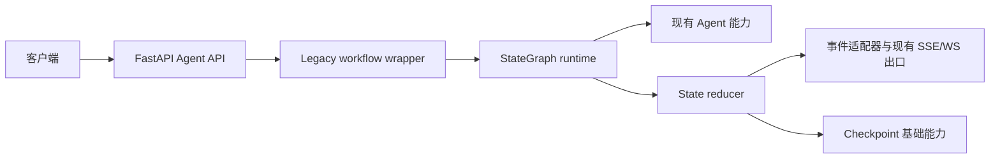

# AI Backend Architecture

## 概述

本项目由 FastAPI 后端、Vue 3 Web 前端、Celery 异步任务、Redis 和 VS Code Agent Host 组成，提供聊天、项目生成与修改、PPT、图像、AI Cloud、GirlAI、工作流和本地验证能力。Agent 能力由传统 Agent、Spec-first、依赖图、拓扑调度和 ReAct 工具链组成。StateGraph 迁移层以统一 State、StateDelta、checkpoint 和事件适配器连接现有能力。当前 Web 与 VS Code 工作台的核心 Agent 交互链路已打通，VS Code 侧承担本地工作区动作和验证执行。

## 技术栈

- Python 3.11（开发与测试约定）；当前 Dockerfile 使用 Python 3.10，部署环境存在版本分裂
- FastAPI、Pydantic、SQLAlchemy、Celery
- SQLite/PostgreSQL 数据访问与 Redis 会话缓存
- pytest、pytest-asyncio
- FAISS/VectorIndex 与外部模型、知识检索服务

## 部署拓扑

开发模式使用 Vite `3000`、FastAPI `8000` 和 Redis `6379`；Vite 将 `/api/v1`、`/api/v2` 和 WebSocket 请求代理到后端。Docker/生产模式使用 API `8080`、Nginx `80`、Redis `6379`，Compose 服务包括 `api`、`celery`、`redis` 和 `nginx`。

## 项目结构

```text
app/
├── api/                 # HTTP 路由和请求模型
├── agent/               # Agent、编排、工具、验证和状态图
│   ├── state/            # State、reducer、checkpoint、graph runtime
│   ├── nodes/            # Spec-first、依赖、拓扑、验证节点
│   ├── adapters/         # legacy、事件、session 和 Spec-first 适配器
│   └── retrieval/        # 统一检索契约和服务
├── db/                  # 数据库模型与服务
├── services/             # 业务服务
└── utils/                # 公共工具与模型路由
tests/unit/               # 单元测试
```

## 请求执行



`generate`、`modify`、同步 `orchestrate` 和流式 `orchestrate/stream` 已通过 `build_legacy_workflow` 运行。当前每个入口使用一个 `legacy_agent` 节点包装既有 Agent 结果，并保留原有响应与事件结构。Spec-first、RAG、依赖图、拓扑、验证和恢复能力仍处于渐进迁移阶段，生产入口尚未组成完整多阶段 StateGraph。

## 前端边界

Web 前端通过 Vue Router 组织页面，通过 Pinia 保存认证、Agent 会话、生成文件和模型上下文。Agent Dashboard 将会话、生成、文件、工作区、流式处理和后端管理拆分到 composables。桌面端使用三栏布局；手机端使用单列工作区和两侧抽屉，相关样式集中在 `src/styles/agent-layout.css`。PPT Web 流程按输入、大纲审阅和质量模式选择三步推进；大纲编辑器维护页面位置并在标题、核心结论或内容缺失时阻止批准，预览页消费质量报告展示整体分、逐页分、问题类型、修复动作和人工复核页。前端通过同源 `/api` 前缀访问后端，开发环境由 Vite proxy 处理跨服务转发。

VS Code 工作台由 `vscode-extension/src/agent-workbench.ts` 提供原生 Webview，由 `extension.ts` 创建 Agent Host 运行时。工作台支持需求输入、流式事件展示、暂停、恢复、取消、动作批准和拒绝；Host 通过 `CloudConnection` 与 `/api/v1/agent/host/*` 交互，并通过 `/api/v1/agent/orchestrate/stream` 发起 Agent 流式请求。VS Code 工作台当前采用轻量面板形态，Web 端的完整历史会话、模型选择、文件版本历史、性能和学习面板仍保留在 Web 工作台。

## StateGraph 边界

节点读取 State 快照并返回 StateDelta，reducer 负责 revision、消息幂等和增量合并。`CheckpointStore`、事件 Envelope 和本地验证适配器已经提供基础契约。会话适配器支持按 sequence replay，并在检测到缺口时返回 snapshot recovery action。云端验证结果限定为 `cloud_syntax`；当 State 声明必需本地 scope 时，验证节点创建 `waiting_local_validation` 动作，`run_workflow()` 将动作适配并发布到已连接的 Agent Host session，同时按 `session_id/task_id` 保存 checkpoint 和下一节点游标；插件 `tool_result` 经过任务版本和本地结果适配器校验后恢复活动 StateGraph，并从游标继续执行后续节点，所有必需 scope 通过后进入 `completed`。活动注册表缺失时可以从 checkpoint 加载状态并合并结果；跨进程续跑需要启动时注册可恢复的 workflow definition。Agent Host session 使用原子 JSON 队列保存动作、策略版本和事件确认，支持进程重启后的恢复；真实 HTTP 已验证 handshake、事件、策略、Skills 和 session control 闭环，用户模型供应商 Key 流程已通过 `13/13` 验收。API 入口仍保留原始 SSE 事件出口，多 worker 和模型驱动的跨工作台续跑仍需独立验收。

## 检索与运行时边界

`RetrievalService` 已实现请求范围过滤、内容 hash 去重、排序和降级结果，但当前未接入生产 Agent 主链路。检索 chunk 的实际字段为 `source_type`、`source_id`、`content_hash`、`metadata` 和 `retrieved_at`；`project_scope` 与 `session_scope` 通过请求和 metadata 参与过滤。

Skills 使用 `system:`, `user:` 和 `workspace:<folder-name>:` 命名空间。User Skills 通过认证用户 ID 隔离；Workspace Skills 由 VS Code 的所有 workspace folders 递归发现，并在 Agent Host session 内保存和同步。Web 端读取当前用户 Skills 与用户拥有的 Agent Host sessions，用于展示当前会话上下文。VS Code activation 会为所有 workspace folders 建立独立授权，`workspace` capability 的 `inspect` 和 `list_roots` 操作返回当前已授权根目录。

运行时补扫记录了以下部署约束：

- 应用同时存在 lifespan 与 startup hook，迁移、scheduler 和供应商恢复位于 startup hook。
- ready 检查数据库和 Redis，当前未纳入 Celery worker 状态。
- API 多 worker 与进程内 scheduler 存在重复执行定时任务的风险。
- API 健康路由为 `/api/v1/health`，容器和部分脚本使用 `/health`，健康契约需要统一。
- 独立 Nginx 容器 upstream 已切换为 Compose 服务名 `api:8080`；Dockerfile 的 root master、`nginx` worker 和 `appuser` API 权限模型已调整，Compose 挂载路径和生产 Celery 服务仍需部署前核对。
- `verify-integration.sh` 与现有集成测试主要提供静态、ASGI 或配置级证据，不能单独证明真实端口、worker、broker 和代理链路可用。
- 本地开发时 Vite 监听 3000 端口，并将 `/api/v1`、`/api/v2` 转发到后端 8000 端口；Vite allowed hosts 包含本地地址和 `.monkeycode-ai.online`。
- `app.main` 使用 `load_dotenv(..., override=False)` 加载 `.env`，已有进程环境变量优先于 dotenv 配置，便于部署和测试环境覆盖本地默认值。

## 统一状态迁移

统一状态层复用既有 `tasks` 表，并新增 `sessions`、`messages`、`task_events`、`checkpoints` 和 `artifacts`。`TaskManager` 在 Redis/内存状态变更时双写 SQL 任务快照和事件，Redis Pub/Sub 仅负责低延迟通知，SQL 事件表负责恢复和重放。启动迁移运行器会为旧 `tasks` 表补齐 session、revision、幂等键、stage、lease、结构化错误/结果和时间字段。

PPT 大纲使用 `ppt_outlines` 保存版本化草稿和批准快照。生成任务记录 `outline_id`、`outline_version` 和 `quality_mode`；生成阶段将大纲和产物分别写入统一 Checkpoint 与 Artifact，质量报告通过任务和大纲版本建立关联。

PPT 模板管理器通过 `recommend_for_scenario()` 返回场景置信度、命中关键词和至少三个候选模板。内置模板包含商业报告、学术答辩、产品路演、教育培训、医疗健康、极简和科技蓝调；`resolve_design_tokens()` 将 `TemplateConfig` 字段解析为版本化颜色、字体、间距、形状、图片和图表令牌，供后续语义规划和渲染阶段复用。

语义规划器 `plan_outline()` 将大纲映射为页面类型、布局候选和容量预算，保留页面及内容块顺序，并对旧版 `title`、`content`、`chart`、`image` 等类型提供兼容映射。商业演示使用 `content_blocks[].metadata` 承载指标、成本、周期、风险、依据、交付物、门槛、负责人和时限；`narrative_role` 将页面归一为机会、证据、策略、路线和决策五类叙事角色。

`run_quality_pipeline()` 先执行确定性规则质检和最多两轮自动重排，再按 `quality_mode` 选择视觉复审。精修服务异常时质量报告保存降级问题，产物仍可继续交付。

`PPTGenerationOrchestrator` 提供可恢复的异步阶段契约，按 `planning -> assets -> rendering -> rule_qa -> reflow -> vision_qa -> completed` 发出结构化进度事件，并在阶段边界执行取消检查。Celery PPT 任务已通过阶段处理器接入该编排器；发生自动重排时，`reflow` 阶段会重新渲染最终产物。

增强 PPTX 路径为每个内容页归一化语义类型，映射到兼容的 `LayoutType`，并为整次生成解析一次不可变 `DesignTokens`。`LayoutDecider.render_slide()` 使用 token-aware style adapter 应用颜色、字体和背景令牌，同时保留旧 `PPTStyle` 作为安全回退。最终 PPTX 渲染优先消费结构化 `content_blocks`，旧 `content` 和 `bullets` 继续经过归一层兼容。`business`、`creative`、`modern`、`minimal`、`tech`、`academic`、`education`、`medical` 和 `elegant` 分别实现独立封面、几何构图、信息层级和视觉动线；五类叙事角色直接选择各主题的专属页面结构。`academic` 使用研究问题、证据注释、假设对照、研究协议和来源脚注表达研究简报语境；`education` 使用学习目标、课堂证据、练习卡、课程路径和课后行动表达教学工作坊语境；`medical` 使用临床信号、证据评估、方案取舍、照护路径和行动结论表达临床简报语境；`elegant` 使用主信号、证据注释、路径取舍、纵向里程碑和董事会决议表达高端备忘录语境。

后续模块迁移新增 `state_compatibility_mappings` 和 `state_retention_records`。前者关联旧模块标识与统一资源，后者记录归档、清理、重试和外部文件保留状态。对应模型位于 `app.models.unified_state`，数据库迁移位于 `migrations/versions/20260829_add_state_migration_tables.py`。

兼容映射和保留生命周期服务位于 `app.services.state_migration_service`，通过作用域唯一键保证旧标识幂等绑定，通过受控状态流转记录归档、清理和失败重试。

双写核对服务位于 `app.services.reconciliation_service`，按模块、资源类型和资源标识保存 expected/actual 快照差异，支持差异合并、retryable 状态、延迟重试和 resolved 结果。

模块级核对报告和读切换控制器位于 `app.services.state_cutover_service`。报告覆盖 session、message、task、event、checkpoint、artifact 六类资源，并将开放差异作为切换门禁；`ReadCutoverController` 按 AICloud、GirlAI、Agent、Workflow 顺序切换统一读源，保留模块级 legacy 回滚能力。

四模块灰度执行由 `activate_modules_in_order` 驱动。控制器基于模块和用户 ID 的稳定 hash 选择 cohort，支持阶段比例和逐模块回滚，确保同一用户在灰度期间持续命中同一读源。

AICloud 通过 `app.services.aicloud_state_adapter` 将旧 `aicloud_sessions/aicloud_messages` 标识幂等映射到统一 `sessions/messages`，聊天和流式聊天入口均在旧记录提交后写入统一状态。

GirlAI 通过 `app.services.girlai_state_adapter` 将用户维度的 `chat_histories` 映射为稳定的 `user:{user_id}` 统一会话，每轮历史写入统一 user/assistant 消息；统一消息 metadata 保存 `legacy_message_id`，支持选择性删除时同步清理。`ChatSummary` 通过统一 `girlai_summary` 任务保存为幂等 checkpoint，归档和 legacy 原始消息删除处于同一事务边界。

GirlAI 伙伴增强的结构化回合契约位于 `app.schema.girl_companion`，解析和降级入口位于 `app.services.girlai_companion_service.parse_companion_turn`。当前实现支持 JSON、JSON code fence 和纯文本降级，提供情绪、意图、记忆候选、工具请求、模型上下文和能力降级字段；伙伴编排、记忆授权、工具策略、任务、提醒和语音 API 仍按规格计划逐阶段接入。

Agent 通过 `app.services.agent_state_adapter` 映射 `ProjectSession`/JSON session，并将可序列化 State 保存到统一任务 checkpoint；`persist_agent_state` 同时写入消息事件和生成文件 Artifact。`run_workflow` 接收可选数据库上下文后自动调用该持久化入口，`generate`、同步 `orchestrate`、增量修改 SSE 和 `orchestrate/stream` 均已传入数据库上下文。Workflow 通过 `app.services.workflow_state_adapter` 将 `WorkflowHistory` 映射为统一 task，节点阶段写入 Task Event，生成文件登记到 Artifact。

Agent 模型上下文使用独立的 `agent_model_context` 任务和 Checkpoint revision 序列。工作流启动时将运行时配置版本与角色映射写入 `State.metadata.model_context`，Graph 持久化时同步初始模型上下文；前端根据 SSE `model_info` 事件补充当前模型、调用统计和降级记录，并在流结束后写回后端。会话切换通过用户作用域的兼容映射读取最新完整快照，本地 Pinia 和 localStorage 作为网络异常时的缓存。

PPT WebSocket 在轮询进程内任务状态前读取 SQL `task_events`，按 sequence 向客户端发送增量事件，支持客户端重连后的事件补发；进程内任务缓存缺失时回退读取 SQL Task。客户端提供 `after_sequence` 且没有后续事件时，服务返回最新 checkpoint 的 `snapshot_recovery` 消息。`app.tasks.ppt_tasks.generate_ppt` 已成为 JSON 参数可序列化的 Celery 任务并路由到 `ppt` 队列，任务在启动、进度更新和完成前续租 90 秒，并双写统一 Task/Event。`PPT_USE_CELERY=true` 时，`app.services.ppt_dispatch_service` 创建 SQL 任务并提交 Celery 任务，支持接口级灰度切换。`app.services.worker_recovery_service.recover_expired_tasks` 提供过期 lease 单次扫描、重投递和 retry 上限处理，`app.db.scheduler` 已按 1 分钟间隔注册恢复任务。

统一状态保留由 `app.services.state_migration_service.process_retention_records` 执行。`RetentionPolicy` 提供归档和清理窗口，资源仍被活动任务、有效会话或恢复流程引用时进入 `blocked`，引用解除后可继续处理。外部产物清理由 `ExternalStorageAdapter` 执行，默认本地 adapter 支持 `file://` URI；每条记录保存稳定 cleanup idempotency key、资源版本、删除意图和执行结果，失败进入 `retryable`。scheduler 每天执行 `unified_state_retention`。
