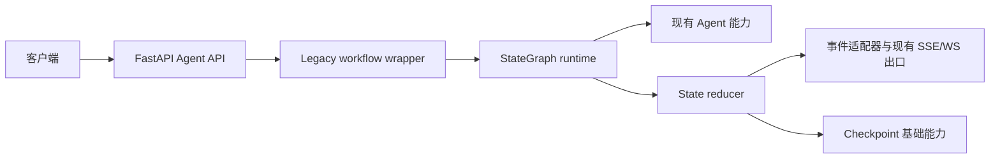

# AI Backend Architecture

## 概述

本项目是基于 FastAPI 的 AI 编程后端，提供项目生成、项目修改、编排执行、模型路由、会话管理和代码验证能力。Agent 能力由传统 Agent、Spec-first、依赖图、拓扑调度和 ReAct 工具链组成。StateGraph 迁移层以统一 State、StateDelta、checkpoint 和事件适配器连接现有能力。

## 技术栈

- Python 3.11（开发与测试约定）；当前 Dockerfile 使用 Python 3.10，部署环境存在版本分裂
- FastAPI、Pydantic、SQLAlchemy、Celery
- SQLite/PostgreSQL 数据访问与 Redis 会话缓存
- pytest、pytest-asyncio
- FAISS/VectorIndex 与外部模型、知识检索服务

## 项目结构

```text
app/
├── api/                 # HTTP 路由和请求模型
├── agent/               # Agent、编排、工具、验证和状态图
│   ├── state/            # State、reducer、checkpoint、graph runtime
│   ├── nodes/            # Spec-first、依赖、拓扑、验证节点
│   ├── adapters/         # legacy、事件、session 和 Spec-first 适配器
│   └── retrieval/        # 统一检索契约和服务
├── db/                  # 数据库模型与服务
├── services/             # 业务服务
└── utils/                # 公共工具与模型路由
tests/unit/               # 单元测试
```

## 请求执行



`generate`、`modify`、同步 `orchestrate` 和流式 `orchestrate/stream` 已通过 `build_legacy_workflow` 运行。当前每个入口使用一个 `legacy_agent` 节点包装既有 Agent 结果，并保留原有响应与事件结构。Spec-first、RAG、依赖图、拓扑、验证和恢复能力仍处于渐进迁移阶段，生产入口尚未组成完整多阶段 StateGraph。

## StateGraph 边界

节点读取 State 快照并返回 StateDelta，reducer 负责 revision、消息幂等和增量合并。`CheckpointStore`、事件 Envelope 和本地验证适配器已经提供基础契约。会话适配器支持按 sequence replay，并在检测到缺口时返回 snapshot recovery action。云端验证结果限定为 `cloud_syntax`；当 State 声明必需本地 scope 时，验证节点创建 `waiting_local_validation` 动作，插件结果按 task、revision、schema version 和 scope 校验后合并，所有必需 scope 通过后才进入终态。API 入口仍保留原始 SSE 事件出口，checkpoint 自动持久化和插件真实 E2E 闭环需要运行环境继续验收。

## 检索与运行时边界

`RetrievalService` 已实现请求范围过滤、内容 hash 去重、排序和降级结果，但当前未接入生产 Agent 主链路。检索 chunk 的实际字段为 `source_type`、`source_id`、`content_hash`、`metadata` 和 `retrieved_at`；`project_scope` 与 `session_scope` 通过请求和 metadata 参与过滤。

运行时补扫记录了以下部署约束：

- 应用同时存在 lifespan 与 startup hook，迁移、scheduler 和供应商恢复位于 startup hook。
- ready 检查数据库和 Redis，当前未纳入 Celery worker 状态。
- API 多 worker 与进程内 scheduler 存在重复执行定时任务的风险。
- API 健康路由为 `/api/v1/health`，容器和部分脚本使用 `/health`，健康契约需要统一。
- 独立 Nginx 容器 upstream 已切换为 Compose 服务名 `api:8080`；Dockerfile 的 root master、`nginx` worker 和 `appuser` API 权限模型已调整，Compose 挂载路径和生产 Celery 服务仍需部署前核对。
- `verify-integration.sh` 与现有集成测试主要提供静态、ASGI 或配置级证据，不能单独证明真实端口、worker、broker 和代理链路可用。
