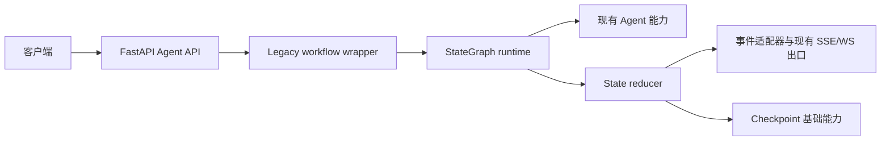
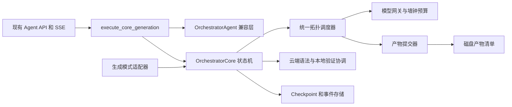

# AI Backend Architecture

## 概述

本项目是基于 FastAPI 的 AI 编程后端，提供项目生成、项目修改、编排执行、模型路由、会话管理和代码验证能力。Agent 能力由传统 Agent、Spec-first、依赖图、拓扑调度和 ReAct 工具链组成。StateGraph 迁移层以统一 State、StateDelta、checkpoint 和事件适配器连接现有能力。

## 技术栈

- Python 3.11（开发与测试约定）；当前 Dockerfile 使用 Python 3.10，部署环境存在版本分裂
- FastAPI、Pydantic、SQLAlchemy、Celery
- SQLite/PostgreSQL 数据访问与 Redis 会话缓存
- pytest、pytest-asyncio
- FAISS/VectorIndex 与外部模型、知识检索服务

## 项目结构

```text
app/
├── api/                 # HTTP 路由和请求模型
├── agent/               # Agent、编排、工具、验证和状态图
│   ├── state/            # State、reducer、checkpoint、graph runtime
│   ├── nodes/            # Spec-first、依赖、拓扑、验证节点
│   ├── adapters/         # legacy、事件、session 和 Spec-first 适配器
│   └── retrieval/        # 统一检索契约和服务
├── db/                  # 数据库模型与服务
├── services/             # 业务服务
└── utils/                # 公共工具与模型路由
tests/unit/               # 单元测试
```

## 请求执行



`generate`、`modify`、同步 `orchestrate` 和流式 `orchestrate/stream` 默认通过 `build_legacy_workflow` 运行，并保留原有响应与事件结构。设置 `AGENT_ORCHESTRATION_ENGINE=core` 后，Spec-First 的同步与流式 `orchestrate` 以及增量 `modify` 会通过 `execute_core_generation()` 进入完整 `OrchestratorCore.execute()` 生命周期；传统 `generate` 的 Core 分支继续使用兼容生成器。RAG、统一事件出口和跨阶段自动恢复仍处于渐进迁移阶段。

## Orchestrator Core 架构

多语言代码生成使用 `OrchestratorCore` 收敛传统生成、Spec-First 和增量修改的任务生命周期。现有 `OrchestratorAgent` 保留入口兼容与模型生成职责，`TraditionalAdapter`、`SpecFirstAdapter` 和 `IncrementalAdapter` 提供模式化计划及单文件生成能力。Core 生命周期为 `planning`、`scheduling`、`generating`、`persisting`、`validating`、`finalizing`，并统一收敛到完成、失败、超时或取消终态。



目标设计采用四级执行预算：单次模型调用、单文件、阶段和任务。流式保活数据不改变墙钟 deadline；超时和用户取消需要传播到活动模型调用及文件任务，并在终态前完成子任务回收。`ModelGateway` 同时为每个 `call_id` 保存 `ModelCallTelemetry`，记录 `finish_reason`、prompt/completion/total tokens、输入字符数、`max_tokens` 和耗时，用于区分正常结束、输出受限和预算超时。

文件计划分为 `strict` 和 `extensible`。需求明确指定文件集合时使用 `strict`，冻结计划外的业务文件形成结构化计划错误；允许架构补全时使用 `extensible`，新增文件需要记录来源和理由。文件生成成功由原子写入、磁盘回读、非空、大小和 hash 校验共同决定，文件完成事件只能引用已登记产物。

跨文件生成使用 `ContractIndex` 作为任务级不可变契约快照。索引从冻结计划中的接口、文件和 HTTP contracts 构建，由 `GenerationScheduler` 传递给每个 `FileGenerationContext`；`ArtifactCommitter` 在写盘前校验生成内容声明的 `contract_refs`，未知契约会形成 `operation_contract_missing` 并阻止产物落盘。

每个入口保留 legacy/core 路由和原有 HTTP、SSE、会话契约，checkpoint 记录引擎版本。Spec-First 与增量 Core 请求通过每次请求唯一的 Core task ID 隔离 checkpoint；`AGENT_CORE_CHECKPOINT_DIR` 可覆盖默认存储目录。

编排请求通过 `_core_request_metadata()` 将 `contracts`、`framework`、`runtime` 与文件边界传入 `execute_core_generation()`；Traditional、Spec-First 和 Incremental adapter 在规划上下文中消费这些结构化字段，冻结框架、运行时和共享契约索引。请求 `engine="core"` 显式选择 Core；省略时读取服务端 `AGENT_ORCHESTRATION_ENGINE`，其缺省值保持 `legacy`。同步入口的显式 Core 请求跳过单文件快捷生成。

`app.agent.orchestration` 已实现严格 Pydantic 契约、单向阶段转换、revision 校验、持久化事件幂等、唯一终态、原子 JSON checkpoint，以及任务创建、推进、终止、取消和恢复协调。文件计划层提供统一安全路径规范化、`strict/extensible` 策略、结构化计划错误、依赖集合校验、扩展来源记录，以及带稳定 digest 的不可变计划版本。Spec-First adapter 从规范或架构冻结 strict 文件集合；增量 adapter 只冻结受影响文件，裁剪计划外依赖、加载外部依赖内容，并把未受影响业务文件作为 `preserved_paths` 纳入磁盘一致性检查。增量 Core 在文件调度前为 add/modify/delete/rename 建立统一事务基线，只有完整调度、持久化、验证与成功门禁进入 `completed` 后才提交，异常和其他终态均回滚。执行层提供不可变的任务、阶段、文件和模型调用四级预算；`ModelGateway` 使用绝对墙钟 deadline 包住模型调用和完整流消费，并在超时或取消后关闭活动流。`GenerationScheduler` 按冻结依赖图调度文件，`ArtifactCommitter` 独占 Core 正常产物落盘、回读、SHA-256 校验、清单登记和完成事件；成功门禁比较计划、事件、清单与磁盘集合后才允许 Core 进入 `completed`。`OrchestratorCore.execute()` 已接入 Spec-First 和增量生产分支，规划异常收敛为 `orchestration.planning_failed`，规划前取消收敛为 `cancelled`；`planning` checkpoint 可重新执行，其他活动阶段恢复收敛为 `orchestration.resume_stage_unsupported`。传统入口继续支持 `TraditionalAdapter`、legacy/core 引擎选择、无源码影子状态对比和 checkpoint 引擎版本元数据。实施进度和验收门禁记录在 `../specs/2026-08-31-multilanguage-generation-orchestration/`。

`app.agent.workflow_ir.WorkflowIR` 为 Core 冻结计划提供版本化、可序列化的控制面投影。IR 同时保存主 `language/framework/runtime` 和完整 `languages/frameworks/runtimes` 技术栈集合，并将规划节点、文件生成节点、依赖 DAG、角色、模型策略、上下文作用域、工具授权、预算范围和契约索引统一纳入稳定 digest；Core 在 scheduling checkpoint 保存完整 IR、`workflow_digest` 和 `model_routing` 快照，文件节点的 `ModelPolicy` 保留按职责解析出的首选模型，实际文件生成仍由现有 `GenerationScheduler` 执行。`PlannedFile.contract` 保存语言无关的 exports、imports、fixtures 等符号事实，`SymbolContract` 与 `missing_symbols()` 提供跨语言的导入/导出兼容校验，具体语法解析由 Language Adapter 完成，Core 只比较结构化事实。IR 校验覆盖节点唯一性、入口存在性、依赖完整性、无环性和入口可达性，执行型工具授权必须声明作用域。
每个生成节点还保存独立 `TechnologyProfile`，用于标识该 Artifact 的语言、框架和运行时。节点技术栈从文件计划和文件合同投影，并受 Workflow 技术栈集合约束；该信息为后续按节点选择 Language Adapter、Framework Profile 和 Runtime Validator 提供确定性输入。
`GenerationScheduler` 将同一节点 `TechnologyProfile` 放入 `FileGenerationContext`。生成 Adapter 优先使用结构化语言和框架选择工程师、Language Adapter 与技术栈规则，文件计划缺少新字段的兼容调用从已冻结的项目计划补全。需求自然语言只承担旧请求缺少结构化技术栈时的兼容识别。
跨语言回归覆盖 Java、Stack Adapter、Local Validation、通用 Agent Adapter、动态 Adapter、Declarative Contract、Workflow IR、Core、Generation Adapter 和 Scheduler；新增合同字段保持 JSON 可序列化，新增校验不要求特定运行时、框架或数据库实现。

云端文件校验通过 `app.agent.validation_report.ValidationReport` 统一表达。报告为不可变、可序列化结构，记录 `cloud_syntax` scope、错误类别、文件路径、诊断上下文 hash、修复候选 hash 和修复证据；`RepairRouter` 对 syntax、dependency、export、signature、async、fixture、schema 和 type 类错误使用受控自动修复，对 business、test 和 unknown 类错误进入用户确认流程。`RepairBudget` 限制单类错误最多 3 次、任务累计最多 5 次，预算耗尽后保留可定位诊断并停止自动修复。

## StateGraph 边界

增量编排通过 `ProjectSnapshot` 保存基线文件 hash，通过 `ChangePlan` 表达动态 add/modify/delete/rename 变更。`IncrementalFileTransaction` 备份 modify 原文件、暂存 delete/rename 源文件并登记 add/rename 新目标；Core 仅在最终成功门禁通过后提交，失败、取消和异常均恢复基线。删除-only 计划使用空生成计划并通过同一成功门禁。

节点读取 State 快照并返回 StateDelta，reducer 负责 revision、消息幂等和增量合并。`CheckpointStore`、事件 Envelope 和本地验证适配器已经提供基础契约。会话适配器支持按 sequence replay，并在检测到缺口时返回 snapshot recovery action。云端验证结果限定为 `cloud_syntax`；当 State 声明必需本地 scope 时，验证节点创建 `waiting_local_validation` 动作，`run_workflow()` 将动作适配并发布到已连接的 Agent Host session，同时按 `session_id/task_id` 保存 checkpoint 和下一节点游标；插件 `tool_result` 经过任务版本和本地结果适配器校验后恢复活动 StateGraph，并从游标继续执行后续节点，所有必需 scope 通过后进入 `completed`。活动注册表缺失时可以从 checkpoint 加载状态并合并结果；跨进程续跑需要启动时注册可恢复的 workflow definition。Agent Host session 使用原子 JSON 队列保存动作、策略版本和事件确认，支持进程重启后的恢复；真实 HTTP 已验证 handshake、事件、策略、Skills 和 session control 闭环，用户模型供应商 Key 流程已通过 `13/13` 验收。API 入口仍保留原始 SSE 事件出口，多 worker 和模型驱动的跨工作台续跑仍需独立验收。

## 检索与运行时边界

`RetrievalService` 已实现请求范围过滤、内容 hash 去重、排序和降级结果，但当前未接入生产 Agent 主链路。检索 chunk 的实际字段为 `source_type`、`source_id`、`content_hash`、`metadata` 和 `retrieved_at`；`project_scope` 与 `session_scope` 通过请求和 metadata 参与过滤。

`ContextAssembler` 将需求、计划、检索结果、Memory 和 MCP/Skill 描述转换为带来源、优先级、作用域和内容 hash 的 `ContextEnvelope`，执行字符预算和敏感字段脱敏。`app.agent.languages` 统一注册 Python、JavaScript/TypeScript、Java、Go 和 Rust Adapter，提供导入解析、模块候选、符号签名和编译/测试能力元数据。Go Adapter 识别 `cmd`、`internal` 和 `pkg` 项目包；Rust Adapter 解析 `crate::`、`self::`、`super::` 与 `mod` 路径。Toolchain 命令使用参数数组和 `shell=false`，工作区 wrapper 必须位于项目目录内。

`app.agent.profile_discovery` 根据 `package.json`、Python manifest、`go.mod`、`Cargo.toml`、`pom.xml` 和 Gradle manifest 创建 `DiscoveredProfile`，应用域覆盖 Web、Windows、Android、爬虫、游戏和 CLI。内置技术栈继承 Framework Profile 的 `supported` 或 `experimental` 状态；未知技术栈进入 `custom_pending` 并输出 `CapabilityGap`，通过 Toolchain 探针结果后再升级。`detect_toolchain()` 解析 Node scripts、Python tool 配置、Go、Cargo、Maven 和 Gradle manifest，优先使用 lockfile 与工作区 wrapper，并为安装、格式、静态检查、类型检查、构建、测试、启动、smoke 和健康检查输出统一参数数组契约。
`app.agent.framework_profiles` 声明 install、lint、typecheck、build、test 和 smoke 阶段。Profile bridge 按节点 `TechnologyProfile` 解析本地验证目标，并对混合技术栈按语言和 Profile 确定性去重；Core 只保存 `waiting_local_validation` 状态并交由 Agent Host 执行本地命令。当前内置 Profile 覆盖 FastAPI、Flask、Django、Python CLI、Pygame、Express、NestJS、React Vite、Next.js、Spring Boot Maven/Gradle、Go stdlib/Gin/Echo 和 Rust CLI/Axum/Actix Web。
已验证的工作区画像由 `ProfileCache` 保存到 `.monkeycode/profiles.json`，后续任务可复用画像并通过 schema version 触发安全失效。探针结果将画像从 `custom_pending` 推进到 `experimental`；完整 conformance checks 通过后才升级到 `supported`。
官方脚手架由 `app.agent.scaffolding` 使用固定版本 CLI 和 `ToolchainRunner` 创建。脚手架源码、manifest、扩展名启动入口和常见文本资产经过工作区路径、符号链接、文件数量、文件大小和 UTF-8 校验，再由 Language Adapter 提取导入、项目依赖和公共符号，最终冻结为带 digest 的 strict `GenerationPlan`。

受约束代码合成控制面通过 `ProjectModel` 和动态 `ChangePlanIR` 描述技术栈事实、Artifact DAG 与生成策略。`SynthesisCapabilityRegistry` 复用语言 Adapter 能力和固定版本官方脚手架注册，向 `StrategyRouter` 提供解析、结构编辑、签名、编译、测试和脚手架证据；路由结果经 `project_change_plan()` 投影为 Core 的冻结 `GenerationPlan`，并在每个 `PlannedFile` 中保留策略理由、能力证据和降级状态。`FrameworkProfile` 通过 Profile bridge 转换为项目事实、验证契约和现有 `ValidationCoordinator` 的安全命令计划。`app.agent.stack_adapters` 提供严格 `StackAdapter` 协议和别名注册表，FastAPI、Express、Go stdlib/net-http 与 Spring Boot Maven/Gradle Adapter 分别负责工作区探测、动态计划、技术栈能力、符号索引、脚手架结果和验证画像；Artifact 路径、依赖与数量完全来自结构化请求，FastAPI 六文件只保留为评测资产。

`app.agent.synthesis_validation` 将候选验证组织为严格的 V0-V6 前缀。V0 在任何工具执行前校验计划产物集合、安全路径、前置条件和非空内容；V1 委托 Stack Adapter 提取文件结构；V2、V3 和 V5 将 `ValidationCoordinator` 命令按模块构建、测试和 smoke action 隔离；V4 由 API、Schema 或消费者契约处理器扩展；V6 复用 `check_artifact_success_gate()` 核对计划、manifest、完成事件和磁盘。任一层失败或能力缺失都会短路后续层并返回结构化分类。候选按完整通过、最高通过层级、硬失败数、诊断数、变更范围和模型调用数进行稳定排序；任务级和策略级候选预算分别产生可区分的耗尽结果，修复反馈只保留原策略、有限诊断和受字符预算约束的相关上下文。该控制面目前作为显式内部路径存在，默认入口仍遵循既有 legacy/core 路由配置。
候选门禁由 `app.agent.declarative_contracts` 提供技术中立的声明比较层。冻结 `GenerationPlan` 为每个 Artifact 保存版本化 `ContractDeclaration`；语言 Adapter 将源码解析为 `ArtifactFacts`，门禁通过 `equals`、`contains_all` 和 `excludes_all` 比较声明与事实，并将缺失解析能力标记为 `unsupported`。依赖闭包检查只消费语言 Adapter 的导入解析结果和冻结文件集合。Python Adapter 还提供静态可确定的外部导出、本地类构造一致性和未定义全局名称诊断，并可最小移除未引用的无效导入或从唯一静态提供模块补全导入。首次候选与语言修复候选均调用同一个 `validate_candidate()`，门禁过程保持候选、文件集合和计划版本不变。旧 Stack 校验回调仅保留兼容调用面，不再进入 Core 主生成路径。
`orchestration/adapters.py` 已移除固定 CRUD/Pygame 样例的源码回退实现和默认策略注册，`_PlannedAgentAdapter` 初始化空的 `StackRepairStrategyRegistry`。通用注册表、`StackRepairCandidate` 和候选构造接口保留；Stack 模块仍有适用性谓词。活动生成路径保留声明门禁、`LanguageAdapter.repair_source()` 和修复后二次门禁，并通过 `language-source-repair` 记录修复证据。

评测 runner 从响应 `output_dir` 读取项目，遍历排除依赖目录、缓存、构建目录和数据库等运行产物后的完整业务文件集合，`record_from_summary()` 将该集合与 fixture 计划严格比较。repair 将实际响应目录解析为绝对路径，再映射为 `PROJECTS_BASE_DIR` 下的项目相对路径，统一传入 HTTP `project_path/output_dir`；本地变更计划和复验使用同一实际目录。基目录本身和基目录外路径在请求前被拒绝。

Core 在事务回滚前把候选文件 SHA-256 和 Profile 验证结果保存到检查点 `metadata.candidate_hashes/candidate_validation`，运行时通过 `repair_feedback` 投影到 API。指纹覆盖生成计划和授权保留依赖，完整调度候选才提供去重指纹；运行异常独立于回滚后的磁盘内容保留。评测 repair 优先消费最新候选诊断，新的失败证据可在 `MAX_REPAIR_ATTEMPTS=3` 内继续；历史重复诊断或候选触发无进展终止。Core 成功和磁盘复验全部通过共同决定修复成功。

`ToolchainRunner` 将工作目录解析为项目绝对路径，在宿主环境副本中以该路径覆盖 `PYTHONPATH`，再启动验证子进程；父进程环境保持原值。该隔离覆盖项目普通包和 namespace package，防止宿主同名 `app` 包抢占导入；Python 安装依赖仍沿用当前解释器环境。

增量候选的依赖可见集合为变更计划与授权保留快照文件的并集；保留路径必须在基线快照中、仍实际存在且解析后位于项目内，显式文件授权进一步限制该集合。候选校验读取保留文件的真实内容，继续检查导出符号；快照后新增文件与缺失文件保持不可见。生成提示分别声明 `frozen_file_set` 和 `writable_file_set`，调度和写入范围仍由变更计划控制。

`ProjectSnapshot` 与产物磁盘门禁共用 `is_python_bytecode_cache()`，仅豁免直接位于 `__pycache__` 下的 `.pyc` 文件，避免验证刷新字节码触发增量未授权变更和事务回滚。同目录中的源码文件仍参与快照和严格产物检查。

2026-09-07 真实 Core 首次候选验收（`python-small-spec_first`，关闭评测 repair）耗时 `92.272s`：HTTP 200，四个必需文件齐全且编译通过，最终 `success=false`。宿主导入污染已修复；生成测试仍因 `client=None` 导致 9 项失败，runtime 因数据库无表失败，CRUD 和持久化仍待通过。该记录的完整磁盘集合还包含额外文件，`plan_consistent=false`；端到端成功门禁保持未通过。
工作区自定义 Profile 使用内容 digest、schema version、`owner_id` 和 `workspace_id` 双重作用域。声明命令与探针命令必须命中命令 allowlist，框架依赖必须命中依赖 allowlist；语法、安装、有限启动、CRUD 和持久化探针全部产生真实成功证据后，状态才可按 `custom_pending -> experimental -> supported` 推进。
传统、Spec-First 和增量修改入口在规划阶段读取 `profile_context()`，将画像状态和能力缺口传递给生成与验证流程。
`CapabilityResolver` 将应用域映射为必需能力、生成约束和验证步骤；Pygame、Scrapy、Android 和 Windows 等应用类型可以复用同一生成生命周期。
解析结果还包含 `required_components`，为生成计划提供领域级组件提示，保持领域策略与具体框架 Profile 解耦。
`add_profile_components()` 将组件提示投影为 `GenerationPlan` 节点和顺序依赖；`strict` 计划保持用户冻结集合，`extensible` 计划记录受控领域扩展。

Skills 使用 `system:`, `user:` 和 `workspace:<folder-name>:` 命名空间。User Skills 通过认证用户 ID 隔离；Workspace Skills 由 VS Code 的所有 workspace folders 递归发现，并在 Agent Host session 内保存和同步。Web 端读取当前用户 Skills 与用户拥有的 Agent Host sessions，用于展示当前会话上下文。VS Code activation 会为所有 workspace folders 建立独立授权，`workspace` capability 的 `inspect` 和 `list_roots` 操作返回当前已授权根目录。

运行时补扫记录了以下部署约束：

- 应用同时存在 lifespan 与 startup hook，迁移、scheduler 和供应商恢复位于 startup hook。
- ready 检查数据库和 Redis，当前未纳入 Celery worker 状态。
- API 多 worker 与进程内 scheduler 存在重复执行定时任务的风险。
- API 健康路由为 `/api/v1/health`，容器和部分脚本使用 `/health`，健康契约需要统一。
- 独立 Nginx 容器 upstream 已切换为 Compose 服务名 `api:8080`；Dockerfile 的 root master、`nginx` worker 和 `appuser` API 权限模型已调整，Compose 挂载路径和生产 Celery 服务仍需部署前核对。
- `verify-integration.sh` 与现有集成测试主要提供静态、ASGI 或配置级证据，不能单独证明真实端口、worker、broker 和代理链路可用。
- 本地开发时 Vite 监听 3000 端口，并将 `/api/v1`、`/api/v2` 转发到后端 8000 端口；Vite allowed hosts 包含本地地址和 `.monkeycode-ai.online`。
- `app.main` 使用 `load_dotenv(..., override=False)` 加载 `.env`，已有进程环境变量优先于 dotenv 配置，便于部署和测试环境覆盖本地默认值。

## 统一状态迁移

统一状态层复用既有 `tasks` 表，并新增 `sessions`、`messages`、`task_events`、`checkpoints` 和 `artifacts`。`TaskManager` 在 Redis/内存状态变更时双写 SQL 任务快照和事件，Redis Pub/Sub 仅负责低延迟通知，SQL 事件表负责恢复和重放。启动迁移运行器会为旧 `tasks` 表补齐 session、revision、幂等键、stage、lease、结构化错误/结果和时间字段。

后续模块迁移新增 `state_compatibility_mappings` 和 `state_retention_records`。前者关联旧模块标识与统一资源，后者记录归档、清理、重试和外部文件保留状态。对应模型位于 `app.models.unified_state`，数据库迁移位于 `migrations/versions/20260829_add_state_migration_tables.py`。

兼容映射和保留生命周期服务位于 `app.services.state_migration_service`，通过作用域唯一键保证旧标识幂等绑定，通过受控状态流转记录归档、清理和失败重试。

双写核对服务位于 `app.services.reconciliation_service`，按模块、资源类型和资源标识保存 expected/actual 快照差异，支持差异合并、retryable 状态、延迟重试和 resolved 结果。

模块级核对报告和读切换控制器位于 `app.services.state_cutover_service`。报告覆盖 session、message、task、event、checkpoint、artifact 六类资源，并将开放差异作为切换门禁；`ReadCutoverController` 按 AICloud、GirlAI、Agent、Workflow 顺序切换统一读源，保留模块级 legacy 回滚能力。

四模块灰度执行由 `activate_modules_in_order` 驱动。控制器基于模块和用户 ID 的稳定 hash 选择 cohort，支持阶段比例和逐模块回滚，确保同一用户在灰度期间持续命中同一读源。

AICloud 通过 `app.services.aicloud_state_adapter` 将旧 `aicloud_sessions/aicloud_messages` 标识幂等映射到统一 `sessions/messages`，聊天和流式聊天入口均在旧记录提交后写入统一状态。

GirlAI 通过 `app.services.girlai_state_adapter` 将用户维度的 `chat_histories` 映射为稳定的 `user:{user_id}` 统一会话，每轮历史写入统一 user/assistant 消息；统一消息 metadata 保存 `legacy_message_id`，支持选择性删除时同步清理。`ChatSummary` 通过统一 `girlai_summary` 任务保存为幂等 checkpoint，归档和 legacy 原始消息删除处于同一事务边界。

Agent 通过 `app.services.agent_state_adapter` 映射 `ProjectSession`/JSON session，并将可序列化 State 保存到统一任务 checkpoint；`persist_agent_state` 同时写入消息事件和生成文件 Artifact。`run_workflow` 接收可选数据库上下文后自动调用该持久化入口，`generate`、同步 `orchestrate`、增量修改 SSE 和 `orchestrate/stream` 均已传入数据库上下文。Workflow 通过 `app.services.workflow_state_adapter` 将 `WorkflowHistory` 映射为统一 task，节点阶段写入 Task Event，生成文件登记到 Artifact。

PPT WebSocket 在轮询进程内任务状态前读取 SQL `task_events`，按 sequence 向客户端发送增量事件，支持客户端重连后的事件补发；进程内任务缓存缺失时回退读取 SQL Task。客户端提供 `after_sequence` 且没有后续事件时，服务返回最新 checkpoint 的 `snapshot_recovery` 消息。`app.tasks.ppt_tasks.generate_ppt` 已成为 JSON 参数可序列化的 Celery 任务并路由到 `ppt` 队列，任务在启动、进度更新和完成前续租 90 秒，并双写统一 Task/Event。`PPT_USE_CELERY=true` 时，`app.services.ppt_dispatch_service` 创建 SQL 任务并提交 Celery 任务，支持接口级灰度切换。`app.services.worker_recovery_service.recover_expired_tasks` 提供过期 lease 单次扫描、重投递和 retry 上限处理，`app.db.scheduler` 已按 1 分钟间隔注册恢复任务。

统一状态保留由 `app.services.state_migration_service.process_retention_records` 执行。`RetentionPolicy` 提供归档和清理窗口，资源仍被活动任务、有效会话或恢复流程引用时进入 `blocked`，引用解除后可继续处理。外部产物清理由 `ExternalStorageAdapter` 执行，默认本地 adapter 支持 `file://` URI；每条记录保存稳定 cleanup idempotency key、资源版本、删除意图和执行结果，失败进入 `retryable`。scheduler 每天执行 `unified_state_retention`。
