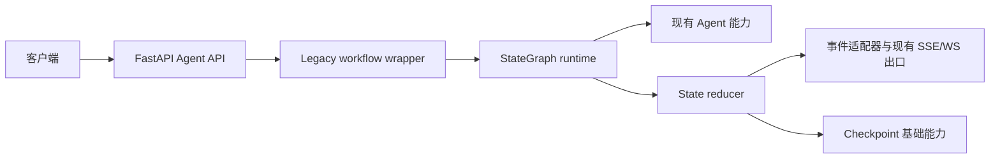

# AI Backend Architecture

## 概述

本项目是基于 FastAPI 的 AI 编程后端，提供项目生成、项目修改、编排执行、模型路由、会话管理和代码验证能力。Agent 能力由传统 Agent、Spec-first、依赖图、拓扑调度和 ReAct 工具链组成。StateGraph 迁移层以统一 State、StateDelta、checkpoint 和事件适配器连接现有能力。

## 技术栈

- Python 3.11（开发与测试约定）；当前 Dockerfile 使用 Python 3.10，部署环境存在版本分裂
- FastAPI、Pydantic、SQLAlchemy、Celery
- SQLite/PostgreSQL 数据访问与 Redis 会话缓存
- pytest、pytest-asyncio
- FAISS/VectorIndex 与外部模型、知识检索服务

## 项目结构

```text
app/
├── api/                 # HTTP 路由和请求模型
├── agent/               # Agent、编排、工具、验证和状态图
│   ├── state/            # State、reducer、checkpoint、graph runtime
│   ├── nodes/            # Spec-first、依赖、拓扑、验证节点
│   ├── adapters/         # legacy、事件、session 和 Spec-first 适配器
│   └── retrieval/        # 统一检索契约和服务
├── db/                  # 数据库模型与服务
├── services/             # 业务服务
└── utils/                # 公共工具与模型路由
tests/unit/               # 单元测试
```

## 请求执行



`generate`、`modify`、同步 `orchestrate` 和流式 `orchestrate/stream` 已通过 `build_legacy_workflow` 运行。当前每个入口使用一个 `legacy_agent` 节点包装既有 Agent 结果，并保留原有响应与事件结构。Spec-first、RAG、依赖图、拓扑、验证和恢复能力仍处于渐进迁移阶段，生产入口尚未组成完整多阶段 StateGraph。

## StateGraph 边界

节点读取 State 快照并返回 StateDelta，reducer 负责 revision、消息幂等和增量合并。`CheckpointStore`、事件 Envelope 和本地验证适配器已经提供基础契约。会话适配器支持按 sequence replay，并在检测到缺口时返回 snapshot recovery action。云端验证结果限定为 `cloud_syntax`；当 State 声明必需本地 scope 时，验证节点创建 `waiting_local_validation` 动作，`run_workflow()` 将动作适配并发布到已连接的 Agent Host session，插件结果按 task、revision、schema version 和 scope 校验后合并，所有必需 scope 通过后才进入终态。Agent Host session 使用原子 JSON 队列保存动作、策略版本和事件确认，支持进程重启后的恢复。API 入口仍保留原始 SSE 事件出口，完整生产级多 worker 共享存储和插件真实 E2E 闭环需要运行环境继续验收。

## 检索与运行时边界

`RetrievalService` 已实现请求范围过滤、内容 hash 去重、排序和降级结果，但当前未接入生产 Agent 主链路。检索 chunk 的实际字段为 `source_type`、`source_id`、`content_hash`、`metadata` 和 `retrieved_at`；`project_scope` 与 `session_scope` 通过请求和 metadata 参与过滤。

运行时补扫记录了以下部署约束：

- 应用同时存在 lifespan 与 startup hook，迁移、scheduler 和供应商恢复位于 startup hook。
- ready 检查数据库和 Redis，当前未纳入 Celery worker 状态。
- API 多 worker 与进程内 scheduler 存在重复执行定时任务的风险。
- API 健康路由为 `/api/v1/health`，容器和部分脚本使用 `/health`，健康契约需要统一。
- 独立 Nginx 容器 upstream 已切换为 Compose 服务名 `api:8080`；Dockerfile 的 root master、`nginx` worker 和 `appuser` API 权限模型已调整，Compose 挂载路径和生产 Celery 服务仍需部署前核对。
- `verify-integration.sh` 与现有集成测试主要提供静态、ASGI 或配置级证据，不能单独证明真实端口、worker、broker 和代理链路可用。
- 本地开发时 Vite 监听 3000 端口，并将 `/api/v1`、`/api/v2` 转发到后端 8000 端口；Vite allowed hosts 包含本地地址和 `.monkeycode-ai.online`。

## 统一状态迁移

统一状态层复用既有 `tasks` 表，并新增 `sessions`、`messages`、`task_events`、`checkpoints` 和 `artifacts`。`TaskManager` 在 Redis/内存状态变更时双写 SQL 任务快照和事件，Redis Pub/Sub 仅负责低延迟通知，SQL 事件表负责恢复和重放。启动迁移运行器会为旧 `tasks` 表补齐 session、revision、幂等键、stage、lease、结构化错误/结果和时间字段。

后续模块迁移新增 `state_compatibility_mappings` 和 `state_retention_records`。前者关联旧模块标识与统一资源，后者记录归档、清理、重试和外部文件保留状态。对应模型位于 `app.models.unified_state`，数据库迁移位于 `migrations/versions/20260829_add_state_migration_tables.py`。

兼容映射和保留生命周期服务位于 `app.services.state_migration_service`，通过作用域唯一键保证旧标识幂等绑定，通过受控状态流转记录归档、清理和失败重试。

双写核对服务位于 `app.services.reconciliation_service`，按模块、资源类型和资源标识保存 expected/actual 快照差异，支持差异合并、retryable 状态、延迟重试和 resolved 结果。

模块级核对报告和读切换控制器位于 `app.services.state_cutover_service`。报告覆盖 session、message、task、event、checkpoint、artifact 六类资源，并将开放差异作为切换门禁；`ReadCutoverController` 按 AICloud、GirlAI、Agent、Workflow 顺序切换统一读源，保留模块级 legacy 回滚能力。

四模块灰度执行由 `activate_modules_in_order` 驱动。控制器基于模块和用户 ID 的稳定 hash 选择 cohort，支持阶段比例和逐模块回滚，确保同一用户在灰度期间持续命中同一读源。

AICloud 通过 `app.services.aicloud_state_adapter` 将旧 `aicloud_sessions/aicloud_messages` 标识幂等映射到统一 `sessions/messages`，聊天和流式聊天入口均在旧记录提交后写入统一状态。

GirlAI 通过 `app.services.girlai_state_adapter` 将用户维度的 `chat_histories` 映射为稳定的 `user:{user_id}` 统一会话，每轮历史写入统一 user/assistant 消息；`ChatSummary` 可通过统一 `girlai_summary` 任务保存为 checkpoint。

Agent 通过 `app.services.agent_state_adapter` 映射 `ProjectSession`/JSON session，并将可序列化 State 保存到统一任务 checkpoint；`persist_agent_state` 同时写入消息事件和生成文件 Artifact。`run_workflow` 接收可选数据库上下文后自动调用该持久化入口，`generate`、同步 `orchestrate`、增量修改 SSE 和 `orchestrate/stream` 均已传入数据库上下文。Workflow 通过 `app.services.workflow_state_adapter` 将 `WorkflowHistory` 映射为统一 task，节点阶段写入 Task Event，生成文件登记到 Artifact。

PPT WebSocket 在轮询进程内任务状态前读取 SQL `task_events`，按 sequence 向客户端发送增量事件，支持客户端重连后的事件补发；进程内任务缓存缺失时回退读取 SQL Task。客户端提供 `after_sequence` 且没有后续事件时，服务返回最新 checkpoint 的 `snapshot_recovery` 消息。`app.tasks.ppt_tasks.generate_ppt` 已成为 JSON 参数可序列化的 Celery 任务并路由到 `ppt` 队列，任务在启动、进度更新和完成前续租 90 秒，并双写统一 Task/Event。`PPT_USE_CELERY=true` 时，`app.services.ppt_dispatch_service` 创建 SQL 任务并提交 Celery 任务，支持接口级灰度切换。`app.services.worker_recovery_service.recover_expired_tasks` 提供过期 lease 单次扫描、重投递和 retry 上限处理，`app.db.scheduler` 已按 1 分钟间隔注册恢复任务。

统一状态保留由 `app.services.state_migration_service.process_retention_records` 执行。`RetentionPolicy` 提供归档和清理窗口，资源仍被活动任务、有效会话或恢复流程引用时进入 `blocked`，引用解除后可继续处理。外部产物清理由 `ExternalStorageAdapter` 执行，默认本地 adapter 支持 `file://` URI；每条记录保存稳定 cleanup idempotency key、资源版本、删除意图和执行结果，失败进入 `retryable`。scheduler 每天执行 `unified_state_retention`。
