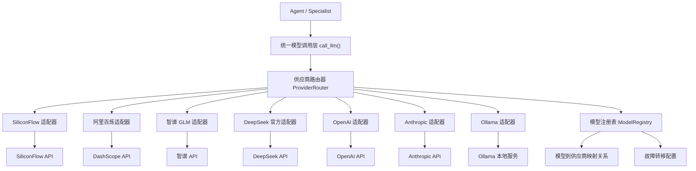

# 多供应商模型调用系统

Feature Name: multi-provider-models
Updated: 2026-05-22

## Description

扩展 CodingMatrix 模型调用系统，支持多个主流 API 供应商（OpenAI、Anthropic、阿里百炼、智谱 GLM、DeepSeek 官方、SiliconFlow 等），实现统一的模型调用接口，并允许 Agent 根据任务类型智能选择供应商和模型。

## Architecture



## 核心组件

### 1. ProviderRouter（供应商路由器）

```python
class ProviderRouter:
    """根据模型名称路由到对应供应商"""
    
    MODEL_PROVIDER_MAP: Dict[str, ModelProvider] = {
        # SiliconFlow 供应的模型
        "deepseek-ai/DeepSeek-R1-0528-Qwen3-8B": ModelProvider.SILICONFLOW,
        "Qwen/Qwen3.5-4B": ModelProvider.SILICONFLOW,
        "Qwen/Qwen3-8B": ModelProvider.SILICONFLOW,
        "Qwen/Qwen2.5-7B-Instruct": ModelProvider.SILICONFLOW,
        "THUDM/GLM-4.1V-9B-Thinking": ModelProvider.SILICONFLOW,
        "THUDM/GLM-4-9B-0414": ModelProvider.SILICONFLOW,
        "THUDM/GLM-Z1-9B-0414": ModelProvider.SILICONFLOW,
        "Kwai-Kolors/Kolors": ModelProvider.SILICONFLOW,
        "deepseek-ai/DeepSeek-OCR": ModelProvider.SILICONFLOW,
        "netease-youdao/bce-embedding-base_v1": ModelProvider.SILICONFLOW,
        
        # 阿里百炼供应的模型（未来扩展）
        "qwen-plus": ModelProvider.DASHSCOPE,
        "qwen-turbo": ModelProvider.DASHSCOPE,
        
        # 智谱供应的模型（未来扩展）
        "glm-4": ModelProvider.ZHIPU,
        "glm-4v": ModelProvider.ZHIPU,
        
        # DeepSeek 官方供应的模型（未来扩展）
        "deepseek-chat": ModelProvider.DEEPSEEK,
        "deepseek-reasoner": ModelProvider.DEEPSEEK,
    }
    
    # 故障转移配置
    PROVIDER_FALLBACK = {
        ModelProvider.SILICONFLOW: [ModelProvider.DASHSCOPE, ModelProvider.ZHIPU],
        ModelProvider.DASHSCOPE: [ModelProvider.SILICONFLOW],
        ModelProvider.ZHIPU: [ModelProvider.SILICONFLOW],
    }
    
    def route(self, model_name: str) -> ModelProvider:
        """根据模型名称返回对应供应商"""
        ...
    
    def get_fallback_providers(self, primary: ModelProvider) -> List[ModelProvider]:
        """获取故障转移供应商列表"""
        ...
```

### 2. 供应商适配器基类

```python
class BaseProviderAdapter:
    """供应商适配器基类"""
    
    provider: ModelProvider
    base_url: str
    api_key: str
    
    def __init__(self, config: ProviderConfig):
        self.api_key = config.api_key
        self.base_url = config.base_url
        self.timeout = config.timeout
    
    async def call_llm(
        self,
        model: str,
        prompt: str,
        system_prompt: str = "",
        stream: bool = False,
        temperature: float = 0.7,
        max_tokens: int = 4096,
        thinking_budget: int = 4096,
        cancel_event: Optional[asyncio.Event] = None,
    ) -> Union[dict, AsyncIterator[str]]:
        """统一调用接口，返回 OpenAI 兼容格式"""
        ...
    
    def _build_messages(self, prompt: str, system_prompt: str) -> List[dict]:
        """构建 messages 列表"""
        ...
    
    def _parse_response(self, response: dict) -> str:
        """解析响应提取内容"""
        ...
```

### 3. 具体供应商适配器

#### SiliconFlowAdapter

```python
class SiliconFlowAdapter(BaseProviderAdapter):
    provider = ModelProvider.SILICONFLOW
    
    # 复用现有 call_siliconflow 逻辑
```

#### DashScopeAdapter（阿里百炼）

```python
class DashScopeAdapter(BaseProviderAdapter):
    provider = ModelProvider.DASHSCOPE
    
    async def call_llm(self, ...):
        # 调用阿里百炼 API
        # 支持 OpenAI 兼容格式
```

#### ZhipuAdapter（智谱 GLM）

```python
class ZhipuAdapter(BaseProviderAdapter):
    provider = ModelProvider.ZHIPU
    
    async def call_llm(self, ...):
        # 调用智谱 API
        # 支持 ChatGLM 格式
```

### 4. 统一调用函数

```python
async def call_llm(
    model: str,
    prompt: str,
    system_prompt: str = "",
    stream: bool = False,
    temperature: float = 0.7,
    max_tokens: int = 4096,
    thinking_budget: int = 4096,
    timeout: float = 360.0,
    cancel_event: Optional[asyncio.Event] = None,
) -> Union[dict, AsyncIterator[str]]:
    """统一模型调用函数"""
    
    # 1. 查找供应商
    provider = get_provider_router().route(model)
    adapter = get_adapter(provider)
    
    # 2. 调用模型（带故障转移）
    try:
        return await adapter.call_llm(
            model=model,
            prompt=prompt,
            system_prompt=system_prompt,
            stream=stream,
            temperature=temperature,
            max_tokens=max_tokens,
            thinking_budget=thinking_budget,
            cancel_event=cancel_event,
        )
    except Exception as e:
        # 3. 故障转移
        fallback_providers = get_provider_router().get_fallback_providers(provider)
        for fallback in fallback_providers:
            try:
                fallback_adapter = get_adapter(fallback)
                return await fallback_adapter.call_llm(...)
            except Exception:
                continue
        
        raise  # 所有供应商都失败
```

## Data Models

### ProviderConfig

```python
@dataclass
class ProviderConfig:
    """供应商配置"""
    provider: ModelProvider
    api_key: str
    base_url: str
    timeout: float = 360.0
    max_retries: int = 3
    enabled: bool = True
```

### ModelProvider (Enum)

```python
class ModelProvider(str, Enum):
    SILICONFLOW = "siliconflow"
    DASHSCOPE = "dashscope"      # 阿里百炼
    ZHIPU = "zhipu"              # 智谱 GLM
    DEEPSEEK = "deepseek"        # DeepSeek 官方
    OPENAI = "openai"
    ANTHROPIC = "anthropic"
    OLLAMA = "ollama"            # 本地部署
```

## Correctness Properties

1. **API Key 保密性**: 所有 API Key 不得在日志中明文输出
2. **故障隔离**: 一个供应商失败不影响其他供应商调用
3. **响应格式统一**: 所有适配器返回相同的 OpenAI 兼容格式
4. **超时控制**: 每个供应商调用独立超时计数
5. **幂等性**: 相同输入应返回相同输出（不考虑 LLM 随机性）

## Error Handling

| 错误场景 | 处理策略 |
|---------|---------|
| 供应商 API Key 无效 | 记录警告，跳过该供应商 |
| 供应商服务不可用 | 自动故障转移到备份供应商 |
| 请求超时 | 重试一次，然后故障转移 |
| 速率限制 (429) | 等待后重试，或切换供应商 |
| 所有供应商都失败 | 抛出 `ModelCallError` 异常 |

## Test Strategy

1. **单元测试**: 测试每个适配器的消息构建、响应解析、参数映射
2. **集成测试**: 测试实际调用各供应商 API（需要有效 API Key）
3. **故障转移测试**: 模拟供应商失败，验证故障转移逻辑
4. **性能测试**: 测试多供应商并发调用的延迟和吞吐量

## References

[^1]: OpenAI API 格式 - [Chat Completions](https://platform.openai.com/docs/api-reference/chat)
[^2]: SiliconFlow API - [SiliconFlow Docs](https://docs.siliconflow.cn/)
[^3]: 阿里百炼 API - [DashScope Docs](https://help.aliyun.com/zh/model-studio/)
[^4]: 智谱 API - [Zhipu Docs](https://open.bigmodel.cn/dev/api)
[^5]: app/utils/AiCodeUtil.py - 现有 SiliconFlow 调用函数
[^6]: app/agent/specialist_base.py - Specialist 调用 LLM 的位置
