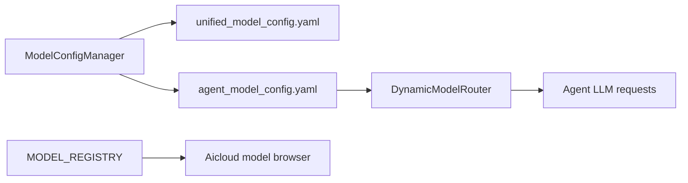

# Structured Model Configuration

Feature Name: structured-model-config
Updated: 2026-08-29

## Description

统一模型配置的字段和运行时刷新边界。管理面以 `unified_model_config.yaml` 为事实源，`agent_model_config.yaml` 作为 Agent 运行时派生文件；Aicloud 静态 `MODEL_REGISTRY` 在本阶段继续提供用户端目录能力。

## Architecture

保存操作通过单一管理器写入管理面配置，并同步运行时所需字段。同步完成后刷新动态路由缓存，避免已加载进程继续使用旧的角色、降级链或模型映射。

## Components and Interfaces

- `ModelConfigManager.save_config`: 保存管理面配置、同步运行时配置并触发刷新。
- `ModelConfigManager._sync_to_agent_config`: 导出模型 ID、Key、类型、上下文长度、输出上限和运行参数。
- `invalidate_model_mapping_cache`: 刷新模型 ID、Key 和供应商映射。
- `reload_roles_config`: 清理角色配置缓存。
- `DynamicModelRouter.reload_fallback_chain`: 重新读取降级链。

## Data Models

模型配置使用以下核心字段：`id`、`name`、`display_name`、`provider`、`type`、`context_length`、`max_output`、`temperature`、`timeout`、`is_reasoning`、`thinking_ratio`、`speed`、`enabled`、`tags`。

运行时文件额外保留 `error_type_models`、`settings`、`cross_validation` 等 Agent 专用字段。

## Correctness Properties

1. 每个模型 ID 在同一配置文件中唯一。
2. 每个角色和降级链元素都引用已声明模型 ID。
3. 模型 ID 到模型 Key 的映射与反向映射在刷新后互相一致。
4. 管理面保存成功后，运行时配置包含管理面模型的类型、上下文长度和输出上限。

## Error Handling

- 配置文件无法解析时沿用现有默认配置并记录错误。
- 运行时缓存刷新失败时记录警告，保存结果仍由文件写入结果决定。
- API 继续对不存在模型 ID 返回 404，对无效角色返回 400。

## Test Strategy

- 验证统一配置与运行时派生配置的 JSON 结构。
- 测试保存后运行时映射和角色缓存刷新。
- 测试 `free_only` 过滤行为。
- 运行模型配置、动态路由和 Aicloud API 相关单元测试。

## References

- `data/unified_model_config.yaml`
- `data/agent_model_config.yaml`
- `app/services/model_config_manager.py`
- `app/agent/dynamic_model_router.py`
