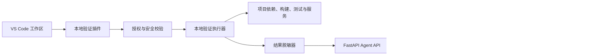
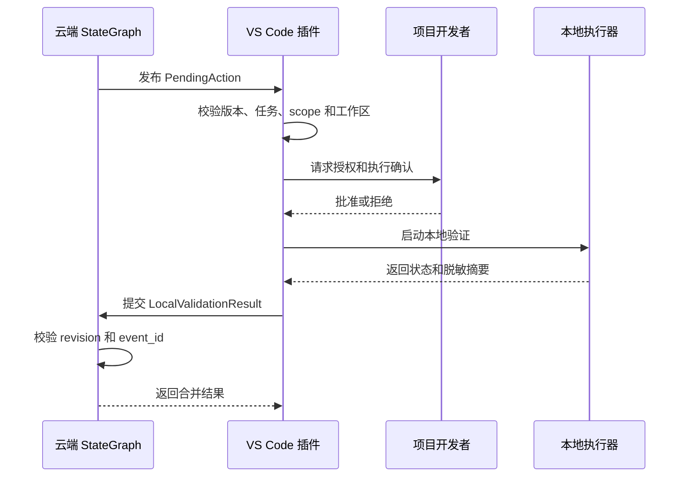

# VS Code 本地验证插件技术设计

Feature Name: vscode-local-validation-extension
Updated: 2026-08-29

## 1. 设计概述

VS Code 本地验证插件采用“云端编排、本地执行、结果回传”的边界。云端生成结构化 `PendingAction`，插件通过受认证的连接获取动作，经过工作区授权、协议版本、路径和执行策略校验后，在本地执行验证命令，再通过 `LocalValidationResult` 回传脱敏结果。

插件是本地验证执行器和用户确认界面。StateGraph、任务版本、终态推导和跨范围结果合并由云端负责。

## 2. 架构



### 2.1 云端边界

- `app/agent/state/models.py`：定义 State、StateDelta、MessageEnvelope 和验证结果模型。
- `app/agent/nodes/validation.py`：执行 `cloud_syntax`，为本地 scope 创建 PendingAction。
- `app/agent/local_validation_adapter.py`：校验插件结果的 task、revision、schema version 和 scope。
- `app/agent/state/reducer.py`：合并增量、处理 revision 冲突和消息幂等。
- Agent API：提供动作同步、结果回传和状态查询所需的 HTTP/SSE 接入层。

### 2.2 插件边界

插件拆分为以下逻辑组件：

- `CloudConnection`：云端认证、动作拉取、结果提交、重连和退避。
- `WorkspaceAuthorization`：工作区确认、路径归属和授权撤销。
- `ActionValidator`：协议版本、任务版本、scope、命令和路径校验。
- `ValidationRunner`：命令启动、超时、取消、退出码和进程树管理。
- `ResultSanitizer`：日志、环境变量和错误输出脱敏。
- `ResultStore`：本地未回传结果、幂等键和断线恢复状态持久化。
- `StatusView`：VS Code 状态栏、通知、进度和诊断信息展示。

## 3. 交互协议

### 3.1 验证动作

```json
{
  "action_id": "action-uuid",
  "event_id": "event-uuid",
  "schema_version": 1,
  "session_id": "session-uuid",
  "task_id": "task-uuid",
  "revision": 12,
  "workspace_id": "workspace-hash",
  "validation_scope": "local_runtime",
  "operation": "test",
  "command": ["python3", "-m", "pytest", "tests/unit", "-q"],
  "working_directory": ".",
  "timeout_seconds": 300,
  "requested_by": "cloud"
}
```

动作使用参数数组表达命令，插件根据允许的操作类型执行。路径以授权工作区为根解析，执行目录和输入文件经过规范化后再校验。

### 3.2 验证结果

```json
{
  "event_id": "result-event-uuid",
  "schema_version": 1,
  "session_id": "session-uuid",
  "task_id": "task-uuid",
  "revision": 12,
  "source": "local",
  "validation_scope": "local_runtime",
  "status": "passed",
  "started_at": "2026-08-29T00:00:00Z",
  "finished_at": "2026-08-29T00:02:10Z",
  "exit_code": 0,
  "summary": {
    "command_name": "pytest",
    "tests_total": 42,
    "tests_passed": 42,
    "tests_failed": 0,
    "diagnostics": []
  }
}
```

结果状态包含 `passed`、`failed`、`timeout`、`rejected`、`waiting_for_confirmation` 和 `cancelled`。插件上传前对命令输出、环境变量和诊断文本执行脱敏。

## 4. 生命周期



状态转换：

```text
pending_action
  -> waiting_for_confirmation
  -> running
  -> result_ready
  -> uploaded
  -> acknowledged
```

异常状态包括 `rejected`、`failed`、`timeout`、`cancelled` 和 `upload_pending`。本地结果在云端确认前保留本地副本，确认后根据保留策略清理。

## 5. 安全设计

- 工作区授权使用 VS Code workspace identity 和规范化绝对路径。
- 插件执行命令使用参数数组，禁止把云端字符串直接交给 shell 解释器。
- 动作按 `operation` 白名单分类：`syntax_check`、`dependency_check`、`build`、`unit_test`、`e2e_test` 和 `service_check`。
- 默认要求项目开发者确认会改变文件、安装依赖、启动服务或访问网络的动作。
- 进程执行设置超时、取消信号、输出上限和子进程清理策略。
- 脱敏规则覆盖 API key、Bearer token、密码、Cookie、私钥、连接串和环境变量值。
- 云端只接收摘要、hash、统计、退出码和有限诊断位置。

## 6. 云端 API 适配

插件适配层应复用现有 StateGraph 契约：

| 方向 | 契约 | 校验重点 |
|------|------|----------|
| 云端到插件 | `PendingAction` | task、revision、schema、scope、workspace |
| 插件到云端 | `LocalValidationResult` | task、revision、schema、scope、source |
| 状态合并 | `StateDelta` | expected revision、event id、终态策略 |
| 断线恢复 | `Checkpoint` 和 sequence | 顺序、重复事件、snapshot recovery |

插件接入现有 Agent API 时保留 legacy SSE 事件兼容层。新增插件消息使用版本化 Envelope，旧事件只作为过渡消费格式。

## 7. 错误处理

| 错误 | 插件行为 | 云端状态 |
|------|----------|----------|
| 工作区未授权 | 请求确认或拒绝执行 | `waiting_local_validation` |
| 协议版本不支持 | 保存错误并停止执行 | `blocked` |
| revision 冲突 | 丢弃过期结果，重新拉取状态 | 保持当前 revision |
| 命令超时 | 终止进程树并上传摘要 | `failed` 或 `partial_success` |
| 结果脱敏失败 | 阻止上传并提示本地处理 | `waiting_local_validation` |
| 网络中断 | 持久化结果并延迟回传 | `waiting_local_validation` |
| 云端确认失败 | 保留结果并限制重复提交 | `waiting_local_validation` |

## 8. 正确性属性

1. 对任意验证动作，插件执行路径都位于项目开发者授权工作区内。
2. 对任意结果事件，`source=local` 时 `validation_scope` 属于本地验证范围。
3. 对任意相同 `event_id`，云端状态最多应用一次。
4. 对任意过期 `revision`，结果不会覆盖当前 State。
5. 对任意包含多个必需验证范围的任务，所有范围完成前任务不会进入 `completed`。
6. 对任意上传成功的结果，云端 payload 不包含完整密钥、密码或完整环境变量。

## 9. 测试策略

### 单元测试

- 动作 Schema 解析、版本拒绝和 scope 校验。
- 工作区路径归属、路径穿越和授权撤销。
- 命令白名单、超时、取消和进程树清理。
- 脱敏器覆盖密钥、Cookie、连接串和多行日志。
- 本地结果缓存、重复提交和断线恢复。

### 集成测试

- 插件与本地 mock Agent API 的动作拉取和结果回传。
- revision 冲突、event 幂等和多 scope 终态推导。
- StateGraph `waiting_local_validation` 到 `completed` 或 `failed` 的状态链。

### VS Code E2E 测试

- 创建临时工作区并完成授权。
- 执行通过、失败、超时、取消和拒绝流程。
- 模拟云端断线后恢复结果回传。
- 验证敏感信息不进入网络 payload。
- 验证升级和不兼容协议提示。

## 10. 分阶段交付

1. 契约与 mock 连接：完成动作、结果、版本和错误模型。
2. 工作区与执行器：完成授权、路径、命令、超时和取消。
3. 结果闭环：完成脱敏、本地存储、回传、幂等和 revision 冲突处理。
4. VS Code 体验：完成进度、诊断、任务取消和断线恢复界面。
5. 生产验收：完成真实插件 E2E、打包、升级和兼容矩阵。

## 11. 参考

- `.monkeycode/docs/INTERFACES.md`
- `.monkeycode/docs/ARCHITECTURE.md`
- `.monkeycode/docs/DEVELOPER_GUIDE.md`
- `.monkeycode/specs/2026-08-28-stategraph-rag-orchestration/tasklist.md`
- `docs/evolution/TASKS.md`
