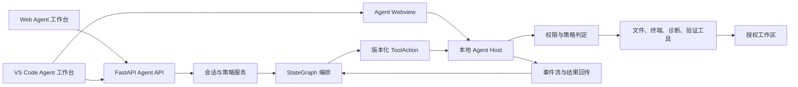
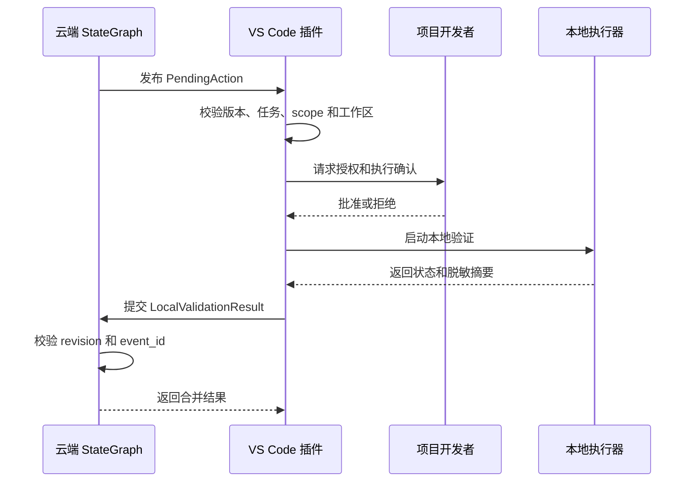

# 网页 Agent 本地 Agent Host 技术设计

Feature Name: vscode-local-validation-extension
Updated: 2026-08-29

## 1. 设计概述

系统采用“共享云端会话、双 Agent 工作台、本地 Agent Host 执行”的边界。Web 与 VS Code 工作台共享 Agent 会话、模型、Skills、权限和验证策略；云端将需要本地能力的工具动作编排为版本化 `ToolAction`；VS Code 扩展在授权工作区内执行动作，并通过事件流回传上下文、进度、诊断和结果。

Web 与 VS Code 是同一 Agent 系统的两个一等工作台。StateGraph、模型调用、Skills 生命周期、任务版本和结果聚合由云端负责；VS Code 扩展提供工作区、文件、终端、诊断、验证和本地权限能力，VS Code Webview 提供 Agent 交互界面。

## 2. 架构



### 2.1 Agent 工作台边界

- Web 工作台：对话、计划、任务时间线、审批和结果展示，支持跨设备、远程项目和团队协作。
- VS Code 工作台：通过 Webview 提供一致的 Agent 会话体验，通过扩展 API 提供本地能力。
- 两个工作台共享会话、模型、Skills、策略、消息和任务状态，用户可从任一工作台继续任务。

### 2.2 Webview 与原生扩展边界

- `AgentWebview`：承载 Agent 对话、计划、模型选择、Skills、审批、验证开关和结果时间线。
- `WebviewBridge`：在 Webview 与扩展 Host 之间传递会话事件、动作请求、策略和本地状态。
- 原生扩展 Host：访问 VS Code API、授权工作区、执行文件、终端、诊断和验证动作。
- Webview 使用云端会话 API；敏感本地能力通过受校验的 `WebviewBridge` 调用。

### 2.3 云端边界

- `app/agent/state/models.py`：定义 State、StateDelta、MessageEnvelope 和验证结果模型。
- `app/agent/nodes/validation.py`：执行 `cloud_syntax`，为本地 scope 创建 PendingAction。
- `app/agent/local_validation_adapter.py`：校验插件结果的 task、revision、schema version 和 scope。
- `app/agent/state/reducer.py`：合并增量、处理 revision 冲突和消息幂等。
- Agent API：提供动作同步、结果回传和状态查询所需的 HTTP/SSE 接入层。

### 2.4 扩展边界

插件拆分为以下逻辑组件：

- `CloudConnection`：云端认证、动作同步、事件提交、重连和退避。
- `AgentHostSession`：工作区绑定、会话握手、策略同步、能力声明和断线恢复。
- `ToolDispatcher`：文件、终端、诊断、验证和 Skill 工具动作分发。
- `ApprovalBridge`：接收网页审批结果，处理本地策略和高风险动作确认。
- `SkillRuntime`：校验 Skill 版本和能力声明，提供受策略限制的 Skill 执行上下文。
- `WorkspaceAuthorization`：工作区确认、路径归属和授权撤销。
- `ActionValidator`：协议版本、任务版本、scope、命令和路径校验。
- `ValidationRunner`：命令启动、超时、取消、退出码和进程树管理。
- `ResultSanitizer`：日志、环境变量和错误输出脱敏。
- `ResultStore`：本地未回传结果、幂等键和断线恢复状态持久化。
- `StatusView`：VS Code 连接、授权、策略和异常状态展示；完整 Agent 交互由 Webview 提供。

## 3. 交互协议

### 3.0 版本化 Agent Host Envelope

所有网页端与插件消息使用统一 Envelope，核心字段如下：

```json
{
  "message_id": "message-uuid",
  "schema_version": 1,
  "session_id": "session-uuid",
  "task_id": "task-uuid",
  "revision": 12,
  "kind": "tool_action",
  "capability": "validation",
  "policy_version": 4,
  "payload": {}
}
```

`kind` 支持 `host_hello`、`tool_action`、`approval_request`、`approval_decision`、`progress_event`、`diagnostic_event`、`tool_result`、`policy_update`、`skill_revoke` 和 `session_control`。`capability` 支持 `workspace`、`file`、`terminal`、`diagnostics`、`validation` 和 `skill_runtime`。

### 3.0.1 会话握手

插件连接后发送工作区标识、插件版本、协议版本和能力清单。云端返回会话绑定、有效策略、允许的能力和当前未完成动作。握手成功后插件才消费动作队列。

### 3.0.2 工具动作

文件读取、文件变更、终端执行、诊断采集和验证动作共享 `ToolAction` 外层结构。每个动作包含能力、风险级别、目标资源、参数、超时、幂等键和策略版本；具体参数根据能力类型进行独立 Schema 校验。

### 3.1 验证动作

```json
{
  "action_id": "action-uuid",
  "event_id": "event-uuid",
  "schema_version": 1,
  "session_id": "session-uuid",
  "task_id": "task-uuid",
  "revision": 12,
  "workspace_id": "workspace-hash",
  "validation_scope": "local_runtime",
   "operation": "unit_test",
  "command": ["python3", "-m", "pytest", "tests/unit", "-q"],
  "working_directory": ".",
  "timeout_seconds": 300,
  "requested_by": "cloud"
}
```

动作使用参数数组表达命令，插件根据允许的操作类型执行。路径以授权工作区为根解析，执行目录和输入文件经过规范化后再校验。

### 3.2 验证结果

```json
{
  "event_id": "result-event-uuid",
  "schema_version": 1,
  "session_id": "session-uuid",
  "task_id": "task-uuid",
  "revision": 12,
  "source": "local",
  "validation_scope": "local_runtime",
  "status": "passed",
  "started_at": "2026-08-29T00:00:00Z",
  "finished_at": "2026-08-29T00:02:10Z",
  "exit_code": 0,
  "summary": {
    "command_name": "pytest",
    "tests_total": 42,
    "tests_passed": 42,
    "tests_failed": 0,
    "diagnostics": []
  }
}
```

结果状态包含 `passed`、`failed`、`timeout`、`rejected`、`waiting_for_confirmation` 和 `cancelled`。插件上传前对命令输出、环境变量和诊断文本执行脱敏。

## 4. 生命周期



状态转换：

```text
pending_action
  -> waiting_for_confirmation
  -> running
  -> result_ready
  -> uploaded
  -> acknowledged
```

异常状态包括 `rejected`、`failed`、`timeout`、`cancelled` 和 `upload_pending`。本地结果在云端确认前保留本地副本，确认后根据保留策略清理。

## 5. 安全设计

- 工作区授权使用 VS Code workspace identity 和规范化绝对路径。
- 插件执行命令使用参数数组，禁止把云端字符串直接交给 shell 解释器。
- 动作按 `operation` 白名单分类：`syntax_check`、`dependency_check`、`build`、`unit_test`、`e2e_test` 和 `service_check`。
- 默认要求项目开发者确认会改变文件、安装依赖、启动服务或访问网络的动作。
- 进程执行设置超时、取消信号、输出上限和子进程清理策略。
- 脱敏规则覆盖 API key、Bearer token、密码、Cookie、私钥、连接串和环境变量值。
- 云端只接收摘要、hash、统计、退出码和有限诊断位置。

## 6. 云端 API 适配

插件适配层应复用现有 StateGraph 契约：

| 方向 | 契约 | 校验重点 |
|------|------|----------|
| 云端到插件 | `PendingAction` | task、revision、schema、scope、workspace |
| 插件到云端 | `LocalValidationResult` | task、revision、schema、scope、source |
| 状态合并 | `StateDelta` | expected revision、event id、终态策略 |
| 断线恢复 | `Checkpoint` 和 sequence | 顺序、重复事件、snapshot recovery |

插件接入现有 Agent API 时保留 legacy SSE 事件兼容层。新增插件消息使用版本化 Envelope，旧事件只作为过渡消费格式。

### 6.1 传输选择

- 首选 WebSocket，用于双向动作、审批、进度和会话控制。
- 保留 HTTP 拉取与提交，用于插件初始化、断线恢复和受限网络环境。
- Web 工作台和 VS Code Webview 都通过云端事件总线接收扩展事件，两个工作台使用同一 Agent 会话时间线。
- VS Code Webview 使用云端模型路由执行 Agent 推理；本地模型 Provider 通过同一模型接口作为可选能力接入。

### 6.2 策略同步

策略以 `policy_version` 单调递增。插件只接受当前会话绑定的策略版本；收到新版本后原子替换本地策略快照，并将执行中的动作继续绑定原策略版本。

## 7. 错误处理

| 错误 | 插件行为 | 云端状态 |
|------|----------|----------|
| 工作区未授权 | 请求确认或拒绝执行 | `waiting_local_validation` |
| 协议版本不支持 | 保存错误并停止执行 | `blocked` |
| revision 冲突 | 丢弃过期结果，重新拉取状态 | 保持当前 revision |
| 命令超时 | 终止进程树并上传摘要 | `failed` 或 `partial_success` |
| 结果脱敏失败 | 阻止上传并提示本地处理 | `waiting_local_validation` |
| 网络中断 | 持久化结果并延迟回传 | `waiting_local_validation` |
| 云端确认失败 | 保留结果并限制重复提交 | `waiting_local_validation` |

## 8. 正确性属性

1. 对任意验证动作，插件执行路径都位于项目开发者授权工作区内。
2. 对任意结果事件，`source=local` 时 `validation_scope` 属于本地验证范围。
3. 对任意相同 `event_id`，云端状态最多应用一次。
4. 对任意过期 `revision`，结果不会覆盖当前 State。
5. 对任意包含多个必需验证范围的任务，所有范围完成前任务不会进入 `completed`。
6. 对任意上传成功的结果，云端 payload 不包含完整密钥、密码或完整环境变量。

## 9. 测试策略

### 单元测试

- 动作 Schema 解析、版本拒绝和 scope 校验。
- 工作区路径归属、路径穿越和授权撤销。
- 命令白名单、超时、取消和进程树清理。
- 脱敏器覆盖密钥、Cookie、连接串和多行日志。
- 本地结果缓存、重复提交和断线恢复。

### 集成测试

- 插件与本地 mock Agent API 的动作拉取和结果回传。
- revision 冲突、event 幂等和多 scope 终态推导。
- StateGraph `waiting_local_validation` 到 `completed` 或 `failed` 的状态链。

### VS Code E2E 测试

- 创建临时工作区并完成授权。
- 执行通过、失败、超时、取消和拒绝流程。
- 模拟云端断线后恢复结果回传。
- 验证敏感信息不进入网络 payload。
- 验证升级和不兼容协议提示。
- 验证网页会话暂停、取消、继续和策略版本同步。
- 验证 Skill 下发、能力校验和撤销事件。
- 验证文件、终端和诊断动作在同一会话时间线中回传。

## 10. 分阶段交付

1. Agent Host 契约：完成 Envelope、握手、能力清单、会话控制和错误模型。
2. 工作区工具：完成文件、终端、诊断、验证、授权、超时和取消。
3. 网页会话闭环：完成双向事件、进度、审批、断线恢复和统一时间线。
4. 模型与 Skills：接入供应商配置、BYOK、模型策略、Skill 上传、版本和撤销。
5. 执行策略：完成总开关、验证类型开关、自动执行级别、风险规则和审计。
6. VS Code 体验：完成后台连接状态、授权异常、通知和最小化本地控制面。
7. 生产验收：完成真实插件 E2E、打包、升级、兼容矩阵和多工作区验证。

## 11. 参考

- `.monkeycode/docs/INTERFACES.md`
- `.monkeycode/docs/ARCHITECTURE.md`
- `.monkeycode/docs/DEVELOPER_GUIDE.md`
- `.monkeycode/specs/2026-08-28-stategraph-rag-orchestration/tasklist.md`
- `docs/evolution/TASKS.md`
