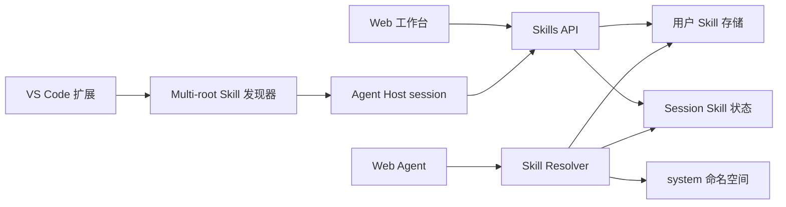

# User-Scoped Skills

Feature Name: user-scoped-skills
Updated: 2026-08-30

## Description

为 Web 与 VS Code 建立统一的三层 Skill 模型：系统内置 Skills、用户云端 Skills 和 workspace session Skills。用户认证决定 User Skill 的所有权；Agent Host session 保存 Workspace Skill；完整命名空间避免同名覆盖。

## Architecture



Web 端通过认证用户 ID 查询用户 Skills，并通过 session ID 查询当前 VS Code 会话 Skills。VS Code 监听所有 workspace folders，按文件变化生成完整快照同步到 session。Agent Resolver 合并三类来源，使用完整命名空间读取内容。

## Components and Interfaces

### Backend

- `CustomSkillManager`: 接受 `owner_user_id`，所有列表、读取、更新和删除操作执行所有权过滤。
- `SkillRegistry`: 为系统 Skill、User Skill 和 session Skill 维护命名空间标识。
- `Agent Host API`: session handshake、Skill snapshot sync、session Skill 查询和 User Skill 变更推送。
- `Skill Resolver`: 根据当前用户和可选 Agent Host session 合并 `system:`, `user:` 和 `workspace:` Skills。
- `Legacy migration`: 选择最早创建的系统管理员，将历史 `api_user` 记录迁移为该用户所有。

### VS Code

- `skill-discovery.ts`: 接收多个 workspace folders，返回 `workspace:<folder-name>:<skill-name>` 标识。
- `FileSystemWatcher`: 监听三类 Skill 目录，使用防抖后的完整快照同步。
- `AgentHostRuntime`: 接受云端 User Skill 更新，并向 Web 可见 session 状态发布变更。

### Web

- 当前 session Skill 列表展示组件只读显示 Workspace Skills。
- 对话上下文从 Skill Resolver 获取全部可用 Skills，由 Agent 自动选择。
- Web 不提供 Workspace Skill 删除、启用或禁用操作。

## Data Models

```text
UserSkill
  id
  owner_user_id
  name
  namespace = user
  category
  content
  description
  version
  created_at
  updated_at

SessionSkillSnapshot
  session_id
  owner_user_id
  workspace_id
  skills: map[workspace-qualified-name, {path, content, hash}]
  version
  updated_at
  expires_at
```

System Skills remain code-registered and receive `system:` identifiers. Workspace Skills remain session data and are not persisted into the UserSkill store.

## Correctness Properties

1. A User Skill can be read only when `owner_user_id` matches the authenticated subject.
2. Two Skills with the same raw name remain distinct when their namespaces differ.
3. A session snapshot exactly represents the latest accepted workspace discovery result.
4. A removed workspace file is absent from the next accepted session snapshot.
5. An expired session contributes zero Workspace Skills to Web resolution.
6. User Skill updates converge across all active sessions for the same authenticated user.

## Error Handling

- Missing authentication returns the existing authentication response.
- Cross-user Skill access returns the existing resource-not-found style response to avoid leaking ownership.
- Invalid namespace or malformed snapshot returns a validation error and preserves the previous accepted snapshot.
- Oversized or unreadable workspace files are skipped individually; other valid files continue syncing.
- Session expiry causes Web resolution to omit Workspace Skills while preserving User and System Skills.
- Migration without an administrator reports a retryable migration error.

## Test Strategy

- Backend unit tests for owner filtering, namespace resolution, session snapshots, expiration and migration idempotency.
- API tests for authenticated CRUD and cross-user access.
- VS Code tests for multi-root discovery, watcher debounce, deletion removal, namespaced collisions and 100 KB limit.
- Integration tests for User Skill propagation to active sessions.
- Existing Agent Host, Web conversation and extension regression suites remain required.

## References

- `.monkeycode/docs/ARCHITECTURE.md`
- `app/api/v1/skills.py`
- `app/api/v1/agent_host.py`
- `app/services/custom_skill_manager.py`
- `app/services/skill_registry.py`
- `vscode-extension/src/skill-discovery.ts`
