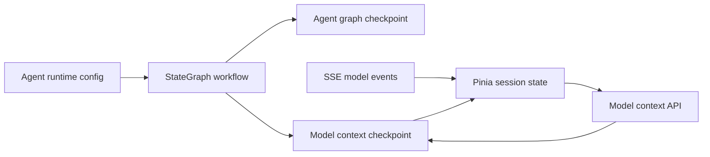

# Agent Model Context Management

Feature Name: agent-model-context
Updated: 2026-09-01

## Description

为 Agent 会话增加后端模型上下文快照。统一状态层保存权威快照，Pinia 和 localStorage 提供客户端缓存，SSE 模型事件提供运行时增量信息。

## Architecture

模型上下文使用独立任务类型、确定性 Task ID 和 revision 序列。Graph metadata 保留执行开始时的模型配置，前端在流式执行结束后补充当前模型和调用统计。PUT 使用 `expected_revision` 乐观锁；配置同步引起冲突时，前端读取最新配置并重试一次运行统计。

## Components and Interfaces

- `model_context_service`: 构造、规范化、合并、保存和读取模型上下文。
- `agent_state_adapter`: Graph 状态持久化时同步模型上下文。
- `GET /api/v1/agent/sessions/{session_id}/model-context`: 返回用户会话的最新模型上下文。
- `PUT /api/v1/agent/sessions/{session_id}/model-context`: 合并并保存前端观察到的运行状态。
- `agentSession` Pinia store: 在后端格式与前端 `modelAssignments` 格式之间转换。

## Data Models

模型上下文包含 `schema_version`、`config_version`、`roles`、`current_model`、`current_agent`、`assignments`、`fallback_history` 和 `updated_at`。`assignments` 中每个角色包含 `model`、`calls` 和 `success_rate`。

## Correctness Properties

1. 模型上下文任务按用户和统一会话唯一。
2. Checkpoint revision 在模型上下文任务内单调递增。
3. API 通过统一会话映射和用户 ID 执行所有权隔离。
4. 每次 Checkpoint 保存完整模型上下文，读取无需重放增量事件。
5. 模型上下文不包含 API Key、访问令牌或供应商凭据。
6. 生成期间会话标识保持稳定，SSE 事件和完成同步只更新发起生成的会话。

## Error Handling

- 旧会话缺少快照时返回运行时默认上下文。
- 前端同步失败时记录警告并保留本地状态。
- 会话映射不存在或归属不匹配时返回 404。
- 配置文件加载失败时返回空角色映射和稳定 schema 版本。

## Test Strategy

- 单元测试模型上下文合并、版本递增和用户会话隔离。
- API 客户端测试读取与更新请求契约。
- Pinia 测试后端上下文恢复和前端格式转换。
- 回归执行 Agent 状态、统一状态和前端测试套件。

## References

- `app/agent/state/models.py`
- `app/services/agent_state_adapter.py`
- `app/services/task_checkpoint_service.py`
- `src/stores/agentSession.js`
- `src/composables/useAgentStreaming.js`
