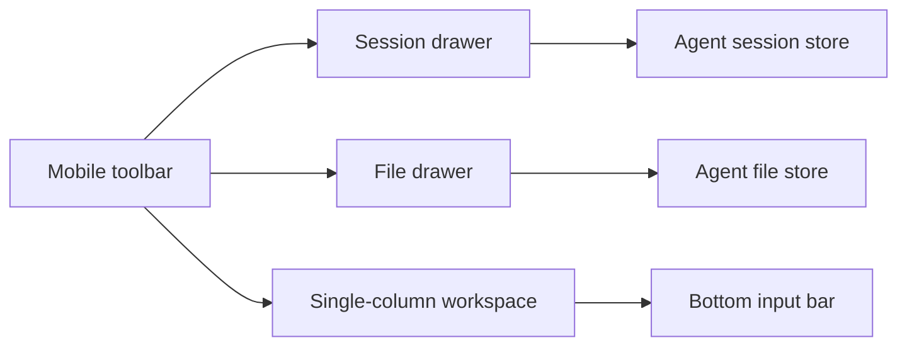

# Mobile Agent Interface

Feature Name: mobile-agent-interface
Updated: 2026-09-01

## Description

手机端沿用 Agent Dashboard 的现有组件和数据流，在 768px 及以下视口切换为单列工作区。会话历史与文件预览通过固定抽屉承载，桌面端三栏布局保持原有行为。

## Architecture

## Components and Interfaces

- `AgentDashboard.vue` 提供移动端工具栏、抽屉状态和遮罩层事件。
- `agent-layout.css` 提供移动端单列布局、左右抽屉、底部安全区域和窄屏字号规则。
- `AgentSidebar.vue` 继续提供会话历史与文件树内容。
- `AgentFilePanel.vue` 继续提供当前文件预览和操作。

## Correctness Properties

1. 手机端页面同一时刻至多展示一个移动端抽屉。
2. 关闭抽屉不会修改会话、文件或生成状态。
3. 桌面端视口继续使用三栏布局。
4. 移动端输入框满足安全区域和触屏字号要求。

## Error Handling

- 没有选中文件时禁用文件抽屉按钮。
- 生成期间沿用现有会话操作保护。
- 抽屉关闭通过遮罩层和会话切换共同处理。

## Test Strategy

- 运行现有 Vitest 单元测试。
- 运行 ESLint 和生产构建，确认新增模板与 CSS 可编译。
- 通过 Vite 预览检查桌面端与手机端路由加载。

## References

- `src/views/AgentDashboard.vue`
- `src/styles/agent-layout.css`
- `src/components/agent/AgentSidebar.vue`
- `src/components/agent/AgentFilePanel.vue`
