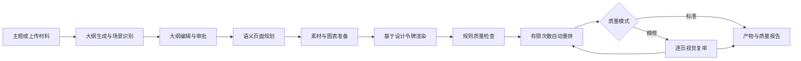
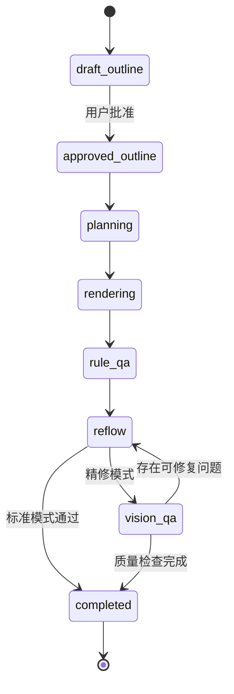

# PPT 视觉质量优化技术设计

Feature Name: ppt-visual-quality
Updated: 2026-09-05

## 描述

本设计在现有 PPT 生成链路上增加大纲审批、语义页面模型、统一设计令牌、标准/精修双质量模式以及生成后质检闭环。现有 `VisualAnalyzer`、`LayoutDecider`、模板系统、`SlideRenderer` 和 `PPTVisualAnalyzer` 继续承担对应职责，新增编排层将这些能力连接为可追踪的多阶段任务。

首期覆盖商务汇报、数据报告、产品路演、学术报告、教育培训和通用演示。各场景共享页面语义模型与质量规则，通过场景画像和模板令牌表达差异。

## 架构



### 阶段状态



生成任务使用已批准的大纲快照。审批之后的编辑产生新版本，从而保证运行中的任务输入稳定。

## 组件与接口

### 1. OutlineWorkflow

职责：生成、校验、编辑、版本化和批准大纲草稿。

建议接口：

```text
POST   /api/v1/pptx/outlines
GET    /api/v1/pptx/outlines/{outline_id}
PATCH  /api/v1/pptx/outlines/{outline_id}
POST   /api/v1/pptx/outlines/{outline_id}/approve
POST   /api/v1/pptx/outlines/{outline_id}/generate
```

现有 `/generate-text` 可作为大纲生成能力的内部入口或兼容入口。`/generate_task` 接收 `outline_id` 和 `outline_version` 后进入渲染，避免在单次调用中同时生成大纲和文件。

### 2. SemanticSlidePlanner

职责：将批准大纲转换为稳定的页面计划。页面计划显式表达页面类型、核心结论、内容块、布局候选、素材需求和容量预算。

页面类型集合：

```text
cover, agenda, section, key_points, image_text, data,
comparison, timeline, process, summary, closing
```

布局选择采用“硬约束过滤 + 评分排序”：

- 硬约束：页面类型兼容性、元素数量、素材可用性、容量预算。
- 评分项：语义匹配、模板匹配、连续布局惩罚、空间利用率、素材质量。
- 稳定性：相同大纲版本、模板版本和规划器版本产生一致的规则规划结果。

`app/utils/visual/visual_analyzer.py` 扩展页面语义和素材意图字段；`app/utils/visual/layout_decider.py` 扩展布局枚举和候选评分，保留现有渲染接口。

### 3. DesignTokenResolver

职责：将场景画像、用户模板和页面类型解析为完整设计令牌。

`TemplateConfig` 扩展以下令牌组：

- 色彩：背景层级、正文、弱化文字、语义色、图表序列色。
- 字体：中英文字体回退、各层级字号、字重、行高。
- 空间：页面安全区、网格、内容块间距、段落间距。
- 形状：圆角、描边、阴影、分隔线和图标规格。
- 图片：裁切焦点、圆角、遮罩、色调和署名位置。
- 图表：坐标轴、网格线、图例、标签和数据来源样式。

`app/utils/pptx/templates/base.py` 保持模板配置的单一来源；旧模板字段通过一次性迁移填充新令牌默认值。

### 4. SlideRendererPipeline

职责：根据页面计划和设计令牌渲染 PPTX，并输出页面级布局元数据。

渲染器按页面类型注册实现，公共标题、页码、来源、背景和装饰由统一层处理。渲染结果附带元素边界、文字测量结果、图片原始尺寸与裁切参数，为规则质检提供确定性输入。

首期渲染器优先级：

1. `cover`、`section`、`key_points`、`summary`
2. `image_text`、`data`、`comparison`
3. `timeline`、`process`、`agenda`、`closing`

### 5. RuleQualityChecker

职责：使用 PPTX 元数据和渲染元数据检测确定性问题。

检查器输出统一 `QualityIssue`：

- `text_overflow`：文本测量边界超出文本框。
- `element_overlap`：非装饰元素重叠面积超过较小元素面积的 2%。
- `low_contrast`：正文对比度低于 4.5:1，大字号文本对比度低于 3:1。
- `content_density`：页面内容超过页面类型容量预算。
- `image_distortion`：显示宽高比偏差超过 2%。
- `layout_repetition`：同一布局连续出现超过 2 页。
- `unsafe_margin`：关键元素进入页面安全区之外。

规则质检在标准模式和精修模式中均执行。

### 6. VisualQualityReviewer

职责：在精修模式中调用现有页面预览和视觉分析能力，补充规则难以识别的问题，包括视觉重心、层级模糊、素材相关性、风格一致性和图表可读性。

`app/utils/pptx/slide_renderer.py` 负责页面预览；`app/utils/pptx/visual_analyzer.py` 输出结构化问题和置信度。视觉结果只触发白名单修复动作，置信度低于 0.70 的建议进入人工复核列表。

精修服务异常时，编排器保存降级原因并使用规则质检结果交付。

### 7. AutoReflowEngine

职责：将质量问题映射为有限、可重复的修复动作。

修复优先级：

1. 内容拆页或减少同页内容块
2. 切换兼容布局
3. 调整内容块尺寸与间距
4. 调整字号至令牌下限
5. 调整颜色、裁切和装饰

每页最多执行 2 轮修复。每轮重新运行受影响规则；同一输入和同一问题集合产生稳定修复顺序。修复动作写入质量报告，便于回放和测试。

### 8. PPTGenerationOrchestrator

职责：编排 `planning -> assets -> rendering -> rule_qa -> reflow -> vision_qa -> completed`，将阶段事件写入现有任务事件体系。

`quality_mode=standard` 在规则质检通过或达到重排上限后交付。`quality_mode=refined` 继续执行逐页视觉复审。页面任务允许并行渲染，整稿一致性检查在页面结果汇总后串行执行。

默认大纲页面为每个非封面页面提供核心论点、依据或例子、行动建议和衡量指标四类内容块；四类内容块由页面叙事角色生成差异化内容，不复用固定句式。页面叙事角色包括 opportunity_map、evidence_story、strategic_choice、execution_roadmap 和 decision_close。页面素材意图进入素材阶段，视觉布局缺少图片决策时使用图片管理器的降级结果，保证内容页保留图文表达。

### 10. 叙事与构图系统

默认渲染器使用页面叙事角色驱动构图。每种角色绑定内容结构和视觉骨架：

| 叙事角色 | 内容结构 | 构图骨架 |
| --- | --- | --- |
| opportunity_map | 三个变化信号、机会窗口、优先验证项 | 大数字 + 右侧机会卡片 |
| evidence_story | 指标证据、用户/市场案例、证据含义 | 左侧大指标 + 右侧证据条 |
| strategic_choice | 选项、取舍标准、推荐选择 | 双栏对比 + 中央推荐标记 |
| execution_roadmap | 阶段、交付物、准入门槛 | 横向路线图 + 阶段卡片 |
| decision_close | 关键判断、立即行动、决策请求 | 中心结论 + 三项行动卡片 |

相邻页面通过背景层级、卡片数量、图片比例、对齐方式和信息重心产生变化。公共设计令牌继续控制颜色、字体和间距，页面骨架控制内容组织，保证统一品牌下的视觉节奏。

### 9. Web 前端

`src/views/PPTGenerate.vue` 调整为三步流程：

1. 输入主题或材料并选择场景、模板候选和页数。
2. 编辑大纲草稿，显示页面类型、核心结论、素材意图和校验问题。
3. 批准大纲，选择标准或精修模式并开始生成。

预览页显示整体质量分和问题页标记。用户可重新生成指定页，并保留其余页面版本。

`src/utils/api/ppt.js` 增加大纲 CRUD、批准、按批准版本生成和质量报告读取方法。

页数控件表达最终总页数。大纲服务为选定值 `N` 创建 `N-1` 个可编辑内容页，PPTX 渲染器统一创建 1 张封面；用户在审阅阶段增删内容页后，生成任务以 `1 + len(approved_outline.slides)` 作为最终总页数。旧的直接生成和文件生成入口在渲染边界将内容页限制为 `slide_count - 1`，保证交付文件不超过请求总页数。

增强 PPTX 渲染器每次任务解析一次 `DesignTokens`，通过共享样式适配器覆盖 `PPTStyle` 的颜色、字体和背景字段，再将同一个样式快照传入封面与全部内容页渲染函数。规范模板 ID 在进入布局分支前映射到对应的旧版视觉主题 ID。

## 数据模型

### OutlineDraft

```python
class OutlineDraft:
    id: str
    user_id: str
    version: int
    status: str  # draft | approved
    title: str
    scenario: str
    template_id: str
    slide_limit: int
    slides: list[OutlineSlide]
    created_at: datetime
    approved_at: datetime | None
```

### OutlineSlide

```python
class OutlineSlide:
    id: str
    position: int
    slide_type: str
    title: str
    key_message: str
    content_blocks: list[ContentBlock]
    asset_intent: AssetIntent | None
    speaker_notes: str
```

### SlidePlan

```python
class SlidePlan:
    slide_id: str
    layout_id: str
    layout_version: str
    token_version: str
    elements: list[PlannedElement]
    capacity_budget: CapacityBudget
    planning_score: float
```

### QualityIssue

```python
class QualityIssue:
    slide_id: str
    issue_type: str
    severity: str  # info | warning | critical
    score: float
    evidence: dict
    suggested_action: str | None
    status: str  # detected | fixed | review_required
```

### QualityReport

```python
class QualityReport:
    task_id: str
    version: int
    quality_mode: str  # standard | refined
    outline_id: str
    outline_version: int
    template_id: str
    template_version: str
    overall_score: float
    slide_scores: dict[str, float]
    issues: list[QualityIssue]
    reflow_attempts: dict[str, int]
    degraded_stage: str | None
```

建议将大纲版本和质量报告存入统一 State/Checkpoint，PPTX、预览图和布局元数据继续作为 Artifact 管理。任务事件保存阶段进度和页面级状态。

## 正确性属性

1. **审批快照一致性**：生成任务引用的大纲内容在任务生命周期内保持不变。
2. **模板一致性**：同一演示文稿的全部页面引用同一设计令牌版本。
3. **页面顺序稳定性**：自动拆页保持原页面顺序及内容块顺序。
4. **质量模式包含关系**：精修模式完整执行标准模式的规则检查。
5. **修复有界性**：每页自动重排次数小于或等于 2。
6. **字号下限**：自动修复后的标题字号大于或等于 24 磅，正文字号大于或等于 14 磅。
7. **图片比例一致性**：等比缩放或裁切后的宽高比偏差小于或等于 2%。
8. **结果可追踪性**：每个产物可解析到大纲、模板、规划器和质量报告版本。
9. **局部再生成隔离性**：指定页再生成只更新目标页及整稿一致性报告。
10. **最终页数一致性**：交付 PPTX 的页面数量等于批准大纲内容页数量加 1，直接生成入口的页面数量小于或等于请求的最终总页数。
11. **令牌渲染一致性**：同一演示文稿的封面与内容页使用同一个设计令牌样式快照。

## 错误处理

| 场景 | 系统行为 |
|---|---|
| 大纲结构无效 | 返回页面级字段错误并保留草稿内容 |
| 场景识别置信度较低 | 采用通用演示场景并提示用户调整 |
| 素材获取失败 | 使用模板视觉元素并记录素材状态 |
| 页面渲染失败 | 对目标页执行一次安全布局重试，随后标记任务失败原因 |
| 规则质检失败 | 保存产物和诊断信息，将任务标记为需复核 |
| 视觉复审服务失败 | 降级为标准模式结果并记录降级阶段 |
| 自动重排达到上限 | 保留最佳得分页并标记人工复核 |
| 用户取消任务 | 停止后续阶段并保存已完成事件与产物索引 |

## 测试策略

### 单元测试

- 大纲状态转换、版本递增和审批快照。
- 页面类型识别和场景识别阈值。
- 布局硬约束、评分排序和连续布局惩罚。
- 设计令牌解析与模板迁移。
- 文本溢出、元素重叠、对比度、密度和图片比例规则。
- 问题到修复动作的映射、修复优先级和两轮上限。
- 整体分与逐页分计算。
- 最终总页数到内容大纲页数量的换算，以及重复封面的归一化。
- 设计令牌对实际 PPTX 颜色、字体和背景样式的覆盖。

### 属性测试

- 任意合法大纲经过规划后保持页面和内容块顺序。
- 任意修复序列保持字号下限和页面安全区约束。
- 相同版本输入产生相同规则布局计划和修复顺序。
- 精修模式的规则问题集合包含标准模式检测结果。

### 集成测试

- `创建大纲 -> 编辑 -> 批准 -> 标准生成 -> 下载 -> 质量报告` 全链路。
- `创建大纲 -> 批准 -> 精修生成 -> 视觉服务成功/降级` 两条链路。
- 文件上传与文本输入使用同一大纲审批流程。
- WebSocket 或任务事件按阶段递增并支持恢复。
- 指定页面再生成保持其他页面二进制内容或布局计划版本不变。

### 视觉回归测试

- 为 11 种页面类型维护固定输入和基准预览图。
- 对关键区域执行像素差异和布局元数据双重断言。
- 覆盖中英文、长标题、极端数值、缺图、透明图片和 5/10/30/50 页整稿。
- 每个内置模板至少覆盖封面、图文、数据、对比和总结页。

### 验收指标

- 测试语料中的文本溢出严重问题为 0。
- 测试语料中的非装饰元素严重重叠问题为 0。
- 所有正文对比度达到 4.5:1，大字号文本达到 3:1。
- 所有自动放置图片的宽高比偏差小于或等于 2%。
- 所有生成任务均可追踪到大纲版本、模板版本和质量报告版本。

## 分阶段实施

### 阶段 1：稳定可读

- 建立大纲草稿、编辑和审批流程。
- 建立页面语义模型和完整设计令牌。
- 实现首批七种高频页面类型。
- 接入规则质检、质量报告和两轮自动重排。
- 上线标准模式。

### 阶段 2：全场景表达

- 补齐时间线、流程、目录和结束页。
- 增加场景画像、模板推荐和图表语义选择。
- 建立 11 种页面类型的视觉回归基线。

### 阶段 3：视觉精修

- 将 `PPTVisualAnalyzer` 接入任务编排。
- 输出结构化视觉问题与置信度。
- 上线精修模式、降级策略和指定页再生成。

## 参考

[^1]: `app/api/v1/aiGeneratorPptx.py:116` - 现有 PPT 生成请求模型。
[^2]: `app/api/v1/aiGeneratorPptx.py:604` - 现有视觉分析与布局渲染接线。
[^3]: `app/api/v1/aiGeneratorPptx.py:1700` - 现有结构化大纲生成接口。
[^4]: `app/utils/visual/visual_analyzer.py:119` - 现有单页视觉决策模型。
[^5]: `app/utils/visual/layout_decider.py:32` - 现有布局类型与规划器。
[^6]: `app/utils/pptx/templates/base.py:30` - 现有模板配置和设计参数。
[^7]: `app/utils/pptx/visual_analyzer.py:48` - 现有生成后视觉分析能力。
[^8]: `src/views/PPTGenerate.vue:553` - 现有前端直接生成流程。
