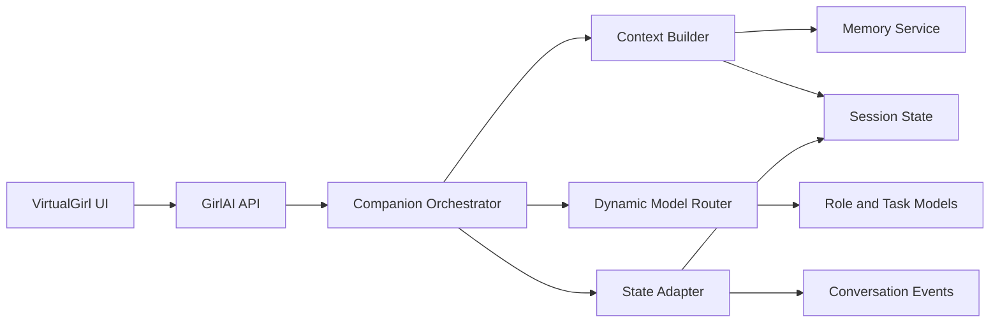

# GirlAI Companion Enhancement

Feature Name: girlai-companion-enhancement
Updated: 2026-09-03

## Description

本设计将 GirlAI 从角色化问答扩展为可观察的纯对话虚拟姬伙伴。系统保留 `app/api/v1/GirlAi.py` 的兼容入口、既有 `chat_histories` 与统一 `sessions/messages` 双写流程，并在对话回合外围增加结构化编排层，连接记忆、情绪和意图能力。

首期采用增量改造：通过服务层和状态适配器复用现有 `ChatHistoryService`、`DynamicModelRouter`、统一状态服务及 `VirtualGirl.vue`，使新增能力可逐步启用。

## Architecture



### Processing Flow

1. API 层验证 JWT、会话归属、请求长度和能力开关。
2. `CompanionOrchestrator` 创建对话回合上下文，加载角色、短期上下文和授权记忆。
3. `DynamicModelRouter` 分配主对话模型，以及情绪、意图和记忆筛选模型。
4. 模型返回 `CompanionTurn` 结构化结果，包含文本、状态和候选记忆。
5. State Adapter 在同一事务边界内写入会话消息、状态事件和记忆候选。
6. 前端根据回合结果更新对话、状态徽章和记忆确认项。

### Rollout Stages

| 阶段 | 交付内容 | 主要复用模块 |
|------|----------|--------------|
| P0 | 结构化回合、模型上下文、错误降级 | `GirlAi.py`, `DynamicModelRouter`, `girlai_state_adapter.py` |
| P1 | 记忆查看、确认、删除和授权 | `UserPreference`, `ChatHistoryService`, 统一 checkpoints |
| P2 | 情绪/意图和语音适配接口 | 前端能力检测、语音抽象 |
| P3 | Live2D/3D 和角色生态 | 独立前端渲染与产品域 |

## Components and Interfaces

### Backend Components

- `companion_orchestrator`：编排单次对话回合，协调上下文、模型、策略和状态写入。
- `companion_context_service`：读取角色设定、近期消息、摘要和授权记忆，并执行预算裁剪。
- `companion_model_service`：通过 `DynamicModelRouter` 调用对话、分类和筛选模型，统一记录模型上下文。
- `companion_memory_service`：将模型候选记忆转换为待确认项，处理用户确认、修订、删除和检索授权。
- `girlai_state_adapter`：维持 legacy GirlAI 数据与统一状态的映射，保证回合写入可恢复。

### API Contract

现有 API 保持可用，并新增以下 JWT 保护接口。所有资源查询和变更都通过当前用户 ID 执行归属校验。

| 方法 | 路径 | 用途 |
|------|------|------|
| POST | `/api/v1/GirlAi/companion/turn` | 创建结构化伙伴对话回合 |
| GET | `/api/v1/GirlAi/companion/state` | 获取角色、会话、情绪、记忆授权和能力状态 |
| GET | `/api/v1/GirlAi/memories` | 分页读取长期记忆和待确认候选 |
| POST | `/api/v1/GirlAi/memories/{memory_id}/confirm` | 确认或修订记忆 |
| DELETE | `/api/v1/GirlAi/memories/{memory_id}` | 删除记忆并撤销后续检索 |
| POST | `/api/v1/GirlAi/voice/transcriptions` | 接收语音转写结果或上传适配结果 |

接口响应统一包含 `conversation_id`、`turn_id`、`state_revision` 和 `degraded_capabilities`，便于前端恢复和能力降级展示。文件上传、音频格式校验和供应商接入由语音适配器承担，API 层只接收标准化结果。

### Structured Turn Schema

```json
{
  "turn_id": "turn_01",
  "conversation_id": "session_01",
  "assistant_text": "我先帮你梳理当前任务。",
  "emotion": {"label": "focused", "intensity": 0.6, "confidence": 0.88},
  "intent": {"label": "task_planning", "confidence": 0.91},
  "memory_candidates": [],
  "model_context": {"current_model": "configured", "fallback_used": false},
  "degraded_capabilities": [],
  "schema_version": 1
}
```

### Frontend Components

- `VirtualGirl.vue` 继续作为悬浮窗口和角色容器。
- `CompanionTurnPanel` 展示文本回合和情绪状态。
- `MemoryConsentPanel` 展示候选记忆并提供确认、修订、删除操作。
- `useGirlAiCompanion` 负责 API 调用、revision 合并、流式回合和能力降级。
- `girlai` API client 负责路径、请求参数和响应 schema 转换。

## Data Models

首期优先复用已有表，并通过统一状态 checkpoint 和事件保存新增状态。需要新增持久化表时采用独立 Alembic migration。

### Companion Turn State

- `schema_version`：结构化回合版本。
- `turn_id`：用户会话内唯一回合标识。
- `conversation_id`：统一会话 ID。
- `emotion`：标签、强度和置信度。
- `intent`：标签和置信度。
- `memory_candidate_ids`：候选记忆引用。
- `model_context`：角色、模型、调用统计和 fallback 记录。
- `degraded_capabilities`：本回合降级能力列表。

### Memory Record

记忆记录沿用 `UserPreference` 的用户归属、键值、置信度和来源字段，增加以下逻辑字段或等价 checkpoint 字段：

- `status`：`candidate`、`confirmed`、`rejected`、`deleted`。
- `consent_source`：`user_confirmed`、`imported` 或 `system_derived`。
- `last_used_at`：最近一次被上下文检索的时间。
- `visibility`：`conversation_only` 或 `companion_allowed`。

## Correctness Properties

1. 每个对话回合只属于一个已认证用户和一个统一会话。
2. 记忆检索集合始终满足用户归属、授权状态和可见性条件。
3. 结构化回合写入与 legacy 历史写入共享同一事务边界；失败回合不会产生部分状态。
4. `state_revision` 单调递增，客户端提交陈旧 revision 时基于最新快照重试。
5. 结构化模型输出不保存 API Key、访问令牌、供应商凭据或内部控制字段。
6. 任何能力降级都保留文字对话主链路，并在响应中返回可识别的降级状态。

## Error Handling

- 角色、会话或记忆归属失败：返回 404 资源不存在响应。
- 请求 schema 或输入预算失败：返回 422，并携带字段级错误信息。
- 主模型失败：按 `DynamicModelRouter` fallback chain 重试，全部失败时返回稳定的文字降级响应。
- 分类模型失败：使用中性情绪和未知意图完成回合，并写入解析失败事件。
- 记忆服务失败：完成对话并将候选记忆放入可重试状态。
- 状态 revision 冲突：返回最新 revision 和快照，前端合并后重试一次。
- 语音服务超时：记录能力降级，使用文字输入或文字输出继续完成回合。

## Test Strategy

### Unit Tests

- 上下文预算裁剪、授权记忆筛选和摘要组合。
- 结构化回合 schema 校验、默认值和解析失败降级。
- 情绪/意图置信度阈值及关怀策略。
- 记忆候选确认、修订、删除和用户隔离。
- DynamicModelRouter fallback 与模型上下文写入。

### Integration Tests

- GirlAI API 与 legacy `chat_histories`、统一 `sessions/messages` 的事务一致性。
- 跨请求读取同一会话的回合状态和记忆。
- 用户 A 访问用户 B 的会话和记忆资源时的隔离。

### Frontend and E2E Tests

- `VirtualGirl.vue` 的文字回合、能力降级和状态恢复。
- 记忆确认和删除的交互。
- 悬浮窗口现有拖拽、缩放、最小化、自动隐藏和 Picture-in-Picture 回归。
- 语音能力可用、超时和回退到文字的流程。
- SSE 或异步事件到达顺序、revision 冲突和页面重载恢复。

## Implementation Boundaries

- 继续使用 `app/api/v1/GirlAi.py` 作为对外兼容入口，新增能力通过服务层拆分，控制路由文件增长。
- 记忆的事实状态以统一状态和数据库为准，Pinia 与 localStorage 作为前端缓存。
- 模型输出只负责提出对话状态和记忆候选，记忆授权和数据删除由确定性服务控制。
- 新增 migration、API schema 和前端类型转换必须与对应测试在同一阶段交付。

## References

- `docs/features/GIRLAI.md`
- `docs/features/SESSION-LIFECYCLE.md`
- `docs/features/DYNAMIC-MODEL-ROUTER.md`
- `docs/architecture/ARCHITECTURE.md`
- `app/api/v1/GirlAi.py`
- `app/services/girlai_state_adapter.py`
- `app/agent/dynamic_model_router.py`
- `app/agent/react_engine.py`
- `src/components/VirtualGirl.vue`
