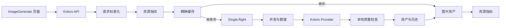

# AI 生图资源消耗优化技术设计

Feature Name: image-generation-resource-optimization
Updated: 2026-09-05

## Description

本设计为现有 Kolors 生图链路增加资源控制层，覆盖请求标准化、精确缓存、进行中任务合并、配额与并发、图片传输、文件生命周期、质量检查和指标记录。设计保持现有 API 路径和前端字段兼容，按 P0、P1、P2 分阶段接入。

## Architecture



### 分层职责

- `kolors_api.py`：认证、请求解析、兼容字段映射、缓存查询、资源状态响应。
- `image_generation.py`：模型调用、连接池、全局并发、URL/Base64 解析和基础文件保存。
- `image_resource_service.py`：资源指纹、Single-flight、用户级配额、资产生命周期和指标记录。
- `image_quality_service.py`：文件、尺寸、像素和可选视觉质量检查。
- `image_asset_service.py`：原图、缩略图、历史记录和收藏生命周期。
- `ImageGenerate.vue`：场景档位、资源提示、缩略图加载、缓存状态和任务状态展示。

## Components and Interfaces

### Resource Fingerprint

```python
def build_image_resource_fingerprint(
    *,
    user_id: int,
    model: str,
    generation_type: str,
    prompt: str,
    negative_prompt: str,
    style: str | None,
    reference_hash: str | None,
    width: int,
    height: int,
    steps: int,
    guidance_scale: float,
    strength: float | None,
    num_images: int,
    seed: int | None,
) -> str:
    """Return a stable hash for an equivalent generation request."""
```

指纹输入先进行规范化：Prompt 去除首尾空白，数值转为统一精度，空字符串统一为 `None`，参数按固定字段顺序序列化。参考图使用内容 hash，避免本地临时路径变化影响命中。

### Cache and Single-flight

```python
async def get_cached_asset(
    db: AsyncSession,
    *,
    user_id: int,
    fingerprint: str,
    max_age_hours: int,
) -> ImageAsset | None:
    ...

async def get_or_create_generation(
    *,
    fingerprint: str,
    owner: Callable[[], Awaitable[GenerationResult]],
) -> GenerationResult:
    ...
```

缓存记录使用结构化字段保存 `fingerprint`、`user_id`、`asset_id`、`expires_at` 和 `status`。数据库查询使用精确字段匹配。进行中任务使用进程内锁作为第一阶段实现；部署到多 worker 后使用 Redis 锁或数据库唯一约束扩展，锁必须设置过期时间并在终态释放。

### Resource Profiles

```json
{
  "preview": {"width": 512, "height": 512, "steps": 24, "num_images": 1},
  "standard": {"width": 768, "height": 768, "steps": 36, "num_images": 1},
  "high": {"width": 1024, "height": 1024, "steps": 50, "num_images": 1}
}
```

比例由页面场景模板映射到宽高，后端再次校验允许的尺寸、步数和数量，防止客户端绕过档位限制。

### Asset Response

```json
{
  "id": 123,
  "url": "/api/v1/kolors/assets/123",
  "thumbnail_url": "/api/v1/kolors/assets/123/thumbnail",
  "width": 1024,
  "height": 1024,
  "cached": false,
  "profile": "standard",
  "status": "completed"
}
```

现有 `images` 和 `paths` 字段继续返回一段兼容周期，新字段作为渐进式资源访问方式。前端结果列表使用 `thumbnail_url`，下载操作使用 `url`。

## Data Models

### ImageGenerationAsset

建议新增字段或独立表保存：

- `id`、`user_id`、`session_id`、`parent_asset_id`
- `generation_type`、`model`、`profile`
- `prompt`、`negative_prompt`、`style`
- `reference_hash`、`fingerprint`
- `seed`、`width`、`height`、`steps`、`guidance_scale`、`strength`
- `original_path`、`thumbnail_path`、`file_size`
- `status`、`quality_status`、`is_favorite`
- `created_at`、`expires_at`、`completed_at`

### ImageGenerationMetric

- `request_id`
- `user_id`
- `generation_type`
- `profile`
- `cache_hit`
- `queue_wait_ms`
- `provider_duration_ms`
- `total_duration_ms`
- `retry_count`
- `image_count`
- `output_bytes`
- `status`
- `failure_code`
- `created_at`

## Correctness Properties

1. 等价请求使用相同资源指纹。
2. 资源指纹包含所有影响模型输出的参数。
3. 缓存命中结果与实时生成结果拥有相同的核心响应字段。
4. 同一资源指纹最多存在一个有效的进行中生成任务。
5. 生成任务进入完成、失败、取消或超时状态后释放所有并发占用。
6. 过期缓存不会作为有效结果返回。
7. 缩略图与原图属于同一个资产并保持尺寸元数据一致。
8. 用户只能读取、下载和删除自己拥有的图片资产。
9. 清理任务不会删除收藏资产和仍被进行中任务引用的文件。
10. 资源指标在请求终态前完成写入或进入可重试记录。

## Error Handling

| 场景 | 响应策略 |
|---|---|
| 参数超出资源档位 | 返回 `422` 和允许范围 |
| 用户达到并发限制 | 返回 `429`、限制类型和重试时间 |
| 用户达到每日额度 | 返回 `429` 和剩余额度 |
| 相同请求正在生成 | 返回进行中任务标识，客户端订阅或轮询同一结果 |
| 缓存文件损坏 | 标记缓存失效并进入生成流程 |
| 模型超时 | 释放并发资源，按策略执行一次重试 |
| 结果文件损坏 | 进入质量失败状态，记录失败码 |
| 缩略图生成失败 | 保留原图资产，记录降级状态 |
| 清理任务失败 | 保留可重试记录并避免重复删除 |

错误响应只包含用户可理解的状态、任务标识和重试建议，模型供应商原始凭据与内部路径保持在服务端日志范围内。

## Test Strategy

### Unit Tests

- 资源指纹规范化和参数完整性。
- 精确缓存命中、过期和损坏文件回退。
- Single-flight 并发合并和异常释放。
- 预览、标准和高清档位边界。
- 用户级并发和额度计算。
- URL/Base64 结果统一处理。
- 缩略图生成和文件清理策略。
- 质量检查和单次自动重试。

### Integration Tests

- 文生图缓存命中跳过外部 Provider。
- 图生图参考图 hash 参与缓存。
- 生成历史、资产表和缓存状态保持一致。
- 超时、取消和失败后再次请求可以正常执行。
- 用户之间的资产访问隔离。
- 清理任务保留收藏和进行中任务引用的文件。

### Frontend and E2E Tests

- 场景模板正确应用资源档位。
- 生成中显示队列和资源状态。
- 缓存结果展示缓存标识。
- 缩略图优先加载，下载使用原图地址。
- 变体和重新生成保持父资产关系。
- 生成失败显示重试入口。

## Rollout Plan

1. P0：先接入资源指纹、精确缓存、Single-flight、统一响应和临时文件清理。
2. P1：接入资源档位、缩略图、基础质量检查、单次重试和指标记录。
3. P2：接入额度策略、收藏资产生命周期、管理统计和跨模块 ImageProvider。
4. 每阶段通过指标观察缓存命中率、平均生成耗时、失败率、磁盘增长和外部调用量，再扩大启用范围。

## References

- `app/api/v1/kolors_api.py`：现有 Kolors API、历史缓存和请求兼容字段。
- `app/utils/image_generation.py`：模型调用、并发信号量、连接池和图片落盘。
- `src/views/ImageGenerate.vue`：现有文生图、图生图、参数和结果交互。
- `docs/evolution/IMAGE-GENERATION.md`：已有图片生成演化路线和已记录问题。
