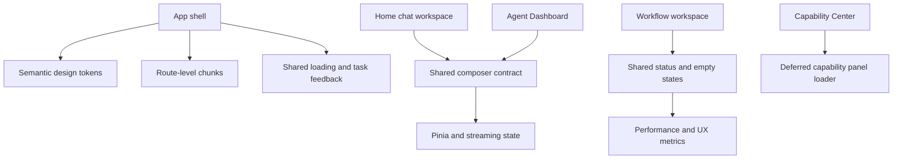

# Web Workbench Experience Refresh

Feature Name: web-workbench-experience-refresh
Updated: 2026-09-06

## Description

本设计将 Web 工作台整理为统一的 AI 任务空间。设计覆盖首页聊天、Agent Dashboard、Workflow 和 Capability Center，目标是统一视觉令牌、降低首屏工作量、完善任务状态反馈，并将移动端从固定侧栏布局扩展为单列工作区与抽屉导航。

Flutter 客户端、后端业务协议和既有 AI 能力实现属于外部边界。本设计通过现有 Vue Router、Pinia、API client、流式状态和组件体系完成渐进式改造。

## Architecture



### Design Decisions

- 使用语义化设计令牌连接首页和 Agent Dashboard，保留页面自身的布局差异。
- 采用渐进式加载：路由继续懒加载，能力中心按 Tab 延迟请求，低频工具继续异步组件化。
- 使用统一任务状态模型表达 `queued`、`running`、`paused`、`failed` 和 `completed`，将状态、进度、错误和下一动作放在同一反馈区域。
- 移动端复用 Agent Dashboard 已有的抽屉和遮罩模式，将首页侧栏纳入相同交互约定。
- 使用真实初始化 Promise 管理启动层，组件在卸载时清理定时器、监听器和可取消请求。

## Components and Interfaces

### Shared UI Foundation

- `src/styles/variables.css`：补充 surface、content、accent、status、control 和 motion 语义令牌，并保留 Light、Default、Dark 主题映射。
- `src/styles/base.css`：提供统一按钮、输入框、焦点态、可访问点击区域和 reduced-motion 规则。
- `src/components/AppLoading.vue`：接收初始化任务状态，展示真实完成状态或不确定进度状态，并清理所有资源。
- 新增共享状态组件：`LoadingState`、`EmptyState`、`ErrorState`、`TaskStatus` 和 `NextAction`。

### Workspaces

- `src/components/index.vue`：继续作为首页组合入口，接入统一导航状态、任务反馈和首页移动抽屉。
- `src/components/leftlist.vue`：将会话、项目、能力、文档和设置组织为统一导航层级；移动端通过 drawer 状态展示。
- `src/components/centerContent.vue`：拆分消息列表、消息项、思考块和附件列表，保持流式消息增量更新。
- `src/components/bottominput.vue`：统一输入框、附件、能力选择、配置和发送/停止操作，替换内部状态文案和 Unicode 操作图标。
- `src/views/AgentDashboard.vue` 与 `src/styles/agent-layout.css`：复用共享令牌、任务状态和移动端抽屉协议。
- `src/views/Workflow.vue`：使用统一任务反馈、历史加载状态和导入导出操作反馈。

### Capability Center

- `src/views/CapabilityCenter.vue`：按 active tab 延迟加载数据，并为每个操作维护独立的 loading、error、success 和 retry 状态。
- `src/utils/api/index.js`：提供统一的请求取消、错误归一化和响应状态处理。
- `src/utils/api/vision.js`、`workflow.js`、`skills.js`：保持领域 API 边界，向 UI 返回统一的资源和任务状态。

### Interfaces

```js
const taskFeedback = {
  status: 'queued | running | paused | failed | completed',
  stage: 'string',
  progress: 'number | null',
  elapsedMs: 'number',
  error: 'string | null',
  nextAction: 'string | null'
}
```

```js
const capabilityPanelState = {
  loaded: 'boolean',
  loading: 'boolean',
  error: 'string | null',
  retryable: 'boolean',
  data: 'unknown'
}
```

## Data Models

- `NavigationState`：当前一级导航、移动端抽屉、活动能力 Tab 和返回上下文。
- `TaskFeedback`：任务状态、阶段、进度、耗时、错误和下一动作。
- `CapabilityPanelState`：单个能力 Tab 的加载、错误、重试和数据状态。
- `PerformanceSnapshot`：路由、构建版本、LCP、INP、CLS、首屏资源体积和最大路由 chunk。

## Correctness Properties

1. 启动层隐藏条件只依赖初始化状态或初始化失败状态。
2. 每个由加载组件创建的 timer、listener 和 abortable request 在组件卸载后均被释放。
3. 同一时刻移动端最多存在一个活动抽屉，遮罩关闭抽屉不会改变会话或任务数据。
4. 能力中心 inactive Tab 的数据请求不会在首屏执行。
5. 单个能力请求失败不会清空其他能力 Tab 的已加载数据。
6. 流式任务的增量事件只更新对应任务反馈和消息节点，保留用户输入、文件和会话上下文。
7. 所有 icon-only 控件具备可访问名称和至少 40px 交互区域。

## Error Handling

- 初始化请求失败时显示可重试的应用级错误状态，并保留公开入口。
- 能力 Tab 请求失败时在当前 Tab 显示错误和重试按钮，其他 Tab 保持可用。
- 流式任务断线时显示连接状态、已保留内容和继续/重试动作。
- 上传失败时显示文件名、失败原因和重新上传动作。
- 删除、清理和取消操作在执行前显示目标和影响范围，并在完成后刷新对应资源。
- API 错误由共享 client 归一化为状态码、用户文案和 retryable 标记，组件不直接解析不同后端错误格式。

## Performance Strategy

- 保持路由级 dynamic import，工具弹窗使用 async component。
- Capability Center 采用按 Tab 首次加载和缓存策略。
- 仅在消息数量超过阈值时启用稳定虚拟列表，并避免每个流式 token 触发全量列表重排。
- 图片附件先生成尺寸受限的缩略图，原图按需加载。
- 记录首屏资源和路由 chunk 预算，使用 Lighthouse 与 Chrome Performance 验证 LCP、INP、CLS。
- 启动页不使用与真实初始化无关的固定等待时间。

## Test Strategy

- 单元测试：设计令牌映射、启动状态机、任务反馈归一化、能力 Tab 状态隔离和移动抽屉状态。
- 组件测试：加载、空状态、错误重试、流式状态、键盘焦点和 icon-only 控件名称。
- E2E 测试：桌面首页、Agent Dashboard、Workflow、Capability Center，覆盖 1440px、768px 和 390px 视口。
- 性能测试：生产-like 构建的 Lighthouse、资源预算、路由导航计时和长任务分析。
- 回归测试：保留现有聊天、Agent、PPT、绘图、图表编辑器和认证 E2E 测试。

## Implementation Order

1. 建立共享设计令牌、焦点态、状态组件和动效降级规则。
2. 修复 AppLoading 生命周期与真实初始化状态。
3. 统一首页和 Agent Dashboard 的导航、Composer、任务状态和移动抽屉。
4. 拆分消息和输入大型组件，保持现有事件与 Pinia 接口。
5. 重构 Capability Center 的按 Tab 加载、文件上传反馈和破坏性操作确认。
6. 接入性能指标、资源预算和桌面/移动端 E2E 验收。

## References

- `src/App.vue:7-15`：当前固定启动等待逻辑。
- `src/components/AppLoading.vue:54-78`：当前进度与定时器实现。
- `src/components/index.vue:1-153`：首页工作台组合入口和异步工具组件。
- `src/components/leftlist.vue:2525-2535`：首页移动端当前仅调整侧栏宽度。
- `src/views/AgentDashboard.vue:1-126`：Agent Dashboard 三栏和移动工具栏结构。
- `src/styles/agent-layout.css:169-284`：现有移动端抽屉和安全区域实现。
- `src/views/CapabilityCenter.vue:182`：当前能力中心一次性加载多个数据集合。
- [ChatGPT](https://chatgpt.com/)：对话主线与输入框能力入口参考。
- [Claude](https://www.anthropic.com/claude)：长文本排版与渐进披露参考。
- [Cursor](https://www.cursor.com/)：任务、文件和结果联动参考。
- [Replit](https://replit.com/)：生成、预览和修改连续流程参考。
