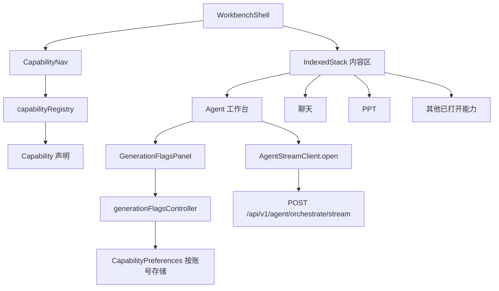

# Flutter 能力注册表与能力开关设计

Feature Name: 2026-09-18-flutter-capability-registry
Updated: 2026-09-18

## Description

本设计把 `flutter_client` 工作台的功能入口从 `workbench_page.dart` 的硬编码弹出菜单改为声明式能力注册表，并按工作区、创作、数据、系统四组呈现为常驻左侧导航栏与窄屏抽屉。同时在需求输入区暴露七个生成开关，补齐当前从未发送的 `enable_skills` 字段，并按账号持久化开关状态。

设计遵循三条既有约定：账号切换必须丢弃旧账号界面状态、异步回调前必须校验账号代次、客户端请求字段必须对照后端真实契约。

## Architecture

工作台从单页改为应用外壳加内容区。外壳持有导航与已打开能力页，内容区按当前能力切换。所有能力页保持现有 `Scaffold` 实现，作为子页面嵌入内容区，因此本次改造不重写任何业务页面。



## Components and Interfaces

### Capability 与分组

`lib/domain/models/capability.dart`

```dart
enum CapabilityGroup { workspace, creation, data, system }

enum CapabilityAccess { normal, admin, superadmin }

class Capability {
  const Capability({
    required this.id,
    required this.label,
    required this.icon,
    required this.group,
    required this.builder,
    this.access = CapabilityAccess.normal,
  });
  final String id;
  final String label;
  final IconData icon;
  final CapabilityGroup group;
  final CapabilityAccess access;
  final Widget Function() builder;
}
```

`CapabilityAccess` 是能力声明的最小权限。`normal` 对全部会话可见，`admin` 对 `admin` 与 `superadmin` 可见，`superadmin` 仅对 `superadmin` 可见。

### 能力注册表

`lib/application/capability_registry.dart`

`capabilityRegistry` 是 `List<Capability>` 常量，是工作台模块入口的唯一来源。当前声明 15 项：

| 分组 | 能力 | id | 可见权限 |
|---|---|---|---|
| 工作区 | Agent 工作台 | `agent` | normal |
| 工作区 | 聊天 | `chat` | normal |
| 工作区 | 会话历史 | `agent_history` | normal |
| 创作 | PPT | `ppt` | normal |
| 创作 | 图片生成 | `image` | normal |
| 创作 | 工作流执行 | `workflow` | normal |
| 创作 | GirlAI 伴侣 | `girl` | normal |
| 数据 | 文件中心 | `files` | normal |
| 数据 | 任务队列 | `tasks` | normal |
| 系统 | Provider 授权 | `provider` | normal |
| 系统 | 模型列表 | `models` | normal |
| 系统 | 动态 Provider | `dynamic_provider` | normal |
| 系统 | GitHub 设置 | `github` | normal |
| 系统 | MCP 管理 | `mcp` | superadmin |
| 系统 | 管理员后台 | `admin` | admin |

`visibleCapabilities(String permissionLevel)` 按会话权限过滤注册表，并保持注册表顺序。`CapabilityAccess` 到权限等级的映射集中在此函数，页面不再各自判断权限。

### 工作台外壳与导航

`lib/presentation/workbench_page.dart` 改为外壳，`lib/presentation/capability_nav.dart` 新增导航组件。

外壳状态：

```dart
final Map<String, Widget> _panes = <String, Widget>{};
String _activeId = 'agent';
```

- 选择能力时，若 `_panes` 不含该 id 则调用其 `builder()` 创建并缓存，然后把 `_activeId` 指向该能力。首次打开才创建，避免启动即发起 15 个页面的网络请求。
- 内容区用 `IndexedStack` 渲染 `_panes`，索引由 `_activeId` 在 `_panes` 中的位置决定，切换能力时保留该能力页的局部状态。
- `MediaQuery.sizeOf(context).width >= 900` 时用常驻导航栏，否则用 `Scaffold.drawer`；两种形态渲染同一份分组数据。
- 账号切换时清空 `_panes` 并把 `_activeId` 复位为 `agent`，使新账号的页面重新构建。
- 权限变化后若 `_activeId` 不在可见集合内，则把 `_activeId` 复位为 `agent`。

导航形态沿用现有视觉语言：`Card` 容器、`ColorScheme.fromSeed` 的暗色主题、选中项使用主题色加透明度底色。分组标题使用 `bodySmall`。

Agent 工作台的正文动作保持独立：项目文件入口与架构决策入口继续由 `workbench.projectPath` 与 `workbench.decisions` 条件驱动，不进入注册表。

### 生成开关模型

`lib/domain/models/generation_flags.dart`

```dart
class GenerationFlags {
  const GenerationFlags({
    this.enableReview = true,
    this.enableValidation = true,
    this.enableErrorRecovery = true,
    this.enableMemory = true,
    this.enableSkills = true,
    this.specFirst = true,
    this.dependencyGraph = true,
  });
  final bool enableReview;
  final bool enableValidation;
  final bool enableErrorRecovery;
  final bool enableMemory;
  final bool enableSkills;
  final bool specFirst;
  final bool dependencyGraph;

  static const defaults = GenerationFlags();
  int get enabledCount => ...;  // 0..7
  GenerationFlags toggle(...);  // 按开关标识返回新实例
  Map<String, dynamic> toJson();
  factory GenerationFlags.fromJson(Map<String, dynamic> json);
}
```

字段名与后端 `OrchestratorRequest` 完全一致，见 `app/api/v1/ai_agent/schemas.py`。七个字段默认值均为 `true`，与后端默认值一致，因此升级后未修改开关的请求行为不变。

### 生成开关控制器与存储

`lib/infrastructure/settings/capability_preferences.dart`

```dart
abstract interface class CapabilityPreferences {
  Future<Map<String, dynamic>?> read(String scope);
  Future<void> write(String scope, Map<String, dynamic> value);
}
```

`SharedPreferencesCapabilityPreferences` 用 `shared_preferences` 实现，键为 `codingmatrix.generation.flags.v1:<scope>`。测试用内存实现，模式与 `test/auth_session_test.dart` 的 `MemoryStorage` 一致。

`lib/application/generation_flags_controller.dart`

```dart
class GenerationFlagsController extends StateNotifier<GenerationFlags> {
  GenerationFlagsController(this.preferences, this.scope)
      : super(GenerationFlags.defaults) {
    if (scope != null) unawaited(_load());
  }
  final CapabilityPreferences preferences;
  final String? scope;  // '<baseUrl>|<username>'
}
```

`scope` 由 provider 在创建时计算：

```dart
final generationFlagsControllerProvider =
    StateNotifierProvider<GenerationFlagsController, GenerationFlags>((ref) {
  final session = ref.watch(authControllerProvider.select((s) => s.session));
  final baseUrl = ref.watch(apiBaseUrlProvider);
  return GenerationFlagsController(
    ref.watch(capabilityPreferencesProvider),
    session == null ? null : '$baseUrl|${session.username}',
  );
});
```

provider 监听 `accessTokenRef` 之外还依赖 `session`，账号切换时控制器重建并载入对应作用域的开关。作用域包含 `baseUrl` 以避免同一用户名在不同服务端之间串用。

### 请求接线

`lib/infrastructure/agent/agent_stream_client.dart` 的 `open()` 与 `generate()` 增加 `enableSkills` 参数并写入请求体 `enable_skills` 字段。

`lib/application/workbench_controller.dart` 的 `startGeneration()` 增加 `GenerationFlags flags = GenerationFlags.defaults` 参数，把七个字段透传给 `open()`。开关在请求构建时取值，生成进行中修改开关不影响本次请求。

`_PromptCard` 增加生成开关面板，读取 `generationFlagsControllerProvider`，用可折叠区域承载七个 `SwitchListTile`，折叠标题显示 `已启用 N/7`。面板在任何状态下可交互，修改作用于下一次生成。

## Data Models

生成开关存储值为 JSON 对象，字段名与 `GenerationFlags.toJson()` 一致，值为布尔。读取时只接受布尔类型，缺失字段回退默认值 `true`。存储键按作用域隔离，单作用域内是单个对象，不维护历史版本。

能力注册表是编译期常量，不持久化。运行时派生的数据只有已打开能力页集合与当前能力标识，二者仅存在于外壳内存。

## Correctness Properties

1. 能力标识在注册表内唯一。
2. 每项能力的分组属于四个 `CapabilityGroup` 之一。
3. `visibleCapabilities('normal')` 是注册表的子集，且不包含 `admin` 与 `mcp`。
4. `visibleCapabilities('superadmin')` 等于完整注册表。
5. 未修改开关时，生成的请求体七个生成开关字段均为 `true`。
6. 请求体在生成开始时定型，生成进行中修改开关不改变该请求体。
7. 任一账号的开关存储只读写自身作用域，账号切换后读到的是新账号的值。

## Error Handling

- 生成开关读取失败时使用 `GenerationFlags.defaults`，界面不出现错误提示，因为默认值与服务端默认值一致，请求仍然有效。
- 生成开关写入失败时保留内存中的开关状态，本次会话内开关仍然生效。
- 生成开关存储值为非法 JSON 或字段类型不符时忽略该存储值，回退默认值。
- 能力页构建函数抛出的异常由现有页面的错误态处理，外壳不额外捕获。

## Test Strategy

单元测试：

1. `test/capability_registry_test.dart`：标识唯一、分组合法、三档权限的可见集合、注册表顺序稳定。
2. `test/generation_flags_test.dart`：默认值全为 `true`、`toggle` 只改目标字段、`toJson` 字段名与后端契约一致、`fromJson` 对缺失与非法类型的回退。
3. `test/generation_flags_controller_test.dart`：默认值、写入、按作用域隔离、账号切换载入、读取失败回退。

组件测试：

4. `test/workbench_shell_test.dart`：宽度 900 及以上显示常驻导航栏、以下显示抽屉、选择能力打开对应页面、当前能力被标记、权限过滤、权限下降后关闭高权限能力、账号切换清空已打开页面。
5. `test/widget_test.dart` 扩展：请求体包含七个生成开关字段，其中包含 `enable_skills`；沿用 `Fixture` 的 `business` 钩子捕获请求体。

回归验证：`git stash push -- <本次源码>` 后回退，第 5 项测试必须失败，用于证明 `enable_skills` 缺口真实存在。

执行 `flutter analyze lib test` 要求零问题；执行 `flutter test` 要求全量通过；`dart format` 只作用于本次改动文件。

## References

[^1]: (app/api/v1/ai_agent/schemas.py) - OrchestratorRequest 能力开关契约
[^2]: (flutter_client/lib/presentation/workbench_page.dart) - 现有硬编码入口与工作台布局
[^3]: (flutter_client/lib/infrastructure/agent/agent_stream_client.dart) - 编排请求体构建
[^4]: (flutter_client/lib/application/workbench_controller.dart) - startGeneration 与状态管理
[^5]: (flutter_client/lib/infrastructure/auth/credential_store.dart) - 可注入存储的实现模式
[^6]: (src/components/WorkbenchNav.vue) - Web 端一级导航分组参考
