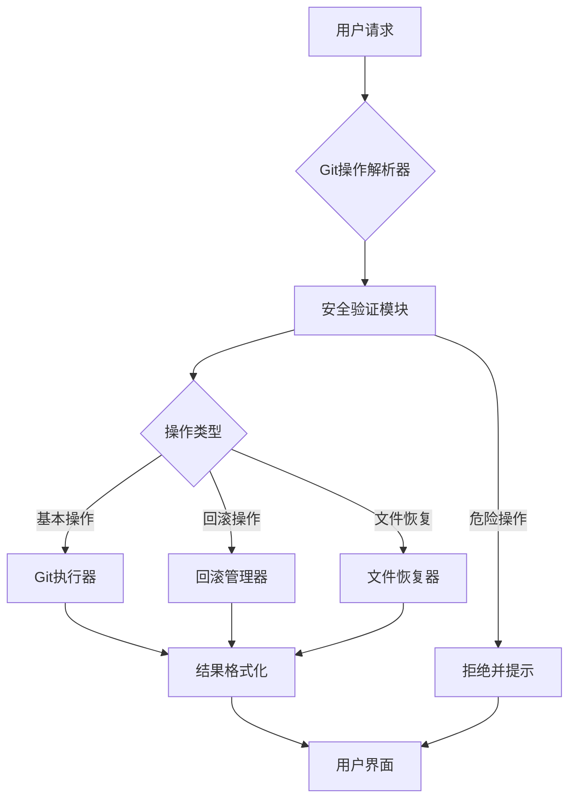

# Agent Git 操作支持

Feature Name: agent-git-operations
Updated: 2026-05-12

## Description

本功能为 Agent 提供安全的 Git 操作支持，包括基本 Git 命令、项目回滚、文件恢复等功能，同时实施严格的安全限制以防止危险操作。

## Architecture

## Components and Interfaces

### 1. Git操作解析器
- 负责解析用户输入的 Git 相关命令
- 识别操作类型（基本操作、回滚、文件恢复等）
- 提取必要的参数（commit ID、文件路径、时间点等）

### 2. 安全验证模块
- 检查操作是否包含危险命令（如 rm -rf, force push 等）
- 验证用户权限和操作范围
- 实施预定义的安全策略

### 3. Git执行器
- 执行基本 Git 命令（status, log, diff, checkout, reset）
- 处理命令输出并进行错误检查
- 确保在正确的工作目录中执行

### 4. 回滚管理器
- 处理基于 commit ID 或时间点的回滚请求
- 自动创建备份分支
- 管理回滚过程中的状态和确认

### 5. 文件恢复器
- 从历史提交中提取指定文件
- 处理文件冲突和备份
- 支持模糊匹配文件名

### 6. 结果格式化
- 将原始 Git 输出转换为用户友好的格式
- 高亮显示重要信息和差异
- 提供操作摘要和建议

## Data Models

### GitOperationRequest
- operationType: string (basic, rollback, restore)
- parameters: object (commitId, filePath, timestamp, etc.)
- safetyConfirmed: boolean
- backupRequired: boolean

### GitOperationResult
- success: boolean
- output: string
- formattedOutput: string
- warnings: array<string>
- suggestions: array<string>

### SafetyPolicy
- blockedCommands: array<string>
- requiresConfirmation: array<string>
- autoBackupOperations: array<string>

## Correctness Properties

1. **安全性保证**: 任何被安全策略标记为危险的操作必须被拒绝
2. **数据保护**: 回滚和恢复操作必须在修改前创建备份
3. **幂等性**: 相同的操作在相同条件下应产生相同的结果
4. **错误透明**: 所有错误必须提供明确的原因和解决方案

## Error Handling

### 常见错误场景
1. **无效的 commit ID**: 提供清晰的错误信息，并建议使用 `git log` 查看有效提交
2. **文件不存在**: 区分工作目录中不存在和历史中不存在的情况
3. **权限不足**: 明确说明需要的权限和如何获取
4. **网络问题**: 对远程操作提供重试建议和离线替代方案

### 错误处理策略
- 所有错误必须被捕获并转换为用户友好的消息
- 提供具体的解决步骤而非通用错误
- 对于可恢复的错误，提供自动修复选项

## Test Strategy

### 单元测试
- 测试 Git 操作解析器的各种输入组合
- 验证安全验证模块正确拦截危险操作
- 测试结果格式化组件的输出质量

### 集成测试
- 在真实 Git 仓库中测试完整操作流程
- 验证回滚和恢复功能的数据完整性
- 测试与现有 Agent 功能的兼容性

### 安全测试
- 尝试各种绕过安全限制的方法
- 验证危险命令被正确拦截
- 测试边界条件下的安全行为

## References

[^1]: (Website) - Git 官方文档 https://git-scm.com/doc
[^2]: (Filename) - Agent 安全规则 /tmp/codingmatrix-project-tpl/.ai-ready/rules/guardrail.md