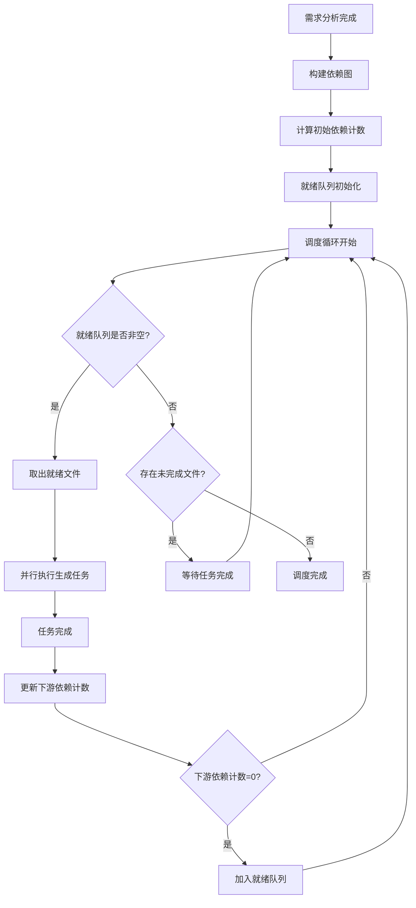
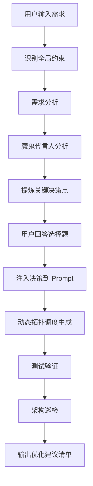

# Dynamic Topology Scheduling & Human Collaboration Optimization

Feature Name: dynamic-topology-scheduling-human-collaboration
Updated: 2026-05-20

## Description

本项目包含两项互补性优化：

1. **动态拓扑调度**: 解决分层并发生成导致的跨文件接口不一致问题。将"静态按层并行"改为基于依赖图的动态拓扑调度，保证任意文件生成时其所有上游代码已确定，彻底杜绝接口猜测。

2. **轻量级人机协作**: 弥补小模型在"全局架构合理性"上的本质短板。包含三项优化：
   - 关键决策点提问（生成前架构决策）
   - 生成后架构优化建议（架构巡检）
   - 自然语言全局约束（动态架构规则）

## Architecture

### 动态拓扑调度架构



### 人机协作架构



### 整体流程集成


## Components and Interfaces

### 1. DependencyGraph（依赖图管理器）

**职责**: 构建和维护文件依赖图，提供依赖状态查询接口

**接口定义**:
```python
class DependencyGraph:
    def build_from_architecture(architecture: dict) -> DependencyGraph
    def get_ready_files() -> List[str]
    def mark_file_completed(file_path: str) -> None
    def get_dependency_count(file_path: str) -> int
    def get_downstream_files(file_path: str) -> List[str]
    def is_all_completed() -> bool
```

**数据结构**:
```python
{
    "nodes": {
        "file_path": {
            "dependencies": ["upstream_file_1", "upstream_file_2"],
            "dependency_count": 2,
            "status": "pending" | "ready" | "generating" | "completed" | "failed"
        }
    },
    "edges": [
        {"from": "file_A", "to": "file_B"}  # file_A depends on file_B
    ]
}
```

### 2. TopologyScheduler（拓扑调度器）

**职责**: 执行动态拓扑调度循环，管理并行任务执行

**接口定义**:
```python
class TopologyScheduler:
    def __init__(max_concurrent: int = 5)
    async def run(graph: DependencyGraph, generator: Callable) -> dict
    async def add_to_ready_queue(file_path: str) -> None
    async def wait_for_completion() -> None
    def get_stats() -> dict
```

### 3. CriticalDecisionExtractor（关键决策提取器）

**职责**: 在需求分析后提取关键架构假设，生成选择题

**接口定义**:
```python
class CriticalDecisionExtractor:
    def extract_from_analysis(analysis_result: dict) -> List[dict]
    def format_as_questions(decisions: List[dict]) -> List[dict]
    def apply_user_choice(decision_id: str, choice: str) -> dict
```

**决策格式**:
```python
{
    "id": "auth_strategy",
    "question": "认证模块策略选择",
    "context": "我计划将认证设计为 JWT 方式，简单但无状态。您希望使用 JWT 还是 Session?",
    "options": [
        {"label": "JWT", "description": "无状态，适合分布式"},
        {"label": "Session", "description": "状态化，适合单机"}
    ],
    "default": "JWT",
    "impact": ["auth.py", "middleware.py", "config.py"]
}
```

### 4. ArchitectureInspector（架构巡检器）

**职责**: 生成完成后执行静态规则检查，输出优化建议清单

**接口定义**:
```python
class ArchitectureInspector:
    def inspect(project_path: str) -> List[dict]
    def check_file_size(file_path: str, threshold: int = 500) -> Optional[dict]
    def check_cross_layer_calls(project_path: str) -> List[dict]
    def check_code_duplication(project_path: str) -> List[dict]
    def format_suggestions(issues: List[dict]) -> str
```

**建议格式**:
```python
{
    "type": "file_size",
    "severity": "warning",
    "file": "order_service.py",
    "line_count": 800,
    "suggestion": "建议拆分为 order_creation.py 和 order_payment.py",
    "impact_files": ["order_service.py"]
}
```

### 5. GlobalConstraintParser（全局约束解析器）

**职责**: 从自然语言需求中提取架构约束，转化为硬约束格式

**接口定义**:
```python
class GlobalConstraintParser:
    def parse(requirement_text: str) -> List[dict]
    def validate_constraint(constraint: dict) -> bool
    def apply_to_prompt(prompt: str, constraints: List[dict]) -> str
```

**约束格式**:
```python
{
    "type": "tech_stack" | "architecture_pattern" | "nonfunctional",
    "scope": "全局" | "模块级",
    "target": "订单模块",
    "constraint": "使用 Redis 做库存扣减",
    "keywords": ["Redis", "库存", "扣减"],
    "hard": true
}
```

## Data Models

### DependencyNode（依赖节点）

```python
class DependencyNode:
    file_path: str
    dependencies: List[str]
    dependency_count: int
    status: Enum["pending", "ready", "generating", "completed", "failed"]
    generated_at: Optional[datetime]
    error: Optional[str]
```

### SchedulingStats（调度统计）

```python
class SchedulingStats:
    total_files: int
    completed_files: int
    failed_files: int
    max_parallelism: int
    avg_parallelism: float
    total_wait_time: float
    interface_errors: int
    schedule_log: List[dict]
```

### ArchitectureSuggestion（架构建议）

```python
class ArchitectureSuggestion:
    type: str
    severity: str
    file: Optional[str]
    description: str
    suggestion: str
    impact_files: List[str]
```

## Correctness Properties

### 动态拓扑调度不变式

1. **依赖完成保证**: ∀文件 f, WHEN f 开始生成, f 的所有上游文件 status = "completed"
2. **无环依赖**: 依赖图 DAG 性质，无循环依赖
3. **就绪队列正确性**: ∀文件 f ∈ 就绪队列, f.dependency_count = 0
4. **并行度上限**: WHILE 调度运行, 并发任务数 ≤ max_concurrent
5. **最终完成**: IF 无失败任务, 最终所有文件 status = "completed"

### 人机协作不变式

1. **决策注入保证**: WHEN 用户做出决策, 后续所有相关 prompt 包含决策内容
2. **约束生效**: WHILE 约束激活, 生成代码必须符合约束规则
3. **建议只读**: 架构巡检输出仅作为建议，不自动修改代码
4. **错误率目标**: 动态拓扑调度后，接口对接错误率 = 0%

## Error Handling

### 调度异常

| 异常场景 | 处理策略 |
|---------|---------|
| 依赖环检测 | 拒绝构建依赖图，提示架构规划修正 |
| 任务执行失败 | 标记文件失败，阻止下游文件就绪，记录错误日志 |
| 并发资源超限 | 暂停新任务接受，等待现有任务完成 |
| 依赖图不一致 | 重新构建依赖图，从失败点恢复 |

### 人机协作异常

| 异常场景 | 处理策略 |
|---------|---------|
| 用户跳过决策 | 使用魔鬼代言人默认建议 |
| 约束冲突检测 | 提示用户修正需求描述 |
| 架构巡检失败 | 输出巡检错误报告，不影响生成结果 |

## Test Strategy

### 动态拓扑调度测试

1. **依赖图构建测试**: 验证不同架构规划的依赖图构建正确性
2. **调度循环测试**: 验证就绪队列管理和并行执行逻辑
3. **接口一致性测试**: 验证生成的代码 import 语句有效性
4. **并行度测试**: 验证并发上限控制正确性
5. **失败恢复测试**: 验证任务失败后的阻塞和恢复逻辑

### 人机协作测试

1. **决策提问测试**: 验证关键决策提取和选择题生成
2. **约束识别测试**: 验证自然语言约束解析准确性
3. **架构巡检测试**: 防止静态规则误报和漏报
4. **集成测试**: 验证三项优化与现有流程集成

## Implementation Plan

### Phase 1: 动态拓扑调度核心（优先级最高）

| 任务 | 文件 | 说明 |
|-----|------|------|
| 依赖图管理器 | `app/agent/dependency_graph.py` | 新建 |
| 拓扑调度器 | `app/agent/topology_scheduler.py` | 新建 |
| 调度集成 | `app/agent/orchestrator_generation.py` | 修改 |
| 调度策略选择 | `app/schema/orchestrator.py` | 新增参数 |

### Phase 2: 人机协作优化

| 任务 | 文件 | 说明 |
|-----|------|------|
| 关键决策提取 | `app/agent/critical_decision.py` | 新建 |
| 全局约束解析 | `app/agent/constraint_parser.py` | 新建 |
| 架构巡检器 | `app/agent/architecture_inspector.py` | 新建 |
| 决策注入 | `app/agent/orchestrator_generation.py` | 修改 prompt 构建 |

### Phase 3: 验证与测试

| 任务 | 文件 | 说明 |
|-----|------|------|
| 接口一致性验证 | `app/agent/interface_validator.py` | 新建 |
| 单元测试 | `tests/agent/` | 新建测试文件 |
| 集成测试 | `tests/integration/` | 新建测试场景 |

## References

[^1]: (app/agent/orchestrator_generation.py) - 现有 OrchestratorAgent 实现
[^2]: (app/agent/multi_model_agent.py) - 多模型 Agent 基类
[^3]: (app/schema/codeRequest.py) - 生成请求 schema