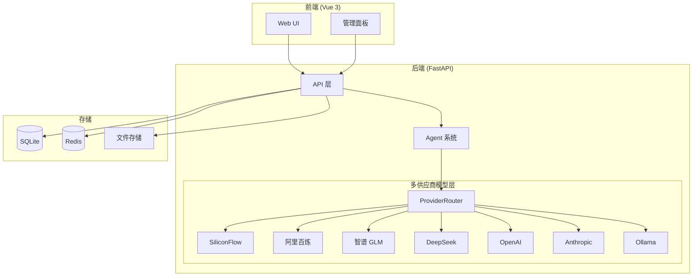

# CodingMatrix

> AI 驱动的全栈代码生成与开发平台

**版本**: v5.4.0 | **技术栈**: FastAPI (Python 3.11) + Vue 3 + SQLite + OpenTelemetry + Docker

---

## 项目概述

CodingMatrix 是一个基于 FastAPI + Vue 3 的 AI 全栈开发平台，提供代码生成、图像生成、PPT 制作、工作流编排、虚拟 AI 对话等多种 AI 能力。

### v5.4.0 核心特性

| 特性 | 说明 |
|------|------|
| **多供应商模型支持** | 支持 SiliconFlow、阿里百炼、智谱 GLM、DeepSeek、OpenAI、Anthropic、Ollama 7 个供应商 |
| **智能故障转移** | 主供应商失败时自动切换到备用供应商 |
| **统一调用接口** | `call_llm()` 统一接口，自动路由到对应供应商 |
| **AI 代码生成** | 基于 LLM 的智能代码生成、流式输出、断点续传 |
| **AI 项目生成** | 完整项目脚手架生成，支持文件管理、预览、保存、GitHub 推送 |
| **增量修改** | 上传已有项目 → Agent 增量修改 → DockerRunner 测试 → git 保存快照 |
| **图像生成** | Kolors 模型支持文生图、图生图、修复、头像、风景、图标 |
| **PPT 生成** | 异步任务生成 PPT，支持预览和下载 |
| **虚拟 AI 对话** | GirlAi 多角色 AI 聊天，支持历史管理 |
| **工作流编排** | 可视化工作流定义、执行、导入导出、历史记录 |
| **视觉分析** | 图像理解、OCR、代码提取、安全检查 |
| **知识库** | 文档上传、搜索、知识管理 |
| **用户管理** | 三级权限 (normal/admin/super)、RSA 加密登录 |
| **系统监控** | 服务健康检查、熔断器、限流、日志管理 |

---

## 架构概览



---

## 快速开始

### 环境要求

- Python 3.11+
- Node.js 18+
- SQLite 3.35+
- Docker (可选，用于 Jaeger 和 DockerRunner)

### 1. 克隆项目

```bash
git clone <repository-url>
cd CodingMatrix
```

### 2. 配置环境变量

```bash
cp .env.example .env
# 编辑 .env 文件，配置 API Keys
```

最小配置（仅 SiliconFlow）：
```bash
SILICONFLOW_API_KEY=your-api-key
SECRET_KEY=your-secret-key
```

多供应商配置：
```bash
# SiliconFlow（默认）
SILICONFLOW_API_KEY=your-siliconflow-key

# 阿里百炼（可选）
DASHSCOPE_API_KEY=your-dashscope-key

# 智谱 GLM（可选）
ZHIPU_API_KEY=your-zhipu-key

# 其他供应商...
```

### 3. 启动后端

```bash
# 安装依赖
pip install -r configs/requirements.txt

# 启动后端服务
python3 -m uvicorn app.main:app --host 0.0.0.0 --port 8080 --reload
```

### 4. 启动前端

```bash
cd src
npm install
npm run dev
```

### 5. 验证安装

```bash
# 健康检查
curl http://localhost:8080/api/v1/health

# 查看支持的模型
curl http://localhost:8080/api/v1/health/models
```

---

## 多供应商模型系统

### 支持的供应商

| 供应商 | 环境变量 | 支持模型 |
|--------|----------|----------|
| SiliconFlow | `SILICONFLOW_API_KEY` | 所有 10 个内置模型 |
| 阿里百炼 | `DASHSCOPE_API_KEY` | qwen-plus、qwen-turbo 等 |
| 智谱 GLM | `ZHIPU_API_KEY` | glm-4、glm-4v 等 |
| DeepSeek | `DEEPSEEK_API_KEY` | deepseek-chat、deepseek-reasoner |
| OpenAI | `OPENAI_API_KEY` | gpt-4o、gpt-4o-mini 等 |
| Anthropic | `ANTHROPIC_API_KEY` | claude-3-5-sonnet、claude-3-opus 等 |
| Ollama | 无需 Key | 本地部署的任何模型 |

### 使用方式

```python
# 自动路由到 SiliconFlow
result = await call_llm(
    model="Qwen/Qwen3.5-4B",
    prompt="你好"
)

# 如果配置了 DashScope，会自动路由到阿里百炼
result = await call_llm(
    model="qwen-plus",
    prompt="你好"
)
```

### 故障转移

当主供应商失败时，系统自动尝试备用供应商：
- SiliconFlow 失败 → 阿里百炼 → 智谱 GLM
- 智谱失败 → SiliconFlow
- DeepSeek 失败 → SiliconFlow

详见 [guides/MULTI_PROVIDER_SETUP.md](guides/MULTI_PROVIDER_SETUP.md)

---

## 内置模型清单

支持 10 个内置模型（均通过 SiliconFlow）：

| 模型 | 用途 | 复杂度层级 |
|------|------|-----------|
| deepseek-ai/DeepSeek-R1-0528-Qwen3-8B | 深度推理 | 攻坚层 |
| THUDM/GLM-Z1-9B-0414 | 深度推理 | 攻坚层 |
| Qwen/Qwen2.5-7B-Instruct | 代码生成 | 标准层 |
| THUDM/GLM-4-9B-0414 | 通用对话 | 标准层 |
| Qwen/Qwen3-8B | 通用对话 | 标准层 |
| Qwen/Qwen3.5-4B | 快速响应 | 简单层 |
| THUDM/GLM-4.1V-9B-Thinking | 视觉分析 | 多模态 |
| deepseek-ai/DeepSeek-OCR | OCR 识别 | 多模态 |
| Kwai-Kolors/Kolors | 图像生成 | 多模态 |
| netease-youdao/bce-embedding-base_v1 | 文本嵌入 | Embedding |

详见 [BUILTIN_MODELS.md](BUILTIN_MODELS.md)

---

## 项目结构

```
CodingMatrix/
├── app/                      # 后端代码
│   ├── api/                  # API 路由
│   ├── agent/                # Agent 系统
│   ├── core/                 # 核心配置
│   ├── db/                   # 数据库模型
│   ├── models/               # Pydantic 模型
│   ├── schema/               # 请求/响应 schema
│   ├── services/             # 业务逻辑
│   ├── tasks/                # Celery 任务
│   └── utils/                # 工具函数
│       └── aicloud/          # 多供应商模型系统
├── src/                      # 前端代码 (Vue 3)
├── docs/                     # 文档
├── configs/                  # 配置文件
├── tests/                    # 测试代码
└── scripts/                  # 脚本工具
```

---

## 文档导航

| 文档 | 说明 |
|------|------|
| [INDEX.md](INDEX.md) | 文档索引 |
| [architecture/ARCHITECTURE.md](architecture/ARCHITECTURE.md) | 系统架构 |
| [architecture/MODELS.md](architecture/MODELS.md) | 模型系统 |
| [guides/MULTI_PROVIDER_SETUP.md](guides/MULTI_PROVIDER_SETUP.md) | 多供应商配置 |
| [guides/GETTING-STARTED.md](guides/GETTING-STARTED.md) | 开发指南 |
| [guides/PRODUCTION.md](guides/PRODUCTION.md) | 生产部署 |
| [API-COMPLETE.md](API-COMPLETE.md) | API 文档 |
| [BUILTIN_MODELS.md](BUILTIN_MODELS.md) | 模型清单 |

---

## 版本历史

| 版本 | 日期 | 主要更新 |
|------|------|----------|
| v5.4.0 | 2026-05-22 | 多供应商模型支持 |
| v5.3.1 | 2026-05-22 | 模型名称修复 |
| v5.3.0 | 2026-05-22 | 文档整合 |
| v5.2.x | 2026-05-20 | 后端综合修复 |
| v5.1.2 | 2026-05-18 | 前端优化 |
| v5.1.0 | 2026-05-15 | 需求理解增强 |
| v5.0.0 | 2026-05-10 | 需求联想增强 |

详见 [versions/](versions/) 目录

---

## 许可证

MIT License

## 贡献

欢迎提交 Issue 和 Pull Request。

## 联系方式

- 项目主页: [GitHub Repository]
- 文档: [docs/INDEX.md](INDEX.md)
