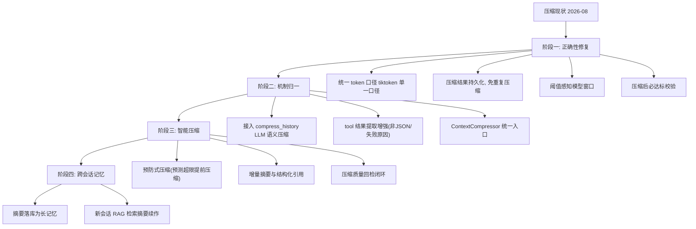

# Agent 上下文压缩机制未来演化路径

> 版本：v1.0 | 日期：2026-08-02 | 分析对象：`app/utils/agent_core.py`（`_compress_context` 主压缩）+ `app/agent/conversation_store.py`（会话历史截断/压缩）+ `app/api/v1/ai_agent/orchestrate_endpoints.py`（多轮拼接截断）+ `app/api/v1/aiGeneratorPptx.py`（文件内容截断）

本文档规划 Agent 上下文压缩机制从现状到长期目标的演化路线。原则与 Agent 引擎一致：**先修正确性（token 口径、触发阈值），再统一机制（规则截断/LLM 摘要/主循环压缩归一），后智能增强（感知模型窗口、增量摘要、跨会话记忆）**。

## 1. 现状基线

### 1.1 三层压缩现状

```
生成主循环 (agent_core.py)
    └── 每步 token 守卫 ──超阈值──► _compress_context (规则摘要，保留最近4条)
多轮会话 (orchestrate_endpoints.py:301)
    └── 拼接历史前 truncate_history (纯规则截断 10轮/4000token)
内容输入 (aiGeneratorPptx.py:1778)
    └── 文件内容 30000 字符硬截断
```

| 机制 | 位置 | 策略 | 是否调 LLM | 生产接线 |
|------|------|------|-----------|---------|
| 主循环压缩 | `agent_core.py:1449 _compress_context` | 保留 system prompt + 最近 4 条，中间消息规则提取文件/快照/错误/决策 | 否 | ✅ 生效 |
| 会话截断 | `conversation_store.py:215 truncate_history` | 保留最近 10 轮、4000 token，从最旧丢弃 | 否 | ✅ 生效 |
| 会话语义压缩 | `conversation_store.py:247 compress_history` | LLM 摘要前半段 + 保留后半段，失败回退截断 | 是 | ❌ 未接线 |
| 内容截断 | `aiGeneratorPptx.py:1778` | 30000 字符截断 | 否 | ✅ 生效 |

### 1.2 主压缩 `_compress_context` 策略（`agent_core.py:1449-1517`）

1. `len(messages) <= 3` 直接返回
2. 保留 `messages[0]`（system prompt）
3. 保留最近 4 条消息（2 轮对话）
4. 中间消息规则提取四类关键信息：
   - tool 结果 `status=success` 且含 `file_path` → 已创建文件清单
   - tool 结果 `status=error` → 错误记录（前 80 字符）
   - system 含「目录状态/snapshot」 → 最新目录快照（前 200 字符）
   - assistant 内容 > 50 字符 → 关键决策（前 100 字符）
5. 合成一条 system 摘要消息，附加压缩条数
6. 压缩后重新估算 token 并记录减少量（`agent_core.py:1727-1729`）

### 1.3 触发与 Token 口径

- **主循环触发**：`_estimate_tokens(messages) > config.max_thinking_tokens * 0.8`（默认 8192×0.8≈6553），每步开始检查（`agent_core.py:1712-1729`）
- **tiktoken 口径**（`agent_core.py:237-243`）：deepseek/qwen/gpt-4/3.5 用 `cl100k_base`；其余默认 `cl100k_base`
- **会话历史口径**（`conversation_store.py:32-37`）：`len(text) // 2` 粗略估算（中文约 1.5 字/token、英文约 4 字符/token）

### 1.4 实测确认的问题（2026-08-02）

| # | 问题 | 位置 | 影响 |
|---|------|------|------|
| P0 | `compress_history`（LLM 语义压缩）写好但无生产调用，只用了 `truncate_history` 规则截断 | `conversation_store.py:247`；`orchestrate_endpoints.py:301` | 多轮长对话语义信息被机械丢弃 |
| P1 | 主压缩保留「最近 4 条」固定值，未考虑单条消息大小；若最近消息巨大（长工具输出），压缩后仍超限 | `agent_core.py:1458-1459` | 压缩可能无效，token 守卫形同虚设 |
| P1 | 压缩后不持久化：压缩结果只影响内存 messages，下次 continue 又从完整历史加载再压缩 | `agent_core.py:1614-1658` | 每轮重复压缩，历史无限增长 |
| P1 | 阈值用 `max_thinking_tokens`（思考预算）而非模型上下文窗口，口径语义混淆，不同模型窗口差异未感知 | `agent_core.py:1716`；`codeRequest.py:82` | 触发时机错误或过晚 |
| P2 | 会话历史 token 估算用 `len//2`，与 tiktoken 不一致 | `conversation_store.py:32-37` | 4000 token 实际可能偏差大 |
| P2 | 摘要提取只认 tool JSON `status/file_path` 形态，其余工具结果（非 JSON、无 file_path）信息全丢 | `agent_core.py:1469-1488` | 重要上下文丢失 |
| P3 | `orchestrate_endpoints.py:300` 注释「保留最近 5 轮」与 `MAX_HISTORY_ROUNDS=10` 实际不符 | `orchestrate_endpoints.py:300`；`conversation_store.py:27` | 注释误导 |

## 2. 演化目标

```
【近期】正确性修复：统一 token 口径、压缩结果持久化、阈值感知模型窗口
  ↓
【中期】机制归一：LLM 摘要接线、主循环压缩/会话压缩合并为一套
  ↓
【长期】智能压缩：感知模型窗口、增量摘要、跨会话记忆引用
```

## 3. 阶段一：正确性修复（近 1-2 个迭代）

**目标**：先让现有压缩「按真实 token 与模型窗口」工作，且压缩不丢结果。

### 3.1 统一 Token 估算口径（P1）

- `conversation_store._estimate_tokens`（`len//2`）替换为与 `agent_core` 一致的 tiktoken 估算，抽出公共模块（如 `app/utils/token_counter.py`）
- 暴露 `count_tokens(text, model_name=None)` 单一口径，`agent_core` 与 `conversation_store` 共用
- 目标：两处对同一文本估算结果一致

### 3.2 压缩结果持久化（P1）

- `_compress_context` 压缩后，将压缩结果写回 `conversation_history_manager.set_history`，替代「每轮从完整历史重新加载再压缩」
- continue 生成（`agent_core.py:1624-1658`）直接读压缩后历史，避免重复压缩
- 记录压缩版本/时间戳，供前端与日志追溯

### 3.3 阈值感知模型窗口（P1）

- 新增模型上下文窗口映射（deepseek/qwen 等各模型 max context），从配置或模型路由取
- 触发阈值改为 `min(model_context_window, max_thinking_tokens) * 0.8`，与思考预算解耦
- `codeRequest.py` 增加 `context_window` 字段，默认跟随 `max_thinking_tokens`

### 3.4 压缩有效性校验（P1）

- `_compress_context` 压缩后若仍超阈值，二次处理：对大体积单条消息截断其 content，或继续丢弃更早消息直到达标
- 压缩后必达标，避免「压缩了仍超限」

### 3.5 验收标准

- 同一文本在 `agent_core` 与 `conversation_store` 估算 token 一致
- 压缩结果持久化，continue 生成不再重复压缩同一段历史
- 阈值随模型窗口变化，触发时机正确
- 压缩后 token 必低于阈值（不再出现压缩后仍超限）

## 4. 阶段二：机制归一（近 2-4 个迭代）

**目标**：消除三层并存的压缩逻辑，接入 LLM 语义压缩。

### 4.1 接入 `compress_history` LLM 语义压缩（P1）

- `orchestrate_endpoints.py:301` 由 `truncate_history` 升级为 `compress_history`（超限才触发，LLM 摘要前半段 + 保留后半段）
- `compress_history` 失败自动回退 `truncate_history` 的降级链保留
- 摘要 prompt 增强：保留项目名称/需求/决策/问题，而非通用「对话摘要」模板（`conversation_store.py:284`）

### 4.2 主压缩摘要提取增强（P2）

- `_compress_context` 的 tool 结果识别从「仅 JSON + file_path」扩展为：非 JSON 文本截断保留、通用 tool 名称/状态保留、失败原因保留
- 摘要结构化：`created_files` / `errors` / `decisions` / `snapshots` 分区，便于后续引用

### 4.3 合并为一套压缩入口（P2）

- 抽象 `ContextCompressor`：主循环压缩（实时）与会话压缩（持久化）统一接口
  - 主循环：每步守卫触发 → 实时压缩（规则优先，避免 LLM 延迟阻塞生成）
  - 会话边界：生成结束/会话切换 → LLM 语义压缩 → 持久化
- 两处 `_estimate_tokens` 彻底收敛到公共模块

### 4.4 验收标准

- 多轮对话超过 4000 token 后走 LLM 语义摘要，摘要保留关键需求/决策
- 主循环实时压缩不引入 LLM 延迟（规则优先）
- 三层压缩入口收敛为 `ContextCompressor` 一套
- 会话历史按「实时压缩 + 边界语义压缩」两级执行

## 5. 阶段三：智能压缩（中期 4-8 个迭代）

**目标**：压缩机制感知模型与任务，质量可量化。

### 5.1 感知模型窗口动态调度

- 依据模型上下文窗口、历史 token 增速预测下一步是否会超限，提前压缩（预防式而非触发式）
- 多模型路由（AGENT-ENGINE.md 6.3）下，窗口随模型切换实时调整

### 5.2 增量摘要与引用

- 摘要缓存：已压缩段不重复摘要，新增段增量合并
- 摘要携带结构化索引（文件/决策/问题），后续生成可引用摘要条目而非全文

### 5.3 压缩质量回检

- 压缩前后对比关键信息保留率（文件数、决策点、错误清单）
- 回检不达标触发重摘要或降级为「保留更近消息」策略
- 采样记录到学习闭环（AGENT-ENGINE.md 5.1），供摘要 prompt 迭代

### 5.4 验收标准

- 预防式压缩使生成全程无一次「压缩后仍超限」
- 摘要引用生效：跨步骤引用摘要条目，而非加载全文
- 压缩保留率 > 90%，回检记录入库

## 6. 阶段四：跨会话记忆（长期）

**目标**：压缩产物进入长记忆，跨会话复用（承接 AGENT-ENGINE.md 6.4 跨会话长记忆）。

### 6.1 摘要入库

- LLM 语义摘要落库（`agent_memory`/`chat_history`），会话结束后沉淀为项目级长记忆
- 压缩出的文件清单/决策作为项目知识，供后续会话检索

### 6.2 记忆引用生成

- 新会话从记忆库检索相关摘要（RAG），构建初始上下文而非空 system prompt
- 与 faiss 链路（AGENT-ENGINE.md 5.3）共用索引

### 6.3 验收标准

- 会话摘要可跨会话检索引用
- 新会话可基于历史摘要续作，无需完整历史

## 7. 演化路径总览



## 8. 风险与依赖

| 风险 | 应对 |
|------|------|
| 主循环接入 LLM 摘要拖慢生成 | 实时路径保持规则优先，LLM 摘要只在会话边界执行 |
| 压缩持久化改变 continue 行为 | 持久化前跑回归：同一 session 继续生成与原先逻辑产物一致 |
| 阈值改模型窗口后触发更频繁 | 窗口映射表先覆盖在用小模型（deepseek/qwen），灰度验证 |
| `compress_history` 摘要质量不稳定 | 保留截断降级链；摘要 prompt 按 4.1 定向增强关键信息 |
| 与 AGENT-ENGINE.md 5.2/6.4 上下文统一方案重叠 | 压缩产出物对齐该文「统一上下文与存储」抽象，避免第三套存储 |
| 跨会话记忆检索增加 RAG 依赖 | 阶段四前置条件为 faiss 链路稳定（AGENT-ENGINE.md 5.3 已规划） |
