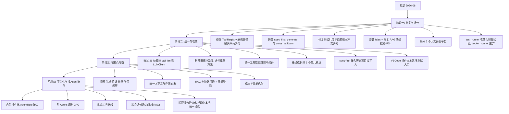

# Agent 引擎未来演化路径

> 版本：v1.122 | 日期：2026-08-17 | 分析对象：`app/agent/`（77 顶层模块 + 3 子包，去重共 98 模块，40,880 行）+ app/utils 测试执行/防护/技能/核心交叉模块
>
> v1.122 更新：2026-08-17 第一百二十一轮推演（**json_parser + error_handler + error_codes 错误处理家族合扫**）——更新模块详档 [modules/error_handling.md](modules/error_handling.md)。新增 P2 2 项、P3 5 项。全库确认：**EH1 [P2] integrity_error_handler 把原始 SQLAlchemy 错误暴露给用户——数据库结构信息泄露**——error_handler.py:144 `details={"original_error": str(exc.orig)}`——含表名/约束/SQL 片段——与 generic_exception_handler :205「服务器内部错误」信息隐藏策略**同文件内自相矛盾**。**JP1 [P2] RobustJSONParser `_fix_common_errors` 破坏性正则修复——损坏含撇号/冒号的合法 JSON**——:122 `re.sub(r"'([^']*)'", r'"\1"', text)` 字符串值内撇号被替换（"don't"→非法）+ :125 冒号加引号正则误匹配字符串值内冒号（"time: 12:30"）——LLM 合法输出被"修复"成损坏（CII 家族）。P3 5 项：JP2 extract_json_from_llm 策略 3「第一个 { 到最后一个 }」多对象拼接跨对象截取损坏；JP3 容错解析静默接受部分数据无告警——下游拿损坏数据当完整结果；EH2 429 Retry-After 硬编码 60 与 rate_limiter 窗口不符；EH3 两套错误码体系并存（error_handler 字符串码 vs error_codes 枚举码——api_response 用枚举、路由层未落地）；EC1 error_codes 40+ 错误码仅 api_response 引用——体系膨胀未采用。Backlog 733→740（P2 276→278、P3 387→392）。已同步 TASKS.md §I.3、EVOLUTION.md §4。
>
> v1.121 更新：2026-08-17 第一百二十轮推演（**web_search.py + web_search_enhancements.py 网络搜索链合扫**）——更新模块详档 [modules/web_search.md](modules/web_search.md)。新增 P2 4 项、P3 7 项。全库确认：**WS1 [P2] DuckDuckGo 搜索 `verify=False` 禁用 TLS 验证——搜索流量可被中间人篡改**——web_search.py:224 硬编码 verify=False（:30 DISABLE_SSL_VERIFY 环境变量定义了未应用）——备用搜索路径网络受控时攻击者篡改搜索结果 → LLM 上下文污染。**WS2 [P2] fetch_page_text 无 SSRF 防护——workflow WebSearchNode 直接传 URL（workflow/node_types/web_search.py:161）→ 内网/metadata 请求**——:442-493 无内网地址黑名单。**WS3 [P2] summarize_page_with_llm 网页内容直接拼 prompt——恶意网页 prompt 注入污染摘要**——:519-530 不可信网页内容 f-string 直插。**WS4 [P2] _clean_url 提取 uddg/link 参数无协议白名单——javascript:/data: URL 进结果**——:296-305。P3 7 项：WS5 命名混乱（_search_baidu 实际查 Bing）；WS6 max_concurrent_fetch 定义未使用 gather 全量并发；WS7 LLM 摘要模型硬编码 deepseek-ai/DeepSeek-R1-0528-Qwen3-8B；WS8 fetch_page_text 无响应体大小限制；WSE1 enhance_query 后整段死代码 + _extract_school_name 重复定义覆盖（:156-252 不可达）；WSE2 current_year=2025 硬编码；WSE4 独立 SearchResult 同名类双轨。**外部内容进入 LLM 链路完整性**：搜索是 agent 工具链（tools.py:1073/executor.py:340）与 workflow 共享后端——WS1/WS3 直接影响 LLM 输入。Backlog 722→733（P2 272→276、P3 380→387）。已同步 TASKS.md §I.3、EVOLUTION.md §4。
>
> v1.120 更新：2026-08-17 第一百一十九轮推演（**cache.py + cache_decorator.py 缓存双轨合扫**）——更新模块详档 [modules/cache.md](modules/cache.md)。新增 **P1 1 项**、P2 4 项、P3 5 项。全库确认：**CA12 [P1] cache_response 缓存键排除用户身份——三处个性化路由跨用户数据泄露——全库首个经装饰器路径 100% 命中复现的跨用户泄露**——cache_decorator.py:51 显式排除 token/user_id——`/user/profile`（auth.py:445）参数仅 (db, token)——**缓存键 = md5("profile:get_user_profile") 全站共键**——用户 A 首次请求后 5 分钟内所有用户命中 A 的 profile（含 email/permission_level）；`/history`（auth.py:289）与 `/conversations`（auth.py:479）键含 query/body 参数不含 user——相同参数用户间互串历史/会话数据——影响面全部注册用户，与 IM1/SCT1/SCT5 同级 P1。P2 4 项：CA1 Redis 降级→恢复切换时 memory 值不可见（get :251-252 短路返回 None）+ set 恒 True 调用方不知落层；CA2 跨进程内存缓存无法失效——多 worker 失效不同步；CA11 cache_response 缓存 Response 对象——Redis 后端 default=str 序列化 Response → 命中返回字符串破坏响应（双后端行为不一致）；CA18 _generate_cache_key 非标量/非 pydantic 参数静默忽略 → 不同参数缓存同键数据串。P3 5 项：CA3 cached 装饰器缓存 None 永远穿透；CA13 invalidate_on 清整个前缀误清同前缀路由；CA16 invalidate_cache 在 func 抛异常时不失效缓存残留；CA5 Redis 宕机每次重建连接降级路径自身慢（雪崩更慢）；CA19 clear flushdb 清空共享 Redis 他人数据。**双轨模式**：cached（通用）+ cache_response（路由）两套装饰器并存——与加密双轨/CodeValidator 双轨同模式。Backlog 712→722（P1 3→4、P2 268→272、P3 375→380）。已同步 TASKS.md §I.3、EVOLUTION.md §4。
>
> v1.119 更新：2026-08-17 第一百一十八轮推演（**resource_guard + dynamic_concurrent + dynamic_chunker + system_load 资源与并发控制合扫**）——更新模块详档 [modules/resource_concurrency.md](modules/resource_concurrency.md)。新增 P2 3 项、P3 9 项。全库确认：**DCC1 [P2] ConcurrentLimitManager 单例 `__new__` 构造竞态——`if False else None` 死代码标志**——dynamic_concurrent.py:45 `_lock = threading.Lock() if False else None` 作者显式写锁又禁用——:47-51 无锁双检——多线程首次并发构造 → 重复初始化覆盖 limits/active_sessions——限额配置丢失。**DCC2 [P2] can_create_session 与 register_session 分离——检查与注册非原子（TOCTOU）→ 并发超限**——:107-116 检查 `active < limit` 与 :118-120 单独注册——N 个并发请求同时过检 → 全部注册 → 实际并发超限（free=1 可 2+）——中间层限流失效（三层并发防线最薄弱）。**SL2 [P2] system_load._get_model_queue_depths 同步阻塞事件循环 + active/reserved 双重计数虚高**——:112 `celery_app.control.inspect(timeout=2.0)` 同步阻塞（每个 worker 一轮）→ 高负载下快照采集卡 2s+ 阻塞事件循环 → 路由决策延迟；:114-115 active+reserved 重复计同一任务 → 队列深度虚高。P3 9 项：RG1 非 psutil 分支静默失真（内存检查失败跳过/cpu 恒 0）；RG2 `cpu_percent(interval=0.5)` 同步阻塞事件循环；DC1 upload_speed_history 只增不删内存无限增长；DC2 DynamicChunker 可变状态无锁并发竞态；DCC3 会话泄漏无自动补偿（注释自认，异常路径永久拒绝用户）；DCC4 _change_log 无限增长；DCC5 update_limit 负数/超大值直通；SL1 _get_active_requests 直接访问 rate_limiter 私有 _config/_lock/_history 紧耦合；SL3 psutil 缺失环境负载信号全 0 过载判断失真。Backlog 700→712（P2 265→268、P3 373→375）。已同步 TASKS.md §I.3、EVOLUTION.md §4。
>
> v1.118 更新：2026-08-17 第一百一十七轮推演（**process_guard.py 进程守护链合扫**）——更新模块详档 [modules/process_guard.md](modules/process_guard.md)。新增 P2 4 项、P3 7 项。全库确认：**PG1 [P2] 端口失联自动执行 restart_cmd——superadmin 手动配置任意 shell 命令常驻自动触发（CII1 家族弱化版）**——guardian_router.py:91-96 `/guard/start` 用户 restart_cmd 直通 → process_guard.py:120 `create_subprocess_shell` shell=True 无白名单——命令在服务失联时被守护循环自动反复执行，且无配置来源审计。**PG2 [P2] restart_service `proc.communicate()` 无超时——前台重启命令永久挂起 → 监控循环卡死、熔断失效**——:127 communicate 无 timeout，前台服务命令永不退出 → `_wait_for_service_ready` 永远到不了，:150 `except asyncio.TimeoutError` 成死代码。**PG3 [P2] 端口失联即杀旧进程——无进程级健康确认 + kill_process 未校验 PID create_time（TOCTOU/PID 重用误杀健康进程）**——is_port_open 仅 TCP connect 误报 + PID 重用杀无关进程。**PG4 [P2] guardian_router.py:672 download_backup 路径穿越**——`config_backup_{timestamp}.json` 无 `..` 校验（delete_backup :747 有——不对称）——admin 读任意 .json。P3 7 项：PG5 lsof 多 PID int() 抛错静默丢；PG6 熔断持久化 `config['process_signature']` KeyError 任务崩溃（不在 except 白名单）；PG7 重启服务无资源限制（UT5）；PG8 必填键直接下标崩溃；PG9 `systemctl restart mysql` 受限环境必败熔断循环；PG10 ServiceConfigManager 相对路径 data/service_configs.json（GRD3）；PG11 is_trusted 直接下标。Backlog 689→700（P2 261→265、P3 366→373）。已同步 TASKS.md §I.3、EVOLUTION.md §4。
>
> v1.117 更新：2026-08-17 第一百一十六轮推演（**crypto.py + encryption.py 加密双轨合扫**）——更新模块详档 [modules/crypto_encryption.md](modules/crypto_encryption.md)。新增 P2 3 项、P3 4 项。全库确认：**CRY1 [P2] 密钥加载失败静默重生成——覆盖共用密钥文件，双模块密钥轮换不同步（SCT6 家族）**——两模块各自定义同名 `RSAKeyManager`、共用同一对密钥文件（`keys/rsa_private.pem`）但单例独立、加载时机独立——crypto.py:71-75 与 encryption.py:79-86 任一方加载失败即 `_generate_keys()` + 覆盖写盘——另一模块内存私钥与新文件不一致——apikey 与 auth 解密行为分裂，历史密文全不可解，且无告警。**CRY2 [P2] encryption.py 版私钥明文落盘权限过宽**——save_keys（:87-107）无 chmod——默认 0o644 明文私钥任何用户可读（crypto.py:97 有 0o600，不对称）+ `NoEncryption()` 明文 PEM。**CRY3 [P2] 默认相对路径 keys/——CWD 漂移下密钥位置漂移、多 worker 各自生成（GRD3 家族）**——crypto.py:26 `Path("keys")` / encryption.py:203 字符串默认——部署 CWD 不同 → 找不到密钥各自重建 → 前端已缓存公钥加密数据在新 worker 解密失败（登录/API Key 随机失败）+ 无密钥版本号。P3 4 项：CRY4 密钥无密码保护（NoEncryption 依赖文件权限兜底）；CRY5 解密失败静默吞错统一抛无上下文 ValueError（EC3 家族）；CRY6 crypto.py 单例无锁无双检（与 encryption.py 双检锁不对称）；CRY7 encryption.py 构造误配只传单路径 → 内存密钥永不写盘 → 永远解密失败。**加密双轨**：crypto.py（RSA 直解→apikey.py）+ encryption.py（RSA+AES 混合→auth.py）同名异构双份实现、双份单例、双份密钥读写——与 CodeValidator 双轨、路径安全四轨道同模式；SCT6 家族确认。Backlog 682→689（P2 258→261、P3 362→366）。已同步 TASKS.md §I.3、EVOLUTION.md §4。
>
> v1.116 更新：2026-08-17 第一百一十五轮推演（**file_operator.py——703 行，路径安全文件操作层**）——更新模块详档 [modules/file_operator.md](modules/file_operator.md)。新增 P2 1 项、P3 6 项。全库确认：**FO1 [P2] PROTECTED_FILES ".env" 子串匹配误伤——项目内 .env* 文件/目录全拒（FCT3/PP8 家族）**——:140-142 `protected_file.lower() in abs_path_str` 子串匹配——路径含 ".env" 即拒（/projects/myapp/.env.example 被拒抛 PathSecurityError）——而 SAFE_EXTENSIONS（:59/:71）明确白名单 .env/.env.example——**黑白名单矛盾**；:147-148 `.env` 扩展名豁免 `if ".env" not in abs_path_str` 被 :141 前置拦截——豁免死代码。P3 6 项：FO2 allow_protected_paths=True 完全关闭路径防护（:89/:135-142「危险仅测试用」无强制，生产零调用传 True——潜在误配风险）；FO3 扩展名白名单仅 create 生效（:272 check_extension 默认 True）——write/delete/move/copy/list_dir/tree 全 check_extension=False（:234/:296/:323/:349/:383/:586）+ SAFE_EXTENSIONS 超全（.env/.gitignore/.lock/.recipe）——扩展名检查形同虚设；FO4 `FileOperator()` 无 base_path 黑名单制范围失控——multi_model_agent.py:72/file_processing.py:37 用无边界实例——/home//usr//opt/ 等非系统路径可读写（PROTECTED_PATHS 覆盖有限，区别于 AC1 完全无校验）；FO5 read 全量 readlines 大文件内存 + 无大小上限（:198，read_async 只是 to_thread 不解决内存）；FO6 _collect_files 点开头全跳（:164）——.github/.env.example 等隐藏内容 search/grep/stats 不可见；FO7 grep/search errors='ignore' 编码损坏内容静默丢弃（EC3 家族）。**路径安全四轨道**：FileOperator（本模块，活跃但规则有误 FO1/FO3/FO4）+ FileContract（FCT 详档）+ guardrails.PathSecurityChecker（GRD7 零消费）+ AC1 的 create_project_file（完全绕过 FileOperator）——四套路径安全各自为政，主生成工具走最弱的一条。修复方向：.env 改精确匹配（文件名等于 .env 而非含子串）+ SAFE_EXTENSIONS 保留 .env.example、扩展名白名单统一应用到 write、无 base_path 消费方强制传 base_path + PROTECTED_PATHS 扩至 /home//usr//opt/、read 改流式分页、_collect_files 隐藏目录策略统一、编码错误处理不静默丢。Backlog 675→682（P2 257→258、P3 356→362）。已同步 TASKS.md §I.3、EVOLUTION.md §4。
>
> v1.115 更新：2026-08-17 第一百一十四轮推演（**agent_core.py——2627 行，项目生成 Agent 核心**）——更新模块详档 [modules/agent_core.md](modules/agent_core.md)。新增 P2 4 项、P3 8 项。全库确认：**AC1 [P2] create_project_file 无路径校验——LLM 可写任意路径（越权写文件）**——:1182 aiofiles.open(file_path) 直接用 LLM 工具参数 + :1177 path.parent.mkdir 任意目录——无 FileOperator._validate_path/无 PathSecurityError/无 FileContract——生成主工具可写 /etc/xxx、../outside.txt 等服务进程权限内任意路径；同模块 create_file（:2551）/edit_file（:2507）/delete_file（:2527）均走 ProjectFileManager→FileOperator 有防护——**同一模块两套文件写入路径，主工具无防护**（防护接线选择性遗漏）；**AC2 [P2] _parse_tool_calls 尝试4 硬编码 file_path `./projects/user_api/{filename}`（:2288）无视 output_dir**——LLM 直接输出代码块时转换工具调用硬编码相对路径，文件写错位置（GRD3 相对路径漂移家族）；**AC4 [P2] 内存级会话历史 ConversationHistoryManager（:37-121）**——全局单例内存 dict 存 messages/output_dir，进程重启丢失 + 多 worker 不共享（session 历史 worker A 创建、worker B 请求继续生成 has_history False → 新生成而非继续——generate_endpoints 继续生成功能失效）；:107-109 _cleanup_if_needed 排序 key 用 `messages[-1].get("timestamp")`——消息 dict 无 timestamp 字段（generate_project :1665-1668 只存 role/content）→ 恒 "" → 清理随机（MCP1/GRD2 家族）；**AC5 [P2] 生成成功判定只看 final 步骤存在（:1994）**——只要 LLM 输出含完成关键词即 success，:1953 验证 runnable False 只发回调不改 success；:1906-1911 完成检测纯文本子串「完成/success/done/生成完毕」——LLM 一句话「完成」即结束（AC11）——TR1/MAR8 结果谎报家族。P3 8 项：AC3 _execute_tools :2403 `self.current_output_dir`——ProjectGeneratorAgent（BaseModel）无此字段 → AttributeError 被 :2418 except Exception logger.debug 吞掉——:2400-2417 目录快照块确定性死代码；AC6 run_full_validation runnable 只计文件验证（:844）——dependency/structure/entrypoint 检查结果不计入，缺 README/无入口点仍 runnable=True（DGV1 放行）；AC7 _validate_runtime :569 宿主机 exec 生成代码——无沙箱无内存/CPU/网络/文件系统限制（仅 10s 超时），生成代码含危险操作直接执行——与 docker_runner 隔离执行矛盾（两条验证执行路径并存：docker 隔离 + 宿主机直跑）；AC8 _check_syntax_warnings :781-785 每个 for 循环无条件 append「循环变量可能未使用」——即使循环体使用变量也报——全量误报注入验证结果；AC9 _validate_security 'open' 列危险函数（:637）任何文件用 open() 触发警告 + security 恒 success=True（:671，:424 汇总只计前三项）——安全检查只告警不阻断（DR2 家族）；AC10 CodeValidator/ProjectValidator 同名双轨（agent_core.py:351/:795 vs app/agent/code_validator.py:20 活跃主验证器 + app/utils/project_validator.py:43，SCT6 家族）+ validate_file :1243 每次调用新建 CodeValidator → :363 每次全量 pip freeze 子进程（性能）；AC11 完成检测关键词子串误判（:1911「完成」中途出现即结束，PP8 家族）；AC12 FileModelRouter 关键词子串匹配（:216-225 kw in req_lower）+ 硬编码 Qwen/Qwen3-8B + DeepSeek-R1-0528-Qwen3-8B（:164-165，SPFG17 家族）。佐证归入：:2019-2025 _call_llm 消息直接拼 prompt、:1661 用户需求直接进 messages——GRD1 注入检测缺失路径又一实例；:2604 ProjectFileManager.PROJECT_BASE_DIR="./projects" 相对路径——GRD3 佐证。**agent_core 是活跃核心（generate_endpoints.py:55/78 主消费）+ 传统生成链代表**：与 spec_first 生成链（SPFG 详档）并存两条生成链，验证体系 AC5-AC9 与 spec_first 验证端（SPFG13）同问题家族。修复方向：create_project_file 接入 FileOperator._validate_path/FileContract（与同模块 9 工具统一）、尝试4 硬编码路径改 output_dir 相对解析、会话历史 Redis/DB 持久化 + last_update 时间戳字段、success 结合 validation.runnable + 完成检测改结构化 JSON 信号、runtime 验证统一走 docker_runner 隔离、for 循环用名检测与 open 危险函数规则重设计、双 CodeValidator/ProjectValidator 合并单一来源。Backlog 663→675（P2 253→257、P3 348→356）。已同步 TASKS.md §I.3、EVOLUTION.md §4。
>
> v1.114 更新：2026-08-17 第一百一十三轮推演（**rate_limiter.py——38 行，slowapi 请求限流层**）——更新模块详档 [modules/rate_limiter.md](modules/rate_limiter.md)。新增 P2 2 项、P3 3 项。全库确认：**RL1 [P2] slowapi 限流默认内存存储 + 单进程计数——多 worker 部署失效（GRD2/MCP1 家族）**——:14-17 Limiter 未配 storage_uri（slowapi 默认 in-memory），main.py:112 init_rate_limit 活跃接线 + apikey 10 处/providers 7 处 @limiter.limit——**限流三套全内存级**（slowapi + middleware.rate_limiter.RateLimitMiddleware + guardrails.InMemoryRateLimiter），多进程部署下整套限流体系失效、总量 n 倍突破；**RL2 [P2] key_func=get_remote_address 忽略代理——反向代理后全站共享同一配额**——:15 直接用 request.client.host，项目配 Nginx（configs/nginx.conf）——代理后全站用户恒为代理内网 IP → 共享 100/minute 全局配额 + 接口级限制按代理 IP 归并，正常多用户并发立即全局 429 误伤；:27-32 get_client_ip 实现了 X-Forwarded-For 解析却零消费（设计了正确逻辑没用上）。P3 3 项：RL3 三层限流并存（slowapi 全局/接口级 + RateLimitMiddleware 多级 tier + guardrails 业务级 10/60s）——同一请求链三套配额叠加误伤、状态互不可见（guardian /admin/rate-limit 只暴露 middleware 层，SCT6 三轨家族极端例）；RL4 :24 用 slowapi 默认 _rate_limit_exceeded_handler——英文「Rate limit exceeded」文案与项目统一中文错误体系（api_response/error_handler）不一致 + 无 Retry-After；RL5 get_client_ip 零消费 + X-Forwarded-For 无 trusted-proxy 白名单校验（接线需前置信任设计，DR10/FCT3 家族）。**限流主线从「双轨」扩展为「三轨全内存」**：slowapi + RateLimitMiddleware + guardrails 三套限流全部单进程内存级——与防护层「检测不拦截」（GC2/GRD3）对照，限流是防护层唯一「主动拦截」机制（429 阻断），但三层全内存级使其在部署形态下失效。修复方向：三层收敛为一套（推荐保留 middleware 多级 tier + admin 观测，slowapi 装饰器与 guardrails 业务级并入）或明确分层职责 + 统一 Redis 存储（main.py:114-116 已检测 REDIS_URL 可复用）；key_func 改用代理感知（需 trusted proxies 白名单校验后再取 X-Forwarded-For）；定制 429 handler 返回统一错误格式 + Retry-After。Backlog 658→663（P2 251→253、P3 345→348）。已同步 TASKS.md §I.3、EVOLUTION.md §4。
>
> v1.113 更新：2026-08-17 第一百一十二轮推演（**guard_contracts.py——286 行，守护合约防护层**）——更新模块详档 [modules/guard_contracts.md](modules/guard_contracts.md)。新增 P2 2 项、P3 4 项。全库确认：**GC1 [P2] 守护合约 existence 检查无变更前基线——「保护项删除」判定语义失真**——:177-198 check_file(file_path, content) 只接收**变更后** content（code_tasks.py:243 实际 read_text 后传入全文），:203-212 `pattern not in content` 即报「保护项可能已被删除」——无变更前快照无法证明删除，变更后本不含该保护项的文件必然误报（TR1/MAR8 假阳性家族）；**GC2 [P2] 守护合约违规只记录不阻断——CRITICAL「禁止修改」无强制力（DGV1 放行家族）**——code_tasks.py:235-245 检查后 guard_violations 仅 append 进结果 dict 返回，无抛异常/中断/用户确认流程——GC-001 认证核心函数（CRITICAL，docstring「修改需用户确认」）违规时修改照常落盘，guard_violations 无调用方处理（success/retry_count 与违规无关）——守护合约是「只报告不拦截」的防护。P3 4 项：GC3 check_type="signature" 实际不检签名——:216 `(def|class)\s+name\s*[\(:]` 只查函数名前缀存在性，`def foo(a,b)`→`def foo(a)`（签名变更）仍匹配 `def foo` → 漏报；与 existence 实际等效，双 check_type 无行为差异（GC-001/002/006/007 签名规则全退化为存在性检查）；GC4 便捷函数 check_file_against_contracts（:262-265）/get_applicable_rules（:268-280）零消费——code_tasks.py:170 import 但走 contracts.check_file 方法链双路径并存，helpers.py to_dict 规则注入只给 LLM 看（规则知识轨与规则执行轨分离无验证）；GC5 10 条规则硬编码于 _load_default_rules（:45-175）无 YAML/DB 外部化 + allowed_changes 白名单死字段（:25 定义 :202-226 从不引用——白名单机制从未实现）+ GC-009/GC-010 NOTICE 级 protected_patterns=[] 空迭代永不触发（两条规则空操作占位）；GC6 保护项子串匹配失真——GC-003 保护 "id"（:94）任何代码含 "id" 子串恒存在 → 实际永不触发；超短 token（"id"/"role"）保护恒失效（FCT3/PP8 家族）。**防护层接线度三分新基准**：guard_contracts 是唯一真实执行（code_tasks:243）的防护模块——与 guardrails（2/6 接线）、agent_skills（0/5 接线）对照——但 GC2 使执行结果不阻断、效力归零：注入检测（GRD1 未接线）、路径安全（FCT 承担）、守护合约（GC2 记录不阻断）三条防护轨道共同失效模式 = **检测不拦截**。修复方向：check_file 传变更前基线（diff 感知——删除/签名变更才有意义）、signature 检查改 AST 解析比对参数签名而非正则前缀、CRITICAL 违规阻断修改流程（或显式降级为「仅提示」）、超短保护项改精确符号匹配/字段级白名单、规则外部化 YAML + allowed_changes 白名单实现 + NOTICE 空操作移除或实现、便捷函数与 code_tasks 方法链统一单一入口。Backlog 652→658（P2 249→251、P3 341→345）。已同步 TASKS.md §I.3、EVOLUTION.md §4。
>
> v1.112 更新：2026-08-17 第一百一十一轮推演（**agent_skills.py——415 行，Agent 认知技能层**）——更新模块详档 [modules/agent_skills.md](modules/agent_skills.md)。新增 P2 1 项、P3 6 项。全库确认：**ASK1 [P2] 五个认知 Skill 全库零消费——「为 Agent 注入 5 个认知能力」从未接线**——get_skills_manager() 唯一调用点 helpers.py:197 位于 get_agent_knowledge_base() 内而后者零调用（code_tasks.py:171 仅 import 未调用）、prompt_loader 侧 load_cognitive_skills_prompt（:159）亦零调用——5 个 Skill 类 + AgentSkillsManager 全部方法（detect/review/detect_patterns/check/assess/process_user_input/pre_modify_review/post_modify_check）零引用，三个 YAML（keyword_triggers/anti_patterns/review_checklist）从不加载——**能力未接线家族模块级全死代码**（GRD1 类级延伸，docstring「注入 5 个认知能力」与接线状态系统性偏差的极端证据）。P3 6 项：ASK2 post_modify_check 假阳性设计——:402 detect_patterns("", code) before 为空 → before_lines=[''] → 全部代码行判「新增行」→ 含 import/def/class/@router/async def 全 pattern 命中（TR1/MAR8 家族，接线即全量误报）；ASK3 KeywordDetectionSkill 无词边界子串触发——:42-44 keyword.lower() in user_input.lower() +「实现/add/优化/修复」超宽词任意出现即触发追问流程 + 命中顺序配置决定 + questions[:3] 双处截断（PP8/FCT3 家族）；ASK4 AntiPatternSelfCheck 正则直扫整个代码文本——注释/docstring 中 password= 同样命中 AP-SEC-001、AP-SEC-002 限定 f-string 前缀漏报、YAML pattern 直接当正则、re.error 静默跳过（DR12 家族）；ASK5 RiskSelfAssessmentSkill 依赖计数子串匹配错算——:299-301 target in file_path 短名跨文件命中 + 多 target 同文件虚高（与 code_tasks.py:267-271 _find_affected_files 同源双副本）、:274-285 文件类型判定同为子串（路径含 auth 即 +30）；ASK6 三个 YAML 相对路径 CWD 漂移 + .exists() False 静默空降级（GRD3/EC3 家族）；ASK7 MultiAngleReviewSkill.review 占位实现（全 pending_review + 空 notes，实际审查逻辑从未实现）+ get_all_skills_context 仅返回元数据「技能名片」（数量/类别名/levels）不含规则内容。**技能层 vs 守护合约对照**：helpers.py 同文件两个知识库来源——get_agent_knowledge_base（零消费，含技能层）vs load_guard_contracts（活跃 :185-186）——一死一活。修复方向：关键词触发接入编排入口但先改词边界、多角度审查/风险自评接入 pre_modify（与 FCT 守护合约协同，技能层专注认知审查）、post_modify_check 保存修改前快照传非空 before、正则剥离注释字符串后再匹配 + YAML 区分正则/子串双模式、依赖计数改精确路径匹配、三个 YAML 路径显式化 + 缺失告警。Backlog 645→652（P2 248→249、P3 335→341）。已同步 TASKS.md §I.3、EVOLUTION.md §4。
>
> v1.111 更新：2026-08-17 第一百一十轮推演（**guardrails.py——452 行，输入与异常防护层**）——更新模块详档 [modules/guardrails.md](modules/guardrails.md)。新增 P2 2 项、P3 6 项。两项全库确认：**GRD1 [P2] Prompt 注入检测全库零消费——防护承诺从未兑现**——PromptInjectionDetector/check_prompt_safety（10 条注入模式正则 + 敏感关键词 + 结构异常 + 评分/风险分级完整实现 :35-133）全 app/ 零引用——**六项声称防护能力仅 2 项接线（速率+磁盘），注入检测/路径安全/会话 ID 验证三套全为死能力**（SCT5/UPL1/CD1 能力未接线家族，docstring 声明能力与接线状态的系统性偏差）；**GRD2 [P2] 内存级限流跨进程失效 + 全局单例无界增长（MCP1 家族）**——check_rate_limit 活跃于 modify/stream 端点（orchestrate_endpoints:254/:519，429 阻断）但 InMemoryRateLimiter 是进程内 dict + threading.Lock——多 worker/多进程每进程独立计数，限流可被分摊绕过；`_entries` 按 user_id 无界增长（攻击者随机 key 累积，cleanup 只清过期条目且 `_last_cleanup` 依赖 check 调用频率）；`get_guardrail_context` 单例无锁。P3 6 项：GRD3 check_disk_space("./projects") 相对路径 CWD 漂移 + 检查失败静默放行（:282-283 异常 is_low_space=False 不阻止，DGV1 放行家族，「磁盘充足」与「检查失败」两态消费方不可区分）；GRD4 限流默认 max_requests=10/60s 过严——stream 端点每用户每分钟 10 次流式，连续对话误伤 429；GRD5 注入检测正则误报面大（一旦接线即误伤：`(execute|run|eval)\s*(code|command|...)` 命中「run python script」、中文「告诉系统」命中、奇数 ```/markdown 表格判结构异常）——接线前需重设计（FCT3/PP8 家族）；GRD6 validate_session_id 同名单函数两处异构（guardrails 版零消费 vs schemas.py:25 独立实现活跃，SCT6 双轨家族）；GRD7 PathSecurityChecker/SessionIdValidator 零消费 + FORBIDDEN_PATTERNS `^/` 绝对路径全拒/`\.(env|ini|conf|cfg)$` 配置全拒——接线即误伤项目内 .env（FCT3 同源）；GRD8 限流/磁盘检查同步调用阻塞 async 端点（shutil.disk_usage 同步 I/O，TR5 家族）。**防护层「六项声明能力四项未接线」**：与 docker 测试链（docker_runner/service_container_manager）对照——编排端点侧防护存在「未接线」（GRD1）与「失败放行」（GRD3/SCM2）双重失真，修复方向是 Prompt 注入检测接线到需求入口但需先重构规则（词边界+白名单+中文模式收窄避免误伤）、限流升级为分布式（Redis 计数复用 conversation_store 基础设施）+ key TTL 治理、磁盘检查路径显式化 + 「检查失败」与「空间不足」两态分离、validate_session_id 与 schemas 版合并单一来源。Backlog 637→645（P2 246→248、P3 329→335）。已同步 TASKS.md §I.3、EVOLUTION.md §4。
>
> v1.110 更新：2026-08-17 第一百零九轮推演（**service_container_manager.py——524 行，Docker 依赖服务容器管理**）——更新模块详档 [modules/service_container_manager.md](modules/service_container_manager.md)。新增 P2 3 项、P3 6 项。三项全库确认：**SCM1 [P2] `cleanup_containers` 缓存判断写反——服务容器在 TTL 内永不停止（容器泄漏）**——`_start_and_register` 每次启动都写入健康缓存（:198-202 container_id=本次容器 id）→ :414 `cached.container_id == container_id` 恒 True → `continue` 跳过停止；缓存复用的容器（:153 写入 running_containers）同样命中缓存不停止——docker 测试每次 run_validation 结束调 cleanup（docker_runner finally :585）但测试时长通常 <300s TTL → **服务容器全部泄漏，资源随时间累积耗尽**；**SCM2 [P2] 健康命令失败当健康通过（DGV1 放行家族）**——:312-313 exec 精确健康命令（redis-cli ping/pg_isready/curl ES health）10s 持续失败仅 warning 后 `return True`（「TCP 已通」覆盖「应用层未就绪」）——ES 启动中/DB 未接受连接仍判健康，测试在依赖未就绪时运行；**SCM3 [P2] `_start_container` 健康检查失败仍返回 container_id**——:255-257 health 失败仅 warning 仍 return container_id（:183 只判容器创建失败）→ 调用方以为服务就绪，与 SCM2 叠加**健康检查整体空转**（失败既不阻断也不反馈）。P3 6 项：SCM4 detect_project_services 子串假阳性（:517 `image_key in content.lower()`——compose 注释/服务名/镜像名 redis/mongo/mysql 全命中，PP8/BE1 家族）+ pyproject.toml 项目漏检测；SCM5 _port_is_open_async 同步 socket connect_ex settimeout(1) 阻塞事件循环（最多 15s/服务，TR5 家族）；SCM6 _find_available_port 并发竞态 + bind OSError 仅 return port+1 不验证（MCP1 家族）；SCM7 startup_timeout 被 :283 `min(startup_timeout, 15)` 硬编码截断——ES 配置 45s 被截到 15s（TFC4 家族）；SCM8 wait_for_health 与 _start_container 双健康检查（缓存使 docker_runner 侧第二次检查基本空转）；SCM9 _generate_test_env_vars 异常静默返回 {}（EC3 家族）。**docker 依赖服务三环全不可信**：启动环 SCM3（健康失败仍返回 id）+ 健康环 SCM2（失败当通过）+ 清理环 SCM1（容器永不停止）——与 docker_runner 详档 DR1-DR7 共同构成 docker 验证侧「启动不可信 + 健康不可信 + 清理不可信 + 结果不可信」四端全失；SCM1 容器泄漏与 DR5 每次实例化 pull 镜像叠加使 docker 侧资源持续累积。修复方向是 cleanup 缓存判断修正（本次启动的应清理、缓存复用者按 TTL 到期清理）+ exec 健康失败即 return False + _start_container 健康失败 return None + startup_timeout 尊重配置值 + detect_project_services 词边界匹配并补 pyproject.toml/package.json 源。Backlog 628→637（P2 243→246、P3 323→329）。已同步 TASKS.md §I.3、EVOLUTION.md §4。
>
> v1.109 更新：2026-08-17 第一百零八轮推演（**docker_runner.py——802 行，Docker 容器化验证执行端**）——更新模块详档 [modules/docker_runner.md](modules/docker_runner.md)。新增 P2 7 项、P3 6 项。**docker 分支安全三条线全空转**：**DR1 [P2] `read_only=True` 与 `pip install` 冲突（静态可证）**——DockerSecurityConfig.read_only=True（:63）挂只读根 FS，tmpfs 仅 /tmp 与 /app（:64-67），:531-536 pip install 写 `/usr/local/lib/python3.11/site-packages` 被只读拒绝——docker 验证容器依赖安装路径恒失败（python:3.11-slim 未预装 pytest/fastapi）；**DR2 [P2] 安全扫描只告警不阻断**——:477-478 security_warnings 仅 extend logs，从不检查非空即终止——os.system/subprocess/eval 命中后仍继续运行测试（DGV1 放行家族）；**DR3 [P2] run_validation 无实际超时机制**——self.timeout 仅被不可达的 except asyncio.TimeoutError（:563）引用，全程无 wait_for 包裹 start/exec_run——死循环测试永挂不超时；**DR4 [P2] 依赖安装只认 requirements.txt（TFC1 docker 侧落点）**——:531 条件 requirements_path.exists() → 只 pip install，npm/go/maven 项目无 requirements.txt 跳过安装 → framework_detector 已检测 test_command=npm test 但依赖未装必失败（test_framework_config.setup_commands 零消费的 docker 执行端）；**DR5 [P2] `__init__` 同步阻塞 + 资源配置异步竞态**——_init_docker_client ping/_pull_image 同步网络 I/O 阻塞事件循环（每次实例化 pull 数百 MB 镜像），_load_resource_config create_task 后 run_validation 立即读 config（DB 配置与容器创建竞态，纯同步上下文 get_running_loop 抛错被吞配置全跳过）；**DR6 [P2] execute_code 任务接线即崩（跨模块，DG1/SCT1 家族）**——code_tasks.py:112-114 传 code=/language= 而 run_validation 签名是 project_path/requirements_path/test_command/...→ TypeError，且 DockerRunner() 构造在 docker 库未装时 raise RuntimeError 无 try；**DR7 [P2] validate_project 任务谎报成功（跨模块，TR1/MAR8 家族）**——project_tasks.py:88-95 构造 runner 从不使用，无任何验证执行，固定返回 {"status":"success"}。P3 6 项：DR8 容器内 /app 是 bind mount 到宿主 project_path（rw）——测试写文件回写宿主（TR2 镜像）；DR9 ALLOWED_PACKAGES ~200 项本模块零消费死数据 + 'shutil'/'subprocess' 等标准库列进 pip 名单 + 三份独立副本（AiProjectCode:235/helpers:24，SCT6 家族）；DR10 FORBIDDEN_PATTERNS 三份独立副本（test_runner:34/guardrails:187）；DR11 orchestrator_testing:254 调 docker_runner.cleanup() 方法不存在 → 恒 AttributeError 被 :253-256 except 静默吞（死调用掩盖契约缺失）；DR12 安全扫描只 skip 整行 # 行内尾注释/字符串内 eval( 误报（TR5 非 AST 家族）；DR13 can_run_container 无锁计数竞态 + _exec_command 输出无界收集 + mem_reservation dataclass 字段漂移。**「存在≠正确」在容器化验证执行端的集中体现**：UT5（bwrap 缺失恒 True）↔ DR1/DR3/DR4（docker 依赖安装恒失败/无超时/只认 requirements）——两条验证执行端（本地 bwrap + docker）都不产生可信验证结果，与 DR7 的「验证任务从不验证」叠加使测试执行链「docker 分支恒失败或谎报 + 本地分支空转」；安全扫描（DR2/DR10/DR12）在两条执行路径都「只告警不阻断」。修复方向是 read_only 时 pip install 挂 volume/tmpfs 或 --target /app/deps + PYTHONPATH、wait_for 包裹 exec_run、setup_commands 按框架执行（TFC1 修复落点）、修 code_tasks/project_tasks 签名与真实验证。Backlog 615→628（P2 236→243、P3 317→323）。已同步 TASKS.md §I.3、EVOLUTION.md §4。
>
> v1.108 更新：2026-08-17 第一百零七轮推演（**spec_first_generate.py 重扫 v0.2——2383 行，orchestrator_generation 子包最大文件**）——更新模块详档 [modules/spec_first_generate.md](modules/spec_first_generate.md)。新增 P2 4 项、P3 4 项。四项全库确认（重读全文逐条核对）：**SPFG1-SPFG10 首扫（2026-08-05）建档缺陷全部仍在**（断点续传未验证/JS 误判/.jsx 不校验/沙箱只修 .py/重构硬编码 python/协程漂移/无并发限流/缓存无失效/启发式校验/默认 delete）。**重扫新增缺陷集中在动态拓扑分支（默认路径 use_dynamic_topology=True，mixin.py:61）的删除性收尾逻辑**：**SPFG11 [P2] 「清理不符合项目语言的文件」静默物理删除生成产物**——:1202-1240 按 `expected_extensions = 语言适配器扩展名 ∪ file_plan 扩展名` 判定，LLM 生成但 file_plan 未规划扩展名的 .py/.js 系文件被 `full_path.unlink()` 物理删除，且普通分支（:320-631）无此清理——双分支行为不一致，断点续传场景既有文件也可能被删；**SPFG12 [P2] 两类「启发式同名删除」不看内容误删**——:1279-1300 根目录 vs src/ 同名删根目录（Django 根 manage.py 误删场景）+ :1302-1340 功能同名跨目录按「src/>app/>src/app/>根」优先级保留一个删其余（app/main.py 与 config/main.py 是不同功能时误删），删除无 LLM/人工确认（GO2「启发式删除破坏已有数据」家族在文件生成收尾的实例）；**SPFG13 [P2] `_validate_project_completeness` is_complete 不含 empty_files**——:2124-2127 检测 empty_files（`<10` 字符）但 :2151 is_complete 只含 missing==0 and invalid==0 and placeholder==0，:2132 对 empty 跳过 invalid 检查——文件生成但内容为空仍判完整（TG4 同族在 spec-first 链复现，两条生成链 is_complete 语义一致地忽略空文件）；**SPFG14 [P2] 动态拓扑断点续传跳过文件直接标记验证通过**——:933 `ctx.update_file_validation(file_path, True, [])` 无任何语法/有效性校验（普通分支 :380 `validation_passed: True` 同款）——SPFG1「>10 字节跳过」的验证端放行细节（DGV1 放行家族）。P3 4 项：SPFG15 文件名含空格 rename 后 dep_graph 节点路径不更新（:1242-1269 只更新 ctx.files/generated_files_dict）；SPFG16 `_infer_unknown_file_types` markdown 清理后直接 json.loads 贪婪跨块解析失败静默（MAR5 家族）；SPFG17 四处直连 call_llm（_infer_unknown_file_types:1649/_quick_llm_check:2156/_fix_sandbox_errors:1830 且用 choices[0] 解析/refactor_file:2244）不走 LLMClient/信号量/成本（LCL1/CEC3 家族）；SPFG18 硬编码模型名 :1135 `"Qwen/Qwen3-8B"` + :1584 `"glm-z1-9b"`（IM1 家族）。**「启发式删除破坏已有数据」主线（GO2/OF2/GO12）在文件生成收尾的第三实例**：动态拓扑分支默认启用且收尾阶段执行「删文件清理」（SPFG11/12），与断点续传（SPFG1/14 验证放行）、is_complete 语义（SPFG13）叠加使「生成产物丢失」与「空文件判完成」并存——修复方向是删除前校验 file_plan/依赖图 + 移入备份目录或人工确认 + is_complete 纳入 empty_files + 跳过前语法/占位符校验。测试状态：**2383 行核心编排仍零测试**（v0.1 记录复核成立），SPFG11-SPFG14 四个 P2 项无任何用例保护。Backlog 607→615（P2 232→236、P3 313→317）。已同步 TASKS.md §I.3、EVOLUTION.md §4。
>
> v1.107 更新：2026-08-17 第一百零六轮推演（**LanguageAdapter 体系深扫——adapters 子包 1613 行：language_adapter.py 281 + python.py 400 + javascript.py 486 + generic.py 416**）——新增模块详档 [modules/language_adapters.md](modules/language_adapters.md)。新增 P2 5 项、P3 6 项。四项实测确认 + 一项全库确认：**AD1 [P2] Python `is_project_module` 前缀白名单漏检——项目根包被误判为外部模块（实测）**——python.py:378 `project_prefixes = ['app','src','lib','pkg','internal','core']`，顶层模块名不在白名单即返回 False——实测 `is_project_module('banking_system.models')`/`('myapp.core')` 均 False、仅 `app.*` 系 True——**真实项目根包名不在白名单时整个项目的内部模块都被判外部 → 依赖边丢失**（integrity_validator 详档 IV5 症状的实现侧根因，正确语义应为「非 stdlib/第三方即项目内」排除法而非白名单）；**AD2 [P2] JS `is_project_module` 无项目白名单——项目内绝对路径导入恒判外部（实测）**——javascript.py:440-462 只认相对导入（`.`）与别名（`@/`、`src/`），无 Python 侧 project_prefixes 等价机制——实测 `is_project_module('models/user')` False 而 `('./models/user')` True——JS/TS「从根导入」（`import {User} from 'models/user'`）恒判第三方，与 Python 不对称；**AD9 [P2] JS `resolve_import_to_file` 不解析项目内绝对路径——依赖边丢失（实测）**——javascript.py:273-290 只处理相对导入与 `@/`/`src/`，项目内绝对路径（models/user）返回空——实测 → `[]`——配合 AD2 使 JS 根导入既不被识别也不被解析，依赖边完全丢失；**AD11 [P2] Python 相对导入层级丢失（实测）**——python.py:178-179 `module = module.lstrip('.')` 把 `..models` 剥成 `models` 丢弃层级，resolve:240-246 基于当前文件父目录拼接——实测 `from ..models import X` 在 `app/api/users.py` → 候选 `app/api/models.py`（应为 `app/models.py`）——多级相对导入依赖边错配；**AD12 [P2] Generic `_file_plan_data` 类级共享可变状态（全库确认）**——generic.py:87 类属性 + :416 单例注册 + dependency_graph.py:181-182 每次 build 调 `set_file_plan_data` 整体覆写 → 所有 DependencyGraph 实例与全部下游共享同一 Generic 单例与 file_plan 缓存，多项目/并发互相污染（SM1/MCP1 全局单例家族）。P3 6 项：AD3 parse_imports 逐行正则多行 import 全漏 + `from . import` 实测 module=''；AD5 `_guess_imports` Go 标准库未过滤（import "fmt" 判项目模块）；AD6 Python extract_definitions 类内方法提为顶层符号 + 多行签名截断（SE5 同族）；AD8 detect_language `>0.5` 阈值混合语言项目回 generic（全栈导入解析退化）；AD10 JS `export default function` 漏检 + TS 泛型箭头函数；AD13 integrity_validator:145-147 `get_adapter('go'/'java')` 注册表无此二适配器→静默落 generic 无感知（EC3 静默降级家族）。**「检测端失真」主线（LD 同族）在 is_project_module 判定层的实例**：LanguageAdapter 是生成链依赖推断的入口语法层（architect 依赖注入 + dependency_graph 边构建 + integrity_validator 校验三端消费），AD1/AD2 使项目模块二元判定失真、AD9/AD11 使依赖边丢失/错配——「已接线 ≠ 正确」主线（multi_language_parser 详档「生产正主 5 大消费族全量接线」）在解析质量层的实例；修复方向是排除法判定替代白名单（AD1/AD2 一处改动恢复依赖图与完整性校验两端）+ JS resolve 增加根导入分支（AD9）+ 相对导入保留层级（AD11）+ file_plan 缓存改实例属性（AD12）。测试状态：**生产正主近零直接测试**（对比 multi_language_parser 被取代旧实现 597 行测试全绿——「生产正主无测试、被取代者测试全绿」，AD1/AD2/AD9/AD11 均一次调用可复现却零用例保护）。Backlog 596→607（P2 227→232、P3 307→313）。已同步 TASKS.md §I.3、EVOLUTION.md §4。
>
> v1.106 更新：2026-08-17 第一百零五轮推演（**评价/组装/会话增量三模块合扫——evaluate_mixin.py 351 行 + mixin.py 146 行 + incremental_generate.py 85 行**）——新增模块详档 [modules/evaluation_mixin.md](modules/evaluation_mixin.md)。新增 P2 3 项、P3 6 项。两项实测确认 + 一项全库确认：**EV1 [P2] `_evaluate_risks` 用 `architecture.get("has_backend"/"has_database")`——架构返回键集合无此二键，两个 high 风险项恒死（全库确认 + 实测）**——architect.py:537-550 的 `design_architecture` 返回键集合为 `project_type/tech_stack/language/frontend_language/backend_language/all_languages/file_plan/project_spec/dependencies/risks`，**无 has_backend/has_database**（真实来源是 `self.complexity.has_backend`），evaluate_mixin.py:260/:267 `architecture.get(...)` 恒 None → `missing_api`/`missing_db_schema` 两个 high 风险项永不触发；实测 fullstack 架构 + 无 api_spec → 风险列表空、overall_severity=low；**且 test_evaluate_mode.py:78/:92/:104 在架构 dict 手工注入 has_backend/has_database 键让恒死规则「全绿」（TR2 家族：测试夹具补的恰是生产缺失的键）**；**EV2 [P2] 架构评价解析恒降级——架构评分恒 0（实测）**——`_parse_evaluation_json`（:339）校验 `parsed.get("score") or parsed.get("completeness")`，但架构 prompt（:191-222）返回 `architecture_quality/tech_stack_fitness/requirement_coverage/security_assessment/performance_assessment` 等键、无顶层 score 也无 completeness → 恒走 `_fallback_evaluation` 返回 `{"score": 0, "error": ...}`；且 `_build_overall_assessment`（:305）`architecture_evaluation.get("architecture_quality", {}).get("score", 0)`——fallback 返回体无 architecture_quality 键 → arch_score 恒 0。实测合法架构 JSON → 返回 `{'score': 0, 'error': 'architecture 评价降级'}`，需求评价正常（completeness 键 80 正确解析）——**整体评分只反映需求评价（req_score//2 再扣风险），「架构可行性评价」完全失效**（LLM 契约漂移家族 CR1/OA1 同族）；**EV3 [P2] evaluate 模式 `models_used` 无 None 防护（全库确认）**——:109-110 `self.model_assignment.architect_model` 无 `if` 防护（对比 :43 同处有 `if ... else DEFAULT_ARCHITECT_MODEL`），`use_dynamic_topology=False` 时 model_assignment=None（:40-41）→ 评价模式在关闭动态拓扑的配置路径崩溃。P3 6 项：EV4 `_parse_evaluation_json` 贪婪 `\{[\s\S]*\}` 跨块（MAR5 家族第 N 处）；EV5 `_evaluate_risks` 硬编码阈值（>50 文件 high、>6 技术栈 medium）；EV6 评价模式最多 6 次 LLM 调用无整体超时（联想有 TIME_BUDGET，两个 `_evaluate_*` 与 design_architecture 均无 wait_for）；EV7 需求/架构评价 fallback 同形 score:0 → 综合评分静默低分无降级标记（成功态谎报家族）；IG1 增量失败 stash_pop 回滚后 `generated_files` 成功项仍报告（incremental_generate.py:78 append 先于 :81-83 回滚，报告与磁盘不一致）；GM1 `_initialize_components` 每次生成全量重建组件 + `_init_mcp_tools` 每次重连（异常静默跳过）。**「评价模式已接线但两维失真」**：orchestrator_generation 子包收尾轮——评价模式（evaluation_only 配置）三维评价中架构维度恒 0（EV2）+ 风险规则半数恒死（EV1），测试恰好在夹具层补上生产缺失的键使其全绿（TR2 家族第 N 例）；修复方向是 `_parse_evaluation_json` 按 eval_type 分派校验键（architecture 认 architecture_quality 等六键）+ 风险来源改用 `self.complexity.has_backend` 真实字段 + `models_used` 防护补齐。**orchestrator_generation 顶层六文件（traditional_generate/mixin/evaluate_mixin/incremental_generate/coverage_checker/feature_extractor）至此全部建档闭环**，子包仅剩 spec_first_generate.py（2383 行，SPFG 详档已建）。Backlog 587→596（P2 224→227、P3 301→307）。已同步 TASKS.md §I.3、EVOLUTION.md §4。
>
> v1.105 更新：2026-08-17 第一百零四轮推演（**TraditionalGenerate 生成链深扫——traditional_generate.py 427 行 + feature_extractor.py 37 行 + coverage_checker.py 61 行**）——新增模块详档 [modules/traditional_generate.md](modules/traditional_generate.md)。新增 P2 5 项、P3 5 项。四项实测确认 + 一项全库确认：**TG1 [P2] `_extract_feature_list` prompt f-string 未转义花括号——功能清单提取恒 ValueError（实测）**——`project_metadata.py:99` 的 prompt f-string 内嵌 `{"features": [...]}` 模板（:107-108 裸 `{` 未转义 `{{`）→ 每次调用必然 `ValueError: Invalid format specifier`；实测空 dict 与非空 dict 均复现，prompt 构造在 try 块外（:99 vs try :122）不被捕获 → `extract_and_save` 中断不落库——**传统链每轮收尾的功能清单提取从未成功执行过**（异常被 traditional_generate.py:329-330 非阻塞静默吞）；**TG2 [P2] `feature_extractor` 输入恒空——generated_files 无 content/code 键（全库确认）**——feature_extractor.py:17-21 `gf.get("content", gf.get("code",""))` 读取文件内容，但 `self.generated_files` 全部六处 append 结构均只有 `{"path","description","success","size"}`（orchestrator_files.py:483-485/:825/:866、traditional_generate.py:228/:258）→ files_dict 恒空——**即使修 TG1，LLM 也只凭空 file_summary（空 dict → 空串）提取，文件内容信息从未传入，输入侧与 prompt 侧双断**；**TG3 [P2] 历史功能数据源恒空 + 模板萃取永不触发（实测，级联影响）**——`data/vector_index/project_metadata.json` 实测不存在，结合 TG1 恒定失败 → 项目从不入库 → `get_projects_by_domain` 恒空 → **模板萃取（≥15 项目）与 Layer 2 联想（≥50 项目）永不触发，TE 详档 TE1「手工模板被自动萃取覆盖」的触发前提实际不可达（TE1/TE2/TE4 被 TG1 前置阻断而休眠，跨详档反向修正）**；**TG4 [P2] 完整性检查 `is_complete` 忽略空文件（全库确认）**——`_validate_project_completeness_traditional`:426 `is_complete = missing==0 and invalid==0` 不含 empty_files（:407-410 单列），且 :414 对 empty 文件跳过 invalid 检查——文件生成但内容为空仍判项目完成（TR1「存在≠正确」家族）；**TG5 [P2] 缓存审查闸门异常/缺评审即放行（全库确认）**——`_cache_review_gate`（orchestrator_utils.py:26-47）except 放行（:44-45）+ reviewer 缺失 return True（:30-31），只判 `risk_level=="high"` 单维度——缓存架构审查任何异常或未配置审查员都直接命中复用（DGV1 放行家族）。P3 5 项：TG6 缓存命中时联想增强需求（:55-56）与缓存旧架构（:60-63）错配；TG7 静态验证失败仍 success=True（:345 errors==0 and test_results 默认 True，静态验证失败不跑测试恒 True，TR1 家族）；TG8 完整性补充文件写盘后 generated_files_dict 未更新（沙箱验证 :270-275 用旧 dict）；TG9 覆盖率关键词子串匹配无词边界（BE1/FE1/PP8 家族）+ 零联想项返回 coverage_rate 1.0 成功态谎报（MAR8 家族）；TG10 补缺失文件走 `_direct_llm_generate_file` 硬编码模型（OF4 消费点）。**「数据源写入端恒失效」主线**：传统生成链每轮调用功能清单提取（traditional_generate.py:326），但 prompt f-string 恒抛 ValueError（TG1）+ 输入恒空（TG2）→ 历史功能数据源（Layer 2 + 模板萃取）写入端从代码层面从未工作，`project_metadata.json` 恒空；TG3 反向修正 TE 详档（TE1 缺陷被更上游缺陷掩盖，「上游阻断式休眠」模式）——修复方向是转义 f-string（一处改动激活整条历史数据写入链）+ feature_extractor 改从 output_dir 按 path 读文件 + is_complete 纳入 empty_files。Backlog 577→587（P2 219→224、P3 296→301）。已同步 TASKS.md §I.3、EVOLUTION.md §4。
>
> v1.104 更新：2026-08-17 第一百零三轮推演（**orchestrator_requirements 子包深扫——10 模块 1036 行**）——新增模块详档 [modules/orchestrator_requirements.md](modules/orchestrator_requirements.md)。新增 P2 4 项、P3 5 项。两项实测确认 + 两项全库确认：**OA1 [P2] requirement-association API 恒静默降级 skipped（实测）**——`association_endpoints.py:40-47` 单独 `RequirementAssociationMixin()` 实例化后调用 `_generate_requirement_associations`，`_association_pipeline` 第一步 `mixin.py:72 self._report_progress(...)` 需宿主提供该方法而 mixin 自身不定义（`architect` 同理，mixin.py:101/:113）→ AttributeError → mixin.py:56-61 捕获 → 返回 `skipped=True`；实测 endpoint 同款调用（callback/_start_time/_current_phase 手工赋值后）→ `skipped=True, skip_reason='联想异常: ...no attribute _report_progress'`，即使补 `_report_progress` 后 `self.architect` 仍缺失再降级——**全库唯一无宿主契约的调用路径**（OrchestratorAgent 主链路契约齐备正常，测试 FakeMixin:39-40 手工补齐 `_report_progress`+`architect` 遮蔽缺口，TR2 家族测试固化错误预期）；**OA2 [P2] 反馈记录链路三端全断（实测）**——① `association_endpoints.py:88` 调 `tracker.record_feedback(association_id, "accepted")` 而 `record_feedback` 方法不存在（feedback_tracker.py 仅 record_choice/record_helpfulness）→ AttributeError → confirm 端点 500；② `:105` `tracker.record_helpfulness(association_id, helpful)` 签名 `(session_id, requirement, helpfulness)` 需 3 参传 2 参 → TypeError → helpfulness 端点 500（即使补参，int association_id 被当 session_id、bool helpful 被当 requirement，UPDATE 按错误键匹配）；③ `record_choice`（唯一正确写入方法）全库零调用——联想项选择反馈从未落库（实测 `hasattr(tracker,'record_feedback')==False` + `record_helpfulness(123, True)` 抛 TypeError）；**OA3 [P2] `parse_llm_response` 双 JSON 贪婪跨块 + 降级污染（实测）**——llm_prompts.py:55 `re.search(r'\{[\s\S]*\}', response)`（MAR5/EC3/PM1/TE3 同款）对 LLM 输出的多段 JSON 跨块匹配 → json.loads 抛 Extra data → :62-71 文本降级**把整块 JSON 原文当 functional item**；实测两段合法 JSON 拼接 → 降级产物为 2 个 content 等于完整 JSON 串的伪功能项，且非 JSON 响应时把 prompt 说明文字「你是架构顾问。」「请分析需求。」也当功能项（PM2 家族）；**OA8 [P2] `_cleanup` 超限删除量语义错位——超 2MB 即清空全表（全库确认）**——feedback_tracker.py:98-103 `db_size > MAX_DB_SIZE_BYTES` 时 `DELETE ... ORDER BY created_at ASC LIMIT db_size // 4`：db_size 是字节数（page_count*page_size），db_size//4 ≈ 524288 当 LIMIT 行数，90 天内反馈行数远小于 50 万 → 一旦超 2MB 首次 cleanup 删光全表（保留期与超限清理语义颠倒），且 `_cleanup` 在 `__init__`:37 每次实例化执行——endpoint 每请求 new tracker 都跑 DELETE + pragma 查询。P3 5 项：OA4 architect 缺失静默空无提示（layer3:27/devil:14 return []，OA1 场景正好命中）；OA5 merge key `content[:50]` 判同项两模型同前缀不同细节被合并丢弃 + both_agree `min(+0.1,0.95)`/single `max(*0.95,0.5)` 置信度地板/天花板硬编码；OA6 `AssociationItem.devil_review` 死字段（devil_advocate 返回独立 challenges 列表不 merge 回 item，「反向审视」只展示不生效，SCT5 家族）；OA7 模型配置双轨 `DEVILS_ADVOCATE_MODEL` 硬编码 vs `DUAL_MODEL_*` 从 `agent_model_config.json` roles 加载（SCT6/DR3/TFC4/CMP2 家族）；OA9 Layer 2 门槛 `MIN_HISTORY_PROJECTS=50` 与模板萃取 15 不一致 + 低于门槛静默降级。**需求联想四层流水线「已接线但对外契约断裂」**：内部主链路（OrchestratorAgent 继承 mixin）契约齐备正常，独立 API 路径因 mixin 未声明宿主依赖（`_report_progress`/`architect`）恒静默降级——与孤儿家族（SCT5/EC8）相反，「接线 ≠ 契约完整」，测试夹具恰好补上缺口使其未被暴露；修复方向是宿主契约显式化（endpoint 复用 OrchestratorAgent 或注入存根）+ 反馈方法签名统一（record_choice 接线或补 record_feedback）+ JSON 边界解析 + 清理 LIMIT 按行数。Backlog 568→577（P2 215→219、P3 291→296）。已同步 TASKS.md §I.3、EVOLUTION.md §4。
>
> v1.103 更新：2026-08-16 第一百零二轮推演（**TemplateExtractor 深扫——app/agent/template_extractor.py 153 行**）——新增模块详档 [modules/template_extractor.md](modules/template_extractor.md)。新增 P2 4 项、P3 3 项。两项实测确认 + 两项全库确认：**TE1 [P2] `_save_template` 用自动萃取结果覆盖手工模板（实测）**——:144-150 模板文件已存在则备份为 `{domain}_manual.json`，再用自动萃取模板覆盖 `{domain}.json`，而 Layer 1 消费路径恰是 `{domain}.json`（layer1_template.py:19），`{domain}_manual.json` 备份全库无消费方；实测：预置手工 banking.json → `_save_template(auto)` → 主文件读出手工 description 变为「自动萃取」、备份 `banking_manual.json` 存在但 layer1 永不读取——**10 个精心编写的手工模板（version 1.0）在领域项目数 ≥15 时被自动萃取模板静默替换，手工版本降级为无人读取的备份文件**（「自动质量替换人工质量」信任模型缺陷）；**TE2 [P2] 审核 LLM 失败即丢弃萃取 + 审核标准与萃取标准矛盾（全库确认）**——`_review_template` 异常返回 `{"approved": False, "reason": "审核过程异常"}`（:140）→ extract_template:78-82 返回 None，审核失败 = 萃取失败无降级路径；且审核要求 `core_modules >= 5`（:114）而萃取 prompt 要求「出现频率 >=40% 才提取 core 模块」（:57）——**低频领域（40% 阈值下 core 模块可能 <5）萃取结果必然被自己的审核拒绝**，审核门槛与萃取规则自相矛盾；**TE3 [P2] `_parse_template_response` 贪婪跨块 + 无降级（实测）**——`\{[\s\S]*\}`（MAR5/EC3/PM1 同款）对多 JSON 块跨块匹配失败（实测 `{...} 附加 {...}` → json.loads Extra data → None），解析失败即整条萃取链路失败；**TE4 [P2] 萃取输入 `all_features[:200]` 截断使频率统计失真（全库确认）**——:36 只喂前 200 条功能而萃取要求按频率 >=40% 提取 core——频率基于子样本，与 15 项目 × [:20] feature 上限（project_metadata:178）不匹配（JP2/PM4 截断家族）。P3 3 项：TE5 模型名硬编码 DEFAULT_REASONING_MODEL + 萃取/审核直连 call_llm（LCL1 家族）；TE6 `_save_template` 非原子写 + 手工备份只留最后一份；TE7 测试仅 2 解析用例零流程覆盖（test_v5_1_requirement_deep.py:340-368 只测 _parse_template_response 正常/非 JSON，TE1-TE4 零用例保护）。**领域模板「萃取→审核→入库→Layer1 消费」四环写端失真**：本模块是领域模板数据源唯一写端（feature_extractor:28 ≥15 项目自动触发），TE1 使自动生成内容覆写人工精修内容——与孤儿家族（SCT5/EC8）相反，「已接线 + 自动覆写 = 数据源退化」，修复方向是保护手工模板（自动模板独立路径或人工确认）+ 审核/萃取标准对齐。Backlog 561→568（P2 211→215、P3 288→291）。已同步 TASKS.md §I.3、EVOLUTION.md §4。
>
> v1.102 更新：2026-08-16 第一百零一轮推演（**ComplexityAnalyzer 深扫——app/agent/complexity.py 172 行**）——新增模块详档 [modules/complexity.md](modules/complexity.md)。新增 P2 3 项、P3 3 项。三项实测确认 + 三项全库确认：**CMP1 [P2] 英文关键词子串假阳性（实测）**——`analyze` 对 5 组关键词做 `any(kw in req_lower ...)` 子串匹配，短英文词大量命中普通英文单词：实测 `"Please build a fast system"` → has_frontend=True（`'ui' in 'build'`）、`"guide to python"` → has_frontend=True（`'ui' in 'guide'`）、`"rapid development"` → has_backend=True（`'api' in 'rapid'`）、`"using a high-end device"` → has_frontend=True（`'ui' in 'using'`）——纯英文需求误判前后端 → estimated_files 累加（+5/+3）+ 等级跳升（SIMPLE→SMALL）+ 下游架构约束注入（architect.py:307-311/:484-493）与模型分配（orchestrate_endpoints.py:1158）全链失真（BE1/FE1/PP8 子串家族）；**CMP2 [P2] `estimated_tokens`/`estimated_cost_usd` 死字段 + 成本估算双轨（全库确认）**——ComplexityAnalysis 计算返回 token/cost（:110-125）但全库零消费方（rg 仅 complexity.py 内部，生产消费方只取 level/estimated_files/has_*/key_technologies/risk_factors），实际成本估算走 `orchestrator_utils._estimate_generation_cost`（:306，OU1 静态表）→ traditional_generate.py:95-109——同一复杂度两套独立成本估算，complexity 侧结果从未使用（CEC7/OU1 双轨家族 + OP1 成本恒零叠加）；**CMP3 [P2] `analyze_with_llm` 死方法 + docstring 谎言（全库确认）**——:169-172 全库零调用，docstring 声称「LLM 校准 / 向后兼容」实现直接 `return cls.analyze(requirement)`，`api_key_token` 参数从未使用（SCT5/EC8 死方法家族 + EC6 docstring 与实现不符家族）；mixin:50 与 evaluate_mixin:28 各实例化无状态 classmethod。P3 3 项：CMP4 `key_technologies` 兜底硬编码 `['Python']`（实测 Express/Node.js/Go 需求全部 techs=['Python'] 伪技术栈注入架构 prompt，与 LD/PP 冲突）；CMP5 docstring 注释与实现不符（:17-21 声称 SIMPLE「单文件脚本<50行」实际基础文件数恒 3 永不 SIMPLE 单文件；risk_factors 只是关键词复述）；CMP6 测试伪测试+弱断言（test_agent_capabilities.py:62-75 纯 print 无 assert；test_orchestrator.py:28-58 四用例多值放行，CMP1-CMP4 零用例保护）。**规模决策层「关键词质量 → 全链路成本/模型/架构」杠杆点**：complexity 是生成链「需求 → 架构」第一道量化输入，子串假阳性沿 level/has_* 扩散到模型分配、架构 prompt、成本估算三层——与 language_detector（LD）同属生成链入口决策，词边界语义匹配是统一修复方向。Backlog 555→561（P2 208→211、P3 285→288）。已同步 TASKS.md §I.3、EVOLUTION.md §4。
>
> v1.101 更新：2026-08-16 第一百轮推演（**ProjectMetadata 深扫——app/agent/project_metadata.py 194 行**）——新增模块详档 [modules/project_metadata.md](modules/project_metadata.md)。新增 P2 3 项、P3 3 项。三项实测确认 + 三项全库确认：**PM1 [P2] `_parse_feature_response` JSON 解析路径三缺陷（实测）**——(1) **`features: null` → TypeError 逃逸**：`:156` `parsed.get("features", [])` 返回 None 时 `for f in features` 抛 `TypeError: 'NoneType' object is not iterable`，而 `:157` 只捕获 `json.JSONDecodeError` → TypeError 未捕获向上传播，feature_extractor:35-36 吞掉返回 None，功能清单提取静默失败；(2) **`features` 为 dict → 静默空**：迭代 dict 得 keys，`isinstance(f, str)` 过滤后返回 `[]` 无告警；(3) **多 JSON 块贪婪跨块匹配**：`re.search(r'\{[\s\S]*\}', response)`（MAR5/EC3 同款）对含解释文本的多块响应匹配整段 → json.loads 失败走文本回退（PM2）；**PM2 [P2] 降级双路径污染（实测）**——(1) 多 JSON 块时行级回退（:160-166）把 `'{"features": ["f1"]} 补充 {"features": ["f2"]}'` 整行当功能项输出（实测）；(2) LLM 双模型失败时 `_fallback_feature_list`（:168-178）用文件名 stem 生成 `"{filename} 模块"` 伪功能（黑名单仅 6 个常见名）且**无标记写入元数据**，`count_with_features` 计入 → layer2_semantic:26/:80 把伪功能当真实历史功能匹配新项目（EC3「分类失败伪装成业务错误」/DGV1「验证失败兜底通过」家族）；**PM3 [P2] `_save` 无锁非原子全量写 + 消费方每次实例化重复 load/mkdir（全库确认）**——`extract_and_save`（:76-77）append 后 `_save`（:35-37）全量 `json.dump` 无锁无原子写（CS1 读改写家族），并发生成多项目 last-write-wins 丢历史；feature_extractor:14 与 layer2_semantic 四处每次 new `ProjectMetadataManager()` → `:20` 每次 mkdir+`_load` 读全文件重复 I/O 无单例缓存。P3 3 项：PM4 `_summarize_files` :144-145 截断 `[:50]` 文件 + `content[:200]` 无截断标记（JP2/TR2 家族）；PM5 模板萃取阈值双处硬编码（trigger_template_extraction 默认 `min_projects=15` :181 vs feature_extractor:28 硬编码 15，TFC4 默认值双处家族）；PM6 测试仅 CRUD 零解析/降级覆盖（test_v5_1_requirement_deep.py:85-120 三用例，PM1/PM2 实测可复现零用例保护）。**「已接线但输入失真」的活跃模块**：本模块是 Layer 2 历史匹配数据源（传统链 feature_extractor extract_and_save + layer2_semantic 语义/关键词链路消费），全方法活跃但与「能力未接线」孤儿家族（SCT5/EC8）方向相反——LLM 解析端与持久化端双失真，警示「接线 ≠ 正确」。Backlog 549→555（P2 205→208、P3 282→285）。已同步 TASKS.md §I.3、EVOLUTION.md §4。
>
> v1.100 更新：2026-08-16 第九十九轮推演（**TestFrameworkConfig 深扫——app/agent/test_framework_config.py 88 行**）——新增模块详档 [modules/test_framework_config.md](modules/test_framework_config.md)。新增 P2 1 项、P3 4 项。一项实测链路确认 + 四项全库确认：**TFC1 [P2] `setup_commands` 全库零消费 → 非 Python 项目 Docker/本地测试依赖从未安装（实测链路）**——6 预设都定义 `setup_commands`（pip/npm/mvn/go mod/cargo/make）但**全库无任何代码读取该字段**：docker_runner 安装依赖硬编码 `"pip install --no-cache-dir --disable-pip-version-check -r requirements.txt"`（:536-539），本地 test_runner `_install_dependencies` 也只对 requirements.txt 做 pip install（:474-489），**npm install / go mod download 等从未执行**——实测链路 orchestrator_testing:243 `install_deps = req_path.exists() or pkg_path.exists()`（package.json 存在即 True）→ docker_runner:531 条件 `install_deps and requirements_path and requirements_path.exists()` → **pkg-only 项目无 requirements.txt → 依赖安装被跳过** → 容器内 `npm test` 在无 node_modules 的 node 镜像必然失败；本地 JS 项目同样无 npm install——非 Python 项目测试链路依赖安装整条缺失。P3 4 项：TFC2 `get_framework_config` 生产零消费死函数（全库 13 处直接 `FRAMEWORK_PRESETS["..."]` dict 索引绕过函数，key 拼错运行时才暴露，DR8/EC8 家族）；TFC3 `custom_args` 字段定义零消费（dataclass :26 全库无读写，6 预设无一设置）；TFC4 默认 output_format 三处硬编码重复（test_runner:742 与 orchestrator_testing:271 各写 pytest_xml + get_default_config :88，双份配置家族）；TFC5 测试仅数量断言零字段级/链路覆盖（test_v4_8_features.py:137-140 只断言 `len==6`，TFC1 无用例保护，TR2 家族）。**预设数据「存在但安装命令未接线」**：预设数据完整（6 框架、与 output_parser 6 解析器一一对应）但消费端只取 test_command/docker_image/output_format，setup_commands/custom_args/get_framework_config 全成死数据——非 Python 测试在「无依赖环境」下运行，与 TR1（无测试文件=通过）/CV2 同属「存在≠正确」验证语义。Backlog 544→549（P2 204→205、P3 278→282）。已同步 TASKS.md §I.3、EVOLUTION.md §4。
>
> v1.99 更新：2026-08-16 第九十八轮推演（**ErrorClassifier 深扫——app/agent/error_classifier.py 196 行**）——新增模块详档 [modules/error_classifier.md](modules/error_classifier.md)。新增 P2 4 项、P3 4 项。三项实测确认 + 一项全库确认：**EC1 [P2] 多错误拼接 + dict 顺序匹配使分类与实际错误顺序脱节（实测）**——`error_recovery:200` 用 `"; ".join(_extract_error_messages(errors))` 拼接最多 7 类错误，`_rule_based_classification` 对整段拼接串按 ERROR_PATTERNS **dict 顺序**（NameError→AttributeError→ImportError→SyntaxError→TypeError→KeyError→IndexError→LogicError）做 `re.search` 找第一个匹配——**返回类型由 dict 遍历顺序决定，与实际首个错误无关**，实测 `"TypeError:...; NameError:..."` → 返回 **NameError**（dict 中 NameError 排 TypeError 前），而 `error_recovery:203-204` 用 `classification.error_type` 查策略模板 → 类型误判直接导致修复策略模板选错；**EC2 [P2] 规则覆盖缺口 + LogicError 规则中文不可达（实测）**——模式要求精确格式，常见变体漏检：`KeyError: 5`（数字键）不匹配 `r"KeyError: '(\w+)'"`、`name x is not defined`（无引号）不匹配 `r"name '(\w+)' is not defined"`，实测全部返回 None → **大量真实错误落入 LLM 兜底**（每次修复循环一次 LLM 调用），且 LogicError pattern 是**中文**英文错误消息永不命中——8 类型规则实际 7 种有效；**EC3 [P2] 模型分类失败全兜底 LogicError confidence=0.5（实测三路径）**——缺字段 JSON → `ErrorClassification(**result_dict)` 抛 TypeError 被 except 吞 / 多 JSON 块 → `re.search(r'\{.*\}', DOTALL)` 贪婪跨块匹配 json.loads 抛 Extra data / 非 JSON 文本 → json_match None，三类失败全部返回 LogicError 且 fix_strategy 指向 deepseek-r1（与 DEFAULT_CODE_MODEL=Nex-N2-Pro 不符）——**分类失败被伪装成「业务逻辑错误」误导修复方向**（DGV1「验证失败兜底通过」家族在分类器的镜像）；**EC4 [P2] `classification_history` 只写不读死数据 + 全局单例无界增长（全库确认）**——`add_to_history` 被 error_recovery:202 每修复循环调用但**全库零读取方**（rg 仅 :98/:192 两处），历史数据收集后从未用于决策，模块级全局单例 `error_classifier`（:196）跨请求共享且 `classification_history` 无上限增长（SM1/MCP1 家族）。P3 4 项：EC5 confidence 三轨不可比（规则固定 0.95 / 模型透传未校验 / 失败兜底 0.5）；EC6 注释与实现不符（docstring 声称 qwen3.5-4b 实际 DEFAULT_CODE_MODEL，LogicError 策略声称 deepseek-r1 不符）；EC7 测试弱断言 + 模型路径零覆盖（test_classify_name_error 用 `if hasattr(result, 'error_type')` 条件断言无属性即通过，9 用例全走规则路径，`_model_based_classification` 零用例）；EC8 `get_fix_strategy_by_type` 生产零消费死方法（仅测试引用，error_recovery 用 strategy_evaluator.get_strategy_template，GC6/SCT5 家族）。**错误恢复链输入端失真**：error_recovery 的修复策略选择依赖 `classification.error_type`，EC1/EC2/EC3 三项 P2 使策略选择的输入端已失真——与 RL 详档「修复循环验证端只有语法级」叠加，错误恢复链从分类输入端到验证端两端不可靠。Backlog 536→544（P2 200→204、P3 274→278）。已同步 TASKS.md §I.3、EVOLUTION.md §4。
>
> v1.98 更新：2026-08-16 第九十七轮推演（**DependencyRules 深扫——app/agent/dependency_rules.py 183 行**）——新增模块详档 [modules/dependency_rules.md](modules/dependency_rules.md)。新增 P2 4 项、P3 4 项。四项实测确认 + 一项全库确认：**DR1 [P2] `_infer_file_type` 对嵌套目录全部漏配（实测）**——dependency_graph.py:928 用 `path == pattern or path.startswith(pattern) or path.endswith(pattern)` 匹配 `PATH_TYPE_RULES`，目录模式（`"api/"`/`"services/"`/`"utils/"`）只对顶层目录或路径尾部生效——实测 `app/api/users.py`、`backend/services/user_service.py`、`src/utils/helpers.py` **全部落到 EXTENSION_TYPE_MAP → `.py` 不在 map → 兜底 `'utils'`**，而 python adapter 用 `f"/{pattern}" in f"{file_path}/"`（python.py:268-269）能正确识别嵌套目录（`app/api/users.py`→api）——**同一份规则数据两个消费方使用不同匹配语义**，主流嵌套结构（app/src/backend 前缀）在 dependency_graph 侧全部漏配；**DR2 [P2] EXTENSION_TYPE_MAP 缺 `.py` 键 → Python 文件兜底恒 'utils'（实测）**——`.py` 是依赖推断主语言，未命中 PATH_TYPE_RULES 的 `.py`（顶层 main.py/app.py + DR1 嵌套漏配场景）全部落入 :939 `EXTENSION_TYPE_MAP.get(ext, 'utils')`，而 `'utils'` 在 DEPENDENCY_RULES 依赖 config/env（:27）——误判文件被注入错误依赖链，且与 python adapter 兜底 `'unknown'`（python.py:299）语义不一致；**DR3 [P2] 三套 PATH_TYPE_RULES 并存且 `schemas.py` 类型冲突（全库确认）**——本模块 :109 `("schemas.py", "types")` vs python.py:112 `("schemas.py", "schema")` vs javascript.py:96 `("schemas", "schema")`——同一文件名推断出不同类型（types 依赖 config，schema 依赖 model+types），依赖注入链不同；三份手工复制无单一来源（SCT6 双份配置家族），升级即漂移；**DR4 [P2] `_auto_add_dependencies` 类型全连接爆炸（实测）**——:559-566 对无 imports 文件按其 file_type 全连接 DEPENDENCY_RULES 目标类型的所有文件——实测 2 api + 3 service → `api/a.py` 依赖全部 3 个 service、总边 6（=2×3），`test` 依赖 model/service/api（:48）→ 测试文件连接全部业务文件，O(n×m) 边爆炸，`get_context_for_file` 依赖注入上下文被无关边污染。P3 4 项：DR5 未知类型兜底 `'utils'` 语义错位（未知文件被当工具类注入 config/env 依赖，与 adapter `'unknown'` 不一致）；DR6 `endswith(pattern)` 后缀宽松匹配误报（实测 `my_config.py`→config、`my_utils.py`→utils，PP5/FE1 子串家族）；DR7 view 系目录规则重叠歧义（`views/`→view 后端 vs `src/views/`→frontend_page 前端，路径前缀顺序决定结果）；DR8 测试 37 用例全结构断言零消费语义（DR1/DR2/DR4 实测可复现但零用例保护，`dict(PATH_TYPE_RULES)` 转换掩盖顺序敏感匹配语义）。**规则数据「存在但消费语义失真」**：PATH_TYPE_RULES 仅无 language_adapter 时生效（生产主路径 adapter 自带副本，本模块规则表大部分处「降级影子」状态），其唯一活跃消费是 startswith/endswith 匹配（嵌套目录全漏配 + endswith 误报）与类型级全连接（边爆炸），EXTENSION_TYPE_MAP 缺 .py 使 Python 主语言兜底恒 utils——修复方向是统一匹配语义（采用 adapter 子串目录匹配）+ 单一规则数据源（三副本收敛，§5.6 支柱 1）+ 兜底语义对齐。Backlog 528→536（P2 196→200、P3 270→274）。已同步 TASKS.md §I.3、EVOLUTION.md §4。
>
> v1.98 更新：2026-08-16 第九十六轮推演（**SignatureExtractor 深扫——app/agent/signature_extractor.py 251 行**）——新增模块详档 [modules/signature_extractor.md](modules/signature_extractor.md)。新增 P2 2 项、P3 5 项。两项实测确认：**SE2 [P2] 签名文本超预算导致后续依赖全部被 break 丢弃（实测）**——`get_context_for_file` 中 `preview = signatures if signatures else content[:budget]`（dependency_graph.py:841），**签名存在时完全不按 budget 截断**，`remaining_budget -= len(preview) + 50`（:846）——实测核心依赖（priority<=2 分 60% 预算）签名文本 5298 字节、预算仅 1800 字节 → remaining_budget 变负 → :847 `if remaining_budget <= 0: break` → 非核心依赖 b.py 完全丢失，注入上下文只剩 1 个依赖——**「签名更紧凑」承诺在依赖函数/类多时失效，签名输出绕过预算机制**，反而不如退化路径 `content[:budget]`（至少受控）；**SE1 [P2] 类方法体内带注解的局部变量被误判为类字段且缩进丢失（实测）**——类体收集无「函数体内」状态跟踪，`_is_class_field` 对 `indent > class_indent` 的所有行（含方法体内缩进更深行）判字段，实测 `def calc` 内的 `x: int = n + 1`/`total: float = x * 2` 全被当类字段注入，且固定 2 空格前缀使真实缩进（8 空格）丢失——注入上下文含「伪字段」污染 LLM 类结构认知。P3 5 项：SE3 `.pyi` stub 走冷门兜底路径字段全丢（SIGNATURE_PATTERNS 无 .pyi 键但 _is_class_field:217 支持 .pyi，字段逻辑不可达，实测 `class User: id: int` 仅输出 `class User`）；SE4 JS/TS 类方法签名完全不提取（function pattern 只匹配 `function name(`/`const name = (`，`run(): void {}` 语法不匹配，实测 `export class Service` 的 run/constructor 全丢——8 语言中唯一类方法语法不覆盖者）；SE5 多行函数签名截断（单行内括号深度匹配，`def long_func(\n a: int,\n...)` 提取为 `def long_func(` 参数全丢）；SE6 嵌套类状态错乱（单一 current_class/class_indent 无栈，嵌套 Inner 覆盖后外层方法被当顶层函数）；SE7 顶层签名/字段 `[:200]` 截断无标记（JP2/TR2 家族）。**信息压缩层「存在≠正确」**：签名提取是依赖上下文注入的信息压缩层，SE2 使预算机制对签名命中路径形同虚设、SE1 使压缩结果含噪声，两 P2 使注入上下文「内容不可控」——与 DG7（预算恒 32768 兜底）叠加后依赖上下文实际内容完全不可预测。Backlog 522→528（P2 194→196、P3 265→270）。已同步 TASKS.md §I.3、EVOLUTION.md §4。
>
> v1.97 更新：2026-08-15 第九十五轮推演（**DependencyGraphValidator 深扫——app/agent/dependency_graph_validator.py 344 行**）——新增模块详档 [modules/dependency_graph_validator.md](modules/dependency_graph_validator.md)。新增 P2 3 项、P3 3 项。两项实测确认 + 一项全库确认：**DGV2 [P2] 缺失依赖边被 `_build_context` 过滤（实测，检测目标与数据矛盾）**——`_build_context` 只收录 `source in nodes and target in nodes` 的边（:125-126），**指向不存在节点的边全部被过滤**；而系统 prompt 明确要求检测「缺失依赖：目标节点不在节点列表」（:206）——实测构造 `a.py -> nonexistent.py` 后 edges 只剩 `b.py -> a.py`、total_edges=1，**缺失依赖检测需要的证据在数据构建阶段已被抹掉**，检测能力与输入数据自相矛盾；**DGV1 [P2] LLM 验证失败全部兜底 passed=True（实测三路径）**——(1) 非 JSON 响应 → `_parse_response` :307/:310 返回 `ValidationResult(passed=True)`；(2) `issues: null` → :313 迭代 None 抛 TypeError 被 validate :92-102 except 吞 → passed=True，**LLM 已判 passed=false 的响应崩溃后反变通过**；(3) 无 passed 键 :323 默认 True / 顶层标量 null（JP1 家族）崩溃兜底 True——spec_first:231 `if passed: break` 直接跳重试，**验证失效静默放行且与「真通过」不可区分**；**DGV3 [P2] incremental/refactor 模式验证失败零反馈零修复（全库确认）**——full 模式失败反馈架构师重新设计（:241-245），但 incremental（:277-282）/ refactor（:2299-2303）只 logger.warning 继续生成，验证门禁在增量/重构路径形同虚设（IM 增量修改链完全不拦截）。P3 3 项：DGV4 error_count/warning_count 白名单外 issue_type 计数丢失（__post_init__ :40-42 只认 4+3 类型，实测 made_up → 0/0）；DGV5 验证结果不落 ctx/metrics/事件流，门禁状态零可观测（OP 家族）；DGV6 architecture=None 时空验证（full prompt 只剩「总数 0/0」）浪费一次 LLM 调用。**验证门禁失效路径全景**：AI1/AI2（架构检查 passed 恒真）→ DGV1（依赖图验证失败兜底通过）——spec-first 链两道质量门禁的失效路径都指向 passed 恒真，且 DGV1 是「验证器自身分不清『验证通过』和『验证没做成』」——「存在≠正确」主线在验证器自身上演。Backlog 516→522（P2 191→194、P3 262→265）。已同步 TASKS.md §I.3、EVOLUTION.md §4。
>
> v1.96 更新：2026-08-15 第九十四轮推演（**SharedContext 深扫——app/agent/shared_context.py 337 行**）——新增模块详档 [modules/shared_context.md](modules/shared_context.md)。新增 P2 3 项、P3 5 项。三项实测确认：**SC1 [P2] 依赖管理整条死链（实测）**——`register_file`（:168-185）全库零调用方 → `self.dependencies` 恒 `{}` → `get_dependencies_for` / `get_dependents_of` / `get_generation_order`（拓扑排序 :245-267）全恒空/退化，实测只调 save_file_content 后 order 返回纯注册序——docstring 声称的「依赖关系图」从未被填充，实际排序由 topology_scheduler + dependency_graph:622（活跃）承担，**本模块拓扑排序是重复死实现**；**SC2 [P2] `save_file_content` 使 file_type 恒 "unknown" + depends_on 恒空（实测）**——未注册文件建 `FileArtifact(file_type="unknown", depends_on=[])`（:193-200），主路径 spec_first_generate:613 直接 `save_file_content` 不传 file_type → 所有经该路径文件 file_type 全 unknown，而真实类型走 dependency_graph `file_node.file_type`（spec_first_generate:341/:902）——**同一文件类型双轨**：dependency_graph 节点有值、shared_context 字段主路径从未真实填充；**SC3 [P2] `session_id` 秒级冲突（实测）**——`datetime.now().strftime("%Y%m%d_%H%M%S")`（:76）同秒多实例同 id，日志事件前缀（:337）/序列化标识（:283/:301）无法区分（SM9 家族）。P3 5 项：SC4 GenerationPhase.files_generated 恒 0 死字段（start_phase 收 total 但 complete_phase 从不更新，实测 0/5）；SC5 get_all_specs_summary [:500]/get_generated_files_summary [:300] 截断无标记（JP2/TR2 家族）；SC6 to_export_dict 不含文件 content 与 docstring「完整导出」承诺不符（实测，spec_first_generate:837 用作 context_full）；SC7 update_file_review/get_phase_status/get_dependencies_for/get_dependents_of/get_generation_order 生产零消费（方法级未接线，GC6/SCT5 家族）；SC8 新旧两代生成链部分重叠消费同一上下文（spec_first_generator v4.7 阶段/规范 API + spec_first_generate v4.8 文件/metrics API + cross_validator:103-104 只注入不消费，AGM3 家族）。**「同一能力双实现」在 spec-first 链内部再现**：shared_context 轻量旧容器（依赖/文件类型死链）vs dependency_graph 重型新模型（活跃），收敛方向是删 shared_context 死依赖或与 dependency_graph 统一；**「报告≠实际」序列化层**：SC6 导出承诺完整实际无 content + SC4 files_generated 恒 0 + SC5 截断无标记（OP1/TR1 同族）。Backlog 508→516（P2 188→191、P3 257→262）。已同步 TASKS.md §I.3、EVOLUTION.md §4。
>
> v1.95 更新：2026-08-15 第九十三轮推演（**GitOperations 深扫——app/agent/git_operations.py 346 行 + snapshot_manager.py 213 行**）——新增模块详档 [modules/git_operations.md](modules/git_operations.md)。新增 P2 3 项、P3 9 项。四项实测确认：**GO1 [P2] `--allow-empty` 使「无变更跳过」永不触发**——commit_snapshot 用 `git commit --allow-empty`（git_operations.py:132），实测无任何变更连续两次提交返回**不同 hash**（均创建空提交）→ `:137-139`「无变更返回 None」只对失败生效、`save_snapshot:98-100`「无变更需要提交」成死分支——传统链路每次生成结束（orchestrator_utils:339 `_git_save_snapshot`）无论有无变更都产出空提交+tag，git 历史被垃圾空提交污染；**GO2 [P2] rollback 删除当前分支永远失败（实测）**——revert_to_commit 用 `git reset --hard` 回滚后当前分支仍是 feature 分支，`rollback_to_snapshot` 的 `delete_branch(current_branch)` 删当前检出分支被 git 拒绝返回 False 且 :153 静默忽略 → 默认 `delete_branch=True` 的快照分支清理永远失败、分支永久残留；**GO7 [P2] rollback 结果谎报（实测）**——current_tag 恒 "main"（:158）但回滚后实际仍在 feature 分支 + `files_restored=snapshot.files_changed`（:159）用保存时恒空 `files_changed=[]`（orchestrator_utils:343）而非 git 实际恢复文件 → 端点 `success=True` 但恢复文件列表恒空、分支与返回不符。P3 9 项：GO3 get_current_branch 非 git 仓库谎报 "main"（实测）；GO4 get_head_commit 无提交仓库返回字面量 "HEAD" + 零调用方（孤儿方法）；GO5 list_snapshots 用 `|` 分隔符解析，message 含 `|` 时截断（实测）；GO6 分支已存在时 create_branch 返回 None → save_snapshot 静默 commit 到错误分支；GO8 finalize_session（会话结束合并）全库零调用方（能力未接线，方法级）；GO9 init_repo 的 git init returncode 不检查谎报成功；GO10 commit_snapshot 的 git add returncode 不检查；GO11 merge_branch 的 git checkout target returncode 不检查；GO12 revert_to_commit 用 reset --hard 无备份无确认（回滚端点外部暴露）。**「报告成功」与「实际结果」分离再实证**：GO7 回滚成功但恢复列表恒空 + current_tag 谎报，与 OP1（成本恒零）、TR1（无测试=通过）、JP2（截断补全）同族；**两套 git 快照实现并存**：orchestrator_utils._git_save_snapshot 裸 git vs git_operations 封装，双份 `--allow-empty` 是收敛对象（OU9 同源）；**能力未接线方法级**：GO8 与 GC6 同族（模块保存/回滚活跃、会话结束合并死代码）。Backlog 496→508（P2 185→188、P3 248→257）。已同步 TASKS.md §I.3、EVOLUTION.md §4。
>
> v1.94 更新：2026-08-15 第九十二轮推演（**GlobalConstraintParser 深扫——app/agent/global_constraint.py 359 行**）——新增模块详档 [modules/global_constraint.md](modules/global_constraint.md)。新增 P2 3 项、P3 5 项。三项实测确认：**GC2 [P2] compatibility/security 约束在全量注入被过滤（安全约束从未进入 prompt）**——spec_first:208 **只用** `generate_prompt_fragment("all","all")`，`get_constraints_for_file` 判定链 `"all" in applies_to`（compatibility applies_to=["frontend"]、security=["backend","api"] 均不含 all）→ `file_type in applies_to` → `_file_matches_category("all", COMPATIBILITY)` 全 False → 实测「必须使用 FastAPI。兼容 IE11。所有接口必须有权限校验」三约束提取成功，但 `generate_prompt_fragment("all","all")` 输出仅含 FastAPI——**安全/兼容约束提取了却不进 prompt**，提取层正常、注入层丢弃（「提取≠生效」家族，与 CD1 决策注入同族）；**GC1 [P2] 单句多约束只取第一个（实测）**——`_classify_constraint` 命中第一个 pattern 即 return + 分句正则 `re.split(r'[。\n;]')`（:174）逗号不分句 → 需求「必须使用 FastAPI，兼容 IE11，所有接口必须有权限校验，响应时间不超过 200ms，统一代码风格」整段成一句只提取 tech_stack FastAPI，IE11/权限/性能/风格 4 约束全丢；**GC3 [P2] 普通需求误提取 general 约束（实测）**——GLOBAL_KEYWORDS 含「必须/所有/统一/支持/兼容」高频词（:60-66）+ pattern 不匹配兜底 general ARCHITECTURE medium（:204-211）→ 实测「开发一个用户管理系统，必须有登录功能，用户数据统一存在 MySQL」被当全局架构约束注入，噪声污染生成。P3 5 项：**GC4 [P3] 性能约束 pattern 不可达（实测）**——performance pattern 存在（:100-102）但 GLOBAL_KEYWORDS 无「响应时间/加载时间/延迟/性能」→ 纯性能句「响应时间不超过 200ms」被 keyword 过滤 0 约束，keyword 层与 pattern 层两套词表脱节；GC5 [P3] `_file_matches_category` tech_stack/performance/architecture/style/naming 5 类恒 True 路径匹配形同虚设；GC6 [P3] `get_constraints_for_file`/`merge_with_decisions`/`_file_matches_category` 生产零消费（merge_with_decisions :335-359 是现成决策注入通道，接线即补 CD1 缺口）；GC7 [P3] constraint_id 用全局 len 非 category 内序号（:194，general 兜底在前时 id 不可预测）；GC8 [P3] 分句正则不含英文句点放大 GC1（英文需求整段一句）。**「提取≠生效」家族成型**：GC2 + CD1 + SCT5——本模块是提取层正常、注入层丢弃的典型；**全局约束「提取→注入→检查」三端两失效**：GC2 注入端丢弃 + AI2 检查端空转（spec_first:794 传约束给 ArchitectureInspector 但 applies_to 层名被当文件路径查），提取端 GC1/GC3/GC4 质量失真——用户全局约束从需求到生成整条链路无一端可靠生效；GC6 merge_with_decisions 是决策注入主线的现成落点。Backlog 488→496（P2 182→185、P3 243→248）。已同步 TASKS.md §I.3、EVOLUTION.md §4。
>
> v1.93 更新：2026-08-15 第九十一轮推演（**MultiLanguageParser 深扫——app/agent/multi_language_parser.py 392 行**）——新增模块详档 [modules/multi_language_parser.md](modules/multi_language_parser.md)。新增 P2 5 项、P3 4 项。四项实测确认：**MLP9 [P2] 被 LanguageAdapter 取代的双轨并存未清理（全库确认）**——生产实际消费 `adapters/language_adapter.py`（`LanguageAdapterRegistry`，消费方含 architect/cross_validator/integrity_validator/dependency_graph/spec_first/traditional/incremental 生成链 5 大消费族），本模块**全 app/ 零 import**（rg 仅测试文件 + features 文档引用），但保留完整文档 + 597 行测试 + 便捷函数制造「已接线」错觉——EVOLUTION.md:144 已确认孤儿、AGENT-ENGINE.md:606 已标记删除候选，删除轮次待执行；**MLP1 [P2] `string_regex` 定义但从未使用（实测）**——13 种语言全部定义字符串正则，`_remove_comments_and_strings`（:275-287）只移除注释、字符串剥离零实现，注释声称「只移除不包含 import 的纯字符串字面量」但方法体空——实测 docstring `"""\nimport os\nimport sys\n"""` → 误解析出 `{'os.py','sys.py'}`；**MLP2 [P2] Go 第三 pattern `"\s*([^"]+)\s*"` 匹配任意双引号字符串（实测）**——字符串未剥离前提下匹配所有字面量：`fmt.Println("hello world"); x := "foo"` → 误报 `{'hello world','foo'}` 为依赖；**MLP3 [P2] Go 无捕获组 pattern 返回整个 import 块（实测）**——`import\s*\((?:[^)]*?)\)`（:83）无捕获组 `findall` 返回整个匹配文本：`import (\n "fmt"\n "os"\n)` → 结果含垃圾条目，测试 `test_multi_import` 用 `in` 子集断言掩盖；**MLP4 [P2] Java static import 取错捕获组（实测）**——`(static\s+)?` 是第一个捕获组，:266 取第一个非空 → `import static java.lang.Math.PI` → `'static .java'`，测试 `test_static_import` 只断言 `len>=1` 掩盖。P3 4 项：MLP5 JS 扩展名补全依赖文件系统 exists() 非确定 + `"typescript"` 死分支（detect_language 永不返回 typescript）；MLP6 C# `using Path = System.IO.Path` → 返回 `'Path'` 别名误取；MLP7 无锁模块级单例 get_parser（JP4 家族）；MLP8 文档宣称 14 语言实为 13 键（TS 并入 JS）+ R 扩展名 `.R` 不可达（detect_language 已 lower）。**双轨/并存主线最极端实例**：MLP9 与 AJP2/CR1 同族，本模块是「一套被全量生产消费、一套仅测试消费」的被取代型孤儿，删除意愿高于未接线型孤儿；**「测试全绿 ≠ 解析正确」实证**：597 行测试全绿但断言强度系统性不足（子集断言 / len>=1 / 字符串用例规避行首 import 真实场景），MLP1-MLP4 全部被弱断言掩盖。Backlog 479→488（P2 177→182、P3 239→243）。已同步 TASKS.md §I.3、EVOLUTION.md §4。
>
> v1.92 更新：2026-08-14 第九十轮推演（**PPTAgent 深扫——app/agent/ppt_agent.py 420 行**）——新增模块详档 [modules/ppt_agent.md](modules/ppt_agent.md)。新增 P2 5 项、P3 4 项。四项实测确认 + 一项文档认知修正：**PPT1 [P2] `modify_outline` 加页请求被截断删错页**——existing 4 页 + LLM 正确返回 5 页（插入 NEW），`modify_outline` 传 `len(existing.slides)=4` 作 num_slides → `_validate_outline` `while len(slides) > 4: pop(-2)` 删倒数第二页 c2 → 结果 4 页 `['T','c1','NEW','谢']`——**新增页保留但原有内容被删，加页不生效**（修改页数被强制与修改前相同 + pop(-2) 从倒数第二删优先删结尾内容页）；**PPT2 [P2] generate_outline 不遵守 num_slides**——请求 10 页 LLM 返回 3 页即返回 3 页，`_validate_outline` 只有超页收缩（:289-290）无少页补齐，prompt「总页数必须等于 {num_slides}」（:137）软约束无程序强制；**PPT3 [P2] AJP1 认知修正（重要）**——实测 `safe_parse_json('null')`→None 后 `_validate_outline(None)` **不崩溃**：`_validate_outline` 内部 `try/except Exception: return None`（:263/:293-295）捕获 AttributeError → `_parse_with_llm_fallback` 返回 None → generate_outline 重试 3 次耗尽走 `_fallback_outline`——**architect_json_parser.md AJP1 记录「ppt_agent.py:258 抛 AttributeError 未处理崩溃」对当前版本不成立**（崩溃路径只在 architect.py:277 TypeError 成立），实际是「静默降级为模板大纲 + 每次 null 浪费一次完整 LLM 调用」；**PPT4 [P2] `_fallback_outline` 页数边界不符**——实测 num_slides=1/2 仍返回 3 页（title+chapter+end 固定 3 页，`range(2, num_slides-1)` 空时无下界校验）。静态确认：**PPT5 [P2] 模型硬编码双份 + call_llm 直连（LCL1 家族）**——`PPT_DEFAULT_MODEL` 在 ppt_agent.py:23 与 aiGeneratorPptx.py:62 双份定义，generate_outline:104/_extract_json_with_llm:238/modify_outline:379 三处直连 `app.utils.call_llm` 不走 LLMClient 信号量/成本/超时，也无 DynamicModelRouter 路由。P3 4 项：PPT6 quality 参数收而不用（声明即空转）；PPT7 bullets[:6]/image_keywords[:3] 静默截断无日志；PPT8 bullet 40 字上限无强制校验；PPT9 _extract_json_with_llm raw_text[:3000] 截断无标记。**LCL1 家族新成员**：PPT5 三处直连 call_llm（与 MAR6/SE4/AE3/TP3 同源），PPT 是少数仍活跃消费 call_llm 的链路，收敛后成本记录覆盖扩面；**「存在≠正确」页数语义**：PPT2/PPT4 使生成页数与请求页数在正常/降级两路径都不一致，`total_slides` 响应字段（aiGeneratorPptx.py:1604）如实反映错误页数；**文档层「存在≠正确」**：PPT3 证实 AJP1 断言与实际代码不符，需同步修正避免按错误基线修复。Backlog 470→479（P2 172→177、P3 235→239）。已同步 TASKS.md §I.3、EVOLUTION.md §4。
>
> v1.91 更新：2026-08-14 第八十九轮推演（**ServiceConfigTemplates 深扫——app/agent/service_config_templates.py 461 行**）——新增模块详档 [modules/service_config_templates.md](modules/service_config_templates.md)。新增 P1 2 项、P2 5 项。一项实测 + 一项链路确认：**SCT5 [P1] 7 个公开函数 6 个生产零消费方（「能力未接线」家族第八例）**——生产仅 `service_container_manager.py:392` import `get_service_template`（且只用 env_vars 字段做端口重映射），`get_all_service_names` / `detect_services_from_requirements` / `generate_env_example` / `generate_docker_compose` / `get_python_packages_for_services` / `get_connection_snippets` 6 函数只在 `tests/unit/test_service_dependency.py` 被调用——docstring 声称「用于架构师生成和一致性验证」但架构师 .env/compose 生成实际走 LLM 提示（spec_first_generator config_hint），模板库整套确定性生成能力从未接线；**SCT1 [P1] `generate_docker_compose` 的 depends_on 产出 Python dict 字面量（实测 PyYAML）**——`:400-403` 构造 list 内含 dict、`:424-428` 渲染时 dict value 直接 f-string 输出 `{'condition': 'service_healthy'}` repr → `depends_on` 解析为 `[{redis: {...}}]` list 元素为 dict，docker-compose 规范拒绝（接线即崩，DG1 同类）。P2 5 项：**SCT2 [P2] detect 短通用词子串误报（实测）**——`"Users need these services"`→elasticsearch、`"session stores tokens"`→redis+elasticsearch，`es`/`cache`/`search`/`session store` 无词边界子串匹配普通英文必误检；SCT3 [P2] 6 模板 connection_code 全用 `os.getenv` 但缺 `import os`（复制即 NameError，实测 6 模板 imports os=False）；SCT4 [P2] service_container_manager:399-402 端口替换全局 `str.replace` 误伤密码（实测 `pass5672word@localhost:5672`→`pass5000word`）；SCT6 [P2] SERVICE_TEMPLATES 与 SERVICE_CONTAINER_CONFIGS 双份配置手工复制（image/health 当前一致，无单向来源，升级即漂移）；SCT7 [P2] `REDIS_PASSWORD=""` 产生空 env 行 + `SECRET_KEY=change-me-in-production` 弱口令硬编码进生成配置。**「能力未接线」家族第八例成型**：UPL1+SL1+FPC1+SHS1+CC1+MDL2+MAR1+SCT5——本模块是死代码+数据质量双缺陷的典型案例，接线（SCT5）与修模板缺陷（SCT1/SCT2/SCT3/SCT7）必须同步，否则接线即崩/误报；SERVICE_TEMPLATES 收敛为 SERVICE_CONTAINER_CONFIGS 单一来源是「统一收敛」阶段对象。Backlog 463→470（P1 新增 2、P2 167→172、P3 235 不变）。已同步 TASKS.md §I.3、EVOLUTION.md §4。
>
> v1.90 更新：2026-08-14 第八十八轮推演（**ArchitectureInspector 深扫——app/agent/architecture_inspector.py 510 行**）——新增模块详档 [modules/architecture_inspector.md](modules/architecture_inspector.md)。新增 P0 2 项、P1 3 项、P2 3 项。三项实测/静态确认：**AI1 [P0] passed 恒 True——架构检查门禁从未拦截**——六项内建检查 severity 赋值最高只有 high（:152/:367/:406/:416 high、:207/:267 medium、:304 low），`passed` 只认 critical（:112-113）；唯一能产出 critical 的 `_llm_architecture_review`（:443）是可选参数，唯一生产消费方 spec_first:797 `inspect()` 无参调用恒 None → **架构检查永远通过**，spec_first:806 `if not passed` 分支恒不执行；**AI2 [P0] `_check_global_constraints` 完全空转**——`constraint.applies_to` 是层名（global_constraint.py:77 `["backend","frontend","all"]`）被当文件路径 `generated_files.get()` 查恒 miss，且 `if file_path == "all": continue`（:336-341）把全局适用的约束显式跳过 → 安全/权限约束检查从未执行；**AI3 [P1] 六类检查四类依赖架构师不产出的 key**——`layers`/`dependency_rules`/`naming_conventions` 全库无生产者（architect 输出仅 tech_stack :273/:538）→ 分层/依赖方向/命名三项结构性空转，实际生效只剩 interface_style（依赖 CD 决策）+ tech_stack（AI6 有缺陷）。P1 另两项：**AI4 [P1] `_violates_boundary` 正则风格模式字面子串匹配**——`"import.*sql"`/`"return.*html"` 含 `.*` 字面永不命中，`SELECT`/`INSERT`/`render`/`template` 裸词命中注释字符串双向失真；**AI5 [P1] `_check_import_direction` 语义反转**——`:243-245` `for allowed in allowed_targets: if allowed not in import_path: return rule_name` 白名单被当「必须全含」，多目标必然误报。P2 3 项：AI6 tech_stack 用 `"backend"/"frontend" in path` 子串归属 + 框架 markers 子串误判；AI7 `_check_api_style` 单向关键词空检（REST 只反证 GraphQL、GraphQL 只反证 REST）；AI8 附属集（_check_file_naming 仅两规则 / score 权重与 passed 口径不一致 / `_llm_architecture_review` 异常静默成功态与失败态同返回 / `get_violations_by_type` 零消费方死方法）。**「存在≠正确」验证主线新环节**：架构审查是生成链路最后一道验证关口，AI1+AI2 使检查门禁与全局约束检查双双失效，与 cross_validator CV1、refinement_loop RL3 构成验证语义失真家族；LLM 审查接线（AI8c）与两套 LLM 契约主线冲突（LLMClient str vs call_llm dict），须走统一 llm_client（LCL1 收敛范围）。Backlog 455→463（P0 新增 2、P1 新增 3、P2 164→167、P3 235 不变）。已同步 TASKS.md §I.3、EVOLUTION.md §4。
>
> v1.89 更新：2026-08-13 第八十七轮推演（**MultiAngleReview 深扫——app/agent/multi_angle_review.py 331 行**）——新增模块详档 [modules/multi_angle_review.md](modules/multi_angle_review.md)。新增 P2 3 项、P3 6 项。三项静态确认：**MAR1 [P2] multi_angle_review.py 顶层模块零消费方（孤儿模块，「能力未接线」家族第七例）**——multi_angle_review / parallel_multi_review / _review_with_role / devil_advocate_review / parse_* 全库零调用，3 角色 LLM 并行审查（docstring 声称「严格：+ 多视角审查」）从未接线；**MAR2 [P2] 「多角度审查」四实现同名并存（CR1 认知修正，实测）**——CR1 第三轨定性错误修正：agent_skills.py:66-139 的 `MultiAngleReviewSkill` 实测是 **YAML checklist 模板**（_load_checklist 读 REVIEW_CHECKLIST_PATH，6 类无 LLM 调用）而非「3 角色并行」；真正 3 角色 LLM 是 multi_angle_review.py 且孤儿；全景四实现：CodeReviewer（活）+ AIReviewer（孤儿）+ multi_angle_review.py（孤儿）+ MultiAngleReviewSkill（死链：唯一消费方 pre_modify_review 零调用，仅 helpers.py:197 元数据展示）；**MAR3 [P2] 魔鬼代言人双副本 JSON 契约不一致（实测对比）**——devil_advocate.py（活，JSON 键 challenges/target_item/challenge，消费链 mixin:112→evaluate_mixin:93/:274+association_endpoints:72）vs multi_angle_review.py:238（死副本，JSON 键 reviews/target/issue + role 字段）——同一概念两套输出键。P3 6 项：MAR4 devil_advocate_review architect 死参数（:248 起不引用）+ STRICT 模式 parallel_multi_review 不传 architect（:125 vs :121）；MAR5 正则贪婪 `\{[\s\S]*\}` 跨块误吞（:210/:300/devil_advocate.py:66 同款，失败 return [] 无重试）；MAR6 DEVILS_ADVOCATE_MODEL 硬编码 + 三处直连 call_llm（:197/:287/:53，LCL1 家族）；MAR7 LIGHT 模式声称「契约检查+交叉验证」实际直接 return []（:114-117 三档严格度实际只有两档有动作）；MAR8 审查失败与零问题同返回 []（mixin 无法区分通过/未执行/失败，成功态家族）；MAR9 role 索引依赖 REVIEW_ROLES dict 顺序（:166）。**「能力未接线」家族第七例成型**：UPL1+SL1+FPC1+SHS1+CC1+MDL2+MAR1；**ReviewChain 三件套两件孤儿**（AIReviewer + multi_angle_review.py），CR1 认知已修正（四实现并存）。Backlog 446→455（P2 161→164、P3 229→235）。已同步 TASKS.md §I.2、EVOLUTION.md §4。
>
> v1.88 更新：2026-08-13 第八十六轮推演（**Models 深扫——app/agent/models.py 385 行**）——新增模块详档 [modules/models.md](modules/models.md)。新增 P2 2 项、P3 5 项。两项静态/实测确认：**MDL2 [P2] get_role_model 零消费方（「能力未接线」家族第六例）**——5×5 角色路由完整实现（COMPLEXITY_LEVELS 校验 + get_assignment_with_learning + role_to_attr + role_fallbacks :288-334）但 rg 全库零调用；multi_model_agent:199-207 的 reviewer 模型切换是**内联重复实现**（get_dynamic_router + get_assignment_with_learning + ModelRegistry.get + 写 self.reviewer.model），既未调 get_role_model 也未复用其映射表——MMA3 的实例竞态点正落在这份内联副本上，接线与去重是同一动作；**MDL4 [P2] route_by_content 关键词顺序歧义（实测）**——先到先得无优先级：'分析文件内容'→reasoning（REASONING「分析」:370 抢走 FILE_OPERATION「文件」:373）、'帮我检查一下环境配置'→code_review（「检查」:367 误伤运维输入）。P3 5 项：MDL1 DEFAULT_*_MODEL 常量语义双轨 + 注释错误（实测：:66 注释「与 ModelRegistry 中 key 对应」错误，4 常量全是 name 格式 `nex-agi/Nex-N2-Pro` 等，`ModelRegistry.get()` 按 key 查全 None、get_by_name 才命中；orchestrator_files.py:774-779 alt_map 混用常量与字面量 `"Qwen/Qwen3-8B"`）；MDL3 get_role_model complexity 参数虚设（:306-307 只校验合法值后续完全不用，MMA7 深化——复杂度在 route_dynamic 没收、get_role_model 收而不用两入口都未生效）；MDL5 route_by_content :379 第二个 REASONING 分支恒不可达（:370 已覆盖同集关键词 + `" reasoning"` 前导空格拼写残留）；MDL6 TASK_MODEL_MAP 12 枚举只映射 10（REACT/PLANNING 落默认单模型，多模型承诺退化）；MDL7 route_dynamic 每次调用导入 + 实例化路由器（:270/:278/:283）。**「能力未接线」家族第六例成型**：UPL1 + SL1 + FPC1 + SHS1 + CC1 + MDL2；**复杂度虚设家族**：MMA7 + MDL3。Backlog 439→446（P2 159→161、P3 224→229）。已同步 TASKS.md §I.2、EVOLUTION.md §4。
>
> v1.87 更新：2026-08-13 第八十五轮推演（**AIReviewer 深扫——app/agent/ai_reviewer.py 223 行**）——新增模块详档 [modules/ai_reviewer.md](modules/ai_reviewer.md)。新增 P2 2 项、P3 4 项。两项静态/链路确认：**ARV1 [P2] 降级计划被 review_plan 强制拒绝（TP2 确证）**——:189-198 has_degraded 检测含降级步骤即强制 approved=False, risk_level=high（LLM 判 high 保持拒绝、判非 high 强制拒绝）→ 任何含降级步骤的计划最终都拒绝 → multi_model_agent 返回「计划审查未通过」任务必定失败——降级路径 enable_review=True 下永不真正降级执行，enable_review=False 时空转报成功——**按配置二选一的确定性双死**（降级执行承诺完全未兑现）；**ARV2 [P2] review_code / review_file_operation 生产零消费方（孤儿方法）**——review_code 代码质量审查从未接线；review_file_operation 是 FileContract.validate_content 唯一生产消费方，自身孤儿使 FCT2 死链坐实。P3 4 项：ARV3 降级检测先于 LLM 审查则 LLM 调用纯浪费（:189/:193 无条件覆盖）；ARV4 降级检测逻辑不一致（:193 仅 LLM 判非 high 加标记）；ARV5 review_code except 面过宽 + 降级严重度不一致（medium vs high）；ARV6 prompt 无 degraded 字段说明。**自我纠错记录（重要）**：v1.85 TP9 曾断言 degraded「死声明」——本轮实测修正：review_plan 明确消费 degraded，消费语义为「强制拒绝降级计划」——degraded 是少见的「声明+消费都实现」例子，问题在消费语义（拒绝而非降级）；**降级语义失真家族闭环**：CD2 + FCT1 + ARV1 在决策/步骤/审查三维度都未兑现「降级」承诺。Backlog 433→439（P2 157→159、P3 220→224）。已同步 TASKS.md §I.2、EVOLUTION.md §4。
>
> v1.79 更新：2026-08-13 第七十七轮推演（**CriticalDecisionExtractor 深扫——app/agent/critical_decision.py 332 行**）——新增模块详档 [modules/critical_decision.md](modules/critical_decision.md)。新增 P2 2 项、P3 4 项。两项实测确认：**CD1 [P2] 用户决策从未注入生成 prompt（核心闭环断裂）**——`get_decision_context_for_prompt`（:303-320，docstring 声称「将用户选择注入后续生成 prompt」的唯一实现）**全库零消费方**；用户 120 秒等待窗口内的决策经 apply_user_choice（spec_first:187）记录后只流向 ① get_all_choices → ArchitectureInspector 事后检查基准（spec_first:795，:253/:396/:397 仅改变检查基准不改变生成内容）② ctx metric 结果面板（:842）——**生成文件阶段的 prompt 从未收到用户决策**（用户输入「收集了未生效」家族，UPL1 同族）；**CD2 [P2] 超时/异常/空决策路径全部静默丢弃不填默认值（实测）**——spec_first:189-194 三分支（空决策/120s 超时/异常）只 logger.warning 后 continue，**从不调用 `skip_remaining_decisions`**（:326-332 唯一「使用默认值」路径，本身零消费方）→ 实测超时后 get_all_choices() 恒返回 {} → ArchitectureInspector 拿空 dict 全走内置默认——docstring 宣称「超时使用默认值继续」实际是静默丢弃（DMR1/MEM1 降级语义不符家族）。P3 4 项：CD3 `_analyze_uncertainty` 子串/条件启发式误判（:191-203 "auth" 遇 "authlib"、"rest" 遇 "restful"；:205-217 dict 分支要求 auth_explicit 等特定键架构师通常不输出 → 恒判定需要 auth/database 决策）；CD4 DecisionCategory 枚举 8 类 vs 模板 7 类（deployment_mode :29 无模板永不触发）+ `_analyze_uncertainty` 只产出 5 类、state_management/caching_strategy 死模板（:178-219）；CD5 apply_user_choice 不校验选项合法性任意值注入（:265-294）+ _identify_impact_files 子串匹配（:244 "auth" 误匹配 "authorization.py"）；CD6 决策状态仅内存每请求新建实例（spec_first:165）不持久化（SM2 家族）。**用户输入「收集了未生效」家族成型**：CD1（本轮明确选择未注入）+ UPL1（长期偏好未注入）——两条用户输入通道都断，生成侧从未收到用户个性化/明确选择；GlobalConstraintParser 的 constraint_prompt 注入模式（spec_first:208-209）是 CD 接线的成熟参照（决策本质也是用户约束）。**测试状态**：无 critical_decision 专项测试，extractor 提取/应用逻辑零覆盖（tests/test_agent_stream_monitor.py 只测 SSE 事件 passthrough）。Backlog 389→395（P2 141→143、P3 190→194）。已同步 TASKS.md §I.2、EVOLUTION.md §4。
>
> v1.78 更新：2026-08-13 第七十六轮推演（**UserPreferenceLearner 深扫——app/agent/user_preference_learner.py 487 行**）——新增模块详档 [modules/user_preference_learner.md](modules/user_preference_learner.md)。新增 P2 3 项、P3 5 项。一项实测确认：**UPL1 [P2] 生产代码零消费方（死代码模块）——学习闭环四组件深扫正式收口**——rg 精确 import 仅自身文件；`record_modification` 无人调用（用户修改从未被记录）、`get_preference_prompt` 无人注入生成 Prompt；这是学习闭环中**唯一面向「用户反馈」的组件**（其他都是内部信号），未接线意味着用户个性化从未生效、生成永远按默认偏好输出；**UPL2 [P2] `get_preference_prompt` 默认值当用户偏好输出（实测）**——判断条件与字段默认值不匹配：`naming_convention` 默认 "snake_case"（:38）判断 `!= "mixed"`（:410）恒 True、`type_annotations` 默认 True（:49）→ :424-427 恒输出、`layer_separation` 默认 "strict"（:55）判断 `!= "moderate"`（:431）恒 True——**实测空画像（从未记录修改）输出「命名风格：使用下划线命名」「类型注解：使用类型注解」「架构风格：严格分层」**，三条伪偏好全为默认值冒充学习结果，若接线即污染生成；**UPL3 [P2] 行集合 diff 丢失语义**——`set(modified_lines)-set(original_lines)`（:218-219）：修改一行内容同行进 added+removed、相同行重复去重失真、整体重写集合爆炸 → `_analyze_naming_changes`（:261-265）把格式噪声当命名趋势。P3 5 项：UPL4 置信度只增不减无纠正路径 + successful_predictions 死字段（:83-84 无更新点）；UPL5 分析阈值 diff>5（:280-283）vs 更新阈值 diff>10（:351-355）不一致——实测新增 7 条注释分析 more_comments 但不更新偏好 + 注释正则 `(?:#|//|/\*|\*/)` 把字符串内 `#` 当注释；UPL6 技术变更 6 硬编码框架词（:313-320）注释/字符串误判 + 无置信度写入（:370）；UPL7 单例字典无限增长（:474 无 LRU/上限）+ :482 lock 外检查并发竞态（MCP1 家族）；UPL8 `_modification_history` 只内存不持久化（:109/:191-192，MEM6 家族）。**学习闭环主线正式收口**：SL1 + FPC1 + CLH1 + UPL1 四组件全灭 + SE1/FL1/DMR15 → 学习域九组件无一接线；UPL2（默认值当真实值）与 DMR14（参数忽略）同属「默认态被误用」家族；UPL3（行集合 diff）与 LD1 同属 diff 语义失真家族；此模块正确使用实例 data_dir（与 CLH2/SL2 不同），data_dir 虚设家族仅限 CLH/SL。**测试状态**：test_learning_capabilities 覆盖 feedback_learner/learning_router/cloud_learning_hub/strategy_learner，**UserPreferenceLearner 无任何测试**——UPL2 默认值 bug 从未被暴露。Backlog 381→389（P2 138→141、P3 185→190）。已同步 TASKS.md §I.2、EVOLUTION.md §4。
>
> v1.77 更新：2026-08-09 第七十五轮推演（**StrategyLearner 深扫——app/agent/strategy_learner.py 399 行**）——新增模块详档 [modules/strategy_learner.md](modules/strategy_learner.md)。新增 P2 2 项、P3 4 项。一项实测确认：**SL1 [P2] 生产代码零消费方（死代码模块）——§5.1 学习闭环四组件深扫全部完成**——rg 全库仅自身文件，`select_action` 无人调用、`update` 无人喂 reward；Q-Learning 是学习闭环中设计最完整的组件（State/Action/Reward/Q-Learning 算法齐全）但从未接线到生成流程，与 SE1/FL1/FPC1/CLH1/DMR15 构成学习闭环全链路无一接线；**SL2 [P2] `data_dir` 参数虚设（实测，与 CLH2 同款）**——`__init__` 收 data_dir（:110-111）但 `_load_q_table`（:122）/`_save_q_table`（:148）用模块级 `STRATEGY_FILE`（`./data/strategy_learning/q_table.json` :29），实测传 data_dir=tmp 后落盘 Errno 2 被 except 吞（:152-153）、多实例隔离失效。P3 4 项：SL3 单步 MDP 使 γ×max_next_q 恒 0（update :254 next_state=None 终止态 → Q 退化为 reward 均值，无时序信用分配，接线时须设计多步序列）；SL5 EXPLORATION_RATE=0.2 无衰减永不收敛；SL4 _current_state/_current_action 实例状态并发串扰（MCP1 家族）；SL8 每 update 全量写 Q 表无锁（FPC7 家族）。**学习闭环主线收口**：六断点（SE1 评估无输入 + FL1 反馈拦截 + SL1 策略学习 + FPC1 复用 + CLH1 共享 + DMR15 路由学习）全链路无一接线；strategy_learner 与 DynamicModelRouter.LearningRouter 学习器功能重叠（动作空间含 model_selection，CR1 双轨家族）；TestStrategyLearner（test_learning_capabilities.py:234-）全内存态断言掩盖 data_dir 落盘失败（TR2 家族）。Backlog 375→381（P2 136→138、P3 181→185）。已同步 TASKS.md §I.2、EVOLUTION.md §4。
>
> v1.76 更新：2026-08-09 第七十四轮推演（**VectorIndex 深扫——app/agent/vector_index.py 181 行**）——新增模块详档 [modules/vector_index.md](modules/vector_index.md)。新增 P2 3 项、P3 3 项。两项实测确认：**VI2 [P2] faiss 可选依赖导入模式缺陷**——模块级 `try: import faiss except ImportError: faiss=None`（:7-10），但 `_create_empty_index`（:53）/`load_or_create`（:36）/`_save_index`（:173）方法内裸 `import faiss`；**实测本环境 faiss 未安装**：`load_or_create` 的 :36 import 失败进 except 后 :48 `self._create_empty_index()`（在 try 块外）裸 import 抛**未捕获 ImportError**——layer2_semantic 外层 try（:20/:45-47）兜住 → 每轮静默降级 keyword fallback，无外层则直接崩溃；**VI1 [P2] embedding 链四断升级**——build_from_metadata/add_project/search 全部 `await get_embedding(text)`，MEM3（空 key 非法 header）使索引**构建与检索全失败**；**embedding 失效面扩至四层**（MEM1 内存态不写入 + MEM3 入口不可用 + AGM2 DB 层不写入 + VI1 索引构建/检索失败）；**VI5 [P2] `SIMILARITY_THRESHOLD=0.35` 弱阈值未校准 + `_project_to_text` 拼 30 条 feature 长文本可能超 embedding 输入上限**。P3 3 项：VI3 build_from_metadata 假设 JSON 顶层为 list（dict 时遍历 keys → :72 AttributeError 静默 count=0）；VI6 search/add_project 并发无锁（MCP1/CS1 家族）；VI7 EMBEDDING_DIM=768 硬编码未验证 bce-embedding 维度。**「存在≠正确」检测端再例**：layer2_semantic 把「faiss 缺失/embedding 失败/索引损坏」混为一类降级 keyword——上层以为「无语义相似」实际「语义能力不可用」；三个语义检索层（vector_index / memory.py / DB MemoryEntry）共用 AiCodeUtil.get_embedding，MEM3 修复后全部激活（§5.4 语义存储雏形）。Backlog 368→375（P2 133→136、P3 178→181）。已同步 TASKS.md §I.2、EVOLUTION.md §4。
>
> v1.75 更新：2026-08-09 第七十三轮推演（**FixPatternCache 深扫——app/agent/fix_pattern_cache.py 266 行**）——新增模块详档 [modules/fix_pattern_cache.md](modules/fix_pattern_cache.md)。新增 P2 3 项、P3 4 项。两项实测确认：**FPC1 [P2] 生产代码零消费方（死代码模块）——学习闭环四组件深扫全部完成**——§5.1 四组件（strategy_learner SE3 / user_preference_learner / fix_pattern_cache FPC1 / cloud_learning_hub CLH1）全部零生产调用方；模块级单例 `fix_pattern_cache`（:266）从未被导入，修复模式复用从未接线（error_recovery 修复成功→add_pattern、失败→find_pattern 是唯一激活路径，与 FL1 需同时接线）；**FPC2 [P2] `find_similar_patterns` 无关错误类型误命中（实测确认）**——BM25 把 project_type/file_type 当打分词（:249 doc_text 拼接），实测缓存「import/ModuleNotFoundError」查询「syntax/IndentationError」完全无关类型时，仅凭共享词 web/python 即过 0.8 阈值返回 1 个不相关修复模式；BM25 分数无归一化阈值量纲漂移（:216-237）；**FPC4 [P2] 反模式判定需 4 次失败（实测确认）**——docstring「failed_count>=3 且成功率<0.3」（:5/:47）但失败 -0.2 步长（:153）从 1.0 起 3 次到 0.4 不达 0.3，第 4 次才触发，门槛比声明高 33%。P3 4 项：FPC5 30 天衰减作用于成功率本值（success_rate *= 0.5 + last_hit 重置，统计值被当排序权重多次减半归零）；FPC6 中文 tokenize 无效（空格 split 无分词器，FL5/MEM5 家族）+ BM25 每查询 O(N) tokenize；FPC7 异步保存线程风暴无节流/合并；FPC8 cache_file 默认相对 CWD + 模块加载即建单例（SE6 家族）。**学习闭环主线闭环确认**：评估（SE1 无输入）+ 反馈（FL1 拦截误伤）+ 复用（FPC1）+ 共享（CLH1）+ 学习（DMR15 无写入）全链路无一处接线；跨项目知识迁移两个候选实现（FPC2 BM25 误命中 / MEM1 embedding 恒空）都不可用；feedback_learner 与 fix_pattern_cache 双 FixPattern 契约分裂（CR1 家族）。Backlog 361→368（P2 130→133、P3 174→178）。已同步 TASKS.md §I.2、EVOLUTION.md §4。
>
> v1.74 更新：2026-08-09 第七十二轮推演（**DynamicModelRouter 深扫——app/agent/dynamic_model_router.py 1035 行**）——新增模块详档 [modules/dynamic_model_router.md](modules/dynamic_model_router.md)。新增 P2 4 项、P3 4 项。三项实测确认：**DMR1 [P2] 配置读取失败静默降级**——`_build_provider_map`（:58-59）/`_build_model_id_to_key`（:76-77）`except Exception: return _provider_map_cache or {}` 无日志，模块加载期（:107/:113）即构建，配置暂不可用则整会话沿用空映射/兜底、后续就绪不自动重试（需手动 invalidate_model_mapping_cache）；**DMR6 [P2] `DEFAULT_FALLBACK_ORDER` 首尾重复（实测）**——:504-508 `["Qwen/Qwen3-8B","THUDM/GLM-4-9B-0414","Qwen/Qwen3-8B"]`，第三项同第一项——3 级降级实为 2 个不同模型，降级深度虚标；**DMR15 [P2] 学习路由数据链路断裂（实测）**——`LearningRouter.record_call`（:371-381 写 sqlite ModelPerformanceTracker）**生产代码零调用方**，生产链路（llm_client:156-375）只调 `DynamicModelRouter.record_call`（写内存 metrics）→ sqlite 恒 0 条 → `has_sufficient_data()` 恒 False → `get_assignment_with_learning`（:664-665）恒走静态分配+熔断分支，`learning_router.select_model` 永不执行（死代码）；**§5.1 学习闭环第三处数据断裂**（SE1 评估无输入 + CLH1 共享无消费 + DMR15 学习无写入）；**DMR14 [P2] 健康感知路由生产零消费方 + `RoutingConfig.enable_health_aware_routing` 默认 False + docstring :788 写 `enable_health_awareness` 与字段名不一致（实测）**——系统负载感知整体未启用（TT2 家族），参数忽略家族。P3 4 项：DMR16 select_model 无数据探索仍触发（实测 20% 概率选非第一候选，被 has_sufficient_data 掩盖）；DMR17 get_context_length/get_model_config 每次调用全量读配置 I/O；DMR18 ModelMetrics.record_failure 不记 latency 延迟权重失真；DMR19 sync/async 双路径无锁 dict 竞态 + _cleanup VACUUM 锁表。**学习闭环主线再升级**：三层路由现状=内存路由+熔断活（llm_client 写入）/学习路由死（sqlite 无写入端）/健康感知死（零消费方）——评估数据（record_call）是唯一输入且只有内存态半闭环，学习路由 sqlite 是 §5.3 Evaluator-optimizer 在模型选择维度的未接数据端。Backlog 353→361（P2 126→130、P3 170→174）。已同步 TASKS.md §I.2、EVOLUTION.md §4。
>
> v1.73 更新：2026-08-09 第七十一轮推演（**AgentMemory 深扫——app/models/agent_memory.py 144 行 + app/services/agent_memory_service.py 367 行**）——新增模块详档 [modules/agent_memory.md](modules/agent_memory.md)。新增 P2 4 项、P3 5 项。核心静态确认：**AGM1 [P2] 两套记忆体系完全割裂**——运行时 `app/agent/memory.py`（内存态，MEM1-MEM7）从不落 DB；DB 层 session/memory/reflection/tool_log/model_stats 五表 service 方法生产代码零调用方（AgentMemoryService 只被 knowledge_endpoints 3 处实例化且仅用 add_knowledge/search_knowledge/get_user_knowledge；AiProjectCode 直接 ORM 走另一条路）；`AgentReflection`/`ToolExecutionLog` 全库无生产写入方零数据；**MEM6「纯内存无持久化」根因即此——持久化能力存在但从未与运行时接线**；**AGM2 [P2] embedding 链三断**——DB 层 `add_memory_entry`（:88-107）签名无 embedding 参数恒 None、`KnowledgeEntry` 无 embedding 字段、`search_knowledge`（:211）只能 ilike 字面匹配——与 MEM1（运行时态不写入）+ MEM3（AiCodeUtil 入口不可用）叠加 → 语义搜索在运行时态/DB 持久态/embedding 入口三层全部从未生效；**AGM3 [P2] 同一能力三实现并存**——会话创建 service.create_session（:30-45）+ AiProjectCode.create_agent_session（:42-60 直接 ORM）；知识写入 add_knowledge（:176-197）+ accumulate_knowledge（:144- 直接 ORM，无 knowledge_key 无 dedupe 每轮重复堆积）；**AGM4 [P2] AgentSession.context_summary 死字段 + get_memory_context（:126-139）按条数 50 截断无 token 预算且含 TOOL 条目**（CS4/MEM4 家族）。P3 5 项：AGM5 update_model_stats avg 分母含失败请求失真 + ModelUsageStats 无成本字段（OP1 schema 侧）；AGM6 get_memory_context 最新 N 条截断；AGM7 log_tool_execution tool_result 硬编码截断 10000 无标记（TR2 家族）；AGM8 update_model_stats/increment_knowledge_usage 并发读改写无行锁（CS1/MCP1 家族）；AGM9 KnowledgeEntry.knowledge_key 无 unique 与 MEM7 同 key 覆盖语义矛盾。**记忆闭环主线升级**：DB 层 schema 完备（六表覆盖全记忆域）但五表空壳——§5.1 记忆闭环从未闭合，AGM1 桥接层是唯一路径；embedding 跨层失效面扩至三层（运行时/DB/入口）。**测试状态**：无 agent_memory 专项测试，service 五表方法无生产消费方也无测试覆盖。Backlog 344→353（P2 122→126、P3 165→170）。已同步 TASKS.md §I.2、EVOLUTION.md §4。
>
> v1.72 更新：2026-08-09 第七十轮推演（**ArchitectJsonParser 深扫——app/agent/architect_json_parser.py 15 行**）——新增模块详档 [modules/architect_json_parser.md](modules/architect_json_parser.md)。新增 P2 1 项、P3 2 项。一项实测确认：**AJP1 [P2] 包装层无类型保护 → JP1 顶层标量穿透生成链**——`ArchitectJsonParser.safe_parse_json` 纯转发 json_parser（:14-15），architect.py `_safe_parse_json`（:419-422）标注 `-> Dict` 但无类型校验，实测 `safe_parse_json('null')` 返回 None 后 architect.py:277 `architecture["project_type"]` 抛 **TypeError: 'NoneType' object is not subscriptable**、ppt_agent.py:258 `data.get("slides")` 抛 **AttributeError: 'NoneType' object has no attribute 'get'** 且外层 `except ValueError`（:186）捕获不了 → 未处理崩溃；react_engine.py:194-201 因有 isinstance 检查幸免。JP1 的 12 消费方中经本层 architect/ppt_agent 两路径放大为生成链崩溃。P3 2 项：AJP2 迁移未完成双入口并存（architect/react_engine/ppt_agent 走包装、refinement_loop 直连 json_parser——JP1 修 raise 后行为分裂）；AJP3 经包装二次引用 _get_parser 无锁单例（JP4 家族）。**解析端主线升级**：JP1 从「解析器语义问题」放大为「架构/PPT 生成链崩溃」，本层是修复前唯一低成本兜底点（一处包装内类型校验覆盖全部三消费方）。**测试状态**：test_orchestrator.py:130-170 7 用例全测合法 dict 解析成功路径，无一覆盖 null/标量顶层 JSON 下游行为（JP1 从未被测试暴露）。Backlog 341→344（P2 121→122、P3 163→165）。已同步 TASKS.md §I.2、EVOLUTION.md §4。
>
> v1.71 更新：2026-08-09 第六十九轮推演（**CloudLearningHub 深扫——app/agent/cloud_learning_hub.py 336 行**）——新增模块详档 [modules/cloud_learning_hub.md](modules/cloud_learning_hub.md)。新增 P2 4 项、P3 3 项。一项实测修正 + 一项实测确认：**CLH1 [P2] 生产代码零消费方（死代码模块）**——rg 全库 `cloud_learning_hub|CloudLearningHub|get_cloud_learning_hub` 仅自身文件与 `tests/unit/test_learning_capabilities.py`；§5.1 学习闭环四组件（strategy_learner/user_preference_learner/fix_pattern_cache/cloud_learning_hub）**全部零生产调用方**，知识共享层从未接线（上游 FL1 反馈学习同为死代码）；**CLH2 [P2] `cache_dir` 参数虚设（实测确认）**——`__init__` 收 cache_dir（:79/:85）并 mkdir（:87），但 `_load_local_cache`（:101）/`_save_local_cache`（:130）/`clear_cache`（:311-312）全部用模块级常量 `CLOUD_CACHE_DIR`（`./data/cloud_learning` :25-27）而非 self.cache_dir——实测传 cache_dir=tmp_path 后 tmp 空、`data/cloud_learning/cloud_knowledge.json` 不存在 → `_save_local_cache` 抛 `[Errno 2]` 被 except 静默吞；相对 CWD 漂移（SE6/FL5 家族）；**测试用 cache_dir=tmp_path 但断言全走内存态（stats["total_patterns"]）掩盖落盘失败（TR2 家族）**；**CLH3 [P2] 质量门槛「1 票成功即高质量」（实测，初始冷启动假设已修正）**——quality_score 无投票默认 0.5（:48-49），但 upload_pattern 总是带 1 票上传（:161-162 success=True→success_votes=1）→ 0.7*1+0*0.3=**0.7 恰达 is_high_quality 阈值**，download_similar_patterns 立即返回新模式，无最小样本量；失败票稀释需成功/失败 ≥7:3 才回落，实际几乎不降级；**CLH4 [P2] 上传哈希键粒度 + 只增票不改内容**——`_compute_pattern_hash`（:94-97）用 error_type:error_message:fix_description md5 前 16 位，同 hash 重复上传只累加票数（:166-172）不更新 fix_example/file_types/error_pattern（修复模式改进被丢弃）；error_message 含随机细节时同错误不同 hash 重复条目、票数分散。P3 3 项：CLH5 clear_cache 删共享文件一实例清全实例（CLH2 共享路径放大）；CLH6 get_cloud_learning_hub 单例只取首个调用者参数（ERL5 家族）；CLH7 upload/vote/download 并发改 dict 无锁 last-write-wins 丢投票（FL5/SE5 家族）。**学习闭环主线确认**：FL1（feedback_learner 记录拦截死代码）+ SE3（strategy_learner 死代码）+ CLH1（知识共享死代码）+ SE1（strategy_evaluator 无输入数据）——§5.1 学习闭环四组件全灭，本模块是最后一块拼图。**测试状态**：test_learning_capabilities.py:162-232 3 用例（upload/download/vote）全断言内存 dict，无文件持久化路径验证。Backlog 334→341（P2 117→121、P3 160→163）。已同步 TASKS.md §I.2、EVOLUTION.md §4。
>
> v1.70 更新：2026-08-09 第六十八轮推演（**ConversationStore 深扫——app/agent/conversation_store.py 317 行**）——新增模块详档 [modules/conversation_store.md](modules/conversation_store.md)。新增 P2 4 项、P3 4 项。一项实测确认：**CS1 [P2] `append_message` 「读-改-写」非原子 → 并发丢消息 + async 上下文 Redis miss 短路覆盖**——:159 get_history（读）→ :160 append → :161 setex（全量写回）三步无原子性，实测（await 让出模拟并发 IO）并发 append 3 条后 Redis 仅存 1 条（last-write-wins 丢 2 条）；且 `append_message` 是 async 但内部调同步 `get_history`（:159）——Redis miss 时 `_load_from_db_sync`（:104 `loop.is_running()` 返回 []）短路 → messages=[] → Redis 被覆盖为只有最新一条（历史缓存丢失，DB 仍在）。消费方 orchestrator:298 先 get_history_async 回填 Redis 掩盖部分触发面。静态确认：**CS2 [P2] DB 写失败仍写 Redis → 幽灵消息破坏「DB 是 source of truth」声明**——:155 `db_success=False` 不短路，:157-161 继续写 Redis → Redis 有 DB 没有的消息且 get_history Redis 命中优先返回（:62-63），注释 :164「下次读取回填」在命中路径不成立；**CS3 [P2] `compress_history` clear+re-append 非事务 → 中途失败丢历史 + 压缩期并发 append 被 clear 误删**——:294 clear_history 清空 DB 后 :295-296 逐条 append 无事务包裹；**且全库零生产调用方（死代码）**——历史 LLM 压缩能力从未接线（memory MEM2 压缩侧同族）；**CS4 [P2] `_estimate_tokens` 注释与实现不符 + 英文 token 高估 2 倍**——docstring :33 声称「中文 1.5 字/token、英文 4 字符/token」，实现 :37 `len(text)//2` → truncate_history/compress_history 的 max_tokens=4000 下英文历史过早丢弃（字符当 token 家族：memory MEM4/OU1/OP6）。P3 4 项：CS5 async 方法内同步 Redis 阻塞事件循环（:44 redis.from_url 非 asyncio，:83/:159/:161 全同步网络 IO）；CS6 get_history/get_history_async 双实现重复（sync 短路是 CS1 源头）；CS7 全局单例 get_conversation_store（:310）无锁（ERL5/MCP1/SM1 家族）；CS8 truncate_history 轮次 ×2 假设（:232 tool/system 混入后「10 轮」实存条数不定）。**写安全主线**：CS3 先清后写非事务（CP5/OF2/SM10 家族）；**并发主线**：CS1 共享 Redis 单例读改写竞态（MCP1/SM1/TR4 家族）；**存储权威主线**：CS2 故障路径违背「DB 权威」+ CS1 缓存覆盖为单条——存储层数据完整性在并发/故障路径失真。**零测试**。Backlog 326→334（P2 113→117、P3 156→160）。已同步 TASKS.md §I.2、EVOLUTION.md §4。
>
> v1.69 更新：2026-08-09 第六十七轮推演（**Memory 深扫——app/agent/memory.py 580 行**）——新增模块详档 [modules/memory.md](modules/memory.md)。新增 P2 4 项、P3 3 项。核心确认：**MEM1 [P2] embedding 恒 None → 语义搜索 search_async 恒返回空**——`MemoryEntry.embedding` 默认 None（:49）、全模块 rg `.embedding =` 零赋值点，add 全路径（user/assistant/tool/knowledge/reflection）不计算 embedding，search_async（:209/:310）`if entry.embedding:` 恒 False → **正常路径恒返回 []，比字符串 fallback 更差**（fallback 仅在 get_embedding 抛异常时触发）；本环境 get_embedding 抛异常使恒走回退、**掩盖 MEM1**——生产可用时反而恒空；**MEM2 [P2] 压缩阈值 15 远小于 max_entries=100**——`COMPRESSION_THRESHOLD=15`（:90）vs `max_entries=100`，实测 17 条即压缩成 `[summary + user×6]`、用户细节摘要化、max_entries 参数虚设、`_is_compressed` 死字段（:98/:156/:221 置位复位但零读取）、二次压缩摘要嵌套退化（`主要话题: AI, 20, 条用户消息` 噪声混入）；**MEM3 [P2] get_embedding 无 key 保护**——AiCodeUtil.py:126 `f"Bearer {settings.SILICONFLOW_API_KEY}"` 空 key 生成 `"Bearer "` 非法 header，实测每次 search_async 先抛 `Illegal header value b'Bearer '` 再回退字符串搜索——**本环境 embedding 唯一入口不可用**；**MEM4 [P2] get_with_context 参数名 max_tokens 实际按字符数截断**——:175 `total_chars + entry_len > max_tokens` 用 `len()` 字符数与 max_tokens 比较（调用处 :486 `max_tokens // 2`），英文 4 字符≈1 token 浪费窗口（OP6/OU1 字符当 token 家族）。P3 3 项：MEM5 中文关键词提取无效 + 停用词噪声（`:136-137` split() 中文无空格整句一个 token）；MEM6 纯内存无持久化 + 秒级 session_id 冲突（:426/:516，SM9 家族）；MEM7 KnowledgeMemory 同 key 覆盖 importance 降级（:252）。**embedding 依赖链双断**：MEM1（不写入）+ MEM3（入口不可用）——memory/session_manager（SM2/SM3 fs.content_embedding 恒 None）/feedback_learner（FL7）共用 AiCodeUtil.get_embedding，该链语义能力从未真实生效；react_agent:97 实例化 AgentMemory 但 specialist 生成链未接线（SB1 关联）；MEM2 的压缩/截断阈值颠倒是 LangGraph Store 剪枝策略（EVOLUTION §5.4）雏形。**零测试**。Backlog 319→326（P2 109→113、P3 153→156）。已同步 TASKS.md §I.2、EVOLUTION.md §4。
>
> v1.68 更新：2026-08-09 第六十六轮推演（**JsonParser 深扫——app/agent/json_parser.py 345 行**）——新增模块详档 [modules/json_parser.md](modules/json_parser.md)。新增 P2 2 项（全实测）、P3 3 项。两项实测确认：**JP1 [P2] 顶层标量 JSON 不 raise 直接返回非 Dict/list**——`safe_parse_json('null')`→None、`'123'`→123、`'true'`→True、`'"abc"'`→'abc'（层 2 :97 直接 `json.loads` 返回，穿透 5 层链），违反 docstring「Raises ValueError」（:46-48）契约；11 个消费方（react_engine/task_planner/spec_first_generator/architect/cross_validator/ai_reviewer/specialist_base/ppt_agent/Aicode 等）按 Dict/list 假设使用，extract_json_field :78 `except (ValueError, Exception)` 宽吞 `.get` AttributeError 静默当字段缺失；**JP2 [P2] 截断修复静默补全、返回不完整数据当完整**——`_fix_truncation`（:291-333）stack 非空补 `}`（:327-328）后 `json.loads` 成功即返回、无「已截断」标记，实测 `'{"tool": "read_file", "params": {"path": "x"'` → 补全成功，字段值中途截断时值不完整零提示——**「存在≠正确」主线的解析端实例**（cross_validator judge / architect 架构 / react_engine 工具调用拿截断数据继续执行）；**test_truncated_json_object（:74-78）把补全当期望行为 = 测试固化错误预期**（TR2 家族，掩盖 JP2）。P3 3 项：JP3 `<thinking>`/`<thought>`/`<reasoning>` 变体标签不清理（:193-195 只认 `<think>`，实测依赖层 3 花括号提取间接兜底、数组 JSON 场景仍受影响）；JP4 模块级单例 `_get_parser`（:30）无锁（ERL5/MCP1/SM1 家族）；JP5 `except (ValueError, Exception)` 冗余宽吞。**契约主线**：json_parser 设计意图是统一解析层，消费方仍有 ppt_agent:675/GirlAi:511 等下标解析（Aicode 家族）未收敛——统一层存在但未全量接线；JP1/JP2 决定 cross_validator/ai_reviewer/architect 的 LLM 结构化输出可信度，是 §5.6 支柱 2（验证器协议）的解析基础。**测试覆盖较全（40 用例）但全部在「顶层是 dict/list」假设下**，顶层标量/截断不完整语义零覆盖。Backlog 314→319（P2 107→109、P3 150→153）。已同步 TASKS.md §I.2、EVOLUTION.md §4。
>
> v1.67 更新：2026-08-09 第六十五轮推演（**CrossValidator 重扫——app/agent/cross_validator.py 1512 行**）——重写模块详档 [modules/cross_validator.md](modules/cross_validator.md)（替换 13 模块时代旧档，CV 编号体系重置：旧 CV1/CV2/CV6/CV7/CV8/CV10 废弃）。新增 P2 3 项、P3 3 项。核心实测：**CV1 [P2] `is_critical_file` 子串假阳性 → 普通文件被双模型交叉验证（成本×3）**——`:135-136` `pattern in path_lower` 17 个短词子串，实测 priority=2 下 `order_detail.py`/`administration_utils.py`（admin 命中）/`accessibility.py`（access 命中）/`tokenizer.py`（token 命中）全判关键文件 → 触发双模型生成 + 裁判 LLM + refinement 单文件 3+ 次 LLM 调用；priority=1 更无条件触发（:126-127）——成本主线「贵」侧放大项（与 SC1/SC3「省」侧失效两头挤压）。静态确认：**CV2 [P2] 模型一致性验证正则低精度 → 假 model_mismatch 喂给 LLM 产生幻觉修复**——`_extract_model_definitions` Pydantic 只认 `(BaseModel)` 单继承（:1175）、SQLAlchemy 只认 `= Column(...)` 单行（:1191），`mapped_column`/多继承全漏；`_validate_model_consistency` :1146 `model_name in content` 子串 + :1153 `(\w+)\s*=` 把方法参数当字段——假 issue 进 `_fix_with_llm`（:1239）→ LLM 无谓改代码（CP1 幻觉补丁风险链的验证端输入端）；**CV3 [P2] generic import fallback 第三方库集合不全 → import_error 假阳性 → LLM 幻觉生成"缺失模块"**——`_is_third_party`（:977-987）硬编码 ~28 库，未列库（click/loguru/rich/motor 等）被当项目模块 → 找不到 → 假 import_error → `_find_missing_modules`（:1253）→ `_generate_missing_modules`（:1274）让 LLM 生成实际是第三方库的错误文件。P3 3 项：CV4 确认 API 契约校验三套并存（cross_validator/api_contract_checker/integrity_validator 三处）；CV5 `_find_missing_modules` 依赖中文 issue 文案正则（同 FC2 家族）；CV6 双模型成本无上限控制。**消费方确认**：spec_first:489/:1050 `cross_validate_with_refinement`（content_a=initial/content_b=alt 双模型真实生成，非空转）+ :697 `validate_and_fix`；`:1424/:1432` 修复与裁判均走 app.utils.call_llm dict 契约（正确方，同 CR1 的 CodeReviewer(AIReviewer 侧)）。**CrossValidator 是 spec_first 链跨文件语义验证层，CV2/CV3 假阳性是幻觉修复输入端——§5.6 支柱 2（验证器协议统一）核心收敛对象；13 模块时代旧档的「缺失模块生成死代码（无条件 continue）」已核实修正：:1226-1230 在 `_find_missing_modules` 非空时确实生成**。Backlog 308→314（P2 104→107、P3 147→150）。已同步 TASKS.md §I.2、EVOLUTION.md §4（补写 SpecCache/StrategyEvaluator/ReviewChain/FeedbackLearner/CrossValidator bullets）。
>
> v1.66 更新：2026-08-09 第六十四轮推演（**FeedbackLearner 深扫——app/agent/feedback_learner.py 428 行**）——新增模块详档 [modules/feedback_learner.md](modules/feedback_learner.md)。新增 P2 3 项、P3 4 项。核心实测：**FL1 [P2] `_build_error_regex` 生成 OR 关键词正则 → 反模式拦截整单误伤**——`:278-282` `"|".join(re.findall(单词))` 把英文错误消息拆成单词 OR，消费方 orchestrator_utils:21 `re.search(pattern.error_pattern, requirement)` 用它匹配**需求文本**；实测反模式（error_message="module 'flask' has no attribute 'Foo'"）生成 error_pattern=`module|flask|has|no|attribute`，`_is_anti_pattern("用 flask 写一个用户系统")`→True——曾因 flask 属性错误失败 3 次的记录会让所有含 "flask" 的新需求被整单拒绝（生成不启动）。error_pattern 本应对「错误信息」匹配，却用于「需求文本」匹配，语义错位 + OR 拆词放大误伤面。静态确认：**FL2 [P2] 反模式拦截二态失真**——判定标准 `failed_count>=3 and success_rate<0.3`（:49）低频错误永不触发、冷启动恒 False，一旦达到阈值 + FL1 假阳性即整单误杀——「要么不触发要么误伤」无缓冲档；**FL3 [P2] 同步 `_find_relevant_patterns`（:340）死代码且与 async 版（:208）逻辑分叉**——async 版多 is_anti_pattern 过滤。P3 4 项：FL4 async_record_fix/async_save_patterns 死代码（同 spec_cache SC1 async 包装家族）；FL5 learning_dir 相对路径 `./data/learning_data` + session_records 不持久化；FL6 `_is_anti_pattern` 跨模块访问私有 `_fix_patterns`；FL7 compute_error_embeddings 逐条串行调用 embedding。**FeedbackLearner（记录修复经验但拦截误伤 FL1/FL2）与 strategy_evaluator（评估策略但无输入 SE1）成对——反馈闭环两端都有缺陷；FL1 是拦截侧过严的又一实例（CR2 审查假阳性之外），配合 UT5 执行空转，拦截侧多处过严/执行侧过松失真持续累积**。Backlog 301→308。已同步 TASKS.md §I.2、EVOLUTION.md §4。
>
> v1.65 更新：2026-08-09 第六十三轮推演（**审查链深扫——code_reviewer.py 168 行 + ai_reviewer.py 223 行 + multi_angle_review.py 331 行**）——新增模块详档 [modules/review_chain.md](modules/review_chain.md)。新增 P2 3 项、P3 3 项。核心实测：**CR2 [P2] CodeReviewer 版本兼容检查子串假阳性 + 本环境版本误用**——`:146/:152` `removed_api in code`/`old_api in code` 子串匹配（注释/字符串均命中），实测注释「# 本项目使用 Middleware 模式」→假 issue「[fastapi v0.136.1] API 'Middleware' 已移除」、字符串「OAuth2PasswordBearer 的使用示例」→假建议，干净代码→[]——假 version_issues 使 needs_fix=True 合法代码被审查 gate 拦入修复流程；且判断基准是本环境（生成环境）已装版本而非用户运行环境，语义错位。静态确认：**CR1 [P2] 三套审查实现并存、LLM 契约与结果 schema 三轨**——CodeReviewer（生成链活跃，mixin:88，specialist call_llm 返回 str + re 解析 + 裸 Dict）、AIReviewer（孤儿，app.utils.call_llm 返回 dict + safe_parse_json + pydantic ReviewResult）、MultiAngleReviewSkill（skill 框架 3 角色）——同语义三种契约三份解析器，§5.6 支柱 1 最典型收敛对象；**CR3 [P2] AIReviewer 随 multi_model_agent 重构 re-export 壳处于非活跃路径**——唯一实例化点 :71 在 multi_model_agent（自称 v5.14 拆分保留向后兼容），生成链实际用 CodeReviewer，AIReviewer 的 review_plan 完整实现（含 degraded 强制拒绝 :189-198）基本无人触达。P3 3 项：CR4 SYSTEM_PROMPT 每次 get_skill 查注册表（同 BE5/FE5）；CR5 VERSION_RULES 仅 4 库硬编码 + 生成环境版本误用；CR6 multi_angle 依赖 .claude/skills 目录（有默认兜底）。**审查是唯一同时出现两套 LLM 客户端契约（specialist str vs app.utils dict）的横切层；CR2 假阳性使拦截侧过严，配合 UT5 执行侧过松——验证语义双向失真**。Backlog 295→301。已同步 TASKS.md §I.2、EVOLUTION.md §4。
>
> v1.64 更新：2026-08-09 第六十二轮推演（**StrategyEvaluator 深扫——app/agent/strategy_evaluator.py 329 行 + strategy_learner.py 399 行核验**）——新增模块详档 [modules/strategy_evaluator.md](modules/strategy_evaluator.md)。新增 P2 3 项、P3 3 项。核心实测：**SE1 [P2] A/B 框架策略库恒空——无创建接线 + 持久化文件不存在**——`create_or_update_strategy` 全库无调用方，`repair_strategies.json` 全盘不存在（find / 零结果）；实测空库 `get_strategy_template("syntax_error")`→(None,None)，`record_evaluation_result(strategy_id=None,...)` 只 append history（strategies 0 条）；error_recovery 侧 `if strategy_id:` 保护（:274/:313 等）使评估记录也不落——**80/20 exploit/explore、variant 探索、promotion 全部死路径**，修复模板恒走 `_build_default_fix_template` 从未被 A/B 优化。静态确认：**SE2 [P2] promotion 连续更优判定要求严格交替配对**——`_check_strategy_promotion` :244-246 只在 `(candidate, main)` 相邻时计分、:236 需 ≥6 条、`:232` 全局窗口被跨 error_type 稀释——即使库有数据也难触发；**SE3 [P2] strategy_learner.py（399 行 Q-learning）全库死代码**——rg 零消费方、不引用 evaluator——**Evaluator-optimizer 两侧（评估无数据 SE1、学习无入口 SE3）都未落地**，TASKS 此前判断「A/B 框架接线是 §5.3 前提」得到确认。P3 3 项：SE4 全模块用 print 而非 logger（:71/:83/:264）；SE5 `_save_strategies` 无锁并发写；SE6 策略库默认相对路径依赖工作目录（同 spec_cache SC1 持久化路径问题家族）。Backlog 289→295。已同步 TASKS.md §I.2、EVOLUTION.md §4。
>
> v1.63 更新：2026-08-09 第六十一轮推演（**SpecCache 深扫——app/agent/spec_cache.py 605 行**）——新增模块详档 [modules/spec_cache.md](modules/spec_cache.md)。新增 P2 3 项（全实测）、P3 3 项。三项实测确认：**SC1 [P2] 磁盘索引懒加载是死代码 → 进程重启缓存全丢**——`_ensure_index_loaded`/`async_save`/`async_lookup`/`async_clear_*` 全库无调用方，所有消费方（spec_first:46、traditional:34）走同步 lookup/save，同步路径从不加载磁盘 index.json；实测 save 后新建实例（模拟重启）lookup→None 且 `_cache` 大小为 0，磁盘数据完整但读侧不读——缓存只存活于单进程内存；**SC2 [P2] dependency_graph 缓存不持久化 + async_save 缺参**——save 存内存（:431）但 `_save_entry`（:538-551）与 `_save_index`（:171-187）序列化均无 dependency_graph 键，实测落盘文件与 index 均无该键，spec_first:129-132 命中后 `DependencyGraph.from_dict({})` 恒空图（DG3 补缺主线在缓存路径断供）；**SC3 [P2] Jaccard 0.85 阈值恒不达 → spec_first 模糊命中形同虚设**——spec_first:46 `lookup(requirement)` 不传 requirement_vector → 恒走 Jaccard 降级，实测「用户管理系统/登录注册/Flask/MySQL」高度相似需求对 0.5、「博客系统 vs 博客平台」0.25，粗粒度关键词 Jaccard 结构上到不了 0.85——spec_first 缓存命中只可能是精确 hash。P3 3 项：SC4 tech_keywords 双份拷贝（:212 vs :265 DRY）；SC5 双 save 点 tech_stack 来源不一致（spec_first key_technologies vs orchestrator_utils architecture.tech_stack）；SC6 Jaccard 用 requirement_preview 前 200 字符截断。**测试盲区**：tests/unit/test_spec_cache.py 仅 2 用例，全在同进程内精确命中路径（掩盖 SC1/SC3），无 dependency_graph 断言（掩盖 SC2）。**spec_cache 本是最直接的成本削减手段，SC1+SC3 使复用率趋近 0——成本主线「省」的一侧也失效；概念上即 §5.6 支柱 4 检查点 Checkpointer 的雏形**。Backlog 283→289。已同步 TASKS.md §I.2、EVOLUTION.md §4。
>
> v1.62 更新：2026-08-09 第六十轮推演（**LanguageDetector 深扫——app/agent/language_detector.py 775 行**）——新增模块详档 [modules/language_detector.md](modules/language_detector.md)。新增 P2 5 项、P3 3 项。核心实测：**LD1 [P2] C# 关键词 `\bc#\b` 边界失效**——`#` 是 `\W`，`\b` 只在 `\w`↔`\W` 交界生效，实测 `detect("请用 C# 写一个项目")`→python 0.30 默认降级、`detect("用C#开发工具")`→python 0.30（c 前中文 `\w` 边界失败），而 `"ASP.NET Core"`→csharp 正常——最常见 C# 表达全部漏检，且 `.cs` 扩展名也不在 ext map，两条自救路径皆断；**LD2 [P2] 策略 3 扩展名正则吞中文**——`:285` `\.(\w+)(?:\s|，|。|,|\.|$)` 的 `\w` 含中文、分隔符白名单无中文，实测 `"app.py文件"`→ext='py文件' 漏配、`"main.py 和 utils.js"`→正常，中文需求「xx.py文件」提法全数漏配。静态确认：**LD3 [P2] LLM 辅助检测死代码**——`_detect_with_llm_sync`/`_detect_with_llm` 全库无调用方，docstring 宣称的策略 5（冲突时 LLM 裁决）从未接线，`detection_method` 恒 "rule"，`_check_language_conflict` 只写 evidence 不改结果；**LD4 [P2] LLM 分支 typescript 必被拒**——`lang_aliases={"ts":"typescript"}` 但 valid_languages 无 "typescript"（被并入 javascript 列表 :51），LLM 返回 TS 即 `return None`，与规则层「typescript→javascript」语义不一致；**LD5 [P2] csharp 规则 needs_clarification=True**——`get_language_specific_rules("csharp")` 因 LANGUAGE_EXTENSION_MAP 缺 csharp 键返回「未知语言」，architect 收到 clarification 放弃内置规则，与 LD1 叠加时 C# 需求完全无语言约束。P3 3 项：LD6 `\bgo\b` 匹配英文动词（实测 "Please go to the market"→go 0.95）；LD7 冲突检测只记录不裁决（与 LD3 同源）；LD8 adapter_map 含 "typescript" 但语言表无此键（与 LD4 同源）。**语言检测是全库生成链的入口决策，LD1/LD2 漏检→错误语言→错误代码→UT5 验证空转不拦截，「存在≠正确」检测端+验证端双失效叠加**。Backlog 275→283。已同步 TASKS.md §I.2、EVOLUTION.md §4。
>
> v1.61 更新：2026-08-09 第五十九轮推演（**FrontendEngineer 深扫——app/agent/frontend_engineer.py 326 行**）——新增模块详档 [modules/frontend_engineer.md](modules/frontend_engineer.md)。新增 P2 2 项、P3 1 项。两项实测确认：**FE1 [P2] `_infer_file_type_from_path` 子串假阳性（BE1 姊妹 bug）**——frontend_engineer.py:47-52 `'page' in path_lower or 'view' in path_lower`/`'component'`/`'test' or 'spec'` 子串，实测 `preview.js`→'frontend_page'（view 命中 preview，普通 JS 组件误判为页面）、`interval/page.tsx`→'frontend_page'（page 命中 interval）；:43-46 对 .html/.css 用 endswith 精确匹配正确，:47 起退化子串；**FE7 [P2] `analyze` 工具访问键 'function' 错误（BE7 姊妹 bug）**——:280 `list_files_tool['function']` 恒 KeyError（SPECIALIST_TOOLS 键是 'fn'，tools.py:1184），except 吞掉 → analyze 项目结构读取从未生效；generate_file 走 call_llm_with_tools → ReActEngine `_execute_tool`（react_engine.py:208）用 `["fn"]` 正确。P3 1 项：FE5 SYSTEM_PROMPT property 每次调用重新加载（同 BE5）。**BE1/BE7 与 FE1/FE7 构成姊妹 bug 对**——工具键 'function' vs 'fn' 在两位工程师模块各现一处（generate_file 路径全对、analyze 路径全错），提示 `SPECIALIST_TOOLS` 访问应封装统一 getter（§5.6 支柱 1 协议统一）。Backlog 272→275。已同步 TASKS.md §I.2、EVOLUTION.md §4。
>
> v1.60 更新：2026-08-09 第五十八轮推演（**BackendEngineer 深扫——app/agent/backend_engineer.py 356 行**）——新增模块详档 [modules/backend_engineer.md](modules/backend_engineer.md)。新增 P2 2 项、P3 1 项。两项实测确认：**BE1 [P2] `_infer_file_type_from_path` 子串假阳性**——backend_engineer.py:43-62 `'api' in path_lower`/`'app' in path_lower`/`'db' in path_lower`，实测 `therapeutic/api.py`→'api'、**`capital/service.py`→'api'（真实 service 文件误判）**、`apple.py`→'entry'、`happened.py`→'entry'、`web/db_utils.py`→'database'——file_type 决定 :130 `project_spec.get(file_type)` 约束注入，错误类型→错误框架/存储/术语约束进 prompt；**BE7 [P2] `analyze` 工具访问键 'function' 错误**——:310 `list_files_tool['function']` 恒 KeyError（`SPECIALIST_TOOLS` 键是 'fn'，tools.py:1184 `{'fn': ..., 'description': ..., 'params': ...}`），except 吞掉 → `project_files=[]` → analyze 的「先用工具读取项目结构」（:297-318）从未生效、files_info 恒空；对照 `generate_file` 走 `call_llm_with_tools` → ReActEngine `_execute_tool`（react_engine.py:208）用 `tools[tool_name]["fn"]` 正确——**同一工具表两处不同键访问**。P3 1 项：BE5 SYSTEM_PROMPT property 每次调用都重新加载（:17 get_skill + 文件读）。**契约定位**：generate_file 返回 call_llm 的 str（:264/:267）——LLM 契约正确方（architect AR3 是错误方）；产物经 utils 门禁后进文件编排（§5.6 支柱 1 产物协议）。Backlog 269→272。已同步 TASKS.md §I.2、EVOLUTION.md §4。
>
> v1.59 更新：2026-08-09 第五十七轮推演（**Utils 深扫——app/agent/utils.py 1383 行，全库最广共享层 51 文件消费**）——新增模块详档 [modules/utils.md](modules/utils.md)。新增 P2 3 项、P3 4 项。三项实测确认：**UT5 [P2] 沙箱验证失效静默通过**——utils.py:973-978 bwrap 缺失（FileNotFoundError）/超时一律 `return True, []`，实测本环境 `which bwrap`=None → `validate_in_sandbox` 恒 `(True, [])`——**spec_first/traditional 生成链路的 sandbox_ok 全部空转，在无 bwrap 环境沙箱验证从未真正执行**（「存在≠正确」主线在验证执行端的直接证据）；**UT10 [P2] LLM 语言检测 "NO" 子串假阳性**——:1066 `"NO" in result.upper()`，实测 LLM 回答 "Note: this is Python code"（确为 Python）→ "NO" 命中 "NOTE" 前两位 → 误判语言不匹配 → extract_engineer_content :100-102 返回 None 触发恢复流程，合法代码被无效重试；**UT6 [P2] `_generate_script_with_ai` async 上下文必抛**——:862-865 `asyncio.get_event_loop().run_until_complete` 在运行中 loop 内抛 RuntimeError → 未注册扩展名的 AI 验证脚本恒降级为括号匹配验证器。P3 4 项：UT14 JS/Go/Rust 验证器忽略 level（import/run 等价 syntax，与 FD1/OP3 同主线）；UT7 GenericSandboxValidator 括号匹配无意义（:741 引号内括号也计）+ run 级执行任意代码（:472-557，与 CV2 同族）；UT13 validate_syntax_for_extension 只覆盖 .json/.py 其他恒 True（:320-338）；UT11 repr(files) 嵌入生成脚本（:404/:576/:627 内容含特殊转义破坏脚本）。**消费面**：spec_first_generate/traditional_generate/incremental_modify/cross_validator/refinement_loop/orchestrator_files/engineers 等 51 文件——UT5 直接影响所有生成链路的验证执行。修复应先固化「验证工具不可用=验证未执行」的可辨识语义（§5.6 支柱 2 Gate 执行端）。Backlog 262→269。已同步 TASKS.md §I.2、EVOLUTION.md §4。
>
> v1.58 更新：2026-08-09 第五十六轮推演（**ProjectProfiler 深扫——app/agent/project_profiler.py 791 行**）——新增模块详档 [modules/project_profiler.md](modules/project_profiler.md)。新增 P2 2 项、P3 5 项。两项实测确认：**PP10 [P2] 外部包污染 high_dependency**——project_profiler.py:547 `_is_project_module` 只检查绝对路径 + stdlib 前缀，无点外部包（flask/requests/numpy）全判为项目模块 → 实测 5 文件 `import flask` + `import requests` → `high_dependency=['flask.py','requests.py']`，**外部包当项目高风险模块**，下游 TestSelector TS2 把「修改含 flask 的路径」当高风险触发全量；**PP8 [P2] 风险关键字超短子串假阳性**——:507/:509 `any(kw in content for kw in ...)`，`'db' in "web dashboard"` 命中 → 实测 `src/webapp.py` 进 data_critical，`'db'`/`'session'` 同时出现在 SECURITY（:179）与 DATABASE（:191）两组关键字。P3 5 项：PP5 `_is_test_dir` 子串匹配（:335 实测 contest/latested 判测试目录，Go test_dir_names 空恒 False）；PP15 `"typescript"` 分支死代码（:635-638/:579 实测传 typescript 回退 python，分支不可达）；PP6 `_module_to_filename` 多语言映射近似（JS ./foo.js、Go 原样返回）；PP3 `detect_project_language` 单语言选择 + manifest 只查根（monorepo 子包不算，与 OU10 同族）；PP14 `test_location` 取 os.walk 首个测试目录（:612 多目录不确定）。**PP10→TS2 污染链闭环**：ProjectProfiler 是测试选择链（ImpactAnalyzer/TestSelector/FailureClusterer）的数据源，风险区误判直接注入选择逻辑；演化方向（§5.6 支柱 4）要求 import 计数与 DG 依赖图共享真相源，当前重复实现。Backlog 255→262。已同步 TASKS.md §I.2、EVOLUTION.md §4。
>
> v1.57 更新：2026-08-09 第五十五轮推演（**FailureClusterer 深扫——app/agent/failure_clusterer.py 219 行**）——新增模块详档 [modules/failure_clusterer.md](modules/failure_clusterer.md)。新增 P2 1 项、P3 3 项。一项实测确认：**FC2 [P2] 位置解析只认标准 Python traceback**——failure_clusterer.py:186 `re.findall(r'File "([^"]+)", line (\d+)')` 不匹配 pytest 短格式（`tests/test_x.py:12: in test_x` 实测 error_location 恒空）→ **聚类退化为仅按 error_type**，「识别共同错误位置」目标失效——TR 链（OT21/OT22 docker 分支）实际测试输出恰是 pytest 短格式，位置维度全丢。P3 3 项：FC1 聚类键含绝对路径 + 精确行号（:98 `(error_type, error_location)`——同类型同文件不同行分簇、跨环境路径分簇；实测同根因同抛错点能正确聚 1 簇，边界在归一化与粒度）；FC3 关键词只有 1 个（:197 最后一行前 50 字符，空行结尾恒空）；FC5 :76/:86 `result['name']` 直接索引缺键 KeyError。消费方 orchestrator_testing.py:122-123（构造无参**不受 OT16 影响**，但聚类只在 TR 本地路径触发，docker 分支 OT21 跳过）。**至此测试选择链（ImpactAnalyzer/TestSelector/FailureClusterer + OT16）全链推演完成**——智能选择四连失效（OT16 构造 + IA3 无影响传播 + TS1/TS2/TS6 选择逻辑）+ 失败补救聚类位置维度丢失。Backlog 251→255。已同步 TASKS.md §I.2、EVOLUTION.md §4。
>
> v1.56 更新：2026-08-09 第五十四轮推演（**TestSelector 深扫——app/agent/test_selector.py 215 行**）——新增模块详档 [modules/test_selector.md](modules/test_selector.md)。新增 P2 3 项、P3 2 项。三项实测确认：**TS6 [P2] 最小充分集从未实现**——三层结果恒≈全量：实测修改 `src/foo.py`（无依赖）、`src/auth.py`（high_dependency）、测试文件本身三种输入，输出都是全部 3 个测试——冒烟层 :179-185「不足 5 个补前几个」把全量当冒烟、高依赖层 :137 命中即 rglob 全选、:59-62 空回退兜底，智能选择是装饰性的；**TS1 [P2] 同目录层映射错位**——test_selector.py:94 `os.path.join(test_dir, file_dir)` 把 `src/foo.py` 映射到 `tests/src/`（不存在）→ 第一层恒空（未做 src→tests 前缀替换、未做 test_foo.py↔foo.py 扁平命名匹配），只有修改文件恰在 test_location 下才可能命中；**TS2 [P2] 高风险命中=全选 + 子串匹配假阳性**——:126 `any(risk in f for risk in risk_files)` 无路径边界（risk 含 auth 时 authentication.py/my_author.py 全命中），:137 命中即 rglob 全部测试而非「相关」测试。P3 2 项：TS4 naming_convention 只认 test_*.py/*_test.py 两种 Python 命名（JS *.test.js/Go *_test.go 全漏，多语言主线）；TS5 冒烟关键字硬编码英文 smoke/core/basic（:156 不可配置）。唯一消费方 orchestrator_testing.py:116-117（已被 **OT16 [P2]** 恒失败拦截——select_tests 从未执行）。**与 OT16（构造失败）+ IA3（无影响传播）+ TS1/TS2/TS6（选择逻辑失效）构成测试选择能力四连失效——每条路径最终都回退全量，等同无智能选择**。Backlog 246→251。已同步 TASKS.md §I.2、EVOLUTION.md §4。
>
> v1.55 更新：2026-08-09 第五十三轮推演（**ImpactAnalyzer 深扫——app/agent/impact_analyzer.py 205 行**）——新增模块详档 [modules/impact_analyzer.md](modules/impact_analyzer.md)。新增 P2 3 项、P3 3 项。三项实测确认：**IA1 [P2] 新旧同名（modified）符号同时出现在 new_symbols 与 modified_symbols**——impact_analyzer.py:86 过滤 `s['name'] not in added or s['file'] != file_path` 只排除 added 语义，modified 符号因 `not in added` 为 True 保留在 new 里，:89 又 extend 进 modified → 实测 `old={"util.py": "def helper()"}` + 新增 Foo → `new=['helper','Foo']`、`modified=['helper']`，summary「新增 2 个符号：helper, Foo；修改 1 个符号：helper」自相矛盾；**IA2 [P2] 只解析 Python**——:133 `ast.parse` 对非 .py 全失败，实测 `app.js`（function/export）→ `AST 解析失败` 符号全盲，多语言项目影响分析只对 .py 生效；**IA3 [P2] 名不副实**——docstring 声称「识别受代码修改影响的文件范围」（:4），实现从不查引用者/依赖图、不做影响传播，只输出符号 diff → TestSelector 即便拿到 ChangeSummary 也无受影响文件列表（影响传播是测试选择的核心输入，从未具备）。P3 3 项：IA7 无 old_versions 时 :71 全量累积未变文件既有符号也进 new_symbols（实测 util.py 既有 helper/Foo 全标「新增」）；IA4 _has_dynamic_imports 子串假阳性（:169 `getattr(` 实测 `x = getattr(obj,'y')` 普通反射判 True、`# __import__` 纯注释判 True）；IA5 符号粒度只有 FunctionDef/ClassDef（ast.walk 未收 AsyncFunctionDef）。唯一消费方 orchestrator_testing.py:116（已被 **OT16 [P2]** 无参构造 TypeError 恒失败拦截——analyze 从未执行），**先修 OT16 才谈得上本模块修复**；影响传播修复方向应复用 DG 依赖图（OA12/DG1/DG3/AR8 闭环）。Backlog 240→246。已同步 TASKS.md §I.2、EVOLUTION.md §4。
>
> v1.54 更新：2026-08-09 第五十二轮推演（**Architect 深扫——app/agent/architect.py 987 行**）——新增模块详档 [modules/architect.md](modules/architect.md)。新增 P2 3 项、P3 8 项。一项实测确认：**AR3 [P2] `_extract_json_with_llm` 恒失败**——architect.py:362 `response.get("choices", [{}])[0].get("message", {}).get("content", "")` 按 OpenAI dict 契约解析，但 `Specialist.call_llm`（specialist_base.py:88 返回 `str`）委托 LLMClient.call 返回 str → str 无 `.get` → AttributeError 恒被 :364-366 except 捕获返回 None（实测 mock call_llm 返回 str → `'str' object has no attribute 'get'`）；**降级链 design_architecture :286-291 = `_safe_parse_json` 失败 → `_extract_json_with_llm`（恒 None）→ 返回默认 3 文件架构**——LLM 输出稍非标准 JSON 时架构设计整体退化为默认架构（v1.11 两套 LLM 契约双轨主线第 N 处混淆）。**AR8 [P2] `expand_file_plan` 依赖 DG3 死方法**——:830 `dep_graph.get_missing_files()` 恒空（DG3 已实测 add_dependency 静默丢弃 → get_missing_files 恒 []）→ :831 依赖图完整性补充分支永不执行，只能靠 LLM 分批补充（:847），与 DG 详档闭环。**AR2 [P2] `_validate_and_enhance_api_spec` 默认 api_spec 只有 `/api/v1/health`**——:373-381 架构师未输出 api_spec 时业务 API 定义全缺失但架构继续生成，后续 API 契约校验（api_contract_checker/AC 链）无参照物形同虚设。P3 8 项：AR4 默认 db_schema 硬编码 users 表（:399-406）+ 已有表强制补 id/created_at（:409-414）；AR6 前端补充条件缺陷（:721 `not has_frontend_types` 整体短路——有 template 类型但缺 css/js 时永不补）+ 多语言项目只取一个语言适配器（:682）前端 import 用后端适配器解析；AR9 expand_file_plan while 循环（:838-869）无批次上限多轮 LLM 串行；AR10 _generate_batch_files（:941-987）单次调用无重试失败 return []；AR12 prompt f-string 双重转义 `{{{{`（:162-167）示例非标准 JSON 可能诱导 LLM 输出错误格式；AR14 design_architecture :286 只捕获 ValueError 异常面窄；AR16 未知语言 dep_file 退化为 README.md（:476）。Architect 是生成链路架构设计端（mixin.py:85 _initialize_components、incremental_modify.py:611-612、evaluate_mixin.py:43 实例化；specialists.py:2 导出），AR3 使架构设计降级路径完全失效、AR8 使依赖驱动扩展退化为纯 LLM 分批。新增 P2 3 项、P3 8 项。Backlog 229→240。已同步 TASKS.md §I.2、EVOLUTION.md §4。
>
> v1.53 更新：2026-08-09 第五十一轮推演（**SessionManager 深扫——app/agent/session_manager.py 582 行**）——新增模块详档 [modules/session_manager.md](modules/session_manager.md)。新增 P2 3 项、P3 7 项。两项实测确认：**SM14 [P2] 小变更文件在 `state.unchanged_files` 重复**——detect_incremental_changes :513-516 embedding 相似度 > 0.95 时 `small_changes.append(file_path)` + `unchanged.append(file_path)`，:525 `state.unchanged_files = unchanged + small_changes` 再拼一遍 → 小变更文件重复；实测 embedding 分支触发时 `state.unchanged_files = ['a.py','a.py']`。**SM2/SM3 [P2] 增量检测复用能力从未生效**——`update_file_status`（:236）**全库零调用** → fs.content_hash 恒空（create_session 初始 FileStatus 无 hash）+ fs.content_embedding 恒 None（update_file_status :252-259 从不写 content_embedding）→ detect_incremental_changes :500（hash 复用判断）与 :508（embedding 语义复用判断）恒 False → **所有已存在文件恒判 changed**，docstring（:457-459）声称的「文件级 Embedding 增量检测（量化变更幅度，小改动跳过）」是死能力；实测 embedding 分支仅手工设 FileStatus.content_embedding 字段才可达。**SM10 [P2] DB 唯一真相源声明 vs 实际不同步面**——`_sync_to_db`（:134）仅 complete_session（:323）/cancel_session（:330/:337）/cleanup_expired（:374-384）调用，create_session（:190-194）/pause_session/resume_from_pause/update_file_status 均不写 DB，「DB 为唯一真相源，SM 为写透缓存」（:124 docstring）与实际矛盾，DB 看不到暂停/文件进度。P3 7 项：SM4 detect_incremental_changes 读文件无异常处理（:494-496 open/read 无 try，单文件损坏中断整个增量检测）；SM1 asyncio.Queue 在 dataclass 字段（:98）跨事件循环 RuntimeError 风险；SM9 create_session 默认 session_id 秒级时间戳（:175）同秒并发覆盖；SM8 SESSION_DIR=Path("./sessions")（:30）相对 CWD 漂移；SM11 两套 DB 访问（_sync_to_db 用注入 factory :141 vs cleanup_expired 直接 import async_session :370）；SM13 get_session_status（:437-444）files 不含 hash/embedding 不可观测。SessionManager 是断点续传/增量生成状态核心（traditional_generate.py:124/:126/:134、incremental_generate.py、helpers.py:242-244 三处消费），SM2/SM3 使增量「只改修改部分」退化为全量重生成、复用能力从未生效。新增 P2 3 项、P3 7 项。Backlog 219→229。已同步 TASKS.md §I.2、EVOLUTION.md §4。
>
> v1.52 更新：2026-08-09 第五十轮推演（**Orchestrator 深扫——app/agent/orchestrator.py 138 行，6 Mixin 组装核心**）——新增模块详档 [modules/orchestrator.md](modules/orchestrator.md)。新增 P2 1 项、P3 6 项。关键结论：**OA12 [P2] `dependency_graph` 开关死配置 + `dependency_graph_obj` 死属性**——`self.dependency_graph`（:52/:83，bool 开关）全库零消费；`self.dependency_graph_obj`（:126）全库零赋值恒 None，`_initialize_components`（mixin.py:39-90）初始化 analyzer/model_router/architect/frontend_engineer/backend_engineer/reviewer/validator/error_recovery **但不含 dependency_graph_obj** → orchestrator_files.py:342（`get_context_for_file` 依赖上下文注入）、:364/:630（`nodes.keys()` 全文件枚举）三处恒走空分支。**依赖图实际是生成器方法内局部实例化**——architect.py:826-827 / traditional_generate.py:161-162 / spec_first_generate.py:222-223/:249-250 各自 `DependencyGraph(language_adapter=...)` + `build_from_architecture(architecture)`——**「共享依赖图」能力从未建立**，DG 详档补充：不仅两套构建方法死代码（DG1 build_from_existing_project 零调用），编排器消费属性也未接线。P3 6 项：OA1 输出目录归一化分叉（:72 `startswith("./projects")` 字符串前缀判断非路径段判断 + `1/xxx` 拼 PROJECTS_BASE_DIR vs `./projects/xxx` 留 CWD 两套相对路径语义 + :76-77 ImportError 静默 pass）；OA4 :138 CostTracker 实例化（OP1 恒零位置确认）；OA3 :115/:128 `analyzer`（ComplexityAnalyzer）/`complexity`（ComplexityAnalysis）双对象近义命名；OA6 :106-109 延迟导入固定实例化 GitOperations/SnapshotManager（不用 git 也创建）；OA13 `__init__` 24 参数注入过载（3 可空注入 + 5 回调 + 8 开关）；OA2 子组件全 None 由 `_initialize_components` 统一注入（dependency_graph_obj 不在清单 = OA12 成因）。OrchestratorAgent 是 ProgressMixin/GenerationMixin/FilesMixin/TestingMixin/UtilsMixin/RequirementAssociationMixin 六 Mixin 组装核心（__init__.py:2 主入口导出），OA12 使共享依赖图能力缺位、编排器依赖图开关是死配置。新增 P2 1 项、P3 6 项。Backlog 212→219。已同步 TASKS.md §I.2、EVOLUTION.md §4。
>
> v1.51 更新：2026-08-09 第四十九轮推演（**OrchestratorTesting 深扫——app/agent/orchestrator_testing.py 306 行**）——新增模块详档 [modules/orchestrator_testing.md](modules/orchestrator_testing.md)。新增 P2 3 项、P3 7 项。关键结论：**OT16 [P2] 智能测试选择全链路失效**——`_select_tests`（:104-127）的 `ImpactAnalyzer()`/`TestSelector()` 无参构造但两者 `__init__(project_root: str)` 必填（impact_analyzer.py:33 / test_selector.py:21）→ TypeError 恒被 except（:125-127）捕获回退 `[]`，test_files 恒空 → docker 命令（:33）不带具体文件、本地 `runner.run_tests()`（:40）无参跑全量——**「变更→影响分析→测试选取」智能链路从未生效**，每次运行日志都打「测试选择失败」无人察觉。**OT21 [P2] Docker 分支跳过失败聚类 + 测试结果事件**——:35-37 docker_result 非 None 直接 return，本地分支的 FailureClusterer 聚类（:52-70）与 `_report_test_results` 事件（:73-84）全跳过，两路径输出结构不一致（TR 双路径「同一项目两种验证结果」主线具体表现）。**OT22 [P2] Docker 分支走 FD-OP 失效链**——`FrameworkDetector().detect`（:230）→ `detected_config.output_format`（:273，FD1 vitest→jest_json）→ `OutputParser.parse`（:276，OP1 pytest_xml 假解析 / OP3 vitest 全 0）直接命中，解析全 0 时 summary total/passed/failed=0 但 `success=result.success`（:259）来自 docker exit_code 可能 True——**测试结果面板全 0 却判定成功**，且 :279 `total=passed+failed` 漏 skipped（OP2 同款口径）。P3 7 项：OT18 `_detect_test_command`（:161-185）package.json test script 优先遮蔽 playwright 分支（FD2「存在 test script≠框架」同类启发式）+ 命令硬编码 `cd /app`（:170-202，TR2 同款 docker 挂载点假设）；OT24 `_cluster_test_failures`（:142-150）正则 test_name 未 `re.escape`——pytest 参数化名含 `[` `]` 元字符 → 正则异常被 except 回退 `[]` 聚类静默失效 + FailureClusterer 每调用实例化；OT25 `_report_test_results`（:77）skipped 字段填 result.errors 语义错位；OT2 docker summary errors 字段双语义漂移（:263 ValidationResult.errors 被 :281 parsed.errors 覆盖）；OT20 零单元测试（tests/unit 无覆盖，仅 tests/archive/integration_old/test_v4_8_e2e.py 归档引用）；OT26 `_collect_all_tests`（:207-208）glob 返回绝对路径与 `_select_tests` 相对路径基准不一致。TestingMixin 是 OrchestratorAgent 生成链路的测试验证入口（orchestrator.py:28/:39），OT16 使智能测试选择从未生效、OT21/OT22 使 docker/本地双路径验证结果口径分裂。新增 P2 3 项、P3 7 项。Backlog 202→212。已同步 TASKS.md §I.2、EVOLUTION.md §4。
>
> v1.50 更新：2026-08-09 第四十八轮推演（**OrchestratorUtils 深扫——app/agent/orchestrator_utils.py 410 行**）——新增模块详档 [modules/orchestrator_utils.md](modules/orchestrator_utils.md)。新增 P2 4 项、P3 7 项。关键结论：**OU1 [P2] 成本估算体系分裂 + estimated_files 死变量**——`_estimate_generation_cost`（:306-337）按 complexity.level 查静态表，token/cost 与文件数/架构内容完全脱节（30 文件 medium = 5 文件 medium），`estimated_files`（:307）只进返回 dict 不影响计算（:336），CEC7 详化（本方法是「审批实际使用的后者」）。**OU2 [P2] `_validate_file_plan` 反斜杠死分支**——:62 正则 `[^a-zA-Z0-9_\-./]` 不含 `\\` → 反斜杠路径先被拒，:66 `count('\\')` 与 :71 `startswith('\\')` 分支永执行不到（死代码），且字符类不允许非 ASCII → UTF-8 中文路径全被跳过。**OU3 [P2] `_check_and_report_api_issues` 每文件事件全量 rglob 读对端**——前端分支（:225-231）每次检查全项目 .py read_text、后端分支（:240-245）同样 rglob 全部前端文件，无缓存，N 个前端文件 → N 次全量后端扫描 O(N×M)；**此为 AC6 位置确认**（api_contract_checker 详档已记录，orchestrator_utils.py:227 实码）。**OU4 [P2] `_record_learning_data` 学习数据空样本**——:186-187 original/fixed 内容恒空只有 error_message，strategy_learner 学不到「怎么修的」，file_type 硬编码 "python"（:185）。P3 7 项：OU5 `_is_anti_pattern`（:16-24）跨模块访问宿主注入 feedback_learner 的私有 `_fix_patterns` dict；OU6 `_cache_review_gate`（:35-43）risk_level 依赖 LLM 自由输出 dict（缺失时 .get 兜底 low 恒放行，审查对象是架构摘要 JSON 截断 800 非代码）——已确认 reviewer 类型为 CodeReviewer（orchestrator.py:120）返回 Dict 含 risk_level，无 Pydantic 契约问题；OU7 `_wait_for_approval` 300s 超时对交互审批过长 + 超时=跳过（拒绝）语义不区分用户主动拒绝；OU8 `_call_llm_for_patch` 复用 backend_engineer/architect 的 call_llm 不走统一 llm_client（LCL1 收敛范围，OF4/ERL4/CEC3 同类）；OU9 `_git_save_snapshot` 裸 git init/commit 双快照体系（snapshot_mgr 优先 + 裸 git fallback）+ `--allow-empty` 每轮空 commit + git config 固定 CodingMatrix Agent 身份；OU10 `_should_check_api_consistency` .py 路径含 api/route 启发式（IV 同类）；OU11 `_compute_layers` priority 缺失默认 3 分层扁平化；OU12 零测试覆盖（UtilsMixin 16 方法全部经 self.xxx 访问宿主注入属性无默认值，不可独立实例化单测）。UtilsMixin 是 OrchestratorAgent 的横切工具方法簇（orchestrator.py:29 唯一消费），成本估算/文件计划校验/API 扫描全无回归保护。新增 P2 4 项、P3 7 项。Backlog 191→202。已同步 TASKS.md §I.2、EVOLUTION.md §4。
>
> v1.49 更新：2026-08-09 第四十七轮推演（**CodePatcher 深扫——app/agent/code_patcher.py 629 行**）——新增模块详档 [modules/code_patcher.md](modules/code_patcher.md)。新增 P2 4 项、P3 6 项。三项实测确认：**CP1 [P2] 精确匹配不验证上下文行**——`_apply_hunks`（:378-402）只查行号边界（:386）不比对 hunk 上下文与实际内容，上下文不符的 patch 按行号静默应用到错误位置（实测 AAA/BBB/CCC + 上下文 ZZZ → ZZZ/CCC success=True 零警告）；**反直觉**：精确匹配比模糊匹配（:404-441 反而做上下文比对）更不安全，LLM 幻觉的补丁可静默破坏代码零感知。**CP2 [P2] `@@ -0,0 +1,N @@` 新文件创建**——old_start=0-1=-1 精确恒返回 None，fuzzy 靠「空上下文 []==[] 恒真」（:411-423）碰巧 offset 0 应用成功，但 errors 残留「行号不匹配」与 success=True 并存（语义矛盾）。**CP12 [P2] 多 hunk 顺序应用行号漂移**——hunk 基于原始文件行号但依次修改同一 result（:382-400），第一个 hunk 净增/净减行后后续 hunk 错位（实测双 hunk 增行 → line7 重复），正确做法应从后向前应用或维护偏移，LLM 生成的 multi-hunk patch 应用不可信。P3 6 项：**CP10 CrossFilePatcher primary_result 多文件循环覆盖**（:551-580 primary_file=changed_files[0] 但每个成功都覆盖 primary_result 留最后一个，语义错乱）+ **整条跨文件补丁链路当前不可达**——CrossFilePatcher 在 mixin.py:93 实例化、orchestrator_files.py:816 调用，但该调用位于 `_apply_patches_incremental`（orchestrator_files:787）内部而后者全库无入口调用方（OF10 死代码下游）；CP3 fuzzy 无上下文 hunk 退化为纯行号应用（与 CP1 同风险）；CP4 .bak 备份残留 + 只留最后版本（:277-278）；CP5 apply_patch_to_file 非原子写（:281，TG1 同类）；CP6 _parse_patch 裸空行截断 hunk（:362）；CP7 _extract 第三 fallback 把响应剩余全当 patch（:341-342）；CP13 测试仅 2 个（test_apply_patch_simple/failure，多 hunk 漂移/新文件/上下文不匹配/fuzzy 零覆盖）。CodePatcher 是增量修改的补丁应用器（mixin.py:92 注入 _call_llm_for_patch、orchestrator_files:858 apply_incremental_change），CP1/CP12 使其对 LLM 生成的 multi-hunk patch 应用不可信。新增 P2 4 项、P3 6 项。Backlog 181→191。已同步 TASKS.md §I.2、EVOLUTION.md §4。
>
> **13 模块回看（2026-08-09，支撑深扫对早期详档影响核验）**：逐一对照 8 条新结论（成本恒零/OF1/OF10/OP2/TT1/FD-OP/RL/验证器多套）与 13 份早期详档——**零硬冲突**。成本恒零已被 LC1/DMR1 预记录（OP1 属实测确认）；其余结论指向后补模块行为，早期详档未断言。已做 **6 处交叉回注**：llm_client.md LC1（OP1 实测 + model_registry.ln 未接入）、dynamic_model_router.md DMR1（OP1 实测 + ln 修复入口）、spec_first_generate.md §2.4（质量校验退化为 ast.parse / 验证体系多套并存 / refine 轻量验证 / content 截断不一致 + 依赖表补 CodeValidator）、error_recovery.md ERR2（复测依赖 FD/OP 解析栈失真）、specialist_base.md §2.4（traced 消费方 + TT1 import 崩溃 + 成本恒零）、cross_validator.md §1（:263 refine 依赖 RL1/RL3 轻量验证）。**结论**：早期详档断言无需修正，仅需交叉引用防误判。

> v1.38 更新：2026-08-09 第三十六轮推演（**DependencyGraph 深扫——app/agent/dependency_graph.py 1340 行**）——新增模块详档 [modules/dependency_graph.md](modules/dependency_graph.md)。四项实测确认：**DG1 [P2] `_build_graph_from_project`:1022 调用 `_auto_add_dependencies()` 缺参 TypeError**（:543 定义要求必填参数；build_from_existing_project 全库零调用，接线即崩，DMR8 同类非即时）；**DG2 [P2] 泛化反推**（:1153-1164）收集 `stem`/`name` 并 append 而非完整路径，`add_dependency` 时 dep 不在 nodes → 边永失（实测返回 `['util']` 而非 `src/util.py`，多语言反推失效，IM4 直接成因）；**DG3 [P2] `add_dependency` 静默丢弃缺失依赖** → `get_missing_files`/`validate_completeness`/`add_missing_files` 三方法恒空恒死（IM9 根因，架构补缺能力永不触发；实测缺失目标入图后 adjacency 空、missing 恒 `[]`；test_dependency_graph.py:96 将「不报错」固化为预期）；**DG4 [P2] `_break_cycles` DFS 递归**（:682-698）无深度守卫，实测 1500 层链 RecursionError。P3 6 项：DG5 Kahn 反复 sort O(V²logV)；DG6 deduplicate 启发式误删风险；DG7 上下文预算恒 32768 兜底（orchestrator_files.py:343 只传 2 参）与模型窗口脱节；DG8 LLM dependencies 用文件名时被 DG3 丢弃（实测完整路径可用）；DG9 `_parse_js_requires` 不解析 `@/` 别名；DG10 `_path_to_api_file` 多段合并单文件。**结构发现**：项目扫描侧（build_from_existing_project）与架构构建侧（build_from_architecture）两套图来源并存，扫描侧零接线；get_generation_layers 分层并行雏形未接线；与 dependency_graph_validator 构成「构建-校验」对。新增 P2 4 项、P3 6 项。Backlog 85→95。已同步 TASKS.md §I.2、EVOLUTION.md §4。

> v1.37 更新：2026-08-09 第三十五轮推演（**错误分析决策链补扫——complexity/error_classifier/strategy_evaluator 3 文件**）——新增模块详档 [modules/error_analysis_chain.md](modules/error_analysis_chain.md)：**CEC1 [P2] strategy_evaluator A/B 框架空转**（`create_or_update_strategy` 全代码库零调用 → `repair_strategies.json` 不存在 → `get_strategy_template` 恒 (None,None) → 修复恒走默认模板，`record_evaluation_result` 因 `if strategy_id:` 短路全部跳过，80/20 分配/统计/自动提升全为死路径）；CEC2 [P2] 默认模板占位符 `{content}`/`{suggested_fix_strategy}` 注入缺失（ERL2 细化，仅 `{error_context}` 被替换且注入位置在 fix_prompt 非 system_prompt）；CEC3 [P2] 错误分类模型兜底直连 `call_llm` 不传 api_key_token/信号量/成本（与 ERL4/EV1/TG1 同源，归入 LCL1 收敛范围）；CEC4 [P3] 硬编码模型名扩散（`deepseek-r1` + `DEFAULT_ERROR_MODEL_MAPPING` 兜底，IM1/DMR 同类）；CEC5 [P3] promotion 连续性判定语义不成立（时间相邻事件≠同错 A/B 对照）；CEC6 [P3] 策略文件非原子写 + CWD 敏感路径 + 全局单例（ERL5 同类）；CEC7 [P3] 成本估算体系分裂（complexity `$0.001/1K` vs orchestrator_utils 按 level 查表，审批只用后者）；CEC8 [P3] `get_fix_strategy_by_type` 死代码 + classification_history 无界 + print 日志。新增 P2 3 项、P3 6 项。Backlog 76→85。已同步 TASKS.md §I.2、EVOLUTION.md §4。

> v1.36 更新：2026-08-05 第三十四轮推演（**编排层补扫完成——13 索引之外的传统生成链路 8 文件**）——新增 3 份模块详档：①顶层 `error_recovery.py`（797 行 ErrorRecoveryLoop）→ [modules/error_recovery_loop.md](modules/error_recovery_loop.md)：ERL1 死代码（`_build_error_context` 仅定义处出现）、ERL2 默认修复模板占位符 `{content}`/`{suggested_fix_strategy}` 未替换裸露注入 system_prompt、ERL3 `_evaluate_code_quality` 临时文件泄漏（缺 finally）、ERL4 修复 LLM 调用不计成本（成本恒 0 又一处）、ERL5 `error_classifier`/`strategy_evaluator` 全局单例跨请求污染、ERL6 测试修复直写非原子；②`incremental_modify.py`（1028 行）→ [modules/incremental_modify.md](modules/incremental_modify.md)：**IM1 [P1] 简单变更/降级重试硬编码 SiliconFlow 专属模型名绕开 dynamic_model_router（非该 provider 必然失败）**、IM2 内容启发式误跳过（`/health` 字符串存在≠逻辑实现）、IM3 增量无语法校验、IM4 依赖图只解析 Python import（多语言失效）、IM7 闭包死代码、IM9 依赖图缺失静默回退全量；③传统生成链路（traditional_generate 427 + incremental_generate 85 + evaluate_mixin 351 + mixin 146 + coverage_checker 61 + feature_extractor 37）→ [modules/traditional_generate.md](modules/traditional_generate.md)：TG1 补缺失文件直连 LLM 非原子写、TG3 缓存命中路径跳过成本审批、EV1/EV3 评价模式绕开 model_config/信号量/成本、EV2 评价 JSON schema 混用致总评分失真、CC1 覆盖率 30% 命中虚高、IG1 增量并发依赖 LLMClient 内部信号量。**演化收敛重点**：两套增量实现（IncrementalModify 依赖图驱动 vs IncrementalGenerate 会话驱动）与两套错误恢复（顶层 ErrorRecoveryLoop vs 子包 ErrorRecoveryMixin）需归位。新增 P1 1 项（IM1）、P2 15 项、P3 8 项。已同步 TASKS.md §I.2、EVOLUTION.md §4。
>
> v1.35 更新：2026-08-05 第三十三轮推演（**待实测项全部完成——6/6 实测收官，阶段一解阻塞）**）——MCP3 实测：起严格标准行为的 Streamable HTTP server（首请求必须 initialize 否则 -32000），`load_servers` 时服务端首个请求 method=tools/list（非 initialize）→ 被拒 → 连接数=0，HTTP 模式完全无法连接标准 MCP server。**待实测 6 项全部完成**：5 项确认真实故障（SPFG2/SPFG9/CV6/SFG3/MCP3），1 项确认非即时故障（DMR8，并发演化时处理）。EVOLUTION.md §3 待实测行清零，注说明改为「全部关键问题已实测确认或实码可证，可直接进入阶段一实现」。阶段一解阻塞清单就绪：RA2+RE1 → LCL1 → B1+T1 → MCP1。已同步 EVOLUTION.md §3、modules/mcp_client.md。
>
> v1.16 更新：2026-08-05 第十四轮推演（§9.1 复测 + 工具/ReAct 栈并存）——新增 §13。**§9.1 P0 Bug 复测通过（仍在）**：跑 §9.4 全组 8 文件 **57 passed, 2 failed 精确**，路径越界错误复现（`test_agent.py:102`，`路径越界：'...' 不在项目根目录 '.' 下`）；根因结构确认——`ToolRegistry` 模块级单例（executor.py:86-93）+ 注册短路（executor.py:152-153 `if not self.tool_registry._tools`）+ 闭包捕获 `self.project_path`（executor.py:205/:212）。注意 test_executor.py 本身 17 passed（不覆盖多实例不同 project_path 场景），暴露点在 test_agent.py。**新发现（三维并存）**：系统实为两套 LLM（§10.1）+ **两套 ReAct 循环**（ReActEngine：react_engine.py:78 默认 max_rounds=6 / specialist_base 传 `_REACT_MAX_ROUNDS=3`；ReActAgent：react_agent.py:72 默认 max_iterations=10 / error_recovery.py:21 传 5）+ **两条工具注册表**（`ToolRegistry` 单例：executor.py:83，被 EnhancedExecutor 与 ReActAgent 消费；`SPECIALIST_TOOLS` 静态 dict：tools.py:1184，被 ReActEngine 消费）。ReActAgent 使用方仅 error_recovery.py:19（修复闭环），经 `app.utils.call_llm`（llm_caller.py:179）直连顶层体系——**§9.1 单例 bug 影响面扩展**：ToolRegistry 闭包捕获错误 project_path 时，ReActAgent 修复闭环的工具写入同样落错目录。§4.2 消除新旧路径并存需补 ReActAgent 栈。
>
> v1.15 更新：2026-08-05 第十三轮推演（未来方向现状核对 + 结构发现）——新增 §12。**§11 两处修正**：① `_tool_search_files` 返回 `{"success": True, "matches": [...], "total": ...}` **无 `results` 键**（tools.py:830-834）——react_engine:504 `result.get("results")` 对**所有工具**恒 0，连搜索工具也失真（§11.3 原「仅搜索工具适用」不准确）；② 内置工具返回结构非统一业务数据——search_files 用 `success` 结构，内置工具实为「业务数据/error」（read 系列）与「success/业务数据/error」（search_files）两式。**新结构发现**：spec_first 双文件并存——`orchestrator_generation/spec_first_generate.py`（2383 行，`SpecFirstGenerateMixin`，编排）与顶层 `spec_first_generator.py`（536 行，`SpecFirstGenerator`，被 refinement_loop:521/incremental_modify:242 实例化的核心生成器），两者非近似重复；文档「spec_first_generate.py」未标子包路径。**未来方向现状核对**：§5.1 学习闭环四组件（strategy_learner/user_preference_learner/fix_pattern_cache/cloud_learning_hub）工厂函数**全部零生产调用方**（纯孤岛，接线空白确认）；§4.6 历史项目接入已有**单文件粒度**基础（spec_first_generate.py:351-378 `skipping_existing_file` 存量跳过）；§6.1 角色硬编码于各模块、specialists.py 纯导出；§6.3 动态工具无实现（SPECIALIST_TOOLS 静态注册，specialist_base:147/:155）。**正面确认**：MCP 闭包签名 `_mcp_tool_fn(project_path="", _sn=..., _tn=..., **kwargs)`（mcp_client.py:372）显式兼容 project_path 注入。
>
> v1.14 更新：2026-08-05 第十二轮推演（运行验证链路复核，回应用户「云端 docker 运行验证是否在推演中舍弃」）——**决策层与代码层区分**：§2.1「舍弃云端真实验证」是**决策定案的未来收敛方向**，当前代码**尚未收敛**——`orchestrator_testing.py:35` 仍调 `_run_tests_in_docker`（docker 优先，fallback 本地 TestRunner）；`docker_runner.py`（802 行，app/utils/，非 app/agent/ 分析范围）仍活跃、非孤儿。**修正 2 处断言**：① `_run_tests_in_docker` 调用行实测 **:35**（v1.8 修正为 :36 是回归错误）；② §2.1「test_runner.py:237 执行 mvn verify」定位不精确——test_runner.py 全文件无 mvn 字样，`mvn verify` 定义于 `test_framework_config.py:49`（`test_command="mvn verify"`），经 `_build_test_command`（test_runner.py:241）组装，非 Python 分支（:237）在宿主原目录执行，语义成立但定位应指向配置源。
>
> v1.13 更新：2026-08-05 第十一轮推演（工具返回契约）——新增 §11。**核心发现：ReAct 工具成功判定与工具返回契约脱节**——`_execute_tool`（react_engine.py:202-225）以**「是否抛异常」判定 success**（:215 正常返回即 `return True`），完全不读返回内容。后果：① 内置读工具业务失败返回 `{"error": "文件不存在"}`（tools.py:167/:193）被判定成功；② MCP 工具返回 `{"success": False, ...}`（mcp_client.py:383）同样被判定成功（仅 `MCPError` 异常才终止）；③ 三套工具返回结构并存——内置读工具（业务数据/`error`）、内置写工具（`success`/`error`，tools.py:369/:412）、MCP 工具（`success`/`result`）；④ specialist_base:273 写工具编辑追踪依赖 `result.get("success")`，读工具/搜索工具不满足该模式；⑤ react_engine:504 `result.get("results", [])` 仅搜索结果工具生效，读/写工具恒为 0，事件上报「找到 N 条结果」失真。业务失败文本经 tool_history（:498-502）喂给 LLM 由模型自行判断，功能可运行但统计/事件/追踪失真。
>
> v1.12 更新：2026-08-05 第十轮推演复验——**修正 1 处断言，其余复核通过**。`AIReviewer.review_code` 定性从「孤儿方法」修正为「**生产代码未接线、测试已覆盖**」：全库含 tests 检索显示 `tests/unit/test_review_result_parsing.py` 有 5 处直接调用（app/ 生产代码仅 multi_model_agent:209 用 review_plan/review_file_operation），非孤儿。复核通过项：LLMClient.call 返回 str（llm_client.py:106 `-> str`）；Aicode.py:675 / GirlAi.py:511 直接下标 `["choices"][0]["message"]["content"]` 无 try 兜底（Aicode 位于 generate_response 裸语句）；multi_angle_review:195/:285 两处直连 call_llm 不走 reviewer；CodeReviewer fallback 含 needs_fix/version_issues（:84-100）；orchestrator_files:738 依赖 `needs_fix`。**补发现**：multi_angle_review 输出 `{"reviews":[{target/issue/severity/suggestion/category}]}` 结构，与 CodeReviewer Dict、AIReviewer ReviewResult 并列，实际为**第四种审查输出结构**（审查体系实为 4 套非 3 套）。
>
> v1.11 更新：2026-08-05 四步法重推演（模块断言→数据流字段消费矩阵→语义契约核对→Backlog，PPTAgent 教训固化）——新增 §10。**核心跨层发现**：① 两套 LLM 调用体系返回契约双轨——顶层 `call_llm`（llm_caller.py:179）返回 OpenAI dict、LLMClient 内部解析为 str（llm_client.py:106）；26 个直连文件各自解析 `choices[0].message.content`，健壮性不一致（ppt_agent 用 `.get` 兜底，Aicode.py:675 / GirlAi.py:511 直接下标无兜底）。② **三套审查/角色体系并存**：OrchestratorAgent 主链 CodeReviewer（Specialist 子类，code_reviewer.py:57 返回 Dict）、MultiModelAgent 链 AIReviewer（**独立类不继承 Specialist**，ai_reviewer.py:21 返回 ReviewResult Pydantic）、multi_angle_review（A7）直连 call_llm 不走任何 reviewer。③ **`review_code` 语义契约不一致**：CodeReviewer 返回含 `needs_fix`/`version_issues`（消费方 orchestrator_files:738 依赖 `needs_fix`），ReviewResult（file_contract.py:118 approved/issues/suggestions/risk_level）**缺这两个字段**。④ **AIReviewer.review_code 生产代码零调用**（app/ 内仅 multi_model_agent:209 用 `review_plan`/`review_file_operation`），但 `tests/unit/test_review_result_parsing.py` 有 5 处直接覆盖——**非孤儿**，属「生产未接线、测试已覆盖」的 public 方法（v1.12 复验修正）。
>
> v1.10 更新：2026-08-05 第六次推演（演化拆分建议可行性核对）——3.1 spec_first 拆分表归属修正：`_initialize_components` 实际定义于 `mixin.py:39`（非 spec_first，拆分时一并迁入 spec_initializer）；`file_generator` 子模块移除 `_select_engineer`（其定义于 `orchestrator_files.py:577` FilesMixin，spec_first 仅经继承调用）；4.2「重复的 `_select_engineer`/`_recover_invalid_content`/`refine`」修正为「近似重复」——`_select_engineer` 无重复定义、`_recover_invalid_content_orchestator`（orchestrator_files:584）与 `_recover_invalid_content`（spec_first:2003）为两套不同名同类实现、`refine` 仅定义于 refinement_loop:94。**3.2/3.3 拆分建议可行性全部验证通过**：cross_validator 可拆（DEFAULT_CRITICAL_PATTERNS:74 / validate_cross_file_consistency:282 / _validate_symbols:328 / _validate_function_signatures:763，契约验证归入 import/跨文件检查）；tools.py 20 工具按文件(10)/git(4)/搜索(3)/执行(2)四域分布成立；dynamic_model_router 指标收集（ModelPerformanceTracker:164）/熔断（:466/:500/:577）/学习路由（LearningRouter:323）/配置加载（:130/:143/:735）四部分拆分成立。**第七次复核（模块数口径修正）**：header「76 模块」修正为「77 顶层模块 + 3 子包（去重 98，40,880 行实测精确）」；全量 file:line 引用与行数断言复核（端点 257、直连 call_llm 26、orchestrator 138 行/6 Mixin、docker_runner 802 行等）全部精确。
>
> v1.9 更新：2026-08-05 第四次推演——⑪ 收集错误实测为 **8 个**（此前 9.2/9.4 仅记 test_multi_model_agent 1 个）：`_LayeredModelRouterCompat` 缺失被 **2 个测试**引用（`test_multi_model_agent.py:19` + `test_orchestrator.py:16`）；`test_specialist_base.py:20` 引用不存在的 `_REACT_MODE_BY_COMPLEXITY`（`specialist_base.py` 实际仅 `_REACT_MODE="full"`:26 + `_REACT_MAX_ROUNDS=3`:27，无复杂度分级映射，与「5×5 复杂度矩阵不存在」同源）；4 个测试因 **aiofiles 未声明且未装** 收集失败（test_mcp_admin_api/test_model_admin_api/test_model_manager_api/test_system_monitor，`app/db/log_server.py` 与 `app/utils/agent_core.py` 使用但 requirements 无声明）；`test_security_services.py:12` `import jwt` 引用 PyJWT（未装），项目源码统一 `from jose import jwt`，测试依赖与项目不一致；⑫ 用例数实测更新：单测收集 **1506**（此前 1376）、E2E **413** 个 test()（此前 409，README 为 2026-06-22 快照）。模型配置断言行号全部精确（dynamic_model_router:735 `_load_roles_assignment` 定义行、services/model_config_manager:232、model_admin:67/:83、react_agent:72 max_iterations=10、MODEL_REGISTRY 17 模型）。
>
> v1.8 更新：2026-08-04 全文通读复核——④' `tools.py` 工具数 **21→20**（v1.6 已修正 SPECIALIST_TOOLS=20，此处遗漏）；⑧ **「5×5 角色复杂度矩阵」为不存在的断言**（`dynamic_model_router.py` 仅函数签名保留 `complexity=None` 参数，`get_assignment` docstring 明示「不再依赖复杂度」，全库无复杂度矩阵实现），1.1 模型路由描述改为 roles 配置 + 熔断 + LearningRouter + context 窗口映射；⑨ `orchestrator_testing.py` `_run_tests_in_docker` 调用行实测 **:35**（v1.14 修正，v1.8 曾误改为 :36）；⑩ 端点实测 **257**（app/api 全部 @router），「240+」成立可精确为 250+。新增验证通过：spec_first :527/:752/:1124/:1811、refinement_loop:31/:128、test_multi_model_agent:19、pytest 8.4.2 基线、model_registry:317、model_manager:61/64/76、agent/models.py:67-70、use_dynamic_topology:303 全部精确。
>
> v1.7 更新：2026-08-04 复核中厘清两个同名 `error_recovery.py`——`orchestrator_generation/error_recovery.py`（33 行，ErrorRecoveryMixin：`_try_react_auto_fix` 定义于 :9，调用时**显式传 `max_iterations=5`**（:21），实际传统路径 ReAct 修复用 5 轮，ReActAgent 默认值为 10）与 `app/agent/error_recovery.py`（**797 行**，ErrorRecoveryLoop:38，`validate_and_fix`:137，`strategy_evaluator` 接线 :200-205，模型降级 `_select_fix_model_by_error_type`:458 走 `error_type_models` 配置）。修正原 `error_recovery.py:770`、`:200-379` 不精确引用。
>
> v1.6 更新：2026-08-04 逐项实测复核修正——① `docker_runner.py` **非孤儿**（实测 3 个生产使用方：orchestrator_testing.py:213、code_tasks.py:102、project_tasks.py:88），此前「无任何使用方」为误判，废弃前须迁移 3 处；② 绕过 `LLMClient` 直连 `call_llm` 实为 **26 个文件**（此前 23）；③ `SPECIALIST_TOOLS` 实为 **20 个工具**（此前 21）；④ `_try_react_auto_fix` 位于 `orchestrator_generation/error_recovery.py:9`（ErrorRecoveryMixin），ReActAgent 默认 `max_iterations=10` 非 5 轮；⑤ 双模型对抗主函数 `validate_and_select` 在 `cross_validator.py:141`（此前 228）；⑥ pytest 版本冲突细节：requirements.txt:90 `pytest==9.0.3` vs requirements-test.txt:4 `pytest==7.4.3`，冲突仍成立。9.1 闭包 Bug 复测仍在（2 failed 路径越界）。
>
> v1.1 更新：补充 2026-08-01 实测运行单测后确认的 2 个真实 Bug 与 1 个依赖冲突，并将修复动作前移至阶段一（详见 [第 9 节](#9-实测发现的bug与修复优先级)）。
>
> v1.2 更新：补充 2026-08-01 实测调研确认的 RAG 现状与 2 个致命问题（faiss 未安装、spec-first 主路径不写向量索引），并将 RAG 打通动作拆入阶段一/二/三（详见 [第 1 节](#1-现状基线) 与各阶段）。
>
> v1.3 更新：新增验证与交付策略定案（C 方案分层验证，舍弃云端运行验证与网页预览），并补充实测评估结论——主路径本就是静态验证驱动，收敛风险可控，前提是同步补齐 Java/Go 静态验证（详见 [2.1 节](#21-验证与交付策略定案2026-08-01-决策)）。
>
> v1.4 更新：新增模型配置同步断裂评估——「默认免费模型」切换只写内存不落盘、且不影响 Agent 实际用模型，三套模型数据源互不相通，免费模型字段为空壳（详见 [9.6 节](#96-模型配置同步断裂与默认模型切换失效2026-08-02-实测确认)）。
>
> v1.5 更新：新增孤儿模块全量梳理与修复后流程分情况反应梳理。首次扫描仅覆盖 `app/agent/` 内部，经全库扫描修正后确认真实孤儿 6 个、误判 4 个（`ppt_agent`/`conversation_store`/`multi_angle_review`/`service_config_templates` 实际有生产调用方）（详见 [9.7 节](#97-孤儿模块全量梳理与处置建议2026-08-02-实测确认)）。

本文档基于当前代码架构分析、实测运行单测结果与技术债务清单，规划 Agent 引擎从现状到长期目标的演化路线。演化遵循三个原则：**先修 Bug、再拆分止血、再收敛统一、后智能增强**。

## 目录

- [1. 现状基线](#1-现状基线)
- [2. 演化目标](#2-演化目标)
- [3. 阶段一：拆分与解耦（近 1-2 个迭代）](#3-阶段一拆分与解耦近-1-2-个迭代)
- [4. 阶段二：统一与收敛（近 2-4 个迭代）](#4-阶段二统一与收敛近-2-4-个迭代)
- [5. 阶段三：智能化增强（中期 4-8 个迭代）](#5-阶段三智能化增强中期-4-8-个迭代)
- [6. 阶段四：平台化与多 Agent 协作（长期）](#6-阶段四平台化与多-agent-协作长期)
- [7. 演化路径总览](#7-演化路径总览)
- [8. 风险与依赖](#8-风险与依赖)
- [9. 实测发现的 Bug 与修复优先级](#9-实测发现的bug与修复优先级)
---

## 1. 现状基线

### 1.1 核心架构

| 维度 | 现状 |
|------|------|
| 编排核心 | `OrchestratorAgent` 为 Mixin 聚合类，6 层 Mixin 叠加，自身仅 138 行 |
| 生成路径 | spec-first 为主路径（2383 行单文件），传统路径与增量路径并存 |
| 角色体系 | Specialist 基类 + Architect/Backend/Frontend/Reviewer 四角色 + 独立 PPTAgent |
| 模型路由 | 健康感知路由（熔断/降级）+ LearningRouter ε-greedy + 角色→模型 roles 配置（`_load_roles_assignment`）+ 上下文窗口映射 |
| 验证闭环 | 生成 → 文件验证 → 双模型对抗 → 修复循环 → 错误学习 |
| 上下文 | 7 种存储介质并存（内存/JSON/SQLite/FAISS/Redis/DB/Git） |

### 1.2 主要技术债务（详见 `docs/TECH-DEBT.md`）

| 等级 | 问题 |
|------|------|
| P0 | `spec_first_generate.py` 2383 行 / `cross_validator.py` 1512 行，职责混杂 |
| P1 | 26 个文件绕过 `LLMClient` 直连 `call_llm`，健康回写与成本统计漏计 |
| P2 | `strategy_learner`/`user_preference_learner`/`fix_pattern_cache` 三孤儿模块零接线 |
| P3 | Mixin 深继承，同名方法多处定义，新旧生成路径并存 |
| P4 | 存储碎片化，项目知识分布在 4+ 处 |
| P5 | embedding 实时计算无缓存、全层并行 token 放大、内存双份驻留 |
| P0 | RAG 链路未真正生效：faiss 未安装，需求阶段向量检索实际降级为关键词匹配（见 1.3） |
| P1 | spec-first 主路径不写项目元数据，历史项目库数据源缺失（见 1.3） |

### 1.3 RAG 现状（实测确认）

Agent 中存在两条检索增强链路，但**当前均未真正生效**：

**链路 A：历史项目语义检索（需求阶段增强）**

```
写入：traditional_generate → feature_extractor.extract_and_save_feature_list
      → project_metadata.ProjectMetadataManager.extract_and_save
      → vector_index.VectorIndexManager.add_project（FAISS 索引 + project_metadata.json）
读取：需求分析 layer2_semantic_match → VectorIndexManager.search
      → 相似历史项目 feature_list 作为 AssociationItem 注入
降级：faiss 不可用 → layer2_keyword_fallback 关键词匹配
```

- 向量模型：`netease-youdao/bce-embedding-base_v1`（siliconflow API，`AiCodeUtil.get_embedding`，带内存+磁盘缓存）
- **问题 1（P0）**：faiss 未安装（`ModuleNotFoundError`），且 `configs/requirements.txt` 无 faiss 依赖 → `VectorIndexManager.search` 抛异常，运行时**实际走关键词降级**，向量检索从未生效
- **问题 2（P1）**：spec-first 主路径（`spec_first_generate.py`）无 `extract_and_save` 调用，仅 traditional 路径写索引 → 历史项目库数据源只有传统路径积累，覆盖面窄

**链路 B：对话记忆语义搜索**

- `ConversationMemory.search_async`（`memory.py:198`）用 embedding 余弦相似度检索历史对话，失败回退字符串搜索
- 与 `feedback_learner.py`/`spec_cache.py` 的余弦实现重复（阶段二 4.3 收敛）

---

## 2. 演化目标

```
【近期】稳定可维护：拆分巨型文件、统一调用层、消除孤儿代码
  ↓
【中期】高效智能：学习闭环打通、上下文统一、成本优化
  ↓
【长期】平台化扩展：插件化角色、多 Agent 协作、跨会话长记忆
```

每个阶段的产物都保证向后兼容，避免破坏现有 240+ 端点与 413 个 E2E 用例。

### 2.1 验证与交付策略定案（2026-08-01 决策）

**决策**：最终产物在**用户本地 IDE** 运行，采用 C 方案（分层验证），**舍弃云端运行验证与网页预览**。

**背景**：用户项目为 Spring Boot + Redis/MySQL 等重服务时，云端 `test_runner.py:237` 非 Python 分支直接在宿主原目录执行框架配置命令（如 `mvn verify`，定义于 `test_framework_config.py:49` 的 `test_command`，经 `_build_test_command`（test_runner.py:241）组装；无 docker 隔离、无资源限制），16C16G 服务器并发 2 个即告急，`mvn verify` 全量构建成本高且云端环境 ≠ 用户环境，验证结果对"本地能否跑起来"无参考价值。参照腾讯 Qoder 等本地 IDE 插件的产品形态定案。

**验证职责划分**

| 验证类型 | 执行位置 | 说明 |
|---------|---------|------|
| 静态验证（语法/契约/依赖图/测试文件存在性） | 云端保留 | 不依赖真实环境，成本低，是 `app/agent/error_recovery.py`（797 行，ErrorRecoveryLoop）修复循环的输入 |
| mock 单测（不依赖真实服务） | 云端保留 | 轻量，继续驱动生成-验证-修复闭环 |
| 真实运行验证（测试执行/依赖安装/服务启动/E2E） | **用户本地 IDE（VSCode 插件）** | 只有用户本地代表"能跑起来"的目标 |
| 网页预览（云端起服务供用户访问） | **舍弃** | 与本地 IDE 交付形态冲突，删除此功能方向 |

**落地动作（拆入各阶段）**
- 阶段一：`test_runner` 收敛为"轻量验证"模式，砍掉真实依赖安装与服务容器启动（最慢最脆弱的两块）；`docker_runner.py`（802 行，位于 **app/utils/**，不在 app/agent/ 分析范围，无端口映射、无预览能力）标记废弃——**注意非孤儿**：实测有 3 个生产使用方（`orchestrator_testing.py:213` 传统路径动态测试、`app/tasks/code_tasks.py:102`、`app/tasks/project_tasks.py:88`），废弃前须迁移这 3 处引用
- 阶段二/三：VSCode 插件提供「本地运行测试」入口，复用 `run_tests` 的框架检测与输出解析逻辑，执行端移到插件；测试结果回传云端进入 `error_recovery` 修复循环
- 阶段四：验证报告协议化（JSON 结构化输出），云端静态验证 + 本地真实验证统一格式，可交叉比对

**评估结论（2026-08-01 实测确认）**：收敛风险可控，前提是补 Java/Go 静态验证。

| 发现 | 依据 | 影响 |
|------|------|------|
| 主路径早已是静态验证驱动 | `spec_first_generate.py` 全程 0 次 `test_runner` 调用；修复闭环输入来自 `refinement_loop._validate_code`（AST/import/一致性）+ `code_validator`（语法/API 映射/requirements）+ `cross_validator`（双模型对抗，无动态执行） | 砍掉云端真实验证**不会让主路径修复循环断粮** |
| 唯一受影响的是传统路径的 ReAct 修复 | `traditional_generate.py:286-300` 静态验证通过后跑动态测试，失败触发 `_try_react_auto_fix` | 传统路径已在阶段二删除计划中，收敛同时移除 `_run_dynamic_tests`，ReAct 输入改接静态验证结果 |
| 静态验证 Java/Go 覆盖为零 | `code_validator.validate_single_file` 只处理 .py/.js/.html/.css | Spring Boot 项目语法错误全漏，**这是唯一真正风险** |
| import 验证非真实解析 | `validate_imports` 分析 import 语句 AST，`validate_runtime_imports` 仅检查模块可导入 | 无法发现"模块存在但符号缺失"；可接受（错误在本地跑时才暴露，插件回传补充） |

**收敛顺序（降低风险）**
1. 阶段一先砍最重的：真实依赖安装 + 服务容器（`_start_service_containers`），保留 `run_tests` 的 mock 单测分支
2. **与收敛同步补齐 Java/Go 静态语法验证**：`javac -proc:none` / `gofmt -e` / `go vet`，无依赖编译、成本低，是 Spring Boot 项目刚需
3. 传统路径在阶段二删除时移除 `_run_dynamic_tests`，ReAct 修复输入改接静态验证结果
4. VSCode 插件回传真实验证结果，作为静态验证的**增量反馈**而非主路径依赖

**不变量**：无论验证在哪执行，`error_recovery` / `refinement_loop` 的修复闭环不断（有测试反馈输入），生成质量不下降。主路径本就只依赖静态验证，收敛不改变主路径行为。

---

## 3. 阶段一：拆分与解耦（近 1-2 个迭代）

**目标**：优先修复实测确认的 Bug（P0/P1），再把不可维护的巨型文件拆成职责单一的小模块，消除最痛的技术债。

### 3.1 修复实测 Bug（先于拆分）

| 优先级 | 问题 | 动作 |
|--------|------|------|
| P0 | `EnhancedExecutor` ToolRegistry 单例闭包捕获 `project_path` | 修复闭包捕获，补充不同根目录回归单测（详见 9.1） |
| P0 | faiss 未安装，需求阶段向量检索实际降级为关键词匹配 | 将 `faiss-cpu` 加入 `configs/requirements.txt`，`vector_index.py` 的 `except ImportError` 改为显式告警 + 依赖清单登记；补 `layer2_semantic` 测试断言走向量分支（详见 1.3） |
| P1 | `test_multi_model_agent.py` / `test_orchestrator.py` 引用不存在符号 | 更新两个测试引用与内部属性假设（详见 9.2） |
| P1 | 依赖声明缺失与测试引用错误库（`aiofiles` 未声明、`test_security_services` 引用 PyJWT、`test_specialist_base` 引用 `_REACT_MODE_BY_COMPLEXITY`） | aiofiles 补入 requirements；测试统一 `from jose import jwt`；测试断言对齐 `_REACT_MODE` 当前实现（详见 9.9） |
| P1 | pytest 版本声明冲突 | 统一 pytest 8.x + pytest-asyncio 1.3.0，登记 pytest 标记（详见 9.3） |
| P0 | 云端全量运行验证不适用重服务项目 | `test_runner` 收敛为静态+mock 轻量验证，砍掉真实依赖安装与服务容器；`docker_runner.py` 标记废弃（详见 2.1 决策） |
| P0 | 静态验证 Java/Go 覆盖为零 | 在 `code_validator` 补 `javac -proc:none` / `gofmt -e` / `go vet` 无依赖静态检查（`validate_single_file` 扩展非 Python 分支），与 test_runner 收敛同步落地，保证 Spring Boot 项目语法级校验不断档（详见 2.1 评估结论） |

### 3.1 拆分 `spec_first_generate.py`（2383 行）

按职责拆为独立模块，保留对外的 Mixin 接口不变：

```
orchestrator_generation/
├── spec_first_generate.py      # 仅保留流程编排骨架（~400 行）
├── spec_initializer.py         # 组件初始化逻辑（_initialize_components 现定义于 mixin.py:39，拆分时一并迁入）
├── spec_pipeline.py            # OpenAPI→types→db_schema→config 规范管线
├── file_generator.py           # generate_single_file / 工程师选择（_select_engineer 归属 orchestrator_files FilesMixin:577，spec_first 经继承调用）
├── content_recovery.py         # _recover_invalid_content / 重试
├── file_refactor.py            # 文件重构逻辑
├── sandbox_validation.py       # 沙箱运行验证与修复
└── file_type_inference.py      # 未知 file_type 的 LLM 推断
```

### 3.2 拆分 `cross_validator.py`（1512 行）

```
agent/
├── cross_validator.py          # 仅保留双模型对抗生成与裁判合并（对外接口不变）
├── symbol_validator.py         # 符号/函数签名验证
├── contract_validator.py       # API 契约验证
├── model_consistency.py        # 模型间一致性验证
└── critical_patterns.py        # DEFAULT_CRITICAL_PATTERNS 硬编码迁移到配置
```

### 3.3 其他大文件拆分

| 文件 | 拆分建议 |
|------|---------|
| `utils.py`（1383 行） | 按内容提取 / 沙箱 / 质量校验拆为 `utils/` 子包 |
| `dependency_graph.py`（1340 行） | 图构建 / 拓扑计算 / 完整性校验 / LLM 推断拆分 |
| `tools.py`（1292 行） | 20 个工具按域分组（文件/git/搜索/执行） |
| `dynamic_model_router.py`（1035 行） | 指标收集 / 熔断 / 学习路由 / 配置加载拆分 |
| `incremental_modify.py`（1028 行） | 变更分析 / 增量生成 / 依赖图增量更新拆分 |

### 3.4 验收标准

- 拆分后各模块 < 800 行，对外 Mixin 接口签名不变
- 9.1 的 ToolRegistry 路径 Bug 修复并通过回归单测（两个不同根目录实例写入各自落位）
- 9.2 的 `test_multi_model_agent.py` 恢复正常收集并全绿
- 全量单测（1506 用例）+ E2E（413 用例）通过
- `orchestrator_generation/__init__.py` 的 re-export 保持可用

---

## 4. 阶段二：统一与收敛（近 2-4 个迭代）

**目标**：统一 LLM 调用、消除新旧路径并存、收敛存储与相似度实现。

### 4.1 统一 LLM 调用层（P1）

- 将 26 处直连 `call_llm` 收敛到 `LLMClient`（或提供带完整回写的 `LLMClient.call()` 替代）
- 涉及文件：`architect.py`、`cross_validator.py`、`refinement_loop.py`、`error_recovery.py`、`spec_first_generator.py`、`orchestrator_requirements/` 子包等
- 收敛后所有调用自动获得：全局并发控制、超时、成本追踪、健康指标回写

### 4.2 消除新旧路径并存（P3）

- 删除 `use_dynamic_topology=False` 的旧分层并行路径，仅保留动态拓扑
- 合并 `orchestrator_files.py` 与 `spec_first_generate.py` 中**近似重复**的能力：`_select_engineer` 仅定义于 `orchestrator_files.py:577`（spec_first 经继承调用，非重复定义）；`_recover_invalid_content_orchestator`（`orchestrator_files.py:584`）与 `_recover_invalid_content`（`spec_first_generate.py:2003`）是两套不同名的同类实现需归一；`refine` 收敛到 `refinement_loop.py:94` 单一入口
- 修复 `incremental_modify.py:97` 经 `spec_first_generate` 间接 re-export `SharedContext` 的脆弱依赖，改为直接从源模块导入

### 4.3 收敛重复实现（P3/P4）

- 三处余弦相似度实现（`memory.py`/`feedback_learner.py`/`spec_cache.py`）统一到 `utils/similarity.py`
- 两套跨文件验证（`CodeValidator` vs `CrossValidator`）明确职责边界或合并
- fallback 链解析统一：`error_recovery.py` 与 `dynamic_model_router.py` 共用一套配置加载

### 4.4 统一工具错误处理中间件（新增）

工具错误处理当前散落在各 `_tool_*` 函数内部与 `executor.py::_wrap_sync` 的 try/catch 中，模型拿不到结构化错误信息，无法自主决策重试或换工具。参考 LangChain `wrap_tool_call` 中间件模式收敛：

- 在 `executor.py` 引入统一的 `tool_call_middleware`，把工具异常统一转换为结构化结果（错误类型 + 可读描述 + 建议动作）
- 工具失败结果回传给 LLM（ReAct 循环），由模型决定重试/换工具/降级，而非每个工具各自处理
- 与现有 `error_recovery` 闭环打通：工具级失败 → 错误分类 → 策略修复
- 同步修复 9.1 的 `ToolRegistry` 单例闭包捕获问题（中间件改造时一并消除闭包对 `project_path` 的捕获）

### 4.5 孤儿模块决策（P2）

对三个孤儿模块二选一：**接线或删除**。

| 模块 | 建议 |
|------|------|
| `strategy_learner.py` | 接线到 `error_recovery` 的策略评估回调（Q-Learning 有完整 Q 表落盘，价值高） |
| `user_preference_learner.py` | 接线到会话生命周期（生成前读取偏好注入 prompt） |
| `fix_pattern_cache.py` | 优先接入；若与 `feedback_learner` 重叠则删除 |

### 4.6 spec-first 主路径接入历史项目库（P1）

补上 spec-first 的数据写入缺口，让 RAG 数据源覆盖主生成路径：

- 在 `spec_first_generate.py` 生成收尾处调用 `extract_and_save_feature_list`（与 `traditional_generate.py:326` 对齐），由 `project_metadata.extract_and_save` 完成 embedding + FAISS 追加
- 复用 `layer2_semantic` 读取端不变，确保需求分析阶段能命中 spec-first 产生的项目
- 收敛 `vector_index.py` 与 `project_metadata.py` 的索引构建入口，避免两条路径各自维护

### 4.7 验收标准

- 全局 grep 确认无直连 `call_llm`（除 `llm_client.py` 内部）
- 无孤儿模块（grep 无引用），新旧路径只保留一条
- LLM 调用成本报表漏计率降为 0
- 工具调用统一走中间件，模型可读结构化错误并可自主重试/换工具
- 9.1 的 ToolRegistry 路径 Bug 在中间件改造后彻底消除
- spec-first 生成完成后，`project_metadata.json` 与 FAISS 索引新增该条项目记录；需求分析经 `layer2_semantic_match` 可检索到（faiss 已装、补 `extract_and_save` 调用后验证）

---

## 5. 阶段三：智能化增强（中期 4-8 个迭代）

**目标**：打通学习闭环、建立统一上下文、降低 token 成本。

### 5.1 打通学习闭环（P2）

```
生成 → 验证 → 修复 → 记录（feedback_learner + strategy_learner 双通道）
        ↓
   错误聚类 → 策略学习 → 下一轮生成前注入预防 prompt
        ↓
   云端学习中心（cloud_learning_hub）跨实例共享
```

- 确保 `record_fix` 在所有修复路径（refinement/error_recovery/cross_validator）都触发
- `user_preference_learner` 接入后，偏好注入覆盖所有工程师角色
- 评估是否把 LearningRouter 的 ε-greedy 学习数据与 `strategy_learner` 合并

### 5.2 统一上下文与存储（P4）

- 抽象 `MemoryBackend` 接口，统一 7 种介质为：进程缓存 + 统一持久化（DB/Redis）+ 向量库 + Git
- `memory.py` embedding 增加结果缓存（如 `embedding_cache` LRU），避免每次搜索实时调用
- **打通 RAG 全链路**（承接阶段一 faiss 依赖 + 阶段二 spec-first 写入）：
  - 需求阶段向量检索（`layer2_semantic_match`）作为一等路径，关键词匹配降级为 fallback
  - 对话记忆语义搜索（`memory.search_async`）统一走 `utils/similarity.py` 的 embedding 检索，去掉重复实现
  - 索引维护纳入会话生命周期：会话结束 / 项目保存时增量写入，索引与 `project_metadata.json` 原子更新
- 项目知识收敛到单一事实源（DB 或文件），其余作为派生索引

### 5.3 RAG 质量增强（P2，新增）

- embedding 模型可配置化（`settings` 增加 embedding 模型/维度配置，替换 `AiCodeUtil.get_embedding` 硬编码默认值）
- 为 `vector_index.py` 增加索引健康检查：损坏时自动重建（现 `load_or_create` 失败仅警告）
- 检索结果注入 prompt 前做相关性过滤与去重，避免低分项目污染需求分析
- 评估 faiss 版本锁定：`IndexFlatIP` 仅内存，若项目量大改为 HNSW/落盘索引（对接阶段三存储抽象）

### 5.3 成本与性能优化（P5）

- `is_critical_file` 触发率已优化过（-60%），继续降低非关键文件的交叉验证成本
- 动态拓扑调度中控制全层并行度，按复杂度分级控制 token 预算
- 文件内容从"双份驻留"改为单份 + 按需加载
- 探索「轻量失败模式预检」：在生成前用规则+小模型预判高风险文件，代替全量交叉验证

### 5.4 验收标准

- 学习数据覆盖率提升至 90%+ 的修复路径
- embedding 命中缓存率 > 80%
- 同类任务平均 token 消耗下降 30% 以上
- RAG 全链路生效：需求分析命中相似项目（faiss 正常、spec-first 数据入库、关键词仅作 fallback）
- 对话记忆与历史项目检索共用统一 embedding 检索模块，无重复余弦实现

---

## 6. 阶段四：平台化与多 Agent 协作（长期）

**目标**：从"内置角色"演进为"可插拔 Agent 平台"，支持复杂多 Agent 编排。

### 6.1 角色插件化

- 定义 `AgentRole` 接口（规划/生成/验证/修复钩子），当前 Specialist 体系作为内置实现
- 角色通过配置/技能包（类似现有 `skills/`）注册，支持第三方自定义角色
- 收敛 `MultiModelAgent`（Router/Planner/Executor/Reviewer）与 `OrchestratorAgent` 两套体系为统一模型

### 6.2 多 Agent 编排层

- 在 `topology_scheduler` 之上抽象任务编排 DSL（类似 `workflow` 的 DAG 引擎）
- 支持「子 Agent 委托、结果合并、仲裁」模式，用于超大项目拆分并行生成
- 引入任务级追踪（现有 `tracing.py`）打通端到端可观测性

### 6.3 动态工具选择（参考 LangChain dynamic tool selection）

当工具数量增长（>30，含多模态工具）后，一次性全量暴露会撑爆上下文、提高误调率。参考 LangChain 运行时按权限/状态过滤工具集的模式：

- `SPECIALIST_TOOLS` 全量注册，但每次调用按角色权限、会话上下文、功能开关动态裁剪暴露给模型的工具子集
- 新能力（图片/视频/音频/表格生成）以工具形式注册，无需任何入口级需求分流；由模型根据工具描述自主调用
- 与 6.1 角色插件化联动：不同 `AgentRole` 拥有不同工具白名单

### 6.4 跨会话长记忆

- 基于 `vector_index.py` 构建项目级长期记忆，跨会话复用架构决策与修复经验
- 与 `spec_cache` 合并为统一的「项目知识库」组件
- 支持多项目间横向迁移最佳实践（经 `cloud_learning_hub`）
- 承接阶段三的 RAG 链路：历史项目检索升级为「跨会话长记忆」检索源，覆盖需求复用、修复模式复用、架构决策复用三类场景

### 6.5 验收标准

- 新角色注册无需修改引擎源码（仅配置文件/插件目录）
- 支持 ≥3 个 Agent 并行协作生成同一大项目
- 跨会话记忆可显著减少重复错误（回归对比验证）
- 工具按权限/上下文动态裁剪，新能力仅需一行工具注册即可被 Agent 使用，无需新增需求分流

---

## 7. 演化路径总览



## 8. 风险与依赖

| 风险 | 应对 |
|------|------|
| 拆分破坏 Mixin MRO 行为（P3） | 每步拆分后跑全量单测 + E2E，小步提交，依赖现有 git 快照机制可回滚 |
| 收敛 `call_llm` 引发并发行为变化 | 保留 `LLMClient` 信号量语义，灰度切换，成本报表对照验证 |
| 孤儿模块接线引入不稳定 | 先以「记录-观察」模式上线，Q-Learning 策略先用离线回放验证 |
| 长期重构与功能迭代抢资源 | 拆分/收敛类重构与业务需求并行，每迭代至少 20% 时间投入技术债 |
| faiss 加入依赖后单测/CI 环境需装 C 扩展 | `faiss-cpu` wheel 无编译依赖，锁版本并加入 `requirements-test.txt`，单测中 mock 掉 embedding API 避免真实调用 |
| RAG 链路生效后需求分析被低分历史项目污染 | 检索结果做相关性阈值过滤 + 去重（阶段三 5.3），灰度对比关键词与向量两条路径的命中质量 |
| 云端砍掉真实验证后，修复循环失去反馈输入 | 静态验证 + mock 单测仍回传 `error_recovery`，先补齐静态规则覆盖率再收敛；插件回传作为真实验证补充 |
| VSCode 插件开发成本与用户采纳率 | 插件先只做「本地跑测试 + 回传结果」最小闭环，复用云端 `run_tests` 框架检测/解析逻辑，避免从零开发 |
| 模型配置三源并轨期间默认/免费模型语义漂移 | 阶段二收敛前先删内存切换端点（9.6），统一配置以 `unified_model_config.json` 为唯一事实源，灰度替换硬编码注册表 |
| 参考演进范例（参考了前端 AgentDashboard.vue 5029→572 行的成功重构经验） | 沿用「先拆分 composables/模块 → 再合并去重 → 最后接线」的节奏 |

---

## 9. 实测发现的 Bug 与修复优先级

> 本节为 2026-08-01 运行单元测试（pytest 8.4.2）后实测确认的问题，修复动作已前移至阶段一「拆分与解耦」。

### 9.1 [P0] EnhancedExecutor 的 ToolRegistry 单例闭包捕获 project_path

- **现象**：`EnhancedExecutor(project_path=tmp)` 传入自定义根目录后，`write_file` 仍报「路径越界：不在项目根目录 '.' 下」
- **根因**：`executor.py::_register_default_tools` 中 `_adapt_sync`/`_adapt_async` 的闭包捕获 `self.project_path`（第一个实例的值 `"."`），而 `ToolRegistry` 是模块级单例（`get_instance()`），后续实例注册工具时因 `_tools` 已非空而跳过重新注册，永久复用首个实例的路径
- **影响**：所有通过 `EnhancedExecutor` 写入的文件落到进程启动时首个实例的根目录，多项目/多会话场景下文件错位，属**数据错位级 Bug**（已用独立脚本复现）
- **修复**：
  - `ToolRegistry` 工具调用改为按调用时传入 `project_path`（wrapper 签名带 `project_path` 参数），而非闭包捕获
  - 或每次实例化重新注册工具（去掉 `if not self.tool_registry._tools` 短路）
  - 补充回归单测：两个不同 `project_path` 的实例先后写入，验证落到各自根目录

### 9.2 [P1] 测试引用不存在的 `_LayeredModelRouterCompat`（2 个测试文件）

- **现象**：`tests/unit/test_multi_model_agent.py:19` 与 `tests/unit/test_orchestrator.py:16` 均 `from app.agent.dynamic_model_router import _LayeredModelRouterCompat`，抛出 ImportError，导致两个测试文件全部用例无法收集
- **根因**：git 全历史中从未存在该符号——两个测试文件未随 `dynamic_model_router.py` 重构（`DynamicModelRouter` 重命名 `LayeredModelRouter`）同步更新
- **影响**：多模型路由与编排相关测试全部静默跳过，路由回归无法被 CI 捕获
- **修复**：更新两个测试引用为当前导出名（`LayeredModelRouter` / `DynamicModelRouter`），并修复其对 `_config_loaded`/`_cached_assignments` 内部属性的假设

### 9.3 [P1] 依赖声明自相矛盾

- **现象**：`configs/requirements.txt:90-91` 声明 `pytest==9.0.3` + `pytest-asyncio==1.3.0`（asyncio 要求 `pytest>=8.2`），而 `configs/requirements-test.txt:4` 声明 `pytest==7.4.3`，pip 安装直接报 incompatible
- **影响**：全新环境按文档安装依赖必然失败，测试环境不可复现
- **修复**：统一 pytest 系列版本（当前实际运行基线为 pytest 8.4.2，建议统一 pytest 8.x + pytest-asyncio 1.3.0，或随主依赖对齐 9.x），并在 `pyproject.toml` 中登记 pytest 自定义标记消除警告（MEMORY 中已记录该建议）

### 9.4 实测基线（供演化对照）

```
pytest 8.4.2 + pytest-asyncio 1.3.0，Agent 引擎相关单测：
test_agent / test_error_recovery / test_feedback_learner / test_refinement_loop /
test_code_validator / test_cross_validator / test_executor / test_learning_capabilities
→ 57 passed, 2 failed（均为 9.1 路径越界 bug 导致）
```

**全量收集基线（2026-08-05 实测）**：`tests/unit` 收集 **1506 用例，8 个收集错误**（此前 9.2 仅记 1 个），分类如下：

| 测试文件 | 原因 | 类型 |
|---------|------|------|
| `test_multi_model_agent.py` / `test_orchestrator.py` | `_LayeredModelRouterCompat` 不存在（9.2） | 代码测试同步 |
| `test_specialist_base.py:20` | `_REACT_MODE_BY_COMPLEXITY` 不存在（`specialist_base.py` 仅 `_REACT_MODE="full"`:26/`_REACT_MAX_ROUNDS=3`:27，见 9.9） | 代码测试同步 |
| `test_mcp_admin_api.py` / `test_model_admin_api.py` / `test_model_manager_api.py` / `test_system_monitor.py` | `aiofiles` 未声明且未装（见 9.9） | 依赖声明缺失 |
| `test_security_services.py` | `import jwt` 引用 PyJWT 未装，项目统一 `from jose import jwt`（见 9.9） | 测试依赖不一致 |

其余 Agent 引擎相关测试（依赖路由、执行器、学习能力）在排除上述收集错误与 9.1 bug 后全部通过，说明核心生成-验证-修复闭环逻辑本身健康，缺陷集中在**工具层单例状态**与**测试同步/依赖声明**两处。

### 9.5 RAG 链路实测补充

- **faiss 未安装**：`python3 -c "import faiss"` 抛 `ModuleNotFoundError`，且 `configs/requirements.txt` 无 faiss 依赖 → `VectorIndexManager` 走 `except ImportError` 空对象，`layer2_semantic_match` 实际降级 `layer2_keyword_fallback`（见 1.3 问题 1，阶段一 3.1 已列入修复）
- **spec-first 不写索引**：`spec_first_generate.py` 全文件无 `extract_and_save`/`ProjectMetadataManager` 调用，历史项目库仅由 traditional 路径积累（见 1.3 问题 2，阶段二 4.6 已列入修复）
- **embedding 正常**：`AiCodeUtil.get_embedding` 走 siliconflow API，含内存（1h）+ 磁盘（24h）双层缓存，模型 `bce-embedding-base_v1`，`EMBEDDING_DIM=768` 与模型维度一致，可复用

### 9.6 模型配置同步断裂与默认模型切换失效（2026-08-02 实测确认）

> 本节为 2026-08-02 追查"默认/免费模型更换是否随配置文件同步"时实测确认的问题。核心结论：**配置更换不会同步，三套模型数据源互不相通，切换默认模型对 Agent 生成无任何作用。**

**问题 1（P2）：默认模型切换只写内存、不落盘、重启即失效**

- `POST /api/v2/model-admin/default`（`model_admin.py:67`）仅执行 `mm._runtime_default_model = request.model_id`（`model_admin.py:83`），写的是 `model_manager.py:61` 的进程级模块变量
- 不写任何配置文件、不同步 `agent_model_config.json`、无持久化，进程重启后回到 `get_default_model().id`
- `get_current_default_model_id()`（`model_manager.py:64`）优先返回该内存变量，仅影响用户端 `list_models`/`get_default` 的 `is_default` 标记

**问题 2（P2）：切换的"默认模型"与 Agent 实际用模型无关**

- Agent 生成时按角色分配模型，走 `dynamic_model_router.py:735 _load_roles_assignment()`，读 `data/agent_model_config.json` 的 `roles`（architect/frontend/backend/reviewer/fallback），与"默认模型"变量完全无关
- `agent_model_config.json` 的唯一合法写路径是 `model_config_manager.py:232 _sync_to_agent_config`（仅 `save_config` 时触发，来自 `unified_model_config.json`）
- 结果：管理员"切换默认免费模型"对用户端只是临时改标记，对 Agent 生成模型**零影响**

**问题 3（P3）：免费模型字段为空壳**

- `model_registry.py` 的 `MODEL_REGISTRY` 全部 17 个模型**无一设置 `is_free=True`**（仅 `model_registry.py:80` 有 1 个 `is_default=True`）
- `model_manager.py:74 list_models` 签名接受 `free_only: bool` 参数但**函数体未使用**，`free_only=true` 请求仍返回全部模型
- `model_registry.py:317` 若真正启用 `free_only` 过滤会返回空列表
- 该字段无任何配置来源，只能改代码，前端"免费模型"筛选实为摆设

**三套数据源对照**

| 数据源 | 位置 | 使用方 | 能否配置 default/free |
|--------|------|--------|----------------------|
| 硬编码 `MODEL_REGISTRY` | `utils/aicloud/model_registry.py` | 用户端浏览接口（`model_manager.py`） | `is_default`/`is_free` 字段存在，但改代码才生效 |
| 硬编码 `DEFAULT_*_MODEL` + 动态 roles | `agent/models.py` + JSON roles | Agent 实际生成 | 仅 roles 走 JSON，default 常量硬编码 |
| JSON 配置 | `unified_model_config.json` → `agent_model_config.json` | Agent 角色分配（`dynamic_model_router.py`） | 仅 roles/fallback_chain，**无 default/free 概念** |

**修复建议（并入阶段二模型配置收敛）**

- 删除 `_runtime_default_model` 内存切换机制，默认模型与角色分配统一走 `unified_model_config.json`（经 `_sync_to_agent_config` 同步），或直接删除该端点
- `MODEL_REGISTRY` 为每个模型补 `is_free` 标注（或改从统一配置读取），并让 `list_models` 的 `free_only` 参数真正参与过滤
- 收敛 `model_registry.py`（硬编码注册表）与 `model_config_manager.py`（JSON 管理）双轨为一套数据源，`model_admin.py` 中已被 `/api/v2/model-config/*` 取代的旧端点按计划移除

### 9.7 孤儿模块全量梳理与处置建议（2026-08-02 实测确认）

> 本节基于**全库**引用扫描（含 `app/`、`tests/`、`main.py`、前端 `src/`，按模块名全文匹配）确认。**6 个模块在除测试外的生产代码中零引用**。处置建议按「接线优先 / 删除候选」分类，归属阶段二 4.4「接线或删除 3 个孤儿模块」的扩展范围。

**孤儿模块清单（仅测试或零引用）**

| 模块 | 功能 | 生产引用 | 替代者/现状 | 处置建议 |
|------|------|---------|------------|---------|
| `strategy_learner.py` | Q-Learning 策略优化 | 无（仅测试） | 与 `strategy_evaluator` 并存，TECH-DEBT P2 已标记 | 接线（离线回放验证）或删除 |
| `user_preference_learner.py` | 用户偏好建模 | 无（仅测试） | 三孤儿之一，TECH-DEBT P2 已标记 | 接线（偏好学习闭环）或删除 |
| `fix_pattern_cache.py` | 修复模式缓存 | 无（仅测试） | 三孤儿之一，TECH-DEBT P2 已标记 | 接线（`error_recovery` 复用成功模式）或删除 |
| `cloud_learning_hub.py` | 跨项目知识共享 | 无（仅测试） | 阶段四 6.4 跨会话长记忆的远期基础 | 阶段四再接线，暂保留 |
| `consistency_checker.py` | 简化一致性检查 | 无（仅测试） | 被 `cross_validator` 取代 | 删除候选 |
| `multi_language_parser.py` | 多语言依赖解析 | 无（仅测试） | 被 `adapters/language_adapter.py` 取代，第九十一轮深扫完成（MLP9 双轨未清理，详见 [modules/multi_language_parser.md](modules/multi_language_parser.md)） | 删除候选 |

**曾误判、实际非孤儿（全库扫描修正）**：以下 4 个模块在此前 `app/agent/` 内部扫描中显示零引用，但全库扫描确认有生产调用方，**不属于孤儿**：

| 模块 | 实际调用方 | 说明 |
|------|-----------|------|
| `ppt_agent.py` | `aiGeneratorPptx.py:1582,1624` | `POST /generate-text` 与 `/generate-from-text` 两个端点使用，PPT Agent 大纲生成 |
| `conversation_store.py` | `orchestrate_endpoints.py:121,297-378` | Agent 编排对话历史持久化，`get_conversation_store()` |
| `multi_angle_review.py` | `app/utils/agent_skills.py:91,339-394` | `MultiAngleReviewSkill` 已注册进技能系统 |
| `service_config_templates.py` | `service_container_manager.py:392` | 服务容器依赖检测时取服务模板 |

**非孤儿的边界确认**：`adapters/{generic,javascript,python}.py` 虽极少被直接 import，但经 `adapters/__init__.py` 导出，并由 `LanguageAdapterRegistry.register` 在模块加载时生效（`python.py:400`、`javascript.py:486`、`generic.py:416`），**运行时可用，不属于孤儿**。`orchestrator_generation/` 下各 Mixin 文件经 `mixin.py` 汇总导入（`coverage_checker`/`feature_extractor`/`error_recovery`/`traditional_generate`/`spec_first_generate`/`incremental_generate`/`incremental_modify`/`evaluate_mixin`），同样非孤儿。

**处置原则**

- 有替代实现的（被 `cross_validator`/`language_adapter` 取代）优先删除，避免代码库持续膨胀
- 代表未来能力的（`strategy_learner`/`user_preference_learner`/`fix_pattern_cache`/`cloud_learning_hub`）优先接线，接线前先以「记录-观察」模式上线（对应风险表既有策略）
- 删除前须再次运行**全库**引用扫描确认零引用，并保留 git 快照可回滚

### 9.8 修复后流程分情况反应梳理（2026-08-02 实测确认）

> 本节梳理 Agent 修复链在不同失败场景下的实际反应路径，供验证策略定案（2.1）与修复逻辑收敛参考。结论：**主路径 4 层递进修复全为静态验证驱动，0 次动态测试；动态测试仅存在于传统路径。**

**主路径（spec-first，每文件生成后）**

```
生成 → ① 双模型对抗(可选) → ② RefinementLoop 精炼循环
     → ③ 内容质量校验 → ④ 写入前语法验证 → 原子写入
     → 项目级完整性/沙箱 → 全量验证 → 架构检查
```

| 层级 | 触发条件 | 反应 |
|------|---------|------|
| ① 双模型对抗（`cross_validator.py:141` `validate_and_select`） | 复杂文件 | 双模型选赢家 → 对赢家跑 RefinementLoop；单模型文件直接进 ② |
| ② RefinementLoop（`refinement_loop.py:128`） | 静态验证出 issue | 按复杂度 2-5 轮（`_REFINEMENT_ATTEMPTS_BY_COMPLEXITY`），每轮注入错误摘要+±10 行上下文重新生成；验证通过即返回 |
| ② 修复无进展 | LLM 返回空/内容未变 | `break` 消耗一次尝试，不无限循环 |
| ③ 内容质量校验失败（`spec_first_generate.py:527`） | `validate_content_quality` 拒绝 | 重新生成 → 仍失败 → `_retry_generate_file`（当前模型 2 次 → 升级模型 2 次）→ 全败则 `success=False` |
| ④ 写入前语法验证失败（`:1124`） | `_validate_content_syntax` 拒 | 先走 `error_recovery.validate_and_fix`（分类→策略模板→3 次修复→模型降级链）→ 仍败 → `_retry_generate_file` → 全败跳过文件 |
| 项目级完整性 | 缺失文件 | 直接 LLM 补充生成，不走修复循环 |
| 沙箱验证 | import 级验证失败 | `_fix_sandbox_errors` 最多 2 轮修复（`:1811`），之后全量验证 |
| 全量验证（`:752`） | 生成完 | `run_full_validation`（语法/导入/API 契约/跨文件一致性/依赖），只报告不修复 |

**传统路径（`traditional_generate.py:286-300`）独有的动态测试分支**

- 静态验证通过 → `_run_dynamic_tests`（docker 优先 `orchestrator_testing.py:36` `_run_tests_in_docker`，fallback 本地 `IsolatedTestRunner`）
- 测试失败 → `_try_react_auto_fix`（`orchestrator_generation/error_recovery.py:9`，ErrorRecoveryMixin 方法定义；调用时**显式传 `max_iterations=5`**（:21），ReActAgent 默认值为 10（react_agent.py:72）→ 重跑测试验证修复

**`app/agent/error_recovery.py` 唯一带模型降级的修复器（797 行，ErrorRecoveryLoop:38）**

- `validate_and_fix`（:137）：错误分类 → 策略模板（`strategy_evaluator.get_strategy_template` 接线于 :200-205）→ 每轮按错误类型选模型（`_select_fix_model_by_error_type`，:458，走 `error_type_models` 配置）
- 修复后写临时文件 → `validate_single_file` → 通过则评估质量并返回，失败则带新错误进下一轮
- 3 轮全败 → 记录 `fix_applied=False` → 触发上层 `_retry_generate_file`

**与 2.1 验证策略定案的呼应**：主路径全程无 `test_runner` 调用（0 次动态测试），修复闭环输入全部来自静态验证（`refinement_loop._validate_code` / `code_validator` / `cross_validator`）。传统路径的 `_run_dynamic_tests` + `_try_react_auto_fix` 是唯一动态测试点，与 2.1 收敛顺序第 3 步（阶段二删除 `_run_dynamic_tests`）直接对应。

### 9.9 [P1] 依赖声明缺失与测试引用错误库（2026-08-05 实测确认）

> 本节为 2026-08-05 全量收集 `tests/unit` 时确认的 3 类问题，共 5 个测试文件收集失败，全部与「测试-依赖-代码」三者的同步断裂有关。

**问题 1：`aiofiles` 未声明且未安装（4 个测试文件）**

- 现象：`test_mcp_admin_api.py` / `test_model_admin_api.py` / `test_model_manager_api.py` / `test_system_monitor.py` 收集时 `ModuleNotFoundError: No module named 'aiofiles'`
- 根因：`app/db/log_server.py` 与 `app/utils/agent_core.py` 均 `import aiofiles`，但 `configs/requirements.txt` 与 `requirements-test.txt` **均无 aiofiles 声明**，全新环境按文档安装依赖后运行相关测试必然失败
- 修复：aiofiles 补入 `requirements.txt`（属运行依赖，非仅测试依赖），与 9.3 的 pytest 版本冲突同属依赖声明自洽性问题

**问题 2：`test_security_services.py` 引用 PyJWT，项目统一使用 python-jose（1 个测试文件）**

- 现象：`test_security_services.py:12` `import jwt` 收集失败（PyJWT 未装）
- 根因：源码统一 `from jose import jwt`（`app/utils/security.py:2`、`app/middleware/rate_limiter.py:20`），测试却 import 顶层 `jwt`（PyJWT 包），两库 API 不兼容且 PyJWT 无声明、环境未装
- 修复：测试改 `from jose import jwt`（与源码对齐），或随测试依赖显式声明 PyJWT——推荐前者，收敛到单一 JWT 实现

**问题 3：`test_specialist_base.py` 引用不存在的 `_REACT_MODE_BY_COMPLEXITY`（1 个测试文件）**

- 现象：`test_specialist_base.py:20` `from app.agent.specialist_base import _REACT_MODE_BY_COMPLEXITY` 收集失败
- 根因：`specialist_base.py` 实际只有 `_REACT_MODE = "full"`（:26）与 `_REACT_MAX_ROUNDS = 3`（:27）两个常量，**无「按复杂度分级的 react 模式」映射**；测试断言 simple/small/medium/large 四种复杂度各有 react 模式，与「5×5 角色复杂度矩阵不存在」（v1.8 修正）同源——测试基于已被代码移除的「复杂度分级」假设编写
- 影响：SpecialistBase 相关测试静默跳过，ReAct 模式收敛（单一 `_REACT_MODE`）后测试未同步
- 修复：测试断言改为验证当前实现（`_REACT_MODE="full"` + `_REACT_MAX_ROUNDS=3`），或若复杂度分级确实需要，先补实现再写测试

**处置归类**：问题 1、2 归入 3.1 阶段一「修复实测 Bug」表（依赖声明自洽），问题 3 与 9.2 同属「测试未随代码重构同步」，与 9.1 的 ToolRegistry 单例 bug 一并修复后，全量收集 1506 用例应收敛为 0 错误。

---

## 10. 数据流与语义契约推演（2026-08-05 四步法重推演）

> 本节采用 PPTAgent 教训固化的四步推演流程：**模块边界断言 → 数据流字段消费矩阵 → 语义契约核对 → 产出 Backlog**。前九轮推演聚焦模块内部断言，本轮补做跨层数据流与契约核对，识别出 3 类此前漏检的问题。

### 10.1 两套 LLM 调用体系，返回契约双轨

**结构事实**：`app/agent/` 内存在两条并行 LLM 调用路径——

| 路径 | 入口 | 返回契约 | 解析方式 |
|------|------|---------|---------|
| 顶层便捷函数 | `app/utils/aicloud/llm_caller.py:179` | OpenAI dict（非流式）/ AsyncIterator[str]（流式） | 各调用方自行解析 |
| LLMClient | `specialist_base.py:88` 委托 `llm_client.py` | `str` | LLMClient 内部解析 |

- **26 个直连文件**直接调顶层 `call_llm`，各自重复实现 `choices[0].message.content` 解析
- **解析健壮性不一致**：ppt_agent.py:113-116 用 `.get("message", {})` 兜底；Aicode.py:675、GirlAi.py:511 直接下标 `["message"]["content"]`，若 message 为 None 或非 OpenAI 结构会直接抛错
- **关系**：对应 4.1「统一 LLM 调用层」的既有方向，本轮补充了「解析点分散 + 健壮性参差」的具体证据

### 10.2 四套审查体系并存，`review_code` 契约不一致

**结构事实**：审查能力分裂为四套互不相通的实现（复验补充：multi_angle_review 输出 `reviews` 数组为第四种结构）——

| 体系 | 载体 | 返回契约 | 消费方 |
|------|------|---------|--------|
| Specialist 子类 | `CodeReviewer`（code_reviewer.py:13） | `Dict`：approved/risk_level/issues/suggestions/needs_fix/version_issues | orchestrator_files:733、orchestrator_utils:35 |
| 独立类 | `AIReviewer`（ai_reviewer.py:21，**不继承 Specialist**） | `ReviewResult`（file_contract.py:118 Pydantic）：approved/issues/suggestions/risk_level | multi_model_agent:209（review_plan）；review_code 仅测试覆盖 |
| 直连 call_llm | `multi_angle_review`（A7） | `{"reviews":[{target/issue/severity/suggestion/category}]}`（:195/:285 两处直连） | 无 reviewer 消费 |
| 验证器 | `cross_validator`（A7） | dict（validate_and_select/validate_cross_file_consistency） | 主链校验 |

- **同名方法契约不一致**：`CodeReviewer.review_code(code, file_path, context) -> Dict` vs `AIReviewer.review_code(code, context) -> ReviewResult`，参数签名与返回类型均不同
- **字段集不兼容**：消费方 orchestrator_files.py:738 依赖 `needs_fix`，ReviewResult 无此字段（有 approved/suggestions 但消费方不用）——若将 AIReviewer 接入主链路，`needs_fix`/`version_issues` 语义丢失
- **AIReviewer.review_code 生产路径未接线**：app/ 内唯一消费方 multi_model_agent 只用 `review_plan`（:209）与 `review_file_operation`，review_code 定义（ai_reviewer.py:31）在生产代码零调用；但 `tests/unit/test_review_result_parsing.py` 有 5 处直接调用覆盖——**非孤儿**，属「生产未接线、测试已覆盖」，Backlog 定性从「孤儿」修正为「生产链路未接入」

### 10.3 待修改清单（Backlog，数据流/契约类）

| # | 优先级 | 问题 | 位置 | 修复方向 |
|---|--------|------|------|---------|
| 1 | P1 | 26 直连文件各自解析 call_llm dict，健壮性参差（下标无兜底） | Aicode.py:675 / GirlAi.py:511 等 | 提供统一响应解析工具；或收敛 LLMClient（4.1） |
| 2 | P1 | `review_code` 双契约，`needs_fix`/`version_issues` 在 AIReviewer 契约缺失 | code_reviewer.py:57 / file_contract.py:118 | 统一审查结果 Schema（含 needs_fix） |
| 3 | P1 | AIReviewer.review_code 生产代码未接线（仅测试覆盖） | ai_reviewer.py:31 | 接入生产链路（供审查调用）或标注测试专用 |
| 4 | P2 | 四套审查/验证输出结构并存（CodeReviewer/AIReviewer/multi_angle_review/cross_validator） | 各 reviewer | 收敛到统一审查接口（承接 4.2 消除新旧路径并存） |
| 5 | P2 | AIReviewer 为第三套角色体系（不继承 Specialist） | ai_reviewer.py:21 | AgentRole 接口化（BATCH2 阶段二）时统一纳入 |

**方法论**：本轮（第 10 轮）推演边界从「模块内部断言」扩展到「模块输出 Schema 在下游全部消费方的消费矩阵 + 同名实体跨层语义一致性」，是第 9.7 孤儿梳理与 4.1/4.2 收敛方向的实证补充。后续模块推演均按 §10 四步执行。

---

## 11. 工具返回契约与成功判定（2026-08-05 第十一轮推演）

### 11.1 成功判定契约脱节

`ReActEngine._execute_tool`（react_engine.py:202）的 success 判定：

```python
try:
    fn = self.tools[tool_name]["fn"]
    result = fn(project_path=self.project_path, **tool_params)
    if asyncio.iscoroutine(result):
        result = await asyncio.wait_for(result, timeout=timeout)
    return True, result          # ← 正常返回即成功
except asyncio.TimeoutError:
    return False, {"error": ...}
except Exception as e:
    if isinstance(e, MCPError): raise   # 仅 MCP 连接断开终止
    return False, {"error": str(e)}
```

**契约结论**：success = 是否抛异常，与工具返回内容无关。工具用返回值表达的业务成败（`{"error":...}` / `{"success": False, ...}`）被统一当作成功。

### 11.2 三套工具返回结构并存

| 工具族 | 成功返回 | 失败返回 | 示例 |
|--------|---------|---------|------|
| 内置读工具 | 业务数据 dict | `{"error": "..."}` | tools.py:174/:193 vs :167/:190 |
| 内置写工具 | `{"success": True, ...}` | `{"success": False, "error": ...}` | tools.py:369/:412 |
| MCP 工具 | `{"success": True, "result": ...}` | `{"success": False, "error": ...}` | mcp_client.py:381/:383 |

### 11.3 失真点

- **事件上报**：react_engine:504 `result.get("results", [])` 仅搜索工具满足，读/写工具恒 0，:506「找到 N 条结果」误导
- **编辑追踪**：specialist_base:273 依赖 `result.get("success")` 判定写工具成功，读工具路径不含该字段（设计如此，但属隐式契约）
- **LLM 视角**：业务失败仅以 JSON 文本喂回（:498-502），模型需自行识别 error/success 语义，无结构化信号

### 11.4 待修改清单（工具契约类，承接 §10.3）

| # | 优先级 | 问题 | 位置 | 修复方向 |
|---|--------|------|------|---------|
| 6 | P1 | 工具返回三套结构，`_execute_tool` 不看返回内容，业务失败被判定成功 | tools.py / mcp_client.py:372 / react_engine.py:202 | 统一工具返回 Schema（success/error/data），`_execute_tool` 检查返回值 |
| 7 | P2 | `result.get("results")` 统计仅搜索工具适用 | react_engine.py:504 | 按统一 Schema 读 data 长度 |
| 8 | P2 | 写工具编辑追踪依赖 `result.success` 隐式契约 | specialist_base.py:273 | 统一 Schema 后显式读取 |

**注**：`_mcp_tool_fn`（mcp_client.py:372-383）用默认参数捕获 `server_name`/`tool_name` 规避闭包 late binding，属正确实现；MCP 工具加 `mcp_{server}_{name}` 前缀规避与内置工具重名，`{**SPECIALIST_TOOLS, **mcp_tools}` 合并（specialist_base:155）结构兼容无冲突；`_mcp_tool_fn` 签名显式含 `project_path=""`，兼容 react_engine:209 统一注入（2026-08-05 实测）。

---

## 12. 未来方向现状核对与结构发现（2026-08-05 第十三轮推演）

### 12.1 §11 两处修正（search_files 返回结构实测）

`_tool_search_files`（tools.py:720）返回（:830-834）：

```python
return {"success": True, "matches": matches[:max_results],
        "total": len(matches), "pattern": pattern, "directory": directory}
```

- **`matches` 而非 `results`**：react_engine:504 `result.get("results", [])` 对**所有工具**恒为 0（连搜索工具也失真），§11.3「仅搜索工具适用」不准确，实际是全工具失效
- **search_files 用 `success` 结构**：内置工具返回结构实为两式——read 系列（业务数据/`error`）与 search_files（`success`/业务数据/`error`），§11.2「内置读工具返回业务数据」需细化

### 12.2 spec_first 双文件并存（结构澄清）

| 文件 | 行数 | 类 | 角色 | 生产消费 |
|------|------|-----|------|---------|
| `orchestrator_generation/spec_first_generate.py` | 2383 | `SpecFirstGenerateMixin` | 编排 mixin（被 `mixin.py:32` 组合） | §3.1 拆分对象 |
| `spec_first_generator.py`（顶层） | 536 | `SpecFirstGenerator` | 核心生成器 | refinement_loop:521、incremental_modify:242、spec_first_generate.py:110 实例化 |

两者**非近似重复**（一个是被依赖核心引擎，一个是编排 mixin）。文档「spec_first_generate.py」此前未标子包路径，v1.10 简写「spec_first:2003」指向子包文件（实测 :2003 `_recover_invalid_content` 精确）。

### 12.3 未来方向现状核对

| 方向 | 优先级 | 现状（实测） | 结论 |
|------|--------|-------------|------|
| §5.1 打通学习闭环 | P2 | 四组件工厂（`get_strategy_learner`/`get_user_preference_learner`/`fix_pattern_cache`/`get_cloud_learning_hub`）**全部零生产调用方** | 纯孤岛，接线空白，方向成立且为纯新增 |
| §4.6 spec-first 接入历史项目库 | P1 | spec_first_generate.py:351-378 已有**单文件粒度**「跳过已有文件」机制（`skipping_existing_file`） | 项目级历史库接入需扩展，基础已具 |
| §6.1 角色插件化 | 长期 | 角色类硬编码于 architect/frontend_engineer/backend_engineer/code_reviewer，specialists.py 仅纯导出（15 行） | 无插件机制，方向为纯新增 |
| §6.3 动态工具选择 | 长期 | SPECIALIST_TOOLS 静态注册表（specialist_base:147/:155），`tools` 参数支持自定义注册表但无动态选择实现 | 无现状基础 |

### 12.4 Backlog 增补（承接 §11.4）

| # | 优先级 | 问题 | 位置 | 修复方向 |
|---|--------|------|------|---------|
| 9 | P1 | §11.4 #7 实际更严重：`result.get("results")` 全工具恒 0（search_files 返回 `matches`） | react_engine.py:504 / tools.py:830 | 统一 Schema 后读 `data` 字段，`matches`/`total` 归入 data |
| 10 | P2 | search_files 用 `success` 结构，与 read 系列返回结构不一致 | tools.py:830 | 并入 #6 统一工具返回 Schema |

---

## 13. §9.1 复测与工具/ReAct 栈并存（2026-08-05 第十四轮推演）

### 13.1 §9.1 P0 Bug 复测通过（仍在，未修复）

- **实测**：跑 §9.4 全组 8 测试文件 → **57 passed, 2 failed**（精确），错误复现：
  `路径越界：'/tmp/.../integration.py' 不在项目根目录 '.' 下`（test_agent.py:102 AssertionError）
- **根因结构确认仍在**：`ToolRegistry` 模块级单例（executor.py:86-93）+ 注册短路（:152-153）+ 闭包捕获 `self.project_path`（:205 `asyncio.to_thread(_wrap_sync, fn, self.project_path, params)` / :212）
- **测试归属细节**：test_executor.py 17 passed（未覆盖多实例不同 project_path），暴露点在 **test_agent.py**（TestEnhancedExecutor::test_execute_write_file / TestAgentIntegration::test_executor_write_and_read）
- **结论**：§9.1/§9.4 断言精确且当前仍成立，修复未落地

### 13.2 新发现：一个引擎两个入口 + 两条工具注册表（栈并存）

> **2026-08-05 v1.17 修正**：ReActAgent **委托 ReActEngine**（react_agent.py:146/:158 创建并 run），**非独立第二套 ReAct 循环**——原「两套 ReAct 循环」表述修正为「一个引擎两个入口」。真正的差异在 LLM 入口与工具注册表：

| 维度 | Specialist 入口（主路径） | ReActAgent 入口（修复闭环） |
|------|------------------------|---------------------------|
| LLM 入口 | LLMClient.call（llm_client.py:106，返回 str） | 顶层 call_llm（llm_caller.py:179，返回 OpenAI dict） |
| ReAct 引擎 | ReActEngine（react_engine.py:78 默认 6 轮；specialist_base 传 `_REACT_MAX_ROUNDS=3`） | 同一 ReActEngine（max_rounds=5，error_recovery.py:21 传入） |
| 工具注册表 | `SPECIALIST_TOOLS` 静态 dict（tools.py:1184）+ MCP 合并（fn 首参 `project_path`，兼容注入） | `ToolRegistry` 单例 wrapper（executor.py:204，签名 `wrapper(params)`） |
| 使用方 | Specialist 全体系 | **仅 error_recovery.py:19**（spec_first 修复闭环 `_try_react_auto_fix`） |

- **§9.1 影响面扩展**：ReActAgent 工具表来自 `self.executor.tool_registry`（react_agent.py:131-138），单例闭包捕获错误 project_path 时，修复闭环工具写入同样落错目录
- **§4.2 收敛对象补充**：消除新旧路径并存需覆盖 ReActAgent 栈（error_recovery 的 `_try_react_auto_fix` → ReActAgent → ToolRegistry 链路）

### 13.3 Backlog 增补

| # | 优先级 | 问题 | 位置 | 修复方向 |
|---|--------|------|------|---------|
| 11 | P1 | §9.1 单例 bug 影响面含 ReActAgent 修复闭环工具写入 | executor.py:205/:212 → react_agent.py:131 | §9.1 修复时同步覆盖 ReActAgent 消费路径（wrapper 按调用传 project_path） |
| 12 | P2 | 两套 ReAct 循环上限/终止语义/工具源不一致 | react_agent.py vs react_engine.py | §4.2 收敛时统一到 ReActEngine（spec_first 修复闭环迁移） |

> **2026-08-05 v1.17 修正**：#12 表述过时——ReActAgent 委托 ReActEngine（同一引擎），非两套循环。#12 核心改为：**统一工具 fn 签名**（executor wrapper `wrapper(params)` 不兼容 ReActEngine `fn(project_path=..., **params)` 注入 → RA1 契约断裂），收敛对象为工具注册表与 LLM 入口（§13.2 修正）。

### 13.4 Backlog 增补（react_agent 深扫，2026-08-05）

| # | 优先级 | 问题 | 位置 | 修复方向 |
|---|--------|------|------|---------|
| 13 | P0 | RA1 工具调用契约断裂：executor wrapper 签名不兼容 ReActEngine project_path 注入，修复闭环工具调用全失败 | react_agent.py:131-139 / executor.py:204 / react_engine.py:209 | 统一工具 fn 签名（wrapper 接受 project_path）或 ReActAgent 改用 SPECIALIST_TOOLS |
| 14 | P1 | RA2：process 的 context 参数未使用，error_recovery 传的 project_path 被丢弃 | react_agent.py:113-149 | process 消费 context["project_path"] 传入 ReActEngine |
| 15 | P1 | RA3：ReActResult.success 仅看 action 步骤，无工具调用任务恒判失败 | react_agent.py:176 | success 改为基于 final_answer 或完成步骤 |
| 16 | P0 | RE1：project_path 空串短路，ReAct 循环完全不执行（修复闭环退化） | react_engine.py:344 / react_agent.py:149 | process 消费 context project_path（与 #14 同根，合并实施） |
| 17 | P1 | RE3：同步工具无超时保护，长命令卡死事件循环 | react_engine.py:209-213 | `asyncio.wait_for(asyncio.to_thread(fn, ...))` 包裹同步调用 |
| 18 | P1 | RE4：result_count 恒 0（只取 results 键） | react_engine.py:504 | 兼容 matches/results/业务长度 |
| 19 | P1 | LC1：成本追踪恒记 0（model_config 无 cost 字段） | llm_client.py:295 / dynamic_model_router.py:1022 | get_model_config 补 cost 字段或从全局成本表查 |
| 20 | P1 | LC2：信号量获取顺序导致跨模型饿死 | llm_client.py:223-224/:344-345 | 先按模型后全局 |
| 21 | P1 | LC3：流式消费循环无超时 | llm_client.py:241 | 消费循环加 wait_for |
| 22 | P2 | LC4：流式 usage 常缺失致成本记录缺失 | llm_client.py:279-286 | usage-only chunk 补记 |
| 23 | P0 | LCL1：直连路径信号量获取顺序+try 外泄漏（26 直连文件） | llm_caller.py:313-316 | 先按模型后全局 + async with（与 #20/#5 同根，统一修复） |
| 24 | P1 | LCL2：流式 fallback 用 primary 的 user_config | llm_caller.py:361 | 按 fallback provider 重建 config 或统一平台默认 |
| 25 | P1 | LCL3：非流式/流式 fallback Key 语义不一致 | llm_caller.py:283-292/:361 | 统一 fallback 的 Key 解析 |
| 26 | P1 | SB1：主路径 full 模式每轮 4 次 LLM + 无 memory | specialist_base.py:26/:258 | 评估回退 simple 或接 memory |
| 27 | P1 | SB2：test_specialist_base.py 收集失败（残留 _REACT_MODE_BY_COMPLEXITY） | tests/unit/test_specialist_base.py | 修复测试与 v3.0 同步 |
| 28 | P1 | SFG1：generate_all_specs 返回值语义不符（docstring 全成功 vs 实现只查 OpenAPI） | spec_first_generator.py:168 | 返回四项结果或失败清单 |
| 29 | P1 | SFG2：types/db 规范链失败不阻断，半规范状态继续 | spec_first_generator.py:146-163 | 显式标记缺失 spec |
| 30 | P2 | SFG3：OpenAPI 生成不走 model_config（固定 8192/0.5） | spec_first_generator.py:199-201 | 统一走 model_config |
| 31 | P1 | SPFG1：断点续传 >10 字节跳过未验证，标 success/validation_passed | spec_first_generate.py:349-383 | 跳过前做语法/有效性校验 |
| 32 | P1 | SPFG2：JS/TS 的 import/from/class 误判 Python 混入 | spec_first_generate.py:1526-1530 | 用 node -c 直接校验 |
| 33 | P1 | SPFG3：沙箱错误只解析 .py，非 Python 错误丢弃 | spec_first_generate.py:1854 | 按扩展名分支解析 |
| 34 | P1 | SPFG5：refactor_file 语言硬编码 python | spec_first_generate.py:2195 | 从架构推断语言 |
| 35 | P1 | CV1：缺失模块 LLM 生成段死代码（无条件 continue） | cross_validator.py:1302-1304 | 修正 continue 逻辑 |
| 36 | P1 | CV2：_is_third_party 白名单不完备 → import_error 假阳性 | cross_validator.py:977-987 | 项目路径+白名单双向判定 |
| 37 | P2 | CV3：judge 的 reason/issues_A/B 被丢弃 | cross_validator.py:158 | 返回值携带评审信息 |
| 38 | P2 | CV5：前端字段提取过宽 → api_mismatch 假阳性 | cross_validator.py:1097-1107 | 限定真实响应解构块 |
| 39 | P2 | CV10：修复后不重新验证，返回旧 issues | cross_validator.py:1239-1241 | 修复后 re-validate |
| 40 | P1 | DMR1：get_model_config 无成本字段 → 成本恒 0 | dynamic_model_router.py:1020-1026 | 配置补 cost_per_1m，关联 #19 |
| 41 | P1 | DMR2：熔断阈值三处不一致（2/3/3） | dynamic_model_router.py:465/:581/:650 | 统一单一阈值常量 |
| 42 | P2 | DMR3：get_best_model 先 LIMIT 后过滤 | dynamic_model_router.py:270-283 | WHERE 过滤后排序 LIMIT |
| 43 | P2 | DMR4：DEFAULT_FALLBACK_ORDER 重复项 | dynamic_model_router.py:504-508 | 去重 |
| 44 | P2 | DMR5：学习路由探索恒 0.2 无收敛 | dynamic_model_router.py:364 | 探索率随记录衰减 |
| 45 | P2 | DMR9：DB_PATH 硬编码 /tmp | dynamic_model_router.py:166 | 环境变量覆盖 |
| 46 | P1 | MCP1：executor/mixin 双 new 竞争 MCP 单例，杀旧连接 | mcp_client.py:405-417 + executor.py:166 + mixin.py:105 | 统一 get_instance |
| 47 | P1 | MCP2：_mcp_tool_fn 闭包依赖全局 _instance | mcp_client.py:372-383 | 闭包捕获 server 引用 |
| 48 | P2 | MCP3：HTTP 传输无 initialize 握手/SSE | mcp_client.py:132-142 | 补标准 MCP HTTP 握手 |
| 49 | P2 | MCP7：工具参数无 schema 校验全字符串 | mcp_client.py:360-364 | 按 inputSchema 类型转换 |
| 50 | P1 | ERR1+ERR2：修复 context 传参被忽略+success 恒 False → 自动修复失效 | error_recovery.py:26-27 | 根因修复在 react_agent.py:149（RA2） |
| 51 | P2 | ERR4：self.error_recovery 门控用对象真值 | error_recovery.py:10 | 改显式布尔开关 |
| 52 | P2 | ERR5：ReAct 修复无总超时 | error_recovery.py:21/:26 | asyncio.wait_for 包裹 |
