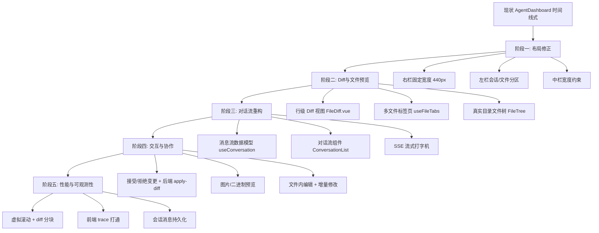

# 前端 Agent 界面演化路径

> 版本：v1.1 | 日期：2026-08-01 | 分析对象：`src/views/AgentDashboard.vue` + `src/components/agent/` + `src/composables/` + `src/stores/` + `src/styles/agent-layout.css`

本文档规划前端 Agent 界面的演化路线：以主流 Agent 产品（MonkeyCode、Cursor、Claude、Continue）为参照，先修正现有三栏排版的失衡问题，再补齐 **diff 对比、文件预览、对话流** 等常见 Agent 界面能力，同时完整保留现有功能。

## 目录

- [1. 现状基线](#1-现状基线)
- [2. 参照基准：主流 Agent 界面](#2-参照基准主流-agent-界面)
- [3. 差距分析](#3-差距分析)
- [4. 演化目标布局](#4-演化目标布局)
- [5. 阶段一：布局修正（首个迭代）](#5-阶段一布局修正首个迭代)
- [6. 阶段二：Diff 与文件预览增强（近 1-2 个迭代）](#6-阶段二diff-与文件预览增强近-1-2-个迭代)
- [7. 阶段三：对话流重构（近 2-3 个迭代）](#7-阶段三对话流重构近-2-3-个迭代)
- [8. 阶段四：交互与协作（中期 3-6 个迭代）](#8-阶段四交互与协作中期-3-6-个迭代)
- [9. 阶段五：性能与可观测性（长期）](#9-阶段五性能与可观测性长期)
- [10. 演化路径总览](#10-演化路径总览)
- [11. 风险与依赖](#11-风险与依赖)

---

## 1. 现状基线

### 1.1 技术栈

| 维度 | 现状 |
|------|------|
| 框架 | Vue 3.4 + Vite 5 + Pinia 2 |
| UI 库 | Element Plus 2.10 |
| 代码高亮 | highlight.js 11（动态按需加载） |
| Markdown | marked + markdown-it |
| 状态 | 9 个 Pinia stores + 13 个 composables |
| 主组件 | AgentDashboard.vue（384 行，组装 6 个 composables） |

### 1.2 现有功能清单

| 区域 | 组件 | 功能 |
|------|------|------|
| 顶部栏 | AgentTopBar (180 行) | 状态指示、成本数据、上传、设置、保存项目、性能面板、学习面板、复杂度分析 |
| 左侧栏 | AgentSidebar (303 行) | 会话历史（新建/切换/删除）、文件分类浏览（前端/后端/测试/配置）、文件搜索、分类折叠 |
| 中间区 | AgentWorkspace (777 行) | 总体进度条、阶段时间线（状态/进度/thinking）、决策面板（等待用户选择）、执行步骤、日志、测试结果、验证结果 |
| 底部输入 | AgentInputBar (213 行) | prompt 输入、模型选择、生成/重新生成/清空/停止 |
| 右侧面板 | AgentFilePanel (162 行) | 单文件预览（highlight.js 高亮）、行数/大小/语言/复杂度徽章、变更/保存版本/历史/复制/下载/删除 |
| Modals | modals/ 6 个 | Diff、版本历史、学习、性能、设置、上传 |

### 1.3 关键短板（实测确认）

| 短板 | 现状 | 问题 |
|------|------|------|
| Diff 对比 | `DiffModal.vue` 26 行，旧/新内容纯文本两栏 | 无行级增删高亮、无统一 diff 视图、无文件内导航 |
| 文件树 | `AgentSidebar` 按固定分类（前端/后端/测试/配置） | 非真实目录层级，无法直观对应项目结构 |
| 文件预览 | 单文件只读，`AgentFilePanel` 每次只看一个文件 | 无多文件标签页、无图片/二进制预览 |
| 对话流 | 中间区是"阶段时间线 + thinking" | 非消息式对话流，用户请求与 AI 回复没有对话链 |
| 流式渲染 | thinking 逐条追加 | 无逐 token 打字机效果、无 markdown 块内代码高亮 |
| 文件编辑 | 纯只读 | 无法直接改文件再请求重生成 |

### 1.4 排版评估（实测确认，`agent-layout.css`）

三栏主结构（顶栏 + 左栏 260px + 中栏 + 右栏）符合主流 Agent 心智，响应式断点（1200/1024/768）齐全。但有 3 个失衡问题：

| 问题 | 位置 | 现状 | 影响 |
|------|------|------|------|
| 右侧面板占比过高 | `agent-layout.css:123-130` | 右栏 `flex: 1` + `max-width: 50%`，与中栏 `.agent-center`（也是 `flex: 1`）同权平分 | 1440px 屏下中栏工作区仅约 590px，右侧纯文件预览却占 590px，主次颠倒 |
| 左栏双职责过挤 | `AgentSidebar` | 260px 内同时放会话历史 + 文件分类树 | 两区互相挤压，长文件名/多会话时阅读困难 |
| 中栏形态 | `agent-center` | 时间线 + thinking + 折叠日志 | 非对话流（此为阶段三目标，非本阶段问题） |

次要项：1024px 以下纵向堆叠时（文件树 30vh + 预览 40vh + 顶栏 + 输入框）垂直空间过紧；右栏无多文件标签页。

---

## 2. 参照基准：主流 Agent 界面

### 2.1 MonkeyCode（本项目直接参照）

MonkeyCode 的核心交互特征：

- **三栏布局**：会话列表（左）+ 对话流（中）+ 文件/上下文（右）
- **对话流**：用户消息与 AI 回复成对排列，AI 回复中直接渲染代码块 + 内联 diff
- **文件变更**：AI 修改文件后以**统一 diff 视图**呈现（行级增删高亮、文件切换、接受/拒绝）
- **上下文面板**：展示当前会话引用的文件、仓库结构

### 2.2 Cursor / Claude / Continue 共性

| 能力 | Cursor | Claude | Continue | 本项目现状 |
|------|--------|--------|----------|-----------|
| 对话流 + Markdown | ✓ | ✓ | ✓ | ✗（时间线） |
| 行级 diff | ✓ | ✓ | ✓ | ✗ |
| 多文件标签页 | ✓ | ✗ | ✓ | ✗ |
| 真实目录文件树 | ✓ | ✓ | ✓ | ✗（固定分类） |
| 图片预览 | ✓ | ✓ | ✓ | ✗ |
| 接受/拒绝变更 | ✓ | ✓ | ✓ | ✗ |
| 流式打字机 | ✓ | ✓ | ✓ | ✗ |

---

## 3. 差距分析

| 差距 | 优先级 | 说明 |
|------|--------|------|
| 三栏比例失衡 | P0 | 右栏 `flex: 1` 与中栏同权，主交互区被压缩（`agent-layout.css:123-130`）；改动最小、见效最快 |
| 左栏双职责 | P1 | 会话历史与文件树同挤 260px，需分区或支持切换 |
| 行级 diff 对比 | P0 | 用户反馈「可以看 diff 对比」的核心诉求；现有 DiffModal 只有两栏纯文本 |
| 对话流 | P0 | Agent 界面的形态基础；从"时间线"演进为"消息流" |
| 多文件标签页 | P1 | 生成多文件时无法在右侧快速切换 |
| 真实目录文件树 | P1 | 对齐项目结构，便于定位 |
| 图片/二进制预览 | P2 | 生成包含图片素材时无法预览 |
| 接受/拒绝变更 | P2 | 用户可控制 AI 修改，对齐 Cursor 心智 |
| 流式打字机 | P2 | 提升生成过程的实时感 |
| 文件内直接编辑 | P3 | 读改写闭环，需后端写接口配合 |

---

## 4. 演化目标布局

```
┌─────────────┬────────────────────────────────┬─────────────┐
│  左栏       │  中间：对话流                    │  右栏       │
│  会话历史   │  ┌──────────────────────────┐   │  文件预览   │
│  ├ 会话1    │  │ 用户: 帮我生成登录系统    │   │  ┌───────┐ │
│  ├ 会话2    │  │ AI: 好的，开始设计架构    │   │  │ 标签栏 │ │
│  └ ...      │  │    ├ 生成文件  │ 查看diff │   │  ├───────┤ │
│             │  │    └── diff 视图 ────────│   │  │ 代码   │ │
│  ────────   │  │ AI: 文件已生成            │   │  │ 预览   │ │
│  文件树     │  └──────────────────────────┘   │  └───────┘ │
│  ├ src/     │                                 │            │
│  ├ app/     │  [输入框: prompt | 模型选择]     │            │
│  └ tests/   │                                 │            │
└─────────────┴────────────────────────────────┴─────────────┘
```

保留现有全部功能，只做**形态演进**：时间线 → 对话流、固定分类 → 目录树、单文件 → 多标签、纯文本 diff → 行级 diff。

---

## 5. 阶段一：布局修正（首个迭代）

**目标**：先修正三栏排版失衡，让主交互区（中栏）回到主导地位。本阶段以 CSS 为主，不新增依赖、不改事件接口，风险最低。

### 5.1 右栏改为固定宽度（P0）

`agent-layout.css:123-130` 调整：

```css
.agent-main > .agent-file-panel {
  flex: 0 0 440px;          /* 固定宽，不再与中栏同权 */
  min-width: 0;
  max-width: 50%;           /* 保留上限，适配窄屏 */
  border-left: 1px solid var(--border-color);
  ...
}
```

- 右栏从 `flex: 1`（与中栏平分）改为固定 440px，中栏 `.agent-center` 自动占满剩余宽度
- 1440px 屏下中栏由约 590px 恢复至约 740px
- 响应式断点同步复核：1200px 时收窄为 360px，1024px 以下维持纵向堆叠不变

### 5.2 左栏分区（P1）

`AgentSidebar` 在 260px 内给会话与文件树明确分区：

- 会话历史区固定高度（如 45%），文件区占余下高度，各自独立滚动（`flex` + `overflow-y: auto`）
- 顶部加分区页签（会话 / 文件），窄屏（<1024px）默认折叠文件区，仅显示会话
- 保留现有会话增删切换、文件分类/搜索全部交互

### 5.3 中栏宽度验证

- 中栏 `< 640px` 时：`AgentWorkspace` 的时间线/决策面板自动收窄内边距，避免换行错乱（`padding: 16px → 12px`）
- 该最小宽度约束为后续对话流重构预留基础

### 5.4 验收标准

- 1440px 屏下中栏宽度 ≥ 720px，右栏固定 440px，主次关系正确
- 左栏会话/文件分区各自滚动，互不挤压
- 1024px 以下纵向堆叠布局不受影响
- 现有全部功能（会话、决策、性能、历史、上传）与 DOM 结构不变
- 回归 `src/styles/agent-layout.css` 依赖的组件：AgentDashboard / AgentSidebar / AgentFilePanel / AgentWorkspace / AgentInputBar 均正常

---

## 6. 阶段二：Diff 与文件预览增强（近 1-2 个迭代）

**目标**：在布局修正基础上，解决用户最直观的痛点——diff 对比和文件预览。

### 6.1 引入行级 Diff（P0）

新增依赖 `diff`（jsdiff）做行级算法，实现统一 Diff 视图组件 `FileDiff.vue`，替换现有 26 行 DiffModal：

```
src/components/agent/
├── FileDiff.vue            # 行级 diff 统一视图（新增）
├── modals/DiffModal.vue    # 改造为包装 FileDiff（保留对外接口）
└── composables/useDiff.js  # diff 计算 + 变更统计（新增）
```

**能力要求**：
- 左右并排 + 统一视图两种模式切换
- 行级增删高亮（`+` 绿 / `-` 红），行号对齐
- 变更统计（+N / -M），文件内"上一个/下一个变更"跳转
- 按文件切换（多文件 diff 场景）
- 保留现有 `@click="showFileDiff"` 等事件接口不变

### 6.2 多文件标签页（P1）

新增 `useFileTabs.js`，在 `AgentFilePanel` 顶部加标签栏：

- 打开文件自动建标签，点击标签切换 `selectedFile`
- 标签关闭按钮、右键菜单（关闭其他/全部）
- 与现有 `files.selectFile` 无缝衔接，`flattenFileTree` 继续复用

### 6.3 真实目录文件树（P1）

改造 `AgentSidebar` 的文件区为目录树（新增 `FileTree.vue`）：

- 由 `generatedFiles` 的路径构建树结构（`useFileTree.js`）
- 文件夹折叠/展开、按目录层级展示
- 保留现有分类筛选（前端/后端/测试/配置）作为**树顶层的筛选视图切换**
- 保留搜索高亮定位

### 6.4 验收标准

- `npm run dev` 后打开 Agent 界面，生成项目后点击「变更」看到行级 diff（+/- 高亮）
- 多文件 diff 可切换，变更跳转可用
- 右键文件面板出现标签栏，多文件可切换
- 侧边栏展示目录树，折叠/展开正常
- 现有全部功能（会话、决策、性能、历史、上传）不受影响

---

## 7. 阶段三：对话流重构（近 2-3 个迭代）

**目标**：把中间区从"阶段时间线"演进为"消息式对话流"，对齐 MonkeyCode 心智。

### 7.1 消息流数据模型（P0）

新增 `useConversation.js`，引入统一消息模型：

```js
// 消息类型
{ id, role: 'user'|'assistant'|'system', content, type: 'text'|'thinking'|'file'|'diff'|'decision'|'log'|'test',
  meta: { agent, model, timestamp, filePath, status } }
```

- 将现有 `thinkingMessages / executionDetails / logs / testResults / decisions` 归一化为一条消息流
- `AgentWorkspace.vue` 从渲染 5 个独立数组改为渲染单一 `messages` 数组，各类型走不同渲染分支
- 保留 `pendingDecisions / decisionAnswers` 与后端提交逻辑不变

### 7.2 对话流组件（P0）

新增 `ConversationList.vue` + `MessageBubble.vue`：

- 用户消息与 AI 回复成对上下排列
- AI 回复内嵌代码块（highlight.js + 复制按钮）+ 内联文件 diff
- 支持 markdown 渲染（现有 marked）
- 流式逐 token 打字机效果（现有 SSE 数据流改造，`useAgentStreaming`）

### 7.3 消息内 diff 嵌入（P1）

- 生成阶段产生的文件变更，在对应 AI 消息内以 `FileDiff` 组件内联呈现
- 点击 diff 内文件可跳转到右侧面板（标签页激活）

### 7.4 验收标准

- 生成过程中，用户请求 → 阶段进展 → 文件变更以对话链形式呈现
- 代码块高亮 + 复制、markdown 正常渲染
- SSE 流式打字机平滑
- 决策、日志、测试结果在消息流中类型化展示，原有交互（提交决策等）可用

---

## 8. 阶段四：交互与协作（中期 3-6 个迭代）

**目标**：补齐主流 Agent 的协作能力。

### 8.1 接受/拒绝变更（P2）

- `FileDiff` 增加「接受」「拒绝」按钮，配合后端新增 `POST /agent/files/apply-diff` 接口
- 接受 → 应用到工作区文件；拒绝 → 回滚该文件变更
- 后端复用现有 `code_patcher.py` / `git_operations.py` 快照能力

### 8.2 图片/二进制预览（P2）

- `AgentFilePanel` 按扩展名分流：`.png/.jpg/.gif/.webp/.svg` 走 `` 预览，其他二进制显示文件信息
- 图片 URL 来源：现有 `uploads/` 或生成文件的静态路径

### 8.3 文件内直接编辑（P3）

- 预览区切"编辑模式"，保存调用现有后端文件写接口
- 与「重新生成」联动：编辑后的文件作为增量修改输入（对接 `incremental_modify`）

### 8.4 命令面板 / 快捷键（P3）

- `Ctrl+K` 命令面板：新建会话、切换文件、打开 diff、性能面板等（复用现有 `useKeyboardShortcuts`）

---

## 9. 阶段五：性能与可观测性（长期）

- **大文件虚拟滚动**：`AgentFilePanel` 千行以上文件虚拟滚动（`useVirtualList`），避免 DOM 卡顿
- **diff 大文件分块**：超过阈值文件只渲染变更片段
- **前端追踪**：与后端 `tracing.py` 打通，时间线消息关联 trace_id，端到端可观测
- **会话消息持久化**：对话流消息入库，跨刷新恢复完整上下文

---

## 10. 演化路径总览



## 11. 风险与依赖

| 风险 | 应对 |
|------|------|
| 右栏改固定宽度影响窄屏 | 保留 `max-width: 50%` + 响应式断点（1200px 收窄至 360px），1024px 以下纵向堆叠不变 |
| 左栏分区挤压现有会话/文件交互 | 分区只改布局不改事件，会话增删切换、文件分类搜索交互原样保留 |
| 对话流重构影响现有 5 类数据展示 | 消息流模型做**兼容映射层**，`thinking/execution/logs/test/decisions` 各映射为一种消息类型，逐个迁移验证 |
| 新增 jsdiff 依赖体积 | 按需引入，仅 FileDiff 组件使用，打包 tree-shaking |
| 接受/拒绝变更需后端配合 | 后端接口独立增量上线，前端先隐藏按钮（feature flag），后端就绪后开启 |
| 现有 409 个 E2E 用例可能受影响 | 会话/决策/性能/历史等交互保持 DOM 结构和事件名不变，新增用例覆盖布局/diff/标签/树 |
| 参考演进范例 | 沿用 AgentDashboard.vue 5029→572 行的经验：先抽 composables/组件 → 再改模板 → 最后接线 |
