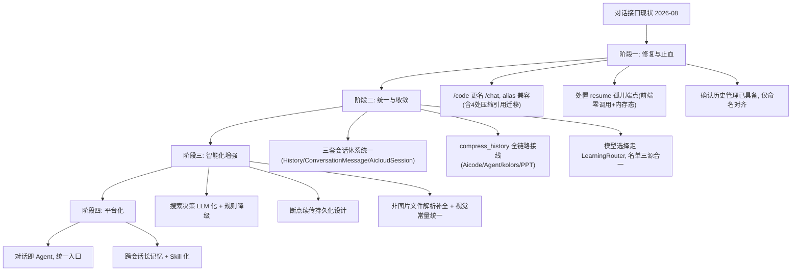

# 对话接口（Chat）功能未来演化路径

> 版本：v5.0 | 日期：2026-08-04 | 分析对象：`app/api/v1/Aicode.py`（938 行，通用问答）+ `app/schema/codeRequest.py`（172 行）+ `app/api/v1/auth.py`（550 行，历史端点）+ `app/api/v1/aicloud.py`（942 行，AI Cloud 沙箱）+ `app/api/v1/ai_agent/orchestrate_endpoints.py`（1582 行，Agent 编排）+ `app/agent/conversation_store.py`（317 行）+ `app/utils/aicloud/llm_caller.py`（438 行）+ `src/components/index.vue`（1251 行）+ `src/components/Aicloud.vue`（1327 行）+ `src/components/leftlist.vue`（2557 行）
>
> **2026-08-04 确认状态**：本节所列问题均经逐行读源码实测核实——`compress_history`（LLM 摘要）全库零调用（`rg "compress_history"` 仅命中定义行）；Agent 编排侧实际用 `truncate_history` 纯截断（`orchestrate_endpoints.py:301`）；resume 端点前端零调用（`rg "resume" src/` 无 `/code/resume` 命中）；`compress_conversation_history` 被 kolors_api 3 处 + aiGeneratorPptx 1 处复用（均 `max_messages=5`）；前端代码混淆（minified），此前将变量名 `n` 误判为路由前缀 `/api/v1/n/` 为误报，真实路径全部为 `/aicloud/*`、`/agent/*`、`/code`。

本文档基于当前对话接口代码分析，规划从现状到长期目标的演化路线。演化遵循与既有文档一致的原则：**先修正确性（契约/孤儿端点）、再拆分统一（会话/压缩/路由收敛）、后智能增强（搜索/断点/多模态）、终平台化（对话即 Agent）**。

## 1. 现状基线

### 1.1 核心架构

```
src/components/index.vue (1251行, 主对话)
    │  is_project_generator 分流 (index.vue:441)
    ├── false ─► POST /api/v1/code ──► Aicode.py (938行, 通用问答)
    │              │                    ├─ compress_conversation_history(纯截断100/150字)
    │              │                    ├─ select_model_for_prompt(硬编码4模型)
    │              │                    ├─ ai_decide_search(关键词规则)
    │              │                    └─ _partial_response_cache(内存, resume孤儿)
    │              ├── auth.py 历史端点: /history /conversation/history /conversations
    │              └── call_llm 统一调用层 (4级路由 + 429重试 + 信号量)
    │
    ├── true  ──► POST /agent/orchestrate/stream ──► orchestrate_endpoints.py (Agent编排)
    │              └── conversation_store (Redis + ConversationMessage, truncate_history)
    │
    └── Aicloud.vue (1327行, 管理员弹窗) ──► POST /aicloud/chat/stream ──► aicloud.py (942行, 沙箱)
                    └── AicloudSession/AicloudMessage + 沙箱执行 + 知识库RAG
```

| 维度 | 现状 |
|------|------|
| 主对话入口 | `index.vue` 路由 `/`，`is_project_generator` 分流：false→`/code`（conversation_id），true→`/agent/orchestrate/stream`（session_id） |
| 核心 API | `Aicode.py` 单文件 938 行 4 端点（`POST /code`、`DELETE /code/history`、`POST /code/resume`、`GET /code/resume/{id}`） |
| 历史管理 | `auth.py` 已具备：`POST /history`（分页+关键词，ttl=60）、`POST /conversation/history`（会话详情）、`GET /conversations`（会话列表，ttl=120） |
| 会话体系 | **三套并存**：History 表+conversation_id（Aicode）/ ConversationMessage+Redis+session_id（Agent）/ AicloudSession+session_id（AI Cloud） |
| 压缩 | `compress_conversation_history` 纯截断（prompt[:100]+response[:150]，字符非 token）；LLM 摘要 `compress_history` 已实现零调用 |
| 模型选择 | `select_model_for_prompt` 硬编码 4 模型；`dynamic_model_router` 仅 Agent 编排使用，Aicode 不引用 |
| 搜索 | `ai_decide_search` 关键词规则（search_triggers 优先、no_search 次之、默认不搜）；FreeWebSearch Bing+DuckDuckGo |
| 断点续传 | `_partial_response_cache` 内存 dict（TTL 300s）；resume 端点前端零调用（孤儿） |
| 认证 | `verify_token` + `api_key_token`（用户自定义 Key，Redis 存储） |

### 1.2 实测确认的问题（2026-08-04）

| # | 问题 | 位置 | 影响 |
|---|------|------|------|
| P0 | **端点 `/code` 名不副实**：docstring 自述「代码生成 API - 纯问答（不创建文件）」，前端 chat.js 已用 chat 命名，但路由仍是 `/code`、文件 `Aicode.py`、schema `CodeRequest` | Aicode.py:2/709、main.py:60/305 | 命名与语义分裂 |
| P0 | **三套会话体系并存**：History（conversation_id int）/ ConversationMessage+Redis（session_id str）/ AicloudSession（session_id str），前端 `temp_` 前缀临时 ID 与数字真实 ID 混存 | add_history.py:10、conversation_store.py:143、aicloud.py:85-95、index.vue:393-404 | 同用户跨入口会话无法续接，ID 语义混乱 |
| P0 | **resume 断点续传是孤儿端点**：`POST /code/resume`、`GET /code/resume/{id}` 前端零调用；`_partial_response_cache` 是进程内存态（重启即丢） | Aicode.py:46-65/854/917 | 死代码 + 内存泄漏风险 |
| P1 | **`compress_history`（LLM 摘要）零调用**：Agent 侧实际用 `truncate_history` 纯截断；Aicode 侧 `compress_conversation_history` 也是纯截断 | conversation_store.py:247、orchestrate_endpoints.py:301 | 长对话上下文质量差，已写好能力未接线 |
| P1 | **`compress_conversation_history` 跨模块共享但语义脆弱**：被 kolors_api 3 处 + aiGeneratorPptx 1 处复用（`max_messages=5`），用字符截断而非 token，与 `_estimate_tokens`（len//2）口径不一致 | kolors_api.py:40/366/533/725、app/api/v1/aiGeneratorPptx.py:386/833、conversation_store.py:32 | 压缩函数改动影响图片/PPT 链路；口径混乱 |
| P1 | **模型选择未走统一路由**：`select_model_for_prompt` 硬编码 4 模型，不引用 `dynamic_model_router`；`CodeRequest` 无 model validator（仅 GenerateRequest/AgentConfig 有） | Aicode.py:204、codeRequest.py:27 | 对话侧不参与动态路由；任意模型名可传 |
| P1 | **模型名单三处并存**：codeRequest.py 8 个 / agent_model_config.json 15 个（全 siliconflow）/ dynamic_model_router fallback 4 个（+ 配置 fallback_chain）；`dynamic_model_router` 被 Agent 编排 + 模型管理/健康检查/负载侧引用，**Aicode 不引用** | codeRequest.py:7、agent_model_config.json、dynamic_model_router.py:23 | 名单来源分裂，改一处不同步；对话侧完全游离于统一路由之外 |
| P2 | **搜索方法命名与实现不符**：`_search_baidu`（app/utils/web_search.py:125）实际调用 bing.com；Aicode 用 `search_and_format`（纯 snippet，:394）未用已实现的 `search_and_format_with_summaries`（LLM 摘要，:375） | web_search.py:125/375 | 命名误导 + 摘要能力未接线 |
| P2 | **非图片文件不解析**：`get_or_parse_file` 对非图片仅返回 `[文件：xxx]` 占位 | Aicode.py:359-367 | 文本/Office/PDF 内容不进上下文 |
| P2 | **视觉常量与降级链矛盾**：vision.py:21 三个常量全为 DeepSeek-OCR，但 `VISION_MODEL_FALLBACK` 首选 GLM-4.1V（analyze_image 实际走 fallback，默认参数不生效） | vision.py:21/72 | 常量误导 |
| P3 | **前端代码混淆**：变量名 minified，`/api/v1/n/` 为误判（真实为 `/aicloud/*`） | src/utils/api/*.js | 排查历史遗留，不影响当前 |

### 1.3 会话体系细节（三套对照）

| 体系 | 存储 | 会话 ID | 写入点 | 前端入口 | 生命周期 |
|------|------|---------|--------|---------|---------|
| Aicode 通用问答 | `History` 表（history 表） | `conversation_id` int（advisory lock + max+1） | add_history.py:10 | index.vue:503（is_project_generator=false） | 永久 |
| Agent 项目编排 | `ConversationMessage` 表 + Redis | `session_id` str（前端 `project_{ts}` / `n{ts}`，后端默认 `n{user}_{ts}` / 续传 `modify_{user}_{ts}`，格式混乱） | conversation_store.py:143-165 | index.vue:460 + ProjectGenerator | Redis 24h 过期，DB 永久 |
| AI Cloud 沙箱 | `AicloudSession`/`AicloudMessage` 表 | `session_id` str（uuid4） | aicloud.py:85-95/203/237/317（chat 与 chat/stream 双端点） | Aicloud.vue:561（/aicloud/chat/stream） | 10 天记忆 |

### 1.4 依赖复用（compress_conversation_history 4 处外部引用）

```
app/api/v1/kolors_api.py:40  import
  ├── :366 文生图 (max_messages=5)
  ├── :533 图生图 (max_messages=5)
  └── :725 inpaint (max_messages=5)
app/api/v1/aiGeneratorPptx.py:386  import
  └── :833 PPT 生成 (max_messages=5)
```

任何对压缩函数签名/语义的改动必须同步上述调用方，否则图片生成与 PPT 链路历史上下文失效。

## 2. 演化目标

```
【近期】修复止血：/code→/chat 更名对齐、孤儿 resume 端点处置、历史管理确认已具备（无需补建）
  ↓
【中期】统一收敛：三套会话体系统一、compress_history 全链路接线、模型选择走统一路由
  ↓
【长期】智能增强：搜索决策 LLM 化、断点续传持久化、多模态/文件解析收敛
  ↓
【终期】平台化：对话即 Agent，/chat 成为统一入口
```

每个阶段保证 `/api/v1/code` 全量端点兼容（alias 过渡），前端 `index.vue`/`chat.js` 无回归，图片/PPT 历史上下文不受影响。

## 3. 阶段一：修复与止血（近 1-2 个迭代）

**目标**：先让命名与语义一致，消除孤儿代码，明确已具备能力（历史管理）。

### 3.1 更名对齐：`/code` → `/chat`（P0）

- 新增 `/api/v1/chat` 路由（tag=`chat`），承载 `generate_code`、`code/history`、`code/resume`；`/api/v1/code` 保留 alias 兼容
- 文件更名：`Aicode.py` → `chat.py`（或薄转发层）；`CodeRequest` → `ChatRequest`；`codeRouter` → `chatRouter`（main.py:60/305）
- 前端切换：index.vue:503 → `/chat`；chat.js:41 `deleteChatHistory` → `/chat/history`
- **关键约束**：`compress_conversation_history` 的 4 处外部引用（app/api/v1/kolors_api.py:40、app/api/v1/aiGeneratorPptx.py:386）必须同步迁移或保留兼容导入（薄转发 `Aicode` 模块）
- **关联 F 组（注释与文档一致性）**：同步统一 docstring 与命名——docstring 自称「代码生成 API」（Aicode.py:2）但能力是纯问答，随更名改为「通用问答 Chat API」

### 3.2 处置 resume 孤儿端点（P0/P1）

- 现状：`POST /code/resume`、`GET /code/resume/{id}` 前端零调用，`_partial_response_cache` 内存态 TTL 300s
- 处置：先全库/前端确认无外部调用方后，**标记废弃或移除**；前端页面刷新恢复已由 streamManager + sessionStorage 承担（streamManager.js:40-43 恢复请求队列 restoreRequestQueue:293、sessionStorage 保存:114/284），不依赖 resume
- 若未来需要真正的断点续传，见阶段三 5.2（持久化设计），不保留现状孤儿

### 3.3 明确已具备能力：历史管理（P1，确认性）

- **历史管理端点早已存在**（auth.py:288 `/history`、:328 `/conversation/history`、:478 `/conversations`），前端 leftlist.vue:556/690、chat.js:10/23 已调用——**无需补建**
- 本阶段仅做命名对齐：`/code/history` 随 `/chat` 更名；历史查询的缓存（ttl=60/120）与失效联动（add_history.py:57-61）保持

### 3.4 验收标准

- `/api/v1/chat/*` 全量可用，`/api/v1/code/*` alias 兼容，前端无 code 命名残留
- 图片生成（文生图/图生图/inpaint）与 PPT 生成的历史上下文不受更名影响（4 处复用回归通过）
- resume 孤儿端点已移除或明确标记废弃，`_partial_response_cache` 不再膨胀
- 历史列表/详情/删除三端点行为不变

## 4. 阶段二：统一与收敛（近 2-4 个迭代）

**目标**：消除三套会话、两套压缩、两套模型选型的并立。

### 4.1 会话契约收敛：三套体系统一（P1）

- 现状：History（conversation_id）/ ConversationMessage+Redis（session_id）/ AicloudSession（session_id）
- 抽象「会话存储接口」（get/append/clear/compress），三套实现收敛为统一读写入口；**不动存量表结构**，双写桥接过渡
- 会话 ID 对齐：conversation_id 与 session_id 桥接映射，前端 index.vue 只维护一种 ID，`temp_` 临时 ID 逻辑消除（index.vue:393-414/463）
- AI Cloud（管理员沙箱工具）会话与主对话可互查：/chat 历史可检索 /aicloud 会话（或保持隔离但接口统一）
- 验收：对话模式与 Agent 模式共用会话历史，切换不丢上下文；前端单一会话 ID

### 4.2 语义压缩全链路接线（P1）

- `compress_conversation_history`（Aicode.py:231）与 Agent 侧 `truncate_history`（orchestrate_endpoints.py:301）统一为共享 `ContextCompressor`
- **接线 `compress_history`**（conversation_store.py:247，LLM 摘要）：Aicode 侧（_build_context:446）+ Agent 侧（orchestrate_endpoints.py:301）+ kolors 3 处 + PPT 1 处，全部走语义压缩，保留 `max_messages` 参数语义与 truncate 降级链（conversation_store.py:303）
- 统一 token 口径：字符截断 → `_estimate_tokens`（len//2）估算，与 AGENT-CONTEXT-COMPRESSION.md 对齐
- 验收：长对话走 LLM 摘要；图片/PPT 历史上下文正常；Agent 编排历史摘要生效；未超限不压缩、LLM 失败回退截断

### 4.3 模型选择走统一路由（P1）

- `select_model_for_prompt`（Aicode.py:204）改为复用 `dynamic_model_router` 选型能力：保留「关键词→候选任务类型」映射（文件→视觉 / 推理→R1 / 分析→GLM-Z1 / 默认→Qwen3），决策交 `LearningRouter.select_model`（dynamic_model_router.py:332，基于成功率/延迟/健康分数）
- 候选模型从 agent_model_config.json 读取；`CodeRequest` 增加可选 model validator（对齐 GenerateRequest:86）
- 模型名单三源合一：codeRequest.py:8 / agent_model_config.json:15 / dynamic_model_router fallback 收敛为配置单一来源
- 验收：对话侧无硬编码模型名，选型随路由健康度动态变化；显式传模型名不受影响

### 4.4 验收标准

- 三套会话读写收敛为统一接口，存量数据不迁移、双写桥接稳定
- 4 类压缩调用方（Aicode/Agent/kolors/PPT）全走语义压缩，降级链生效
- 对话模型选型走 LearningRouter，模型名单单一来源
- 前端无回归，历史互通查询可用

## 5. 阶段三：智能化增强（中期 4-8 个迭代）

**目标**：从「规则决策」升级为「智能决策」，补齐多模态与持久化。

### 5.1 搜索决策 LLM 化（P2）

- `ai_decide_search`（Aicode.py:109）从关键词规则升级为 LLM 决策（或与 Agent 动态工具选择统一）；关键词规则作降级兜底
- 顺手修正：`_search_baidu` 命名与实现不符（app/utils/web_search.py:125，实际调 bing.com）；可选升级 `search_and_format` → `search_and_format_with_summaries`（LLM 摘要，web_search.py:375 已实现）
- 验收：时效性/知识类问题判断准确率提升；搜索失败降级链不变；LLM 决策可按权限开关

### 5.2 断点续传持久化设计（P2）

- 承接阶段一 3.2 的现状：resume 为孤儿且内存态
- 若启用断点续传：partial_response 持久化到会话服务（Redis/DB，承接 4.1 会话契约），跨进程可用；前端再决定是否调用
- 验收：断点续传跨进程可用（非内存态），与前端 streamManager 恢复机制协同而非重复

### 5.3 多模态与文件解析收敛（P2）

- 非图片文件解析补全：`get_or_parse_file`（Aicode.py:285/359-367）对非图片仅返回 `[文件：xxx]` 占位 → 补文本/Office/PDF 解析（复用统一解析层，关联 H3 文件上传）
- 图片理解已走 vision.analyze_image（fallback 链正确），顺手统一 vision.py:21 常量与降级链矛盾（VISION_MODEL 常量实际不生效）
- 验收：文本/图片/文档统一解析入口，无重复实现

### 5.4 验收标准

- 搜索决策智能判断 + 规则降级生效，摘要方案可切换
- 断点续传持久化可用（若启用）
- 文本/Office/PDF 内容可进上下文，图片解析与视觉链路统一

## 6. 阶段四：平台化（长期）

**目标**：对话接口成为平台统一入口。

### 6.1 对话即 Agent（P3）

- `/chat` 可路由至 OrchestratorAgent（承接 AGENT-ENGINE.md），对话界面成为 Agent 产物/项目生成入口（替代 `is_project_generator` 分流，index.vue:441）
- 工具调用渲染：对话流展示 Agent 步骤（文件 diff、验证结果），对齐 AGENT-FRONTEND.md B3 对话流
- 验收：对话界面驱动 Agent 生成，工具调用可视化，无独立分流

### 6.2 会话记忆与 Skill 化（P3）

- 会话历史进入跨会话长记忆（承接 AGENT-ENGINE.md 6.4），对话/Agent/AI Cloud 会话互通检索
- 提示词模板已走 skill_registry（chat_reasoning/chat_code/chat_general，Aicode.py:496/500/504）保持；后续统一 Skill 注册（关联 auto-use-skills）
- 验收：跨会话记忆生效，对话模板与 Agent Skill 统一注册

### 6.3 验收标准

- 对话界面可作为 Agent 入口，工具调用可视化
- 三套会话历史统一检索，长记忆生效

## 7. 演化路径总览



## 8. 风险与依赖

| 风险 | 应对 |
|------|------|
| 更名破坏既有客户端 | `/code` 保留 alias 过渡，前端切换后观察再移除 |
| 压缩函数 4 处复用被改造波及 | 阶段一保留兼容导入（薄转发），阶段二再迁移调用方，回归图片/PPT 历史 |
| 三套会话收敛动数据 | 抽象接口 + 双写桥接，不迁移存量表；ID 对齐渐进 |
| Agent 侧接线 compress_history 改变行为 | 未超限不压缩；摘要放会话边界；A/B 灰度 |
| 模型路由改变对话行为 | 先对 `/chat` 生效、`/code` 旧逻辑保留灰度 |
| 搜索升级依赖 LLM 成本 | 规则降级路径，LLM 决策按权限开关 |
| 断点续传设计重做历史 | 确认外部调用方后再动；统一设计后迁移 |
| 与 AGENT-ENGINE / AGENT-FRONTEND / H 组重叠 | 阶段四以工具注册渐进接入；H3 文件解析复用统一层，不重复实现 |
