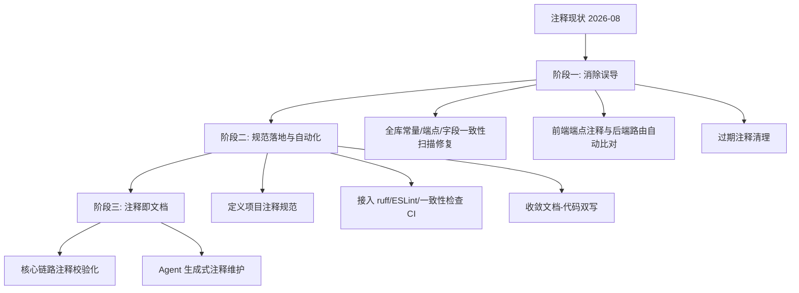

# 项目注释规范化未来演化路径

> 版本：v1.0 | 日期：2026-08-02 | 范围：全库 362 个 py 文件约 109,600 行（注释约 9,558 行，注释率 ≈ 8.7%），含 `app/` 后端、`src/` 前端 Vue/JS、`docs/` 文档

本文档规划项目注释从「现状无序」到「规范统一」的演化路线。与功能演化不同，注释治理不改变运行时行为，但**易错点在于：注释若与实际代码不一致，比没有注释更有害**。因此阶段划分围绕「消除误导 → 建立规范 → 自动化守护」展开。

## 1. 现状基线

### 1.1 已确认的注释与实际不一致案例（2026-08-02 实测）

| # | 位置 | 注释声称 | 实际情况 | 状态 |
|---|------|---------|---------|------|
| C1 | `app/api/v1/ai_agent/orchestrate_endpoints.py:300` | 「保留最近 5 轮」 | `MAX_HISTORY_ROUNDS = 10`（`conversation_store.py:27`），实际保留 10 轮 | ✅ 已修正（2026-08-02） |
| C2 | `src/utils/api/ppt.js:4-17` | 注释列出 13 个端点，未含 `generate-text`、`generate-from-text`、`generate_from_file`、`templates/upload`、`templates/custom`、`download/{ppt_id}/pdf` | 后端实际 20 个路由（`aiGeneratorPptx.py:790-2029`） | ⚠️ 不完整 |
| C3 | `src/utils/api/ppt.js:26` 传 `template_id` | 注释「POST /pptx/generate_task - 异步任务生成」 | 后端 schema 用 `template`，字段静默丢弃 | ⚠️ 关联 PPT-FEATURE.md P0 |
| C4 | `app/agent/conversation_store.py:32-37` | 注释「中文约 1.5 字/token，英文约 4 字符/token」 | 实际实现 `len(text) // 2`（不分中英文） | ⚠️ 注释与实现不符 |
| C5 | `app/core/config.py:100` | 「默认 2 = 允许 2 个并发会话」 | 需核实环境变量读取路径是否一致 | 🔍 待核 |

### 1.2 注释类型分布与主要问题

| 类型 | 占比特征 | 主要问题 |
|------|---------|---------|
| 函数/类 docstring | 大量 Python 三引号注释 | 参数/返回描述与签名不一致；部分模块缺 docstring |
| 行内解释（`# 为什么`） | 常见 | 过期注释（描述已删除逻辑）；与常量值不一致（C1/C4） |
| 端点清单（前端） | `ppt.js` 等 | 人工维护端点列表，新增端点未同步（C2） |
| 中英混排 | 全库 | 同一文件中文为主，偶有英文残留；与 mermaid 规则冲突面小 |
| 测试文件注释 | `app/test/12.py` 等 | 大段注释冗余，与实际断言脱节 |

### 1.3 结构性原因

- **无注释规范约束**：项目无 `AGENTS.md`/`.editorconfig` 注释章节，无 lint 规则（`# noqa`、docstring 必填等）
- **注释与代码不同步机制缺失**：常量值、端点清单、字段名全靠人工同步（C1-C4 均是此类）
- **文档-代码双写**：端点/字段在注释与 `docs/` 中重复维护，是误导源（C2/C3）
- **历史遗留**：`app/test/` 与 `app/api/v1/` 含测试快照与复制脚本，注释冗余

## 2. 演化目标

```
【近期】消除误导：修复已确认不一致，建立「注释不允许与常量/端点/字段矛盾」基线
  ↓
【中期】规范落地：定义项目注释规范，接入 lint 自动化，收敛文档-代码双写
  ↓
【长期】注释即文档：关键路径注释可校验，生成式注释维护
```

## 3. 阶段一：消除误导性注释（近 1-2 个迭代）

**目标**：先消灭「注释与代码矛盾」这一类最高危害问题。

### 3.1 全库一致性扫描与修复（P1）

- 对常量值注释做脚本化核对：提取 `# 注释数字` 与相邻常量/字面量比对（C1/C4 模式），建立**不一致清单**
- 修复清单内全部不一致，优先 API/核心链路（`agent_core`、`conversation_store`、`aiGeneratorPptx`、`orchestrate_endpoints`）
- 前端端点注释与后端路由自动比对（C2 模式）：以后端 `@router.*` 为准生成端点清单，替换前端手写列表

### 3.2 字段名一致性治理（P1，关联 PPT-FEATURE P0）

- `ppt.js:26` 的 `template_id` 与后端 `template` 失配：随 PPT-FEATURE 阶段一 P0 一并修复，注释与 schema 同步
- 前端请求体字段与后端 pydantic 字段做**契约核对**，产出不一致清单

### 3.3 过期注释清理（P2）

- 定位描述已删除/重命名逻辑的注释（`git log` 交叉验证），删除或更新
- `app/test/` 快照文件若为复制产物，移出主注释扫描范围（不删除文件，仅排除治理）

### 3.4 验收标准

- C1-C4 已确认案例全部闭环（C1 已闭环）
- 全库无「注释数字/字段名/端点与代码矛盾」的已知实例
- 前端端点注释与后端路由自动比对工具可用，偏差为 0

## 4. 阶段二：规范落地与自动化（近 2-4 个迭代）

**目标**：让规范可执行，不再依赖人工自觉。

### 4.1 定义项目注释规范（P1）

- 写入 `.monkeycode/docs/`：注释语言统一简体中文；行内注释用于「为什么」而非「做什么」；docstring 含参数/返回/异常；常量旁注释允许但须与值一致
- 规范对齐既有 `shell-comment-style`、`mermaid-label-format` 等工程规则

### 4.2 接入 lint 自动化（P1）

- Python 侧：`ruff`/`pydocstyle`（D 规则子集）检查 docstring 缺失与参数不一致；配置进 `AGENTS.md` 要求 `ruff check` 通过
- 前端侧：`eslint` 注释规则 + 端点清单生成脚本（3.1 产物）接入 CI
- 新增**常量-注释一致性检查**（自定义脚本或现有 lint 插件）：解析 `# 数字` 与字面量比对，CI 拦截

### 4.3 收敛文档-代码双写（P2）

- 端点/字段清单以代码为准（`@router`/pydantic 生成 OpenAPI），注释与 `docs/` 引用生成物而非手写
- 减少「注释与文档重复描述同一逻辑」的双维护面

### 4.4 验收标准

- `ruff`（docstring 规则）+ `eslint` + 常量一致性检查全绿
- 新代码提交时注释不一致被 CI 拦截
- 端点清单不再人工维护

## 5. 阶段三：注释即文档（中期 4-8 个迭代）

**目标**：核心链路注释成为可校验、可检索的文档。

### 5.1 关键路径注释校验化（P2）

- 对 `agent_core.generate_project`、`conversation_store` 压缩链、PPT 渲染链等核心链路，docstring 标注前置/后置条件，由代码检查工具校验
- 工具调用/消息结构注释与实际 JSON 结构绑定（`_compress_context` 摘要消息结构、tool_calls 解析）

### 5.2 生成式注释维护（P3）

- 利用 Agent 能力：运行定期扫描任务，对 docstring 缺失或签名不符的函数自动生成/修正，产出 diff 供人工审
- 对齐 `user-teaching-memory` 与 `project-wiki`，注释维护进入常态工作流

### 5.3 验收标准

- 核心链路注释覆盖率 ≥ 90%，签名与描述校验通过
- 注释维护任务定期执行，历史欠账逐步清零

## 6. 演化路径总览



## 7. 风险与依赖

| 风险 | 应对 |
|------|------|
| 大规模改注释引入冲突 | 阶段一只改「已确认不一致」清单，不动风格；运行行为零变更 |
| lint 规则过严阻塞开发 | 先启用 docstring 缺失与参数一致性子集，风格类降级 warning |
| 常量一致性检查误报 | 解析器限定 `# 数字/符号` 模式，扫描结果人工复核后入基线 |
| 与既有演化文档重叠 | 字段失配修复依赖 PPT-FEATURE 阶段一；压缩注释（C4）依赖 AGENT-CONTEXT-COMPRESSION 阶段一 |
| 历史测试快照污染统计 | 治理范围排除 `app/test/` 复制产物，仅纳入代码注释 |
| 后续新增功能引入新不一致 | 阶段二 CI 拦截兜底，规范写入 AGENTS.md 供后续 Agent 遵守 |
