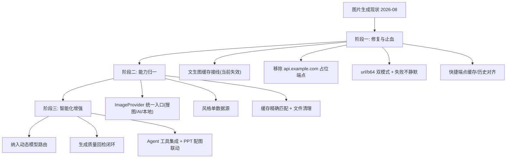

# 图片生成功能未来演化路径

> 版本：v1.0 | 日期：2026-08-02 | 分析对象：`app/utils/image_generation.py`（483 行，Kolors 工具）+ `app/api/v1/kolors_api.py`（875 行，8 端点）+ `app/api/v1/kolors_history.py`（历史）+ `app/utils/pptx/image_upgrader.py`（AI 配图）+ `app/utils/visual/image_manager.py`（PPT 配图）+ `src/views/ImageGenerate.vue`（920 行）+ `src/components/ImageGenerator.vue`（1701 行）+ `app/utils/vision.py`/`app/api/v1/vision_api.py`（图像理解，相关域）
>
> **2026-08-02 确认状态**：本节问题均经代码引用实测核实——`text_to_image_api` 全程零次 `get_cached_image`（图生图/inpaint 有），缓存失效成立；`image_upgrader.AdvancedImageGenerator` 默认端点 `api.example.com` 且全库无生产调用，占位端点成立；`response_format="url"` 硬编码 3 处；`/avatar`、`/landscape`、`/icon` 三端点零缓存零历史；缓存命中分支返回 `images: []`。

本文档基于当前图片生成功能代码分析，规划演化路线。原则与既有演化文档一致：**先修正确性（缓存失效、占位端点），再统一能力（AI 生成/搜图/本地绘制归一），后智能增强（与 PPT/Agent 集成）**。

## 1. 现状基线

### 1.1 核心架构

```
ImageGenerator.vue ──► /api/v1/kolors/* ──► kolors_api.py (875行, 8端点)
    │                        │
    │                        ├── image_generation.py (483行, Kolors 文生图/图生图/修复)
    │                        ├── kolors_history.py (历史记录 CRUD)
    │                        └── vision_api.py (图像理解/OCR/安全, 相关域)
    └── PPT 配图侧: image_manager.py(搜图/占位/PIL图标) + image_upgrader.py(AI升级, 未接线)
```

| 维度 | 现状 |
|------|------|
| 模型 | `Kwai-Kolors/Kolors`，固定 `https://api.siliconflow.cn/v1`（`image_generation.py:26-27`） |
| 能力 | 文生图、图生图、局部重绘(inpaint)、快捷头像/风景/图标、风格系统（10 内置 + 自定义）、历史 CRUD |
| 端点 | `/kolors/text-to-image`、`/image-to-image`、`/inpaint`、`/avatar`、`/landscape`、`/icon`、`/config`、`/styles` + `/kolors/history*` |
| 认证/鉴权 | `verify_token`（`kolors_api.py:343`） |
| 缓存 | `get_cached_image` 按 prompt+seed 查 `History.metadata_json`，24h 有效（`kolors_api.py:62-109`） |
| 并发/连接池 | `asyncio.Semaphore(4)` 并发限制 + httpx 连接池复用（`image_generation.py:46-65`） |
| 重试 | `_call_kolors_api` 3 次重试（`image_generation.py:371-431`） |
| 前端 | `ImageGenerate.vue` 920 行 + `ImageGenerator.vue` 1701 行（生成/历史/风格一体） |

### 1.2 实测确认的问题（2026-08-02）

| # | 问题 | 位置 | 影响 |
|---|------|------|------|
| P0 | **文生图缓存未生效**：`text_to_image_api` docstring 声称「检查缓存」但代码从未调用 `get_cached_image`；只有 `image_to_image`（`kolors_api.py:512`）和 `inpaint`（`:709`）真正检查 | `kolors_api.py:341-420` | 相同 prompt 重复扣费生成，缓存形同虚设 |
| P0 | **PPT AI 配图是占位端点**：`AdvancedImageGenerator` 默认 `_api_endpoint = "https://api.example.com/v1/generate"`（假地址），未接线 Kolors；且整个 `image_upgrader` 无生产调用（关联 PPT-FEATURE.md） | `image_upgrader.py:1041-1073` | PPT 的「AI 配图」能力是死代码 |
| P1 | **响应格式硬编码 `response_format="url"`**，但 `_save_images_from_response` 支持 b64_json/url 双格式 | `image_generation.py:217,290,359` | 需先返回 url 再下载，浪费一次网络请求 |
| P1 | **失败静默吞错**：`_save_images_from_response` 对 url 下载失败仅记录异常继续（`:120-122`），无回退 b64/重试 | `image_generation.py:119-127` | 偶发图片缺失且无提示 |
| P2 | **快捷端点无缓存**：`/avatar`、`/landscape`、`/icon`（`kolors_api.py:775-838`）直接调生成，不查缓存不写历史 | `kolors_api.py:775-838` | 与主端点行为不一致 |
| P2 | **`get_cached_image` 用 `metadata_json.contains(cache_key)` 字符串模糊匹配**，命中可能误判；且缓存只在 DB，无文件级清理 | `kolors_api.py:86` | 缓存命中准确性差 |
| P2 | **图片模型不在动态模型路由**：`dynamic_model_router.py:880` 仅注释提及 Kolors，未纳入路由/成本统计 | `dynamic_model_router.py:880` | 图片生成不参与统一路由 |
| P3 | **`image_to_image` 返回 `paths` 为空时前端异常**：缓存命中分支返回 `paths: [cached_path]` 但 `images: []`，前端 `downloadPPT` 依赖 blob | `kolors_api.py:517-522` | 缓存命中路径数据形态与正常不同 |
| P3 | **头像/风景/图标风格为硬编码 dict**（`image_generation.py:433-483`），与 `/styles` 返回的 10 内置风格脱节 | `image_generation.py:433-483` | 两套风格定义并存 |

### 1.3 与 PPT 配图的交叉点

- `image_manager.py`（PPT 主配图）：搜图（Bing→Unsplash→Pexels）+ 占位符 + PIL 图标（`generate_icon` 用 emoji/形状，非 AI），**已接线**于 `aiGeneratorPptx.py`
- `image_upgrader.py`：AI 生成增强（带风格/批量/变体），**未接线** + 占位端点
- 图片生成侧与 PPT 配图侧完全解耦：PPT 不会调用 `text_to_image`

## 2. 演化目标

```
【近期】修复止血：文生图缓存生效、占位端点移除、url/b64 双模式
  ↓
【中期】能力归一：AI 生成/搜图/本地绘制统一为 ImageManager、风格统一
  ↓
【长期】智能增强：与 PPT 配图联动、纳入 Agent 工具路由、多模型扩展
```

每个阶段保证 `/api/v1/kolors/*` 全量端点兼容，前端 `ImageGenerator.vue` 无回归。

## 3. 阶段一：修复与止血（近 1-2 个迭代）

**目标**：先让「重复生成不重复扣费」「PPT AI 配图不再指向假地址」。

### 3.1 文生图缓存接线（P0）

- `text_to_image_api`（`kolors_api.py:341-420`）在生成前调用 `get_cached_image`，命中直接返回（对齐 `image_to_image` 的 `:512-523` 模式）
- 同步修正 docstring 与实现一致
- **主修复点是「接线缓存调用」而非替换存储介质**：`History.metadata_json` 缓存 + 「删历史删文件」联动保留；介质升级（KV 层）属阶段二可选增强，非本阶段目标

### 3.2 移除占位端点（P0）

- `image_upgrader.py:1041-1073` `AdvancedImageGenerator` 改为注入 `text_to_image`（`image_generation.py`），或标注显式弃用并删除
- 若接线，作为 PPT-FEATURE 阶段二「接线未用能力」的组成，共享同一 Kolors 入口

### 3.3 响应格式双模式（P1）

- `_save_images_from_response` 根据 `response_format` 或 API 实际返回，优先 b64_json 直存，减少一次下载
- url 下载失败时回退：尝试其他 data 项或明确报错，不再静默吞错（`image_generation.py:119-127`）

### 3.4 快捷端点行为对齐（P2）

- `/avatar`、`/landscape`、`/icon` 复用主链路（查缓存 + 写历史），`verify_token` 已具备
- 风格参数与 `/styles` 内置风格统一（见 4.2）

### 3.5 验收标准

- 相同 prompt 连续两次文生图，第二次命中缓存不调外部 API
- 全库无 `api.example.com` 占位端点
- url 下载失败不再静默，返回明确错误或回退
- 快捷端点与主端点缓存/历史行为一致

## 4. 阶段二：能力归一与统一（近 2-4 个迭代）

**目标**：消除「AI 生成 / 搜图 / 本地绘制」三套并存的配图能力，统一风格定义。

### 4.1 统一图片能力入口（P1）

- 抽象 `ImageProvider` 接口：`text_to_image` / `image_search` / `local_draw` 三实现，供 PPT 配图与独立图片生成共用
- `image_manager.py`（搜图/占位）与 `image_upgrader.py`（AI）收敛为同一接口的两种 provider，`generate_icon` 的 PIL 绘制作为 `local_draw` 兜底
- PPT 配图策略升级为：搜图失败 → AI 生成 → 本地绘制，三级降级

### 4.2 风格定义统一（P2）

- 头像/风景/图标的硬编码风格 dict 迁移至 `_BUILTIN_STYLE_PROMPTS`，`/styles` 单一数据源
- 自定义风格（skill_registry `image_styles`）保持外部可注入

### 4.3 缓存与存储强化（P2）

- `get_cached_image` 的 `contains` 模糊匹配改为精确 metadata 匹配（JSON 结构比对而非子串）
- 增加文件级清理：`generated_images/` 超期/超量清理（对齐 `kolors_history` 删除端点）
- 缓存 TTL 可配置
- **可选增强（非必要）**：若 Redis 稳定部署，可引入通用 KV 层（`app/utils/cache.py`）做快速命中缓存（精确键 `image:{user_id}:{prompt_hash}:{seed}` + TTL），但 `History` 表仍为事实存储（历史展示 + 文件生命周期联动），KV 仅作加速层；**必须处理 TTL 失效与磁盘文件清理的联动**，避免产生孤儿文件——当前「删历史同步删文件」（`kolors_history.py:29-35`）的联动在引入 KV 后需保留或迁移

### 4.4 验收标准

- PPT 配图与独立生成共用同一 `ImageProvider`，配图三级降级生效
- 风格单数据源，快捷端点与主端点风格一致
- 缓存命中精确，文件清理可配置

## 5. 阶段三：智能化增强（中期 4-8 个迭代）

**目标**：图片生成纳入 Agent 路由与质量闭环。

### 5.1 纳入动态模型路由（P1）

- `dynamic_model_router.py:880` 注释的 Kolors 落地：图片生成计入统一模型路由、成本统计、并发控制
- 支持多图片模型（如 Flux/SDXL）按任务选型，配置化切换

### 5.2 生成质量回检（P2）

- 生成结果回检：图片有效性（非全黑/损坏）、尺寸合规、风格匹配（可复用 `vision_api` 分析）
- 失败自动重生成（换 seed/参数），对齐 Agent 引擎「生成-验证-修复」闭环

### 5.3 与 Agent 工具集成（P2）

- 文生图注册为 `AgentRole` 工具（承接 AGENT-ENGINE.md 6.3），Agent 生成项目/PPT 时可主动配图
- 图片生成作为 PPT 配图的自动升级路径（PPT-FEATURE 阶段四多模态扩展）

### 5.4 验收标准

- 图片生成走统一模型路由，多模型可切换
- 生成回检 + 自动重生成生效
- Agent 可调用文生图工具，PPT 配图自动升级

## 6. 演化路径总览



## 7. 风险与依赖

| 风险 | 应对 |
|------|------|
| 文生图缓存接线改变返回形态 | 缓存命中分支数据形态对齐正常生成（`images` 也回填 data url），前端无感 |
| `image_upgrader` 接线依赖外部 API 可用性 | 保持多 provider 降级（搜图→AI→本地），AI 源默认可开关 |
| 缓存策略改动影响命中准确率 | 先精确匹配后灰度，TTL 可配 |
| 风格统一改动快捷端点行为 | 风格映射做别名兼容，旧风格名仍可用 |
| 与 PPT-FEATURE 重叠 | 阶段一 3.2 复用 PPT-FEATURE 阶段二「接线未用能力」；阶段三 5.3 复用 PPT 阶段四多模态 |
| 与 vision_api 功能边界 | 本文档聚焦生成，vision（理解/OCR）仅作为质量回检依赖，不扩展范围 |
