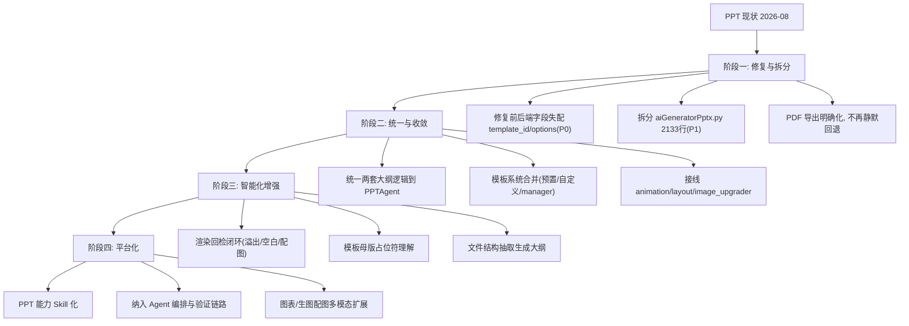

# PPT 生成功能未来演化路径

> 版本：v1.0 | 日期：2026-08-02 | 分析对象：`app/api/v1/aiGeneratorPptx.py`（2133 行）+ `app/agent/ppt_agent.py`（420 行）+ `app/utils/pptx/`（15 模块约 9,000 行）+ `app/utils/visual/`（3 模块约 2,000 行）+ `src/views/PPTGenerate.vue`（1287 行）+ `src/views/PPTPreview.vue`
>
> **2026-08-02 确认状态**：本节所列问题均经实测/代码引用验证——P0 字段失配已用 pydantic 模拟复现（`template_id`→`template`、`auto_images`/`enable_animation`→`options` 均被静默丢弃）；PPTAgent 接线点、PDF 回退、模板双轨、未接线模块（`LayoutOptimizer`/`AnimationEngine`/`ImageStrategy` 全库零调用）均已核实。

本文档基于当前 PPT 生成功能的代码分析，规划从现状到长期目标的演化路线。演化遵循与 Agent 引擎一致的原则：**先修 Bug、再拆分止血、再收敛统一、后智能增强**。

## 1. 现状基线

### 1.1 核心架构

```
PPTGenerate.vue ──► ppt.js ──► /api/v1/pptx/* ──► aiGeneratorPptx.py (2133 行)
                         │               │
                         │               ├── ppt_agent.py (PPTAgent 大纲生成)
                         │               ├── utils/visual/ (视觉决策/布局/配图)
                         │               ├── utils/pptx/    (渲染/模板/动画/修改)
                         │               └── task_manager 任务队列 + WS 进度
                         └── 输出: PPTX / HTML / Markdown / PDF(未实现)
```

| 维度 | 现状 |
|------|------|
| 入口 | 文本生成、文件上传生成（PDF/Word/TXT/MD/代码）、大纲 Agent 生成 |
| 核心 API | `aiGeneratorPptx.py` 单文件 2133 行，集渲染/视觉/模板/PDF/WS 于一体 |
| 大纲生成 | **两套并存**：`ppt_agent.py`（PPTAgent，SlideType 枚举）与 `aiGeneratorPptx.py` 内联 JSON |
| 渲染 | 主路径走视觉决策（`visual_analyzer`→`layout_decider`→`render_slide`），失败回退 `_render_slide_default` |
| 修改 | `/pptx/{id}/modify`（自然语言修改，`visual_modifier`）+ `/pptx/{id}/update`（大纲增量更新） |
| 模板 | 预置 9 套（`ppt_style.py PPT_TEMPLATES`）+ 自定义模板上传（`custom_template.py`）+ `templates/presets.py` |
| 输出格式 | PPTX/HTML/Markdown 已实现；PDF 依赖 LibreOffice 未装时回退 PPTX（`aiGeneratorPptx.py:882-884`） |
| 前端 | `PPTGenerate.vue` 1287 行（生成/预览/修改/历史一体）+ `PPTPreview.vue`（iframe 预览） |

### 1.2 PPT Agent 接线状态（2026-08-02 全库扫描确认）

此前在 `app/agent/` 内部扫描中 `ppt_agent.py` 显示零引用，但**全库扫描确认已被生产接线**：

- `POST /generate-text`（`aiGeneratorPptx.py:1570`）：`PPTAgent.generate_outline` 仅返回结构化大纲
- `POST /generate-from-text`（`aiGeneratorPptx.py:1612`）：大纲 → `adapt_for_pptx_engine` → 配图 → 渲染 PPTX
- 能力：大纲生成（含 LLM JSON 兜底提取）、`modify_outline` 大纲级修改、3 次重试降级

### 1.3 未接线/降级能力（实测确认）

| 模块 | 行数 | 状态 | 说明 |
|------|------|------|------|
| `utils/pptx/animation_engine.py` | 585 | **导出未接线** | 仅被 `__init__.py` 导出，无任何调用方；前端「动画效果」开关只是写进 prompt 文本 |
| `utils/pptx/image_upgrader.py` | 1456 | **导出未接线** | 图片升级策略，无调用方 |
| `utils/pptx/layout_engine.py` | 781 | **导出未接线** | `LayoutOptimizer` 无调用方，主路径实际用 `visual/layout_decider.py` |
| `utils/pptx/templates/` | ~800 | **独立一套** | `TemplateManager`/`presets.py` 与主路径 `PPT_TEMPLATES` 并存 |
| PDF 导出 | - | **依赖未满足** | 需要 LibreOffice，未装则 501/回退，`download_ppt_as_pdf` 与 `generate_task` 内 PDF 逻辑分叉 |

### 1.4 实测 Bug（前后端字段失配）

前端 `ppt.js:21-31 createPptTask` 传 `template_id`/`auto_images`/`enable_animation`，后端 `PPTGenerationRequest`（`aiGeneratorPptx.py:83`）字段是 `template`/`options`（dict）——**前端模板选择与选项在生成时被静默丢弃**，模板恒为默认 `modern`。前端虽有 `buildFullPrompt()` 把「模板风格/特殊要求」拼进文本（`PPTGenerate.vue:605-616`）兜底，但结构化参数未生效。文件上传模式（`generate_from_file`）用 Form 直传 `template` 则正常。

## 2. 演化目标

```
【近期】稳定可用：修复字段失配、拆分 2133 行 API 文件、PDF 回退明确
  ↓
【中期】统一收敛：两套大纲逻辑合一、模板系统合并、接线未用能力
  ↓
【长期】智能增强：视觉质量闭环、模板理解、与 Agent 引擎统一
```

每个阶段产物保证向后兼容，不破坏现有端点（`/api/v1/pptx/*` 全量）与前端页面。

## 3. 阶段一：修复与拆分（近 1-2 个迭代）

**目标**：先让现有功能「按用户设定工作」，再降低单文件维护成本。

### 3.1 修复前后端字段失配（P0）

- 统一字段名：后端 `PPTGenerationRequest` 增加 `template_id`（alias 到 `template`）兼容前端，或前端改传 `template`
- `options` 拆为显式字段：`auto_images`/`enable_animation` 作为布尔字段直接声明，替代「拼进 prompt 文本」的隐式传递
- 前端 `ppt.js` 与 `PPTGenerate.vue` 同步更新，使模板选择/自动配图/动画开关真正生效
- 补充契约测试：mock 请求断言 `template_id` → `template` 映射

### 3.2 拆分 `aiGeneratorPptx.py`（2133 行，P1）

参照 `spec_first_generate.py` 拆分经验，按职责拆分子包：

| 新模块 | 承接内容 | 预估行数 |
|--------|---------|---------|
| `app/utils/pptx/outline.py` | `generate_ppt_outline`（内联 JSON 大纲）+ schema 定义 | ~200 |
| `app/utils/pptx/generate.py` | `generate_pptx_file_enhanced` + 渲染辅助函数 | ~450 |
| `app/utils/pptx/exporters.py` | HTML/Markdown 导出、预览 HTML | ~150 |
| `app/utils/pptx/search.py` | 搜图/下载/缓存（`get_image_search_manager` 等） | ~120 |
| `app/api/v1/pptx_router.py` | 仅保留 API 路由与依赖注入（瘦 Router） | ~400 |

### 3.3 PDF 导出明确化（P2）

- 生成路径不再「静默回退 PPTX」，改为返回明确 `pdf_unavailable` 状态
- `download_ppt_as_pdf` 与 `generate_task` 内 PDF 逻辑收敛为同一转换函数（`pptx→pdf` 统一走 LibreOffice，探测可用性）

### 3.4 验收标准

- 前端模板选择/自动配图/动画开关在生成结果中真实生效
- `aiGeneratorPptx.py` 从 2133 行降为纯路由层（< 500 行）
- `/api/v1/pptx/*` 全部端点行为不变，前端页面无回归
- PDF 不可用时返回明确错误而非静默降级

## 4. 阶段二：统一与收敛（近 2-4 个迭代）

**目标**：消除两套并存逻辑，合并模板系统，接线已写好但未用的能力。

### 4.1 统一大纲生成（P1）

- `ppt_agent.py` 的 `PresentationOutline` 作为**唯一大纲数据模型**（含 SlideType 枚举、bullets/image_keywords/notes）
- `generate_ppt_outline` 内联逻辑迁移为 `PPTAgent.generate_outline` 的适配层，删除重复 JSON prompt
- `/pptx/generate_task`、`generate_from_file` 统一走 PPTAgent 产出大纲，再经 `adapt_for_pptx_engine` 渲染
- 存量 slide_type 字段（`cover/content/summary/toc`）与 SlideType（`title/chapter/content/...`）映射表收敛为一套

### 4.2 模板系统合并（P2）

- `ppt_style.py PPT_TEMPLATES`（预置 9 套）、`templates/presets.py`、`custom_template.py`（用户上传）统一为「预置 + 用户自定义」两级注册
- 用户自定义模板渲染真正生效（当前 `generate_pptx_file_enhanced` 只读 `req.template` 字符串，custom 模板未接入渲染）
- 统一 `TemplateManager` 为唯一访问入口，`PPT_TEMPLATES` 改为其输出

### 4.3 接线未用能力（P2）

- `layout_engine.LayoutOptimizer`：作为 `visual/layout_decider` 的增强层（文本密度、留白、元素对齐检测），灰度对比后替换
- `animation_engine`：前端「动画效果」开关从 prompt 文本升级为真实 PPTX 动画注入（`enable_animation=true` 时）
- `image_upgrader`：配图后处理（清晰度/尺寸过滤、本地图升级），接入 `visual/image_manager` 之后
- 若阶段末仍未接线则标记废弃，避免死代码膨胀

### 4.4 验收标准

- 两套大纲逻辑收敛为一套，删除重复 prompt 与字段映射
- 自定义模板可在渲染中生效，模板管理走单一入口
- 动画/布局优化/图片升级至少一个真实接线并生效
- 前端生成-修改-预览闭环无回归

## 5. 阶段三：智能化增强（中期 4-8 个迭代）

**目标**：从「模板拼装」升级为「内容-版式匹配」的视觉质量闭环。

### 5.1 视觉决策质量闭环

- 生成后**渲染回检**：`layout_decider` 渲染结果做文本溢出/空白占比检测，失败项自动重排（类似 Agent 引擎「生成-验证-修复」闭环，但面向版式）
- `visual_analyzer` 的布局决策加入内容类型感知：图表页用图表版式、纯文字页用卡片版式、封面页用居中构图
- 配图与版式联动：图片尺寸/位置由布局引擎计算而非固定坐标（当前 `_render_slide_default:326-337` 固定位置）

### 5.2 模板理解与自适应

- 用户自定义模板解析增强：从「提取配色/字体」升级为「提取母版占位符布局」，渲染按模板实际结构填充
- 主题色从模板自动提取后注入视觉决策（当前 `visual_analyzer` 只看 `theme=req.template` 字符串）

### 5.3 素材与上下文增强

- 文件上传生成支持「结构抽取」：PDF/Word 提取标题层级直接映射为大纲章节，而非全文本塞 prompt
- 会话历史/素材绑定在 `generate_from_file` 中同样生效（当前仅 `generate_task` 支持 `conversation_id`/`material_file_ids`）

### 5.4 验收标准

- 渲染回检覆盖溢出/空白/配图三类问题，修复率 > 80%
- 自定义模板按母版占位符填充，不再固定坐标
- 文件上传生成的大纲章节结构与源文档标题层级对应

## 6. 阶段四：平台化（长期）

**目标**：PPT 能力与主 Agent 引擎、平台能力统一。

### 6.1 PPT 能力 Skill 化

- 将大纲生成注册为 `AgentRole` 工具（承接 AGENT-ENGINE.md 6.3 动态工具选择），PPT 生成从独立路由升级为 Agent 能力
- 与 `ppt_agent.py` 的 `ppt_system_prompt` skill 机制合并为统一 Skill 注册

### 6.2 与 Agent 引擎统一

- PPT 生成纳入主编排链路（`OrchestratorAgent` 输出物之一），共享模型路由、成本统计、会话记忆（承接 AGENT-ENGINE.md 6.4 跨会话长记忆）
- 验证链路复用：PPT 渲染结果作为「产物」进入 `error_recovery` 质量回检

### 6.3 多模态扩展

- 图表生成（matplotlib/ECharts 渲染为图片嵌入）、音视频导出
- 与 `image_generate`（文生图）集成：配图从「外部搜图」扩展为「AI 生图 + 外部搜图双源」

### 6.4 验收标准

- PPT 生成作为 Agent 工具被调用，无需独立路由分流
- 新能力（图表/生图配图）以工具形式注册即用，无入口级改造

## 7. 演化路径总览



## 8. 风险与依赖

| 风险 | 应对 |
|------|------|
| 字段修复破坏前端现有调用 | 前后端同步改，先加契约测试；`template_id` 以 alias 兼容过渡 |
| 拆分破坏渲染/预览行为 | 每步拆分后跑端点冒烟（generate→download→preview→slides），前端无回归 |
| 两套大纲收敛改变生成内容风格 | 保留 PPTAgent 现有 prompt 为基准，仅收敛数据模型；对比生成结果后再删旧逻辑 |
| 自定义模板渲染接入复杂度高 | 先支持占位符填充最小集（标题/正文/图位），母版复杂结构留阶段三 |
| 接线 animation 增加 PPTX 生成失败面 | 动画注入失败降级为无动画（不影响文件生成），灰度开启 |
| PPT 与 Agent 引擎统一周期长 | 阶段四前保持独立路由稳定运行，统一以工具注册方式渐进接入 |
| 图片升级/搜图依赖外部 API 可用性 | 保持多源降级（Bing→Unsplash→Pexels→占位图），新增 AI 生图源时默认关闭待配 Key |
